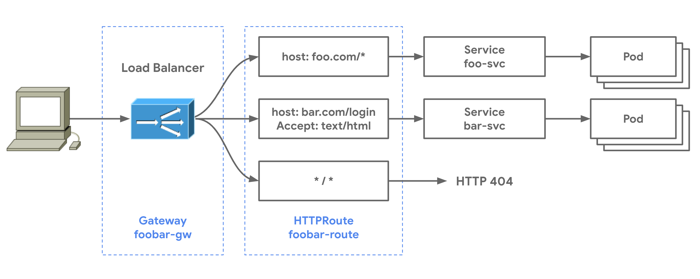

# Complex routing

HTTPRoute resources can have more than one routing rule to account for complex traffic matching. Routing rules can map to multiple Services and thus multiple application backends. The following HTTPRoute matches on `foo.com` and `bar.com` and sends traffic to foo-svc and bar-svc respectively. Any traffic to the Gateway that doesn't match will be sent to the default-backend Service which is configured to respond with an HTTP 404. This example also demonstrates protocol-specific matching for HTTP headers and paths.



The foobar-gw Gateway is deployed from the hypothetical `my-l7-gw-class`. It listens for HTTP traffic on port 80 and will bind to all HTTPRoute resources within the `default` Namespace.

```yaml

kind: Gateway
apiVersion: networking.x-k8s.io/v1alpha1
metadata:
  name: foobar-gw
  namespace: default
spec:
  class: my-l7-gw-class
  listeners:  
  - protocol: HTTP
    port: 80
    routes:
      resource: httproutes
```

The following foobar-route HTTPRoute binds to the foobar-gw and will define the matching for any traffic that the Gateway is listening for. All traffic with `foo.com` will be sent to the foo-svc. Traffic to `bar.com/login` with the `accept: text/html` header will be sent to bar-svc. Nonmatching traffic will be sent to a default backend or get a default response which is GatewayClass-specific and not defined by the Gateway API itself. In this example, the Gateway returns a 404.

```yaml

apiVersion: networking.x-k8s.io/v1alpha1
kind: HTTPRoute
metadata:
  name: foobar-route
  namespace: default
spec:
  hosts:
  - hostnames: 
    - foo.com
    rules:
    - action:
        forwardTo:
        - targetRef:
            name: foo-svc
  - hostnames: 
    - bar.com
    rules:
    - matches:
      - path: /login
        headers:
          accept: text/html
      action:
        forwardTo:
        - targetRef:
            name: bar-svc

```

