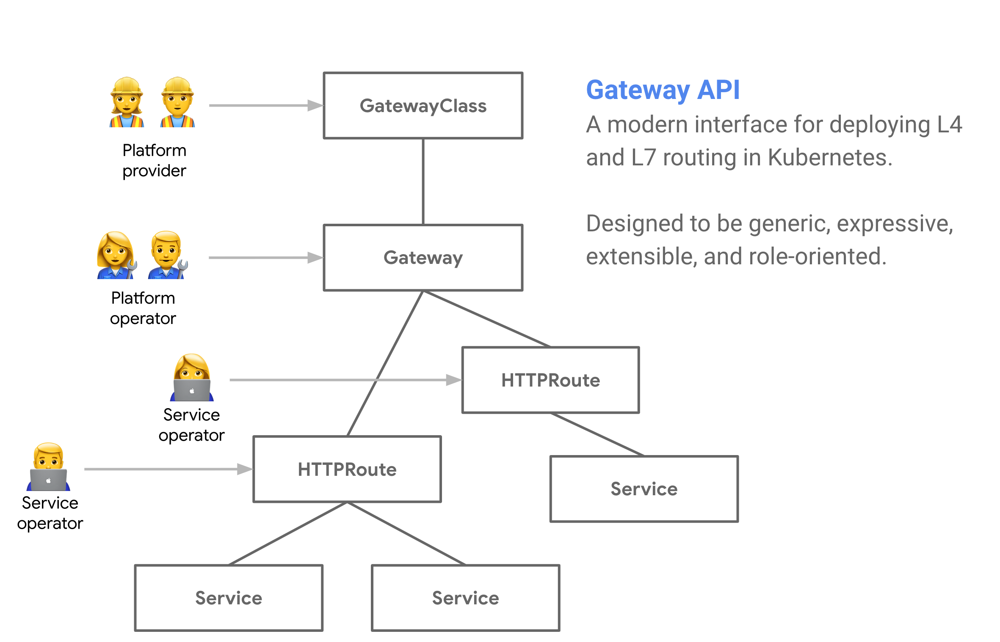

# Introduction

Service APIs is an open source project, working under
[SIG-NETWORK][sig-network], that is evolving service networking APIs within the Kubernetes ecosystem. Service APIs are the APIs you use to expose your Kubernetes applications - Services, Ingress, and more. The Gateway API is the primary API being developed to unify service networking under a core set of networking APIs.

### What is the Gateway API?

The Gateway API is an effort by a consortioum of companies and users to evolve the current Kubernetes Ingress API. Gateway aims to improve upon Ingress by becoming a more expressive, extensible, role-oriented API while remaining a generic routing API that has many implementations and broad industry support. 

Gateway is really a collection of API resources - `GatewayClass`, `Gateway`, `HTTPRoute`, `TCPRoute`, and so on. These resources are used together to model a wide variety of different networking use-cases. See [API Concepts](concepts.md) to learn more.

How does Gateway improve upon current standards like Ingress?

- **More expressive** - It includes core functionality for header-based matching, traffic weighting, and other capabilities that were only possible through custom means in the Ingress spec.
- **More extensible** - It allows for custom resources to be linked at multiple layers within its resources. This allows for more granular customization at the appropriate places within the API structure.
- **Role oriented** - It is broken into API resources that map to the types of roles that commonly deploy and configure load balancing.
- **Generic** - This isn't an improvement but rather something that should stay the same. Just as Ingress is a universal specification with [numerous implementations](https://kubernetes.io/docs/concepts/services-networking/ingress-controllers/), Gateway is designed to be a portable specification for many implementations.

Some other notable capabilities include …

- **Shared Gateways** - It allows the sharing of load balancers and VIPs by permitting independent Route resources to bind to the same Gateway. This allows teams to share infrastructure safely without requiring direct coordination.
- **Typed backend references** - With typed backend references Routes can reference Kubernetes Services, but also any kind of Kubernetes resource that is designed to be a Gateway backend.
- **Cross-Namespace references** - Routes across different Namespaces can bind to Gateways. This allows for shared networking infrastructure despite Namespace segmentation for workloads.
- **Classes** - GatewayClasses formalize types of load balancing implementations. These classes make it easy and explicit for users to understand what kind of capabilities are available as a resource model itself.

[sig-network]: https://github.com/kubernetes/community/tree/master/sig-network

### Where to get started

To get started, please read through [API concepts](concepts.md) and
[Security model](security-model.md). These documents give the necessary background
to understand the API and the use-cases it targets. Once you have a good understanding of the API at a higher-level, please follow one of our [guides](guides.md) to dive deeper into different parts of
the API.

For a complete API reference, please refer to:

- [API reference](spec.md)
- [Go docs for the package](https://pkg.go.dev/sigs.k8s.io/service-apis/apis/v1alpha1)

### How to get involved

Gateway has many contributors and we welcome anybody and everybody to get involved. No contribution is too small - even opinions matter!

There are [weekly meetings](community.md#meetings) to join and discuss the latest improvements. [Slack rooms](https://kubernetes.slack.com/messages/sig-network-service-apis) to stay updated on the disccussions. Feel free to file an [enhancement request](enhancement-requests.md) or contact the [project owners](https://raw.githubusercontent.com/kubernetes-sigs/service-apis/master/OWNERS) if you have ideas or improvements to propose.

