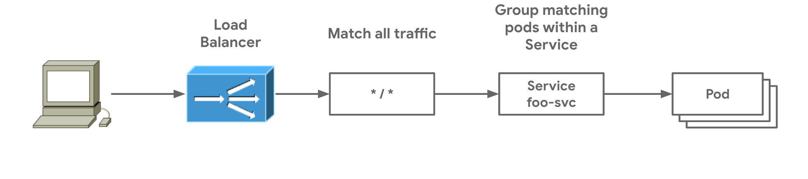

# Deploying a simple Gateway

The simplest possible deployment is a Gateway and Route resources which are deployed together and have the same owner. This represents the same kind of model used for Ingress. A Gateway is deployed and an HTTPRoute is deployed which matches all traffic and sends it to a single Service named foo-svc. 



```
kind: Gateway
apiVersion: networking.x-k8s.io/v1alpha1
metadata:
  name: foobar-gw
  namespace: default
spec:
  class: l7-gw-class
  listeners:  
  - protocol: HTTP
    port: 80
    routes:
      resource: httproutes
```

The Gateway listens for HTTP traffic on port 80. This hypothetical `l7-gw-class` does not require the specification of an IP address and so it will automatically assign an IP address which will be shown in the Gateway.status after it has been deployed. The following HTTPRoute resource defines the mapping of a Gateway to a backend Service that traffic routes to.

```yaml
apiVersion: networking.x-k8s.io/v1alpha1
kind: HTTPRoute
metadata:
  name: my-route
  namespace: default
spec:
  hosts:
  - rules:
    - action:
        forwardTo:
        - targetRef:
            name: foo-svc
```

Once these are deployed to the Kubernetes cluster, the Gateway controller of the `l7-gw-class` will deploy the following load balancer and routing. Because there are no host routes or paths specified, this HTTPRoute will match all traffic that arrives at port 80 of the load balancer and send it to the `foo-svc` Pods.


