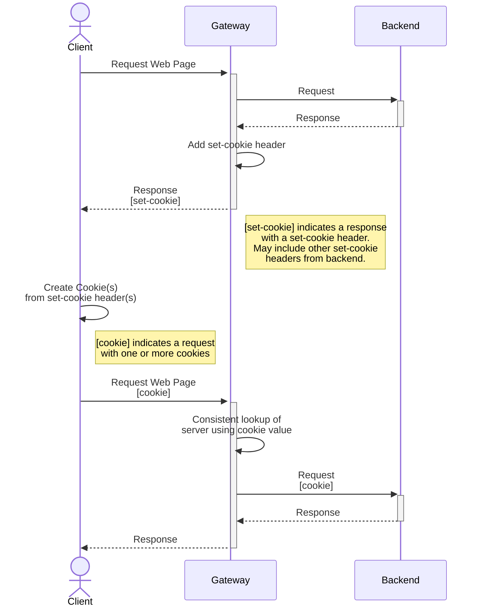
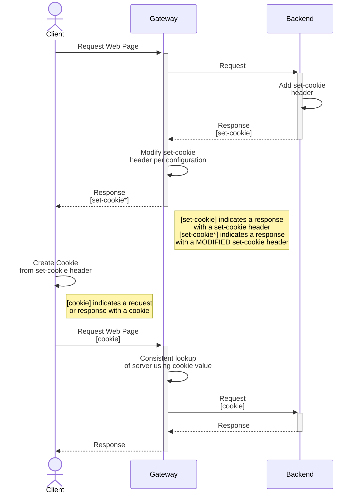
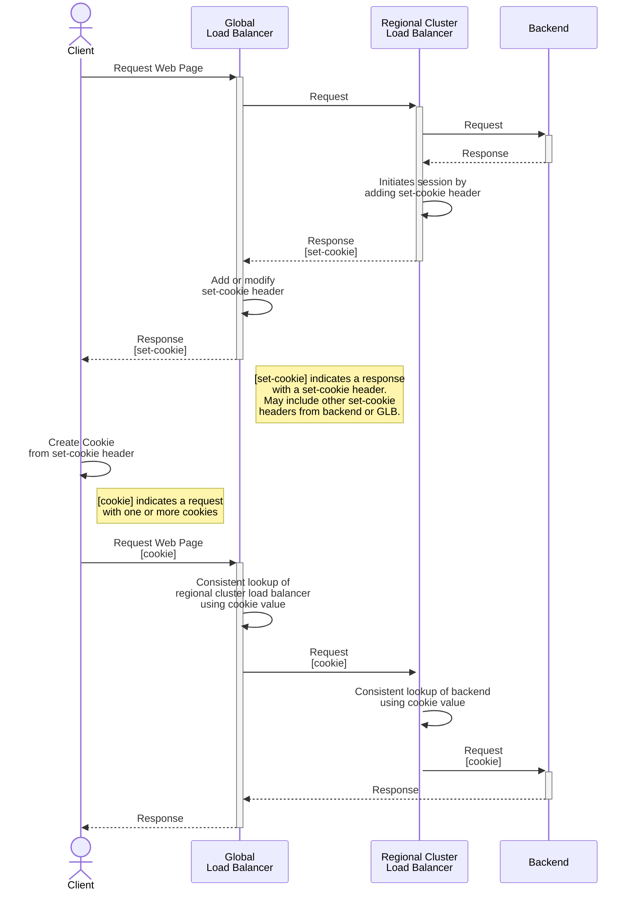
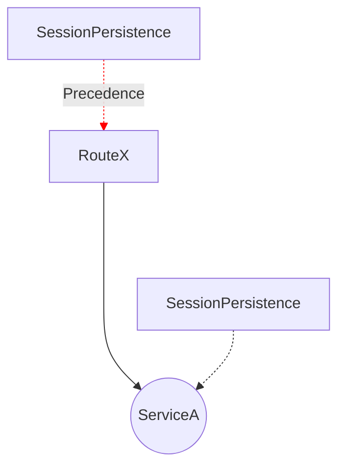
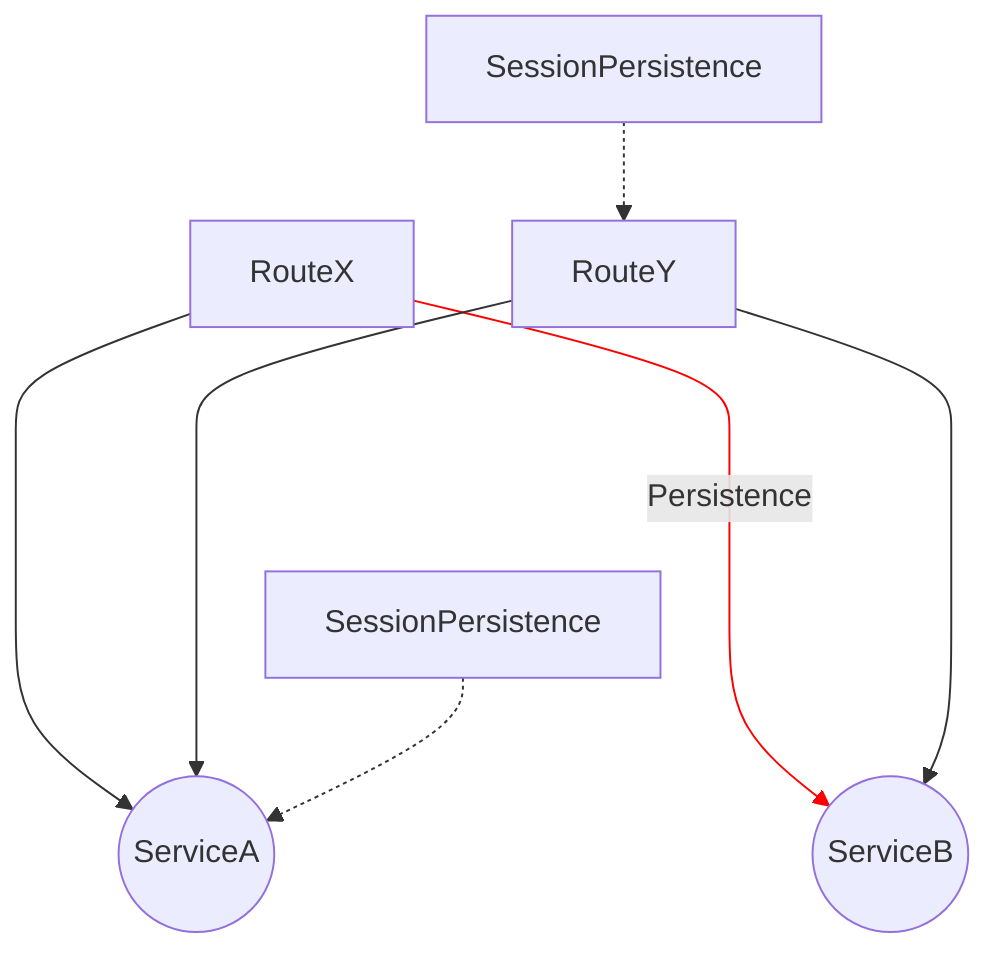

# GEP-1619: Session Persistence

* Issue: [#1619](https://github.com/kubernetes-sigs/gateway-api/issues/1619)
* Status: Provisional

(See definitions in [GEP Status][/contributing/gep#status].)

## Graduation Criteria for Implementable Status

This GEP was accidentally merged as Provisional before the required approval
from 2 maintainers had been received. Before this graduates to implementable,
we need to get at least one of @robscott or @youngnick to also approve this GEP.

There are some open questions that will need to be answered before this can
graduate:

1. Should we leave room in this policy to add additional concepts in the future
   such as Session Affinity? If so, how would we adjust the naming and overall
   scope of this policy?
2. Should we leave room for configuring different forms of Session Persistence?
   If so, what would that look like?

## TLDR

This GEP initially proposes a definitions for session persistence, followed by the definition of an API spec for
configuring it. Additionally, it explores example scenarios of session persistence and examines the approaches that
implementations have taken to design APIs for session persistence. It intentionally refrains from defining an API for
session affinity, as this design is expected to be addressed within a separate GEP.

## Goals

- Define session persistence and session affinity to establish a common language
- Identify differences in session persistence functionality between implementations
- Define an API for session persistence
- Establish anticipated outcomes for specific API configurations or scenarios

## Non-Goals

- Define an API for session affinity
- Mandate a default session persistence or session affinity functionality for implementations
- Prescribe the precise manner (the "how") in which implementations should achieve session persistence or handle
  specific scenarios
- Add API configuration for supporting backend initiated sessions

## Introduction

### Defining Session Persistence

Session persistence is when a client request is directed to the same backend server for the duration of a "session". It is achieved when a client directly provides information, such as a header, that a proxy uses as a reference to direct traffic to a specific server. Persistence is an exception to load balancing: a persistent client request bypasses the proxy's load balancing algorithm, going directly to a backend server it has previously established a session with.

Session persistence enables more efficient application workflows:
1. Better performance: Maintaining a single session allows a server to cache information about a client locally reducing the need for servers to exchange session data and overall storage needs.
2. Seamless client experience: Clients can reconnect to the same server without re-authenticating or re-entering their information.

Some of the concerns of session persistence are the duration and expiration of the session, security of the transaction stream, and storage of the context or state.

Session affinity, not to be confused with session persistence, uses an existing attribute of the request to consistently send to the same backend. Session affinity can be considered a weaker form of session persistence: it is not guaranteed to persist a connection to the same backend server if certain attributes of the request or the backends are changed.

### Security and Privacy Implications

Session persistence can introduce security and privacy vulnerabilities if not properly implemented. These vulnerabilities can include:

1. Session hijacking: Attackers intercepting or predicting a valid session token to gain unauthorized access.
2. Session fixation: Attackers setting a client's session ID to a known value, which they can then use to hijack the session.
3. Session replay attacks: Attackers capturing and resending a client's message with a valid session ID.
4. Data leakage: Attackers can exploit sensitive session information cached on servers if not properly secured.
5. Denial of service attacks: Attackers can use up server resources by creating and maintaining large numbers of sessions.

To mitigate these security concerns, it is important to implement session persistence using secure practices, such as using strong session ID generation algorithms, implementing session timeouts, encrypting sensitive data, and monitoring server resources for unusual activity.

IP address reuse may also be a security or privacy concern when using session persistence or session affinity. If Kubernetes reuses an IP address of previously shutdown pod, the new pod may receive session persistent traffic meant for the old pod.

Session affinity introduces fewer security and privacy vulnerabilities since there are no session tokens to protect or exploit.

### Achieving Session Persistence

Session persistence is achieved using attributes residing in the application layer. The following are mechanisms for achieving session persistence:

**1. Cookie-Based Session Persistence**

The most common mechanism is by using cookies (described by [RFC6265](https://www.rfc-editor.org/rfc/rfc6265)) with the set-cookie HTTP response header. A client will use the provided value in the set-cookie response header in a cookie request header in subsequent requests. Proxies can use this cookie header to maintain a persistent connection to a single backend server on behalf of the client.

**2. Header-Based Session Persistence**

Header-based stateful sessions are achieved by a backend or gateway providing an HTTP response header and the client using the same header in subsequent HTTP requests. Proxies can use this header to maintain a persistent connection to a single backend server on behalf of the client.

**3. URL-Encoded Session Persistence**

Session information can be also encoded into the request URL to establish a persistent session. The server rewrites the client's URL to encode the new session information automatically. The server or the gateway then decodes the session information from the URL to identify the session.

### Session Persistence Initiation

For all implementations of session persistence, the initiation of the persistent session is possible from various
sources, including the gateway, intermediary gateway, backend, a sidecar in a backend, or any other infrastructure
component.

Let's consider a simple implementation comprised of gateways and backends. The following rules apply based on who initiates the session:
- If the gateway initiates the session, the backend will be presented with session attributes regardless if it enabled them.
- If the backend initiates the session, the gateway should allow this and not force persistent connections, unless
  specifically configured to[^1]. The gateway may decode and alter the cookie established by the backend to achieve
  session persistence.

It's important to note that we can have more complex implementations which involve traversing global load balancers,
regional load balancers, intermediary internal gateways, sidecars, or waypoints before reaching the backend. At any
point within this architecture, a persistent session can be initiated. See [Global Load Balancer Initiated Session Example](#global-load-balancer-initiated-session-example)
for an example of one of these alternative implementations.

In the next sections, we will take a closer look at the initiation of sessions in both the gateway and the backend.
Please note that in the next sections, we are examining the various scenarios in which a session can be initiated. We
are not prescribing specific implementations for session persistence. The intention is to understand the possibilities
and behaviors related to session initiation while the [API](#api) section will provide more details on specific
implementation details.

#### Gateway Initiated Session Example

To illustrate how a gateway can initiate a session, let's examine an implementation that uses cookies for persistence.
This represents the most straightforward scenario for utilizing cookies. When a request is made, the gateway includes
the `set-cookie` header in the final response, prompting the client to store the cookie. This cookie is subsequently
used in future requests, allowing the gateway to consistently choose the same upstream, establishing a persistent
session.

Here an example implementation of a gateway initiating a session through cookies:


#### Backend Initiated Session Example

**Important**: While we took it into consideration, this GEP does not support configuring backend-initiated sessions.
This could potentially affect frameworks that initiate sessions in the backend. Implementing this feature is complicated
and requires careful design, making it suitable for exploration in a separate GEP.

Continuing with the cookie example, when dealing with backend-initiated sessions, the process becomes somewhat more
complex. For cookie-based session persistence, the gateway needs to store a value within a cookie containing a backend
identifier. This identifier can be then used as a reference to maintain a persistent session to a specific backend.
There are several approaches a gateway could use in this situation to achieve session persistence:

1. Insert an additional cookie
2. Modify the existing cookie's value
3. Prefix the existing cookie

Additionally, there are variations to each of these approaches, such as making new or updated cookies transparent to the
backend, either by remove an inserted cookie or reversing modifications of the cookie's value.

Alternatively, if the backend is not configured for session persistence, the gateway should refrain from modifying or
inserting a cookie. In this situation, the gateway should remain passive and simply forward the `set-cookie` header as
it is.

Refer to the [Session Initiation Guidelines](#session-initiation-guidelines) section of the API for implementation
guidance.

Here's an example implementation of a backend initiating a session and the gateway modifies the cookie's value:


#### Global Load Balancer Initiated Session Example

In a more complex architecture example, a global load balancer may need to use cookies in order to maintain persistent
connections to a regional load balancer. The regional cluster load balancer initiates the session by issuing the
`set-cookie` header and subsequently uses the cookie to maintain persistent connections to a specific backend. The
global load balancer then adds or modifies a cookie in order to establish persistent connection to a regional cluster
load balancer.

Here an example implementation of a global load balancer and a regional load balancer creating sessions through cookies:


### When does an application require session persistence?

Enabling session persistence is a required configuration for applications intentionally designed by the application
developer to use it, as they will encounter failures or malfunctions when it's not enabled. However, it's worth noting
that certain applications may be designed to function both with and without session persistence. Regardless, the
importance of Gateway API supporting session persistence remains emphasized because it is frequently seen as a necessary
feature.

Conversely, apps that have not been designed or tested with session persistence in mind may misbehave when it is
enabled, primarily because of the impacts of load distribution on the app. Apps using session persistence must account
for aspects like load shedding, draining, and session migration as a part of their application design.

### The Relationship of Session Persistence and Session Affinity

Though this GEP's intention is not to define a spec for session affinity, it is important to recognize and understand
its distinction with session persistence. While session persistence uses attributes in the application layer, session
affinity often uses, but is not limited to, attributes below the application layer. Session affinity doesn't require a
session identifier like session persistence (e.g. a cookie), but instead uses existing connection attributes to
establish a consistent hashing load balancing algorithm. It is important to note the session affinity doesn't guarantee
persistent connections to the same backend server.

Session affinity can be achieved by deterministic load balancing algorithms or a proxy feature that tracks IP-to-backend associations such as [HAProxy's stick tables](https://www.haproxy.com/blog/introduction-to-haproxy-stick-tables/) or [Cilium's session affinity](https://docs.cilium.io/en/v1.12/gettingstarted/kubeproxy-free/#id2).

We can also examine how session persistence and session affinity functionally work together, by framing the relationship into a two tiered logical decision made by the data plane:
1. If the request contains a session persistence identity (e.g. a cookie or header), then route it directly to the backend it has previously established a session with.
2. If no session persistence identity is present, load balance as per load balancing configuration, taking into account the session affinity configuration (e.g. by utilizing a hashing algorithm that is deterministic).

This tiered decision-based logic is consistent with the idea that session persistence is an exception to load balancing. Though there are different ways to frame this relationship, this design will influence the separation between persistence and affinity API design.

### Implementations
In this section, we will describe how implementations achieve session persistence, along with a breakdown of related configuration options. Input from implementations is appreciated to complete this information.

In the following tables, we will example two types of APIs:
1. Dataplane APIs
2. Implementation APIs

Generally, the implementation API programs the dataplane API; however these two are not always clearly separated. The two types of APIs can use different API structures for configuring the same feature. Examining the dataplane APIs helps to remove the layer of API abstraction that implementations provide. Removing this layer avoids situations where implementations don’t fully implement all capabilities of a dataplane API or obfuscate certain configuration around session persistence. On the other hand, examining implementation APIs provides valuable data points in what implementations are interested in configuring.

| **Technology** 	| **Technology Type** 	| **Session Persistence Type** 	| **Configuration Options** 	| **Configuration Association (Global, Gateway, Route, or Backends)** 	| **Notes** 	|
|---	|---	|---	|---	|---	|---	|
| Acnodal EPIC 	| Implementation (Envoy) 	| N/A 	| Supports Gateway API Only* 	| N/A 	| *Acnodal Epic solely uses Gateway API; therefore, it doesn’t yet have a way to configure session persistence. [Acnodal EPIC Docs](https://www.epick8sgw.io/docs/) 	|
| Apache APISIX 	| Implementation (Nginx) 	| [Cookie-Based](https://apisix.apache.org/docs/apisix/admin-api/#upstream) 	| hash_on=[vars \| header \| cookie \| consumer]<br>key=cookie_name 	| [Upstream](https://apisix.apache.org/docs/apisix/admin-api/#upstream) (Route or Backends) 	| N/A 	|
|  	| Implementation (Nginx) 	| [Header-Based](https://apisix.apache.org/docs/apisix/terminology/upstream/#header) 	| hash_on=[vars \| header \| cookie \| consumer]<br>key=header_name 	| [Upstream](https://apisix.apache.org/docs/apisix/admin-api/#upstream) (Route or Backends) 	| N/A 	|
| Apache httpd 	| Web Server 	| [Cookie-Based / URL-Encoded](https://httpd.apache.org/docs/2.4/mod/mod_proxy_balancer.html) 	| Cookie Attributes 	| N/A 	| N/A 	|
| Cilium 	| Implementation / Dataplane 	| None 	| None 	| None 	| Cilium has no documented way of doing session persistence. [Cilium Docs](https://cilium.io/)  	|
| Contour 	| Implementation (Envoy) 	| [Cookie-Based](https://projectcontour.io/docs/1.24/config/api/#projectcontour.io/v1.CookieRewritePolicy)  	| Name=name<br>pathRewrite=path<br>domainRewrite=domain<br>secure<br>sameSite 	| [Route](https://projectcontour.io/docs/1.24/config/api/#projectcontour.io/v1.Route) and [Service](https://projectcontour.io/docs/1.24/config/api/#projectcontour.io/v1.Service) (Backends) 	| Envoy does not natively support cookie attribute rewriting nor adding attributes other than path and TTL, but rewriting and adding additional attributes is possible via Lua ([Contour design reference](https://github.com/projectcontour/contour/blob/main/design/cookie-rewrite-design.md), [Envoy Issue](https://github.com/envoyproxy/envoy/issues/15612)). 	|
| Emissary-Ingress 	| Implementation (Envoy) 	| [Cookie-Based](https://www.getambassador.io/docs/emissary/latest/topics/running/load-balancer#cookie) 	| Name=name<br>Path=path<br>TTL=duration 	| [Module or Mapping](https://www.getambassador.io/docs/emissary/latest/topics/running/load-balancer#cookie) (Global or Route) 	| N/A 	|
|  	|  	| [Header-Based](https://www.getambassador.io/docs/emissary/latest/topics/running/load-balancer#header) 	| Name=name 	| [Module or Mapping](https://www.getambassador.io/docs/emissary/latest/topics/running/load-balancer#cookie) (Global or Route) 	| N/A 	|
| Envoy 	| Dataplane 	| [Cookie-Based](https://www.envoyproxy.io/docs/envoy/latest/api-v3/extensions/http/stateful_session/cookie/v3/cookie.proto) 	| Name=name<br>Path=path<br>TTL=duration 	| [HttpConnectionManager](https://www.envoyproxy.io/docs/envoy/latest/api-v3/extensions/filters/network/http_connection_manager/v3/http_connection_manager.proto) (Route) 	| Envoy does not natively support cookie attribute rewriting nor adding attributes other than path and TTL, but rewriting and adding additional attributes is possible via Lua ([Contour design reference](https://github.com/projectcontour/contour/blob/main/design/cookie-rewrite-design.md), [Envoy Issue](https://github.com/envoyproxy/envoy/issues/15612)). 	|
|  	|  	| [Header-Based](https://www.envoyproxy.io/docs/envoy/latest/api-v3/extensions/http/stateful_session/header/v3/header.proto) 	| Name=name 	| [HttpConnectionManager](https://www.envoyproxy.io/docs/envoy/latest/api-v3/extensions/filters/network/http_connection_manager/v3/http_connection_manager.proto) (Route) 	| N/A 	|
| Envoy Gateway 	| Implementation (Envoy) 	| N/A 	| Supports Gateway API Only* 	| N/A 	| *Envoy Gateway solely uses Gateway API; therefore, it doesn’t yet have a way to configure session persistence. [Envoy Gateway Docs](https://gateway.envoyproxy.io/v0.3.0/index.html) 	|
| Flomesh Service Mesh 	| Implementation / Dataplane (Pipy) 	| ? 	| ? 	| ? 	| ? 	|
| Gloo Edge 2.0 	| Implementation (Envoy) 	| [Cookie-Based](https://docs.solo.io/gloo-edge/latest/reference/api/envoy/api/v2/route/route.proto.sk/#cookie) 	| Name=name<br>Path=path<br>TTL=duration 	| [Route](https://docs.solo.io/gloo-edge/latest/reference/api/envoy/api/v2/route/route.proto.sk/#route) (Route) 	| N/A 	|
|  	|  	| [Header-Based](https://docs.solo.io/gloo-edge/latest/reference/api/envoy/api/v2/route/route.proto.sk/#hashpolicy) 	| Name=name 	| [Route](https://docs.solo.io/gloo-edge/latest/reference/api/envoy/api/v2/route/route.proto.sk/#route) (Route) 	| N/A 	|
| Google CloudRun 	| Implementation / Dataplane 	| [Cookie-Based](https://cloud.google.com/run/docs/configuring/session-affinity) 	| Enabled / Disabled 	| [Service](https://cloud.google.com/run/docs/configuring/session-affinity) (Backends) 	| Only allowed to turn off or on, no other configuration items 	|
| Google Kubernetes Engine 	| Implementation / Dataplane 	| [Cookie-Based](https://cloud.google.com/load-balancing/docs/backend-service#session_affinity) 	| GENERATED_COOKIE or HTTP_COOKIE=name<br>cookieTtlSec 	| [Backend Policy](https://cloud.google.com/kubernetes-engine/docs/how-to/configure-gateway-resources#session_affinity) (Backends) 	| Google Kubernetes Engine [lists](https://cloud.google.com/load-balancing/docs/backend-service#bs-session-affinity) the products that can do persistence/affinity mode. All persistence/affinity options are exclusive and can’t be used at the same time.<br>Note: Google Kubernetes Engine defines everything (persistence and affinity) as session affinity. 	|
|  	|  	| [Header-Based](https://cloud.google.com/load-balancing/docs/backend-service#header_field_affinity) 	| httpHeaderName=name 	| [Backend Policy](https://cloud.google.com/kubernetes-engine/docs/how-to/configure-gateway-resources#session_affinity) (Backends) 	| N/A 	|
| HAProxy 	| Dataplane 	| [Cookie-Based](https://docs.haproxy.org/2.6/configuration.html#4.2-cookie) 	| name=name<br>[rewrite \| insert \| prefix ]<br>indirect<br>nocache<br>postonly<br>preserve<br>httponly<br>secure<br>domain=domain<br>maxidle=idle<br>maxlife=life<br>dynamic<br>attr=value 	| [Default or Backends](https://docs.haproxy.org/2.6/configuration.html#4.2-cookie) (Global or Backends) 	| HAProxy allows for operational cookie strategy configuration (i.e. when/how HAProxy should inject cookies) 	|
| HAProxy Ingress 	| Implementation (HAProxy) 	| [Cookie-Based](https://haproxy-ingress.github.io/docs/configuration/keys/#affinity) 	| affinity (enable/disable)<br>cookie-key=key<br>session-cookie-domain=domain<br>session-cookie-dynamic=[true \| false]<br>session-cookie-keywords=keywords<br>session-cookie-name=name<br>session-cookie-preserve=[true \| false]<br>session-cookie-same-site=[true \| false]<br>session-cookie-shared=[true \| false]<br>session-cookie-strategy=strategy<br>session-cookie-value-strategy=value_strategy	 	| [Backend](https://haproxy-ingress.github.io/docs/configuration/keys/#affinity) (Backends) 	| N/A 	|
| Hashicorp Consul  	| Implementation (Envoy) 	| N/A 	| Supports Gateway API Only* 	| N/A 	| *Hashicorp Consul solely uses Gateway API; therefore, it doesn’t yet have a way to configure session persistence. [Hashicorp Consul API Gateway Docs](https://developer.hashicorp.com/consul/docs/api-gateway) 	|
| Istio 	| Implementation (Envoy) 	| [Cookie-Based](https://istio.io/latest/docs/reference/config/networking/destination-rule/#LoadBalancerSettings-ConsistentHashLB-HTTPCookie) 	| Name=name<br>Path=path<br>TTL=duration 	| [ConsistentHashLB](https://istio.io/latest/docs/reference/config/networking/destination-rule/#LoadBalancerSettings-ConsistentHashLB) (Backends) 	| Istio also supports turning on cookie-based session persistence via the Pilot ENV variable [PILOT_PERSISTENT_SESSION_LABEL](https://istio.io/latest/docs/reference/commands/pilot-discovery/#envvars). 	|
|  	| Implementation (Envoy) 	| [Header-Based](https://istio.io/latest/docs/reference/config/networking/destination-rule/#LoadBalancerSettings-ConsistentHashLB) 	| Name=name 	| [ConsistentHashLB](https://istio.io/latest/docs/reference/config/networking/destination-rule/#LoadBalancerSettings-ConsistentHashLB) (Backends) 	| N/A 	|
| Java Servlet 	| Web Server 	| [Cookie-Based / URL-Encoded](https://docs.oracle.com/javaee/7/api/javax/servlet/http/HttpSession.html) 	| invalidate()<br>setAttribute(String name, Object value)<br>setMaxInactiveInterval(int interval) 	| N/A 	| Java Servlets do not natively support proxy functions. 	|
| Kong 	| Implementation / Dataplane 	| [Cookie-Based](https://docs.konghq.com/hub/kong-inc/session/) 	| cookie_name=name<br>rolling_timeout=timeout<br>absolute_timeout=timeout<br>idling_timeout=timeout<br>cookie_path=path<br>cookie_domain=domain<br>cookie_same_site=[Strict \| Lax \| None \| off]<br>cookie_http_only<br>cookie_secure=[true \| false]<br>stale_ttl=duration<br>cookie_persistent=[true \| false]<br>storage=storage_type 	| [Route, Service, Global](https://docs.konghq.com/hub/kong-inc/session/) (Route or Backends or Global) 	| N/A 	|
|  	|  	| [Header-Based](https://docs.konghq.com/gateway/latest/how-kong-works/load-balancing/#balancing-algorithms) 	| name 	| [Upstreams](https://docs.konghq.com/gateway/3.2.x/admin-api/#add-upstream) (Backends) 	| N/A 	|
| Kuma 	| Implementation (Envoy) 	| None 	| None 	| None 	| Kuma has no documentation on how it supports session persistence or cookies. [Kuma Docs](https://kuma.io/docs/2.1.x/) 	|
| Nginx  	| Dataplane 	| [Cookie-Based (Nginx Plus Only)](https://docs.nginx.com/nginx/admin-guide/load-balancer/http-load-balancer/#enabling-session-persistence) 	| Name=name<br>Expires=time<br>Domain=domain<br>HttpOnly<br>SameSite = [strict \| lax \| none \| $variable]<br>Secure<br>path=path 	| [Upstream](https://docs.nginx.com/nginx/admin-guide/load-balancer/http-load-balancer/#enabling-session-persistence) (Backends) 	| See also [Sticky Cookie](https://nginx.org/en/docs/http/ngx_http_upstream_module.html?&_ga=2.184452070.1306763907.1680031702-1761609832.1671225057#sticky_cookie) 	|
| NGINX Gateway Fabric 	| Implementation (Nginx) 	| N/A 	| Supports Gateway API Only* 	| N/A 	| *NGINX Gateway Fabric solely uses Gateway API; therefore, it doesn’t yet have a way to configure session persistence. [NGINX Gateway Fabric Docs](https://github.com/nginxinc/nginx-gateway-fabric) 	|
| Traefik 	| Implementation / Dataplane 	| [Cookie-Based](https://doc.traefik.io/traefik/routing/services/#sticky-sessions) 	| name=name<br>secure<br>httpOnly<br>sameSite=[none \| lax \| strict ] 	| [Services](https://doc.traefik.io/traefik/routing/services/#sticky-sessions) (Backends) 	| N/A 	|

### Sessions in Java

Java application servers such as Tomcat and Jetty, were the first to standardize the API around cookies and sessions.
These Java applications introduced the “jsessionid” cookie and session IDs encoded in URL parameters as well as more
advanced features such as session migration, replication, and on demand session activation. It’s important for Gateway
API to examine cookie use cases and history from Java APIs to ensure the API is designed appropriately.

### Session Affinity in K8S Services

Kubernetes provides an API that allows you to enable [session affinity](https://kubernetes.io/docs/reference/networking/virtual-ips/#session-affinity)
on service objects. It ensures consistent sessions by utilizing the client's IP address and also offers the option to
set a timeout for the maximum session duration. Implementations of Gateway API, such as service mesh use cases, may use
the service IP directly. In these cases where both Kubernetes service session affinity and Gateway API session
persistence are both enabled, the route must be rejected, and a status should be set describing the incompatibility of
these two configurations.

## API

In this section, we will explore the questions and design elements associated with a session persistence API.

### GO

```go
// SessionPersistencePolicy provides a way to define session persistence rules
// for a service or route.
//
// Support: Core
type SessionPersistencePolicy struct {
    metav1.TypeMeta   `json:",inline"`
    metav1.ObjectMeta `json:"metadata,omitempty"`

    // Spec defines the desired state of SessionPersistencePolicy.
    Spec SessionPersistencePolicySpec `json:"spec"`

    // Status defines the current state of SessionPersistencePolicy.
    Status SessionPersistencePolicyStatus `json:"status,omitempty"`
}

// SessionPersistencePolicySpec defines the desired state of
// SessionPersistencePolicy.
// Note: there is no Override or Default policy configuration.
type SessionPersistencePolicySpec struct {
    // TargetRef identifies an API object to apply policy to.
    // The TargetRef may be a Service, HTTPRoute, GRPCRoute,
    // or a HTTPRouteRule or GRPCRouteRule section.
    // At least one of these targets must be supported for
    // core-level compliance.
    //
    TargetRef gatewayv1a2.PolicyTargetReference `json:"targetRef"`

    // AbsoluteTimeoutSeconds defines the absolute timeout of the
    // persistent session measured in seconds. Once
    // AbsoluteTimeoutSeconds has elapsed, the session becomes invalid.
    //
    // Support: Core
    //
    // +optional
    AbsoluteTimeoutSeconds int64 `json:"absoluteTimeoutSeconds,omitempty"`

    // IdleTimeoutSeconds defines the idle timeout of the
    // persistent session measured in seconds. Once the session
    // has been idle for more than specified IdleTimeoutSeconds
    // duration, the session becomes invalid.
    //
    // Support: Core
    //
    // +optional
    IdleTimeoutSeconds int64 `json:"idleTimeoutSeconds,omitempty"`

    // SessionName defines the name of the persistent session token
    // (e.g. a cookie name).
    //
    // Support: Extended
    //
    // +optional
    // +kubebuilder:validation:MaxLength=4096
    SessionName String `json:"sessionName,omitempty"`
}

// SessionPersistencePolicyStatus defines the observed state of SessionPersistencePolicy.
type SessionPersistencePolicyStatus struct {
    // Conditions describe the current conditions of the SessionPersistencePolicy.
    //
    // Implementations should prefer to express SessionPersistencePolicy
    // conditions using the `SessionPersistencePolicyConditionType` and
    // `SessionPersistencePolicyConditionReason` constants so that
    // operators and tools can converge on a common vocabulary to
    // describe SessionPersistencePolicy state.
    // Known condition types are:
    //
    // * “Accepted”
    //
    // +optional
    // +listType=map
    // +listMapKey=type
    // +kubebuilder:validation:MaxItems=8
    // +kubebuilder:default={type: "Accepted", status: "Unknown", reason:"Pending", message:"Waiting for validation", lastTransitionTime: "1970-01-01T00:00:00Z"}
    Conditions []metav1.Condition `json:"conditions,omitempty"`
}

// SessionPersistencePolicyConditionType is the type of condition used
// as a signal by SessionPersistencePolicy. This type should be used with
// the SessionPersistencePolicy.Conditions field.
type SessionPersistencePolicyConditionType string

// SessionPersistencePolicyConditionReason is a reason that explains why a
// particular SessionPersistencePolicyConditionType was generated. This reason
// should be used with the SessionPersistencePolicy.Conditions field.
type SessionPersistencePolicyConditionReason string

const (
    // This condition indicates that the SessionPersistencePolicyStatus has been
    // accepted as valid.
    // Possible reason for this condition to be True is:
    //
    // * “Accepted”
    //
    // Possible reasons for this condition to be False are:
    //
    // * “Invalid”
    // * “Pending”
    SessionPersistencePolicyConditionAccepted SessionPersistencePolicyConditionType = “Accepted”

    // This reason is used with the “Accepted” condition when the condition is true.
    SessionPersistencePolicyReasonAccepted SessionPersistencePolicyConditionReason = “Valid”

	// This reason is used with the “Accepted” condition when the SessionPersistencePolicy is invalid, e.g. crossing namespace boundaries.
    SessionPersistencePolicyReasonInvalid SessionPersistencePolicyConditionReason = “Invalid”

    // This reason is used with the “Accepted” condition when the SessionPersistencePolicy is pending validation.
    SessionPersistencePolicyReasonPending SessionPersistencePolicyConditionReason = “Pending”
)
```

### API Granularity

The purpose of this session persistence API spec is to enable developers to specify that a specific backend expects a
persistent session. However, it intentionally avoids specifying low-level details or configurations related to the
session persistence implementation, such as cookie attributes. This decision is because the Gateway API supports various
infrastructure types, and some implementations that already provide session persistence may not be able to adhere to a
low-level API.

For instance, platforms using global load balancers to maintain persistent sessions between regional load balancers, or
Tomcat servlets generating distinct cookies per server. In such scenarios, it is important that this GEP does not
obstruct the existing use of cookies while enabling session persistence. Enabling particular low-level API
configurations, like allowing customization of the cookie name, could prevent certain implementations from conforming to
the spec. In other words, opting for a higher-level API provides better interoperability among our implementations.

### Target Persona

Referring to the [Gateway API Security Model](https://gateway-api.sigs.k8s.io/concepts/security-model/#roles-and-personas),
the target kubernetes role/persona for session persistence are application developers, as mentioned in the [When does an application require session persistence?](#when-does-an-application-require-session-persistence)
section. It is the responsibility of the application developers to adjust the persistence configuration to ensure the
functionality of their applications.

### Prior Art

Referring to our [Implementations](#Implementations) table on session persistence, the majority of Gateway API
implementations designed session persistence in their APIs to be attached to a service or backends. This should be
considered cautiously, as making associations to Gateway API's notion of Gateway, Route, and Service to other
implementation's objects is hard to directly translate. The idea of a route in Gateway API is often not the same as a
route in any given implementation.

### Metaresource Policy Design

In order to apply session persistence configuration to both a service and a route, we will implement it as a
metaresource policy, as outlined in [Policy Attachment](https://gateway-api.sigs.k8s.io/references/policy-attachment/#direct-policy-attachment).
The metaresource is named `SessionPersistencePolicy` and is only responsible for configuring session persistence for
services or routes. It is defined as a [Direct Policy Attachment](https://gateway-api.sigs.k8s.io/v1alpha2/references/policy-attachment/#direct-policy-attachment)
without defaults or overrides, applied to the targeted service, HTTPRoute, or GRPCRoute.

Attaching the `SessionPersistencePolicy` metaresource to a service will be a core support level feature, while attaching
it to a route will be considered extended. Implementations must support services for conformance, while routes are
considered optional. This distinction arises because most existing implementations primarily support attaching to a
service, while attaching to a route is less common and involves greater complexities (see [API Attachment Points](#api-attachment-points)
for more details).

### API Attachment Points

The `SessionPersistencePolicy` metaresource can target a service, route, and a route rule section (e.g. [HTTPRouteRule](https://gateway-api.sigs.k8s.io/references/spec/#gateway.networking.k8s.io%2fv1beta1.HTTPRouteRule)).
The core functionality of attaching it to any of these is generally identical. The distinction lies in where the
configuration gets propagated: when attached to a route or a route rule, it can define session persistence for multiple
services, whereas attaching it to a service defines it for a single service. Enabling session persistence doesn't
require configuration on the route, route rule, and service; configuring it on any one is sufficient.

Given that certain implementations will only support attaching to services, and considering that some implementations
might want to solely support attachment to routes, implementations must provide support for at least one of the options
(route, route rule, or service) to be compliant with this GEP.

Attaching `SessionPersistencePolicy` to a route ensures session persistence for all possible paths the route can take.
Conversely, attaching to a route rule section provides session persistence exclusively for that route rule. Without the
capability to target a specific rule section within a route, users might be required to decompose their route into
multiple routes to satisfy different session persistence requirements for each individual route path.

Edge cases will arise when providing supporting services, routes, and the route rule section. For guidance on addressing
conflicting attachments, please consult the [Expected API Behavior](#expected-api-behavior) section, which outlines API
use cases.

To learn more about the process of attaching to services, routes, and the route rule section, please refer to
[GEP-713](/geps/gep-713).

### Traffic Splitting

In scenarios involving traffic splitting, session persistence impacts load balancing done after routing, regardless if
it is attached to a service or a route. When a persistent session is established and traffic splitting is configured
across services, the persistence to a single backend should be maintained across services. Consequently, a persistent
session takes precedence over traffic split weights when selecting a backend after route matching. It's important to
note that session persistence does not impact the process of route matching.

When using multiple backends in traffic splitting, all backend services should have session persistence enabled.
Nonetheless, implementations should also support traffic splitting scenarios in which one service has persistence
enabled while the other does not. This support is necessary, particularly in scenarios where users are transitioning
to or from an implementation version designed with or without persistence.

See [Expected API Behavior](#expected-api-behavior) for more use cases on traffic splitting.

### Cookie Attributes

While the API is intended to be generic, as described in [API Granularity](#api-granularity), a majority of
implementations will employ session persistence through cookies. Therefore, let's explore the possibilities of cookie
configuration for these APIs.

A cookie is composed of various attributes, each represented as key=value pairs. While some attributes may have optional
values, the cookie name attribute is the only mandatory one, and the rest are considered optional.

The cookie attributes defined by [RFC6265](https://www.rfc-editor.org/rfc/rfc6265#section-5.2) are:
- Name=_value_
- Expires=_date_
- Max-Age=_number_
- Domain=_domain_
- Path=_path-value_
- Secure
- HttpOnly

Other cookie attributes not defined by RFC6265, but are captured in draft RFCs and could be considered de facto
standards due to wide acceptance are:
- SameSite=[Strict|Lax|None]
- Partitioned

Unless a `SessionPersistencePolicy` API field can be satisfied through a manipulating a cookie attribute, the attributes
of the cookies are considered as opaque values in this spec and are to be determined by the individual implementations.
Let's discuss some of these cookie attributes in more detail.

#### Name

The `Name` cookie attribute can be configured via the `SessionName` field on `SessionPersistencePolicy`. However, this
field is considered extended support level. This is because some implementations, such as ones supporting global load
balancers, don't have the capability to configure the cookie name.

#### TTL

The `TTL` cookie attribute may be influenced by the `AbsoluteTimeoutSeconds` field on `SessionPersistencePolicy`.
However, it's important to understand that `AbsoluteTimeoutSeconds` represents the duration of the entire session, not
just the cookie duration. Conversely, the cookie's `TTL` attribute does not have to be configured in order to implement
`AbsoluteTimeoutSeconds`.

#### Path

The cookie's `Path` attribute defines the URL path that must exist in order for the client to send the `cookie` header.
Whether attaching session persistence to an xRoute or a service, it's important to consider the relationship the cookie
`Path` attribute has with the route path.

When the `SessionPersistencePolicy` policy is attached to an xRoute, the implementor should interpret the path as
configured on the xRoute. To interpret the `Path` attribute from an xRoute, implementors should take note of the
following:

1. For an xRoute that matches all paths, the `Path` should be set to `/`.
2. For an xRoute that has multiple paths, the `Path` should be interpreted based on the route path that was matched.
3. For an xRoute using a path that is a regex, the `Path` should be set to the longest non-regex prefix (.e.g. if the
   path is /p1/p2/*/p3 and the request path was /p1/p2/foo/p3, then the cookie path would be /p1/p2).

It is also important to note that this design makes persistent session unique per route path. For instance, if two
distinct routes, one with path prefix `/foo` and the other with `/bar`, both target the same service, the persistent
session won't be shared between these two paths.

Conversely, if the `SessionPersistencePolicy` policy is attached to a service, the `Path` attribute should be left
unset. This is because multiple routes can target a single service. If the `Path` cookie attribute is configured in this
scenario, it could result in problems due to the possibility of different paths being taken for the same cookie.
Implementations should also handle the case where client is a browser making requests to multiple persistent services
from the same page.

#### Secure, HttpOnly, SameSite

The `Secure`, `HttpOnly`, and `SameSite` cookie attributes are security-related. The API implementers should follow the
security-by-default principle and configure these attributes accordingly. This means enabling `Secure` and `HttpOnly`,
and setting `SameSite` to `Strict`. However, in certain implementation use cases such as service mesh, secure values
might not function as expected. In such cases, it's acceptable to make appropriate adjustments.

### Session Persistence API with GAMMA

The object of the [GAMMA (Gateway API for Mesh Management and Administration)](https://gateway-api.sigs.k8s.io/contributing/gamma/)
initiative is to provide support for service mesh and mesh-adjacent use-cases with Gateway API. GAMMA is focused on
defining how Gateway API could also be used for inter-service or [east/west](https://gateway-api.sigs.k8s.io/concepts/glossary/#eastwest-traffic)
traffic within the same cluster.

Given that service meshes commonly have session persistence requirements, this API design should take into consideration
session persistence needs in GAMMA and service mesh scenarios.

### Session Initiation Guidelines

As illustrated in the examples provided in [Session Persistence Initiation](#session-persistence-initiation),
implementations must consider how to manage sessions initiated by other components. As mentioned in [Backend Initiated Session Example](#backend-initiated-session-example),
this GEP does not support configuring backend-initiated persistent sessions. We leave the decision of handling existing
sessions with each specific implementation. In the case of cookie-based session persistence, an implementation has the
freedom to either rewrite the cookie or insert an additional cookie, or to do nothing (resulting in the lack of a
persistent session). In general, inserting an additional cookie is a generally safe option, but it's important for
implementations to exercise their own discretion. However, regardless of the implementation's design choice, the
implementation must be able to handle multiple cookies.

### Expected API Behavior

Implementing session persistence is complex and involves many edge cases. In this section, we will outline API
configuration scenarios (use cases) and how implementations should handle them.

#### Attaching Session Persistence to both Service And Route

In a situation which:
- `ServiceA` with `SessionPersistencePolicy` attached
- `RouteX` with `SessionPersistencePolicy` attached and backend `ServiceA`

The `SessionPersistencePolicy` policy attached to `RouteX` should take precedence. Since routes effectively group
services, the policy attached to xRoutes operates at a higher-level and should override policies applied to individual
services.



#### Two Routes Share Backends with Session Persistence Applied only on one Route

In the situation in which:
- `ServiceA` with`SessionPersistencePolicy` attached
- `ServiceB` with no session persistence
- `RouteX` with no session persistence backends `ServiceA` and `ServiceB`

At this point, traffic through `RouteX` to `ServiceB` doesn't use session persistence.

A new route is added:
- `RouteY` with `SessionPersistencePolicy` attached

Even though it's not explicitly configured, traffic flowing through `RouteX` to `ServiceB` should utilize session
persistence. This behavior occurs because `ServiceB` has session persistence configured via `RouteY`.



#### Traffic Splitting

Consider the scenario where a route is traffic splitting between two backends, and additionally, a
`SessionPersistencePolicy` is attached to the route:
```yaml
kind: HTTPRoute
metadata:
  name: split-route
spec:
  rules:
  - backendRefs:
    - name: servicev1
      weight: 50
    - name: servicev2
      weight: 50
---
kind: SessionPersistencePolicy
metadata:
  name: spp-split-route
spec:
  targetRef:
    kind: HTTPRoute
    name: split-route
  type: HTTPCookie
```

When persistent sessions are established, the persistence to a single backend should override the traffic splitting
configuration.

#### Traffic Splitting with two Backends and one with Weight 0

Consider the scenario where a route has two path matches, but one of those paths involves traffic splitting with a
backendRef that has a weight of 0, and additionally, a `SessionPersistencePolicy` is attached to the route:
```yaml
kind: HTTPRoute
metadata:
  name: split-route
spec:
  rules:
  - matches:
    - path:
      value: /a
    backendRefs:
    - name: servicev1
  - matches:
    - path:
      value: /b
    backendRefs:
    - name: servicev1
      weight: 0
    - name: servicev2
      weight: 100
---
kind: SessionPersistencePolicy
metadata:
  name: spp-split-route
spec:
  targetRef:
    kind: HTTPRoute
    name: split-route
  type: HTTPCookie
```

A potentially unexpected situation occurs when:
1. Curl to `/a` which establishes a persistent session with `servicev1`
2. Curl to `/b` routes to `servicev1` due to route persistence despite `weight: 0` configuration

In this scenario, implementations should give precedence to session persistence, regardless of the `weight`
configuration.

#### A Service's Selector is Dynamically Updated

In Kubernetes, it's possible to modify the [selector](https://kubernetes.io/docs/concepts/services-networking/service/#services-in-kubernetes)
of a service after the gateway has established persistent sessions with it.

```yaml
kind: Service
metadata:
  name: my-service
spec:
  selector:
    app.kubernetes.io/name: MyApp # Service selector can change
```

The expected behavior is that the gateway will retain existing persistent sessions, even if the pod is no longer
selected, and establish new persistent sessions after a selector update. This use case is uncommon and may not be
supported by some implementations due to their current designs.

### Open Questions

- What happens when session persistence is broken because the backend is not up or healthy? If that's an error case, how should that be handled? Should the API dictate the http error code? Or should the API dictate fall back behavior?
- What happens when session persistence causes traffic splitting scenarios to overload a backend?
- Should we add status somewhere when a user gets in to a "risky" configuration with session persistence?
- Should there be an API configuration field that specifies how already established sessions are handled?

## TODO
The following are items that we intend to resolve before we consider this GEP implementable:

- We need to identify and document requirements regarding session draining and migration. How do implementations drain established sessions during backend upgrades without disruption?
  - Do we need a "session draining timeout" as documented by [A55: xDS-Based Stateful Session Affinity for Proxyless gRPC](https://github.com/grpc/proposal/blob/master/A55-xds-stateful-session-affinity.md#background)
    defined in this API?
- We need to document sessions with Java in greater detail. Java standardized the API and behavior of session persistence long ago and would be worth examining.
- We need to add a small section on compliance regarding the browser and client relationship.
- We need to finish enumerating all the edge cases in [Expected API Behavior](#expected-api-behavior) and identify
potential scenarios where session persistence could break so an implementation can implement session persistence in a
predicable way.

## Alternatives

### Alternate Session Persistence API

Alternatively, the API for Session Persistence could define a loosely-typed list of attributes instead of strongly-typed
attribute fields. This approach offers a more flexible specification, particularly when new attributes need to be
introduced. However, loosely-typed lists may not be as user-friendly due to the lack of validation.

```go
// HttpCookie defines a cookie to achieve session persistence.
//
// Support: Core
type HttpCookie struct {
    // Name defines the cookie's name.
    //
    // Support: Core
    //
    // +kubebuilder:validation:MaxLength=4096
    Name String `json:"name,omitempty"`

    // CookieAttributes defines the cookie's attributes.
    //
    // Support: Core
    // +optional
    CookieAttributes []CookieAttribute `json:cookieAttributes`
}

// CookieAttribute defines the cookie's attributes.
type CookieAttribute map[string][]string
)
```

The API could also be a mix of individual fields and listed attributes. More specifically, we could separate the key
attributes with no value into a list. This approach is taken by [Haproxy Ingress](https://haproxy-ingress.github.io/docs/configuration/keys/#affinity)
with their `session-cookie-keywords` field. This provides flexibility for simple boolean-typed attributes, while
validating attributes that have values. However, this approach may be confusing to users as uses two different API
patterns for cookie attributes.

```go
// HttpCookie defines a cookie to achieve session persistence.
//
// Support: Core
type HttpCookie struct {
    // Name defines the cookie's name.
    //
    // Support: Core
    //
    // +kubebuilder:validation:MaxLength=4096
    Name String `json:"name,omitempty"`

    // SameSite defines the cookie's SameSite attribute.
    //
    // Support: Extended
    //
    // +optional
    // +kubebuilder:validation:Enum=Strict;Lax;None
    SameSite SameSiteType `json:"sameSite,omitempty"`

    // Domain defines the cookie's Domain attribute.
    //
    // Support: Extended
    //
    // +optional
    // +kubebuilder:validation:MaxLength=4096
    Domain String `json:"domain,omitempty"`

    // CookieKeywords defines the cookie's attributes that have no value.
    //
    // Support: Extended
    // +optional
    CookieKeywords []CookieKeyword `json:cookieKeywords`
}

// CookieKeyword defines the cookie's attributes that have no value.
type CookieKeyword string

const (
    // CookieKeywordsHttpOnly specifies the HttpOnly cookie attribute.
    CookieKeywordsHttpOnly HttpOnlyMode = "HttpOnly"
    // CookieKeywordsSecure specifies the Secure cookie attribute.
    CookieKeywordsSecure HttpOnlyMode = "Secure"
)
```

Taking a different approach, this GEP could design a generic approach to configuring load balancing policy. Instead of
only having a metaresource specifically for session persistence, a metaresource called `LoadBalancerPolicy` of which
includes a field for session persistence along with other load balancer related configuration. It's important to note
that persistent session takes priority over balance algorithm.

The `LoadBalancerPolicy` design provides tighter coupling with other load balancing configuration which help reduce CRD
proliferation, but may limit API flexibility as it forces coupling between concepts that may not be appropriate for
current and future implementations.

```go
// LoadBalancerPolicy provides a way to define load balancing rules
// for a service.
//
// Support: Core
type LoadBalancerPolicy struct {
    metav1.TypeMeta   `json:",inline"`
    metav1.ObjectMeta `json:"metadata,omitempty"`

    // Spec defines the desired state of LoadBalancerPolicy.
    Spec LoadBalancerPolicySpec `json:"spec"`

    // Status defines the current state of LoadBalancerPolicy.
    Status LoadBalancerPolicyStatus `json:"status,omitempty"`
}

// LoadBalancerPolicySpec defines the desired state of
// LoadBalancerPolicy.
// Note: there is no Override or Default policy configuration.
type LoadBalancerPolicySpec struct {
    // TargetRef identifies an API object to apply policy to.
    // Services are the only valid API target references.
    TargetRef gatewayv1a2.PolicyTargetReference `json:"targetRef"`

    // SessionPersistence defines and configures session persistence.
    SessionPersistence *SessionPersistence `json:"sessionPersistence"`

    // BalanceAlgorithm defines and configures the load balancer
    // balancing algorithm.
    BalanceAlgorithm *BalanceAlgorithm `json:"balanceAlgorithm"`
}

// SessionPersistence defines and configures session persistence.
//
// Support: Core
type SessionPersistence struct {
    // HttpCookie defines and configures a cookie to achieve
    // session persistence.
    //
    // Support: Core
    HttpCookie *HttpCookie `json:"httpCookie"`
}
```

### Alternate Naming

This GEP describes session persistence and session affinity as the idea of strong and weak connection persistence respectively. Other technologies use different names or define persistence and affinity differently:

- Envoy defines [stateful sessions](https://www.envoyproxy.io/docs/envoy/latest/api-v3/extensions/http/stateful_session/cookie/v3/cookie.proto) as what we've defined as session persistence
- Google Cloud defines [session affinity](https://cloud.google.com/run/docs/configuring/session-affinity) as what we've defined as session persistence
- Nginx defines [session persistence](https://docs.nginx.com/nginx/admin-guide/load-balancer/http-load-balancer/#enabling-session-persistence) as what we've defined as both session persistence and affinity
- Traefik defines [sticky sessions](https://doc.traefik.io/traefik/routing/services/#sticky-sessions) as what we've defined as session persistence
- Apache httpd defines [sticky sessions or stickyness](https://httpd.apache.org/docs/2.4/mod/mod_proxy_balancer.html) as what we've defined as session persistence
- Kubernetes defines [session affinity](https://kubernetes.io/docs/reference/networking/virtual-ips/#session-affinity) based on client IP hashing (same as our session affinity)

Though session persistence is a ubiquitous name, session affinity is more inconsistently used. An alternate decision could be made to use a different name for session affinity based on the prevalence of other naming conventions.

## References

- [LBPolicy](https://static.sched.com/hosted_files/kccnceu2023/c4/Autoscaling%20Elastic%20Kubernetes%20Infrastructure%20for%20Stateful%20Applications%20using%20Proxyless%20gRPC%20and%20Istio.pdf#page=25) (proposed extension for session persistence API)
- [gRPC Stateful Session Affinity Proposal](https://github.com/grpc/proposal/blob/master/A55-xds-stateful-session-affinity.md) (info on session draining and session persistence in gRPC)
- [Kube-Proxy Session Affinity](https://kubernetes.io/docs/reference/networking/virtual-ips/#session-affinity)
- [GEP-713: Metaresources and PolicyAttachment](/geps/gep-713/)
- [RFC6265](https://www.rfc-editor.org/rfc/rfc6265)
- [Policy Attachment](https://gateway-api.sigs.k8s.io/references/policy-attachment/#direct-policy-attachment)
- [Envoy Session Persistence Design Doc](https://docs.google.com/document/d/1IU4b76AgOXijNa4sew1gfBfSiOMbZNiEt5Dhis8QpYg/edit#heading=h.sobqsca7i45e)
- [Envoy Session Persistence Issue](https://github.com/envoyproxy/envoy/issues/16698)