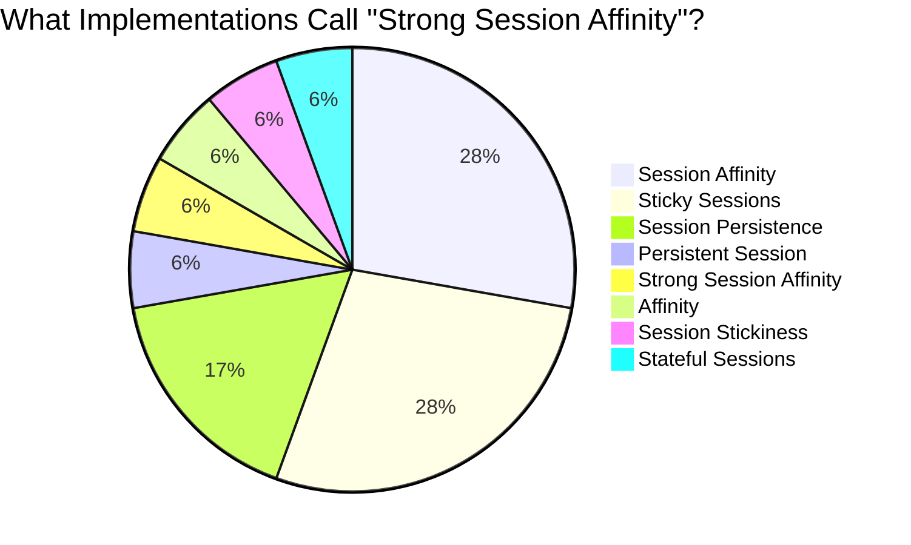
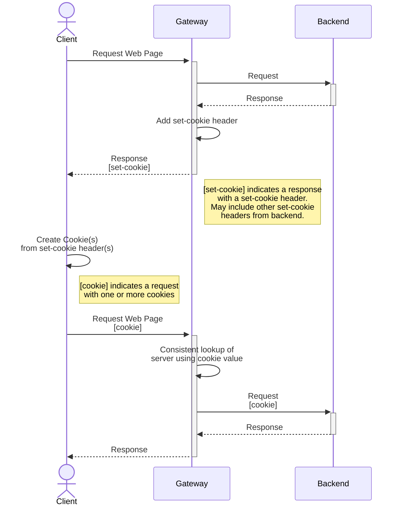
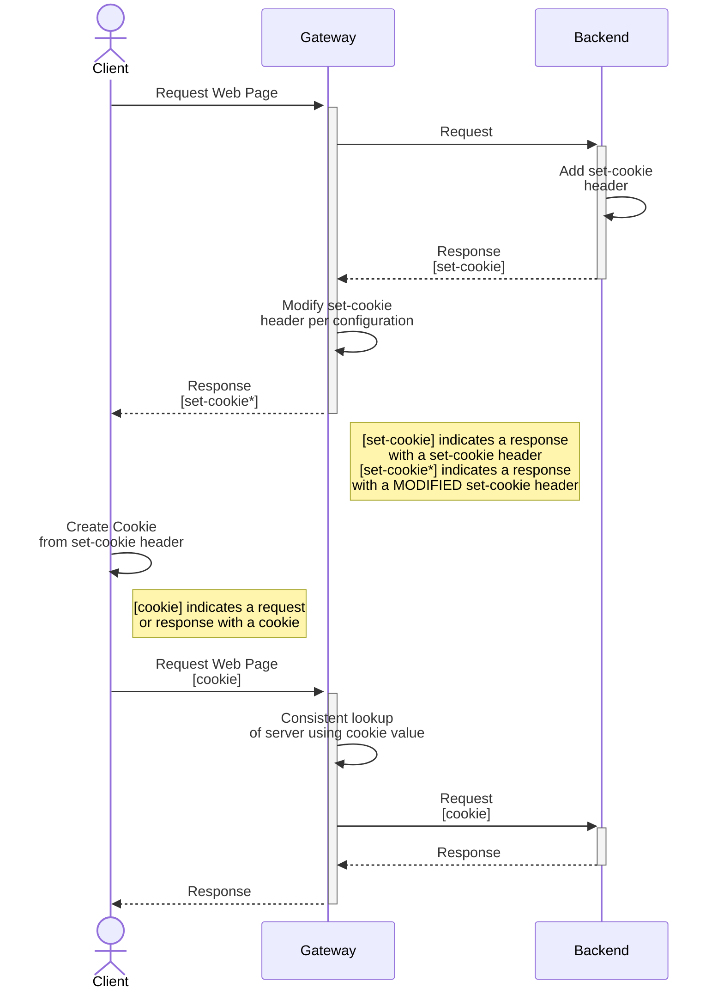
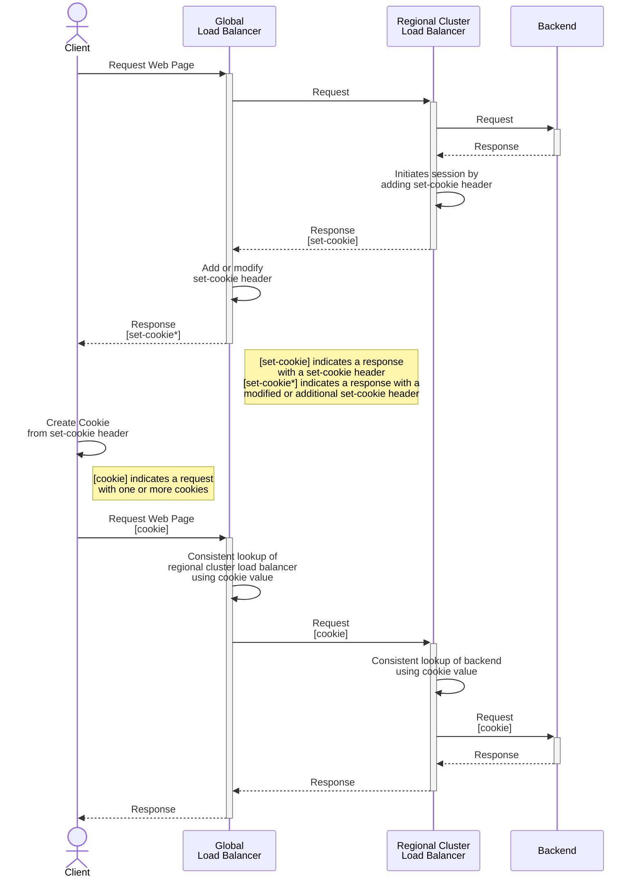
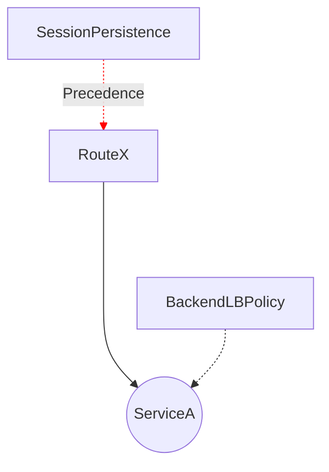

# GEP-1619: Session Persistence via BackendLBPolicy

* Issue: [#1619](https://github.com/kubernetes-sigs/gateway-api/issues/1619)
* Status: Experimental

(See [status definitions](../overview.md#gep-states).)

## Graduation Criteria

### Implementable

This GEP was accidentally merged as Provisional before the required approval
from 2 maintainers had been received. Before this graduates to implementable,
we need to get at least one of @robscott or @youngnick to also approve this GEP.

Before this GEP graduates to Implementable, we must fulfill the following criteria:

 1. Should we leave room in this policy to add additional concepts in the future
    such as Session Affinity? If so, how would we adjust the naming and overall
    scope of this policy?
    - **Answer**: Yes. We adjusted the API to use `BackendLBPolicy`. See [API](#api) for more details.
 2. Should we leave room for configuring different forms of Session Persistence?
    If so, what would that look like?
    - **Answer**: Yes. See the [BackendLBPolicy API](#backendlbpolicy-api) and [API Granularity](#api-granularity)
      sections for more details.
 3. What name appropriately describe the API responsible for configuring load-balancing options for backend traffic?
    - **Answer**: We decided on `BackendLBPolicy` since it is aligned with `BackendTLSPolicy`, describes configuration
      related to load balancing, and isn't too long.
 4. Finish designing the [Route Rule API](#route-rule-api) and document edge cases in [Edge Case Behavior](#edge-case-behavior)
    for configuring session persistence on both `BackendLBPolicy` and route rules.
    - **Answer**: Yes. See [Route Rule API](#route-rule-api) and [Edge Case Behavior](#edge-case-behavior) for more details.

### Standard

Before this GEP graduates to the Standard channel, we must fulfill the following criteria:

- Sign-off from the GAMMA leads to ensure service mesh gets fully considered.

## TLDR

This GEP initially proposes a definitions for session persistence, followed by the definition of an API spec for
configuring it. Additionally, it explores example scenarios of session persistence and examines the approaches that
implementations have taken to design APIs for session persistence. It intentionally refrains from defining an API for
session affinity, as this design is expected to be addressed within a separate GEP.

## Goals

- Define session persistence and session affinity to establish a common language
- Identify differences in session persistence functionality between implementations
- Define an API for session persistence
- Establish anticipated outcomes for specific API configurations or scenarios

## Non-Goals

- Define an API for session affinity
- Mandate a default session persistence or session affinity functionality for implementations
- Prescribe the precise manner (the "how") in which implementations should achieve session persistence or handle
  specific scenarios
- Add API configuration for supporting backend initiated sessions

## Introduction

### Naming

Naming is hard. We've had lots of [discussion](https://github.com/kubernetes-sigs/gateway-api/discussions/2893) on the
topic of naming session persistence. Adding to the complexity, the Gateway API implementations do not have a consensus
on a naming convention for session persistence or affinity.

To start this discussion, lets establish the idea of strong session affinity (what this GEP calls session persistence)
and weak session affinity (what this GEP calls session affinity) which we will define further in
[The Relationship of Session Persistence and Session Affinity](#the-relationship-of-session-persistence-and-session-affinity).
In this context, "strong" implies a guarantee, while "weak" indicates a best-effort approach.

Here's a survey of how some implementations refers to these ideas:

| Implementation  | Name for Strong Session Affinity | Name for Weak Session Affinity |
| ------------- | ------------- | ------------- |
| Apache APISIX | [Sticky Sessions](https://apisix.apache.org/docs/ingress-controller/concepts/apisix_upstream/) | N/A |
| Avi Kubernetes Operator | [Session Persistence](https://docs.vmware.com/en/VMware-NSX-T-Data-Center/3.2/administration/GUID-8B5C8D64-2B69-4C95-86A5-C5396CB9E51F.html) | [Session Persistence](https://docs.vmware.com/en/VMware-NSX-T-Data-Center/3.2/administration/GUID-8B5C8D64-2B69-4C95-86A5-C5396CB9E51F.html) |
| Azure Application Gateway for Containers | [Session Affinity](https://learn.microsoft.com/en-us/azure/application-gateway/for-containers/session-affinity?tabs=session-affinity-gateway-api) | N/A |
| Cilium | N/A | [Session Affinity](https://docs.cilium.io/en/stable/network/kubernetes/kubeproxy-free/#session-affinity) |
| Contour | [Session Affinity / Sticky Sessions](https://projectcontour.io/docs/1.24/config/request-routing/#session-affinity) | N/A |
| Envoy | [Session Stickiness / Stateful Sessions](https://www.envoyproxy.io/docs/envoy/latest/configuration/http/http_filters/stateful_session_filter) (Strong) | [Session Stickiness / Stateful Sessions](https://www.envoyproxy.io/docs/envoy/latest/configuration/http/http_filters/stateful_session_filter) (Weak) |
| Emissary-Ingress (Ambassador API Gateway) | [Sticky Sessions / Session Affinity](https://www.getambassador.io/docs/emissary/latest/topics/running/load-balancer#cookie) | [Sticky Sessions / Session Affinity](https://www.getambassador.io/docs/emissary/latest/topics/running/load-balancer#cookie) |
| Gloo Gateway 2.0 | [Session Affinity / Sticky Sessions](https://docs.solo.io/gloo-edge/latest/installation/advanced_configuration/session_affinity/) | [Session Affinity / Sticky Sessions](https://docs.solo.io/gloo-edge/latest/installation/advanced_configuration/session_affinity/) |
| Google Kubernetes Engine | [Session Affinity](https://cloud.google.com/load-balancing/docs/backend-service#session_affinity) | [Session Affinity](https://cloud.google.com/load-balancing/docs/backend-service#session_affinity) |
| HAProxy Ingress | [Affinity](https://haproxy-ingress.github.io/docs/configuration/keys/#affinity) | N/A |
| HAProxy Kubernetes Ingress Controller | [Session Persistence](https://www.haproxy.com/documentation/haproxy-runtime-api/reference/enable-dynamic-cookie-backend/#sidebar) | N/A |
| Istio | [Strong Session Affinity](https://istio.io/latest/docs/reference/config/networking/destination-rule/#LoadBalancerSettings-ConsistentHashLB) | [Soft Session Affinity](https://istio.io/latest/docs/reference/config/networking/destination-rule/#LoadBalancerSettings-ConsistentHashLB) |
| Kong | [Persistent Session](https://docs.konghq.com/hub/kong-inc/saml/configuration/#config-session_remember) | N/A |
| Nginx (Proxy) | [Session Persistence](https://docs.nginx.com/nginx/admin-guide/load-balancer/http-load-balancer/#enabling-session-persistence) | [Session Persistence](https://docs.nginx.com/nginx/admin-guide/load-balancer/http-load-balancer/#enabling-session-persistence) |
| Traefik | [Sticky Sessions](https://doc.traefik.io/traefik/routing/services/#sticky-sessions) | N/A |

Visualizing the result for what implementations call "Strong Session Affinity" (aka Session Persistence), it's mostly
inconclusive:



This GEP chooses to use "session persistence" as the preferred definition of strong session affinity (guaranteed) while
reserving "session affinity" to mean weak session affinity (best-effort).  We selected these names because "session
persistence" and "session affinity" share a symmetry that indicates to users that there is a relationship between them.
The term "Persistence" implies a sense of strong consistency or recurring behavior, whereas "Affinity" carries a weaker
connotation related to liking or attraction.

**Note**: One concern for using the name "session persistence" is that it may be confused the idea of persisting a
session to storage. This confusion is particularly common among Java developers, as Java defines session persistence as
storing a session to disk.

### Defining Session Persistence

Session persistence is when a client request is directed to the same backend server for the duration of a "session". It is achieved when a client directly provides information, such as a header, that a proxy uses as a reference to direct traffic to a specific server. Persistence is an exception to load balancing: a persistent client request bypasses the proxy's load balancing algorithm, going directly to a backend server it has previously established a session with.

Session persistence enables more efficient application workflows:

1. Better performance: Maintaining a single session allows a server to cache information about a client locally reducing the need for servers to exchange session data and overall storage needs.
2. Seamless client experience: Clients can reconnect to the same server without re-authenticating or re-entering their information.

Some of the concerns of session persistence are the duration and expiration of the session, security of the transaction stream, and storage of the context or state.

Session affinity, not to be confused with session persistence, uses an existing attribute of the request to consistently send to the same backend. Session affinity can be considered a weaker form of session persistence: it is not guaranteed to persist a connection to the same backend server if certain attributes of the request or the backends are changed.

### Security and Privacy Implications

Session persistence can introduce security and privacy vulnerabilities if not properly implemented. These vulnerabilities can include:

1. Session hijacking: Attackers intercepting or predicting a valid session token to gain unauthorized access.
2. Session fixation: Attackers setting a client's session ID to a known value, which they can then use to hijack the session.
3. Session replay attacks: Attackers capturing and resending a client's message with a valid session ID.
4. Data leakage: Attackers can exploit sensitive session information cached on servers if not properly secured.
5. Denial of service attacks: Attackers can use up server resources by creating and maintaining large numbers of sessions.

To mitigate these security concerns, it is important to implement session persistence using secure practices, such as using strong session ID generation algorithms, implementing session timeouts, encrypting sensitive data, and monitoring server resources for unusual activity.

IP address reuse may also be a security or privacy concern when using session persistence or session affinity. If Kubernetes reuses an IP address of previously shutdown pod, the new pod may receive session persistent traffic meant for the old pod.

Session affinity introduces fewer security and privacy vulnerabilities since there are no session tokens to protect or exploit.

### Achieving Session Persistence

Session persistence is achieved using attributes residing in the application layer. The following are mechanisms for achieving session persistence:

**1. Cookie-Based Session Persistence**

The most common mechanism is by using cookies (described by [RFC6265](https://www.rfc-editor.org/rfc/rfc6265)) with the set-cookie HTTP response header. A client will use the provided value in the set-cookie response header in a cookie request header in subsequent requests. Proxies can use this cookie header to maintain a persistent connection to a single backend server on behalf of the client.

**2. Header-Based Session Persistence**

Header-based stateful sessions are achieved by a backend or gateway providing an HTTP response header and the client using the same header in subsequent HTTP requests. Proxies can use this header to maintain a persistent connection to a single backend server on behalf of the client.

**3. URL-Encoded Session Persistence**

Session information can be also encoded into the request URL to establish a persistent session. The server rewrites the client's URL to encode the new session information automatically. The server or the gateway then decodes the session information from the URL to identify the session.

### Session Persistence Initiation

For all implementations of session persistence, the initiation of the persistent session is possible from various
sources, including the gateway, intermediary gateway, backend, a sidecar in a backend, or any other infrastructure
component.

Let's consider a simple implementation comprised of gateways and backends. The following rules apply based on who initiates the session:

- If the gateway initiates the session, the backend will be presented with session attributes regardless if it enabled them.
- If the backend initiates the session, the gateway should allow this and not force persistent connections, unless
  specifically configured to. The gateway may decode and alter the cookie established by the backend to achieve
  session persistence.

It's important to note that we can have more complex implementations which involve traversing global load balancers,
regional load balancers, intermediary internal gateways, sidecars, or waypoints before reaching the backend. At any
point within this architecture, a persistent session can be initiated. See [Global Load Balancer Initiated Session Example](#global-load-balancer-initiated-session-example)
for an example of one of these alternative implementations.

In the next sections, we will take a closer look at the initiation of sessions in both the gateway and the backend.
Please note that in the next sections, we are examining the various scenarios in which a session can be initiated. We
are not prescribing specific implementations for session persistence. The intention is to understand the possibilities
and behaviors related to session initiation while the [API](#api) section will provide more details on specific
implementation details.

#### Gateway Initiated Session Example

To illustrate how a gateway can initiate a session, let's examine an implementation that uses cookies for persistence.
This represents the most straightforward scenario for utilizing cookies. When a request is made, the gateway includes
the `set-cookie` header in the final response, prompting the client to store the cookie. This cookie is subsequently
used in future requests, allowing the gateway to consistently choose the same upstream, establishing a persistent
session.

Here an example implementation of a gateway initiating a session through cookies:


#### Backend Initiated Session Example

**Important**: While we took it into consideration, this GEP does not support configuring backend-initiated sessions.
This could potentially affect frameworks that initiate sessions in the backend. Implementing this feature is complicated
and requires careful design, making it suitable for exploration in a separate GEP.

Continuing with the cookie example, when dealing with backend-initiated sessions, the process becomes somewhat more
complex. For cookie-based session persistence, the gateway needs to store a value within a cookie containing a backend
identifier. This identifier can be then used as a reference to maintain a persistent session to a specific backend.
There are several approaches a gateway could use in this situation to achieve session persistence:

1. Insert an additional cookie
2. Modify the existing cookie's value
3. Prefix the existing cookie

Additionally, there are variations to each of these approaches, such as making new or updated cookies transparent to the
backend, either by remove an inserted cookie or reversing modifications of the cookie's value.

Alternatively, if the backend is not configured for session persistence, the gateway should refrain from modifying or
inserting a cookie. In this situation, the gateway should remain passive and simply forward the `set-cookie` header as
it is.

Refer to the [Session Initiation Guidelines](#session-initiation-guidelines) section of the API for implementation
guidance.

Here's an example implementation of a backend initiating a session and the gateway modifies the cookie's value:


#### Global Load Balancer Initiated Session Example

In a more complex architecture example, a global load balancer may need to use cookies in order to maintain persistent
connections to a regional load balancer. The regional cluster load balancer initiates the session by issuing the
`set-cookie` header and subsequently uses the cookie to maintain persistent connections to a specific backend. The
global load balancer then adds or modifies a cookie in order to establish persistent connection to a regional cluster
load balancer.

Here an example implementation of a global load balancer and a regional load balancer creating sessions through cookies:


### When does an application require session persistence?

Enabling session persistence is a required configuration for applications intentionally designed by the application
developer to use it, as they will encounter failures or malfunctions when it's not enabled. However, it's worth noting
that certain applications may be designed to function both with and without session persistence. Regardless, the
importance of Gateway API supporting session persistence remains emphasized because it is frequently seen as a necessary
feature.

Conversely, apps that have not been designed or tested with session persistence in mind may misbehave when it is
enabled, primarily because of the impacts of load distribution on the app. Apps using session persistence must account
for aspects like load shedding, draining, and session migration as a part of their application design.

### The Relationship of Session Persistence and Session Affinity

As discussed in [Naming](#naming), we defined session persistence as "strong" and session affinity as "weak". Though
this GEP's intention is not to define an API for session affinity, let's understand its distinction with session
persistence.

While session persistence uses attributes in the application layer, session affinity can also use attributes below the
application layer. Session affinity doesn't require a specific backend identifier to be encoded in a cookie or header;
instead, it can use any existing connection attributes to establish a consistent hashing load balancing algorithm. This
implies session affinity can use cookies or headers, as seen in Istio's [ConsistentHashLB](https://istio.io/latest/docs/reference/config/networking/destination-rule/#LoadBalancerSettings-ConsistentHashLB). With session
affinity, the cookie or header will be hashed on its arbitrary value.

It is important to note the session affinity is less reliable and doesn't guarantee persistent connections to the same
backend server. If a proxy or load balancer restarts, or if backends are added to the backend pool, the session affinity
mechanism will likely redirect the user's connection to a new backend. In contrast, session persistence encodes a
backend identifier in a cookie or header, so as long as the backend still exists, it will be unaffected by proxy
restarts or changes in the backend pool.

Session affinity can be achieved by deterministic load balancing algorithms or a proxy feature that tracks IP-to-backend
associations such as [HAProxy's stick tables](https://www.haproxy.com/blog/introduction-to-haproxy-stick-tables/) or
[Cilium's session affinity](https://docs.cilium.io/en/v1.12/gettingstarted/kubeproxy-free/#id2).

We can also examine how session persistence and session affinity functionally work together, by framing the relationship
into a two tiered logical decision made by the data plane:

1. If the request contains a session persistence identity (e.g. in a cookie or header), then route it directly to the
   backend it has previously established a session with.
2. If no session persistence identity is present, load balance as per load balancing configuration, taking into account
   the session affinity configuration (e.g. by utilizing a hashing algorithm that is deterministic).

This tiered decision-based logic is consistent with the idea that session persistence is an exception to load balancing.
Though there are different ways to frame this relationship, this design will influence the separation between
persistence and affinity API design.

### Implementations

In this section, we will describe how implementations achieve session persistence, along with a breakdown of related configuration options. Input from implementations is appreciated to complete this information.

In the following tables, we will example two types of APIs:

1. Dataplane APIs
2. Implementation APIs

Generally, the implementation API programs the dataplane API; however these two are not always clearly separated. The two types of APIs can use different API structures for configuring the same feature. Examining the dataplane APIs helps to remove the layer of API abstraction that implementations provide. Removing this layer avoids situations where implementations don’t fully implement all capabilities of a dataplane API or obfuscate certain configuration around session persistence. On the other hand, examining implementation APIs provides valuable data points in what implementations are interested in configuring.

**Table Last Updated:** Feb 21, 2024

| **Technology** 	| **Technology Type** 	| **Session Persistence Type** 	| **Configuration Options** 	| **Configuration Association (Global, Gateway, Route, or Backends)** 	| **Notes** 	|
|---	|---	|---	|---	|---	|---	|
| Acnodal EPIC 	| Implementation (Envoy) 	| N/A 	| Supports Gateway API Only* 	| N/A 	| *Acnodal Epic solely uses Gateway API; therefore, it doesn’t yet have a way to configure session persistence. [Acnodal EPIC Docs](https://www.epick8sgw.io/docs/) 	|
| Amazon Elastic Kubernetes Service | Implementation / Dataplane | N/A | Supports Gateway API Only* | N/A | *Amazon Elastic Kubernetes Service solely uses Gateway API; therefore, it doesn’t yet have a way to configure session persistence. [Amazon Elastic Kubernetes Service Docs](https://www.gateway-api-controller.eks.aws.dev/) |
| Apache APISIX 	| Implementation (Nginx) 	| [Cookie-Based](https://apisix.apache.org/docs/apisix/admin-api/#upstream) 	| hash_on=[vars \| header \| cookie \| consumer]<br>key=cookie_name 	| [Upstream](https://apisix.apache.org/docs/apisix/admin-api/#upstream) (Route or Backends) 	| N/A 	|
|  	| Implementation (Nginx) 	| [Header-Based](https://apisix.apache.org/docs/apisix/terminology/upstream/#header) 	| hash_on=[vars \| header \| cookie \| consumer]<br>key=header_name 	| [Upstream](https://apisix.apache.org/docs/apisix/admin-api/#upstream) (Route or Backends) 	| N/A 	|
| Apache httpd 	| Web Server 	| [Cookie-Based / URL-Encoded](https://httpd.apache.org/docs/2.4/mod/mod_proxy_balancer.html) 	| Cookie Attributes 	| N/A 	| N/A 	|
| Avi Kubernetes Operator | Implementation / Dataplane | [Cookie-Based](https://docs.vmware.com/en/VMware-NSX-T-Data-Center/3.2/administration/GUID-8B5C8D64-2B69-4C95-86A5-C5396CB9E51F.html) | Shared Persistence Cookie Mode=[Insert \| Prefix \| Rewrite] Cookie Name=name Cookie Domain=domain Cookie Fallback=domain Cookie Path=path Cookie Garbling Cookie Type=[ Session Cookie \| Persistence Cookie] Http Only Flag Secure Flag Max Idle Time=time Max Cookie Age=time | [Route](https://docs.vmware.com/en/VMware-NSX-Advanced-Load-Balancer/1.11/Avi-Kubernetes-Operator-Guide/GUID-E8F3C338-46FB-412E-8B46-16EE2C12A8AF.html) | N/A |
| Azure Application Gateway for Containers | Implementation / Dataplane | [Cookie-Based](https://learn.microsoft.com/en-us/azure/application-gateway/for-containers/session-affinity?tabs=session-affinity-gateway-api) | affinityType=[application-cookie \| managed-cookie]<br>cookieName=name<br>cookieDuration=seconds | [Route](https://github.com/MicrosoftDocs/azure-docs/blob/main/articles/application-gateway/for-containers/api-specification-kubernetes.md#alb.networking.azure.io/v1.RoutePolicy) | RoutePolicy which attaches to HTTPRoutes |
| BIG-IP Kubernetes Gateway | Implementation (F5 BIG-IP) | N/A | Supports Gateway API Only* | N/A | *BIG-IP Kubernetes Gateway solely uses Gateway API; therefore, it doesn’t yet have a way to configure session persistence. [BIG-IP Kubernetes Gateway Docs](https://gateway-api.f5se.io/) |
| Cilium 	| Implementation / Dataplane 	| None 	| None 	| None 	| Cilium has no documented way of doing session persistence. [Cilium Docs](https://cilium.io/)  	|
| Contour 	| Implementation (Envoy) 	| [Cookie-Based](https://projectcontour.io/docs/1.24/config/api/#projectcontour.io/v1.CookieRewritePolicy)  	| Name=name<br>pathRewrite=path<br>domainRewrite=domain<br>secure<br>sameSite 	| [Route](https://projectcontour.io/docs/1.24/config/api/#projectcontour.io/v1.Route) and [Service](https://projectcontour.io/docs/1.24/config/api/#projectcontour.io/v1.Service) (Backends) 	| Envoy does not natively support cookie attribute rewriting nor adding attributes other than path and TTL, but rewriting and adding additional attributes is possible via Lua ([Contour design reference](https://github.com/projectcontour/contour/blob/main/design/cookie-rewrite-design.md), [Envoy Issue](https://github.com/envoyproxy/envoy/issues/15612)). 	|
| Easegress | Implementation / Dataplane | None | None | None | [Easegress Docs](https://megaease.com/docs/easegress/) |
| Emissary-Ingress 	| Implementation (Envoy) 	| [Cookie-Based](https://www.getambassador.io/docs/emissary/latest/topics/running/load-balancer#cookie) 	| Name=name<br>Path=path<br>TTL=duration 	| [Module or Mapping](https://www.getambassador.io/docs/emissary/latest/topics/running/load-balancer#cookie) (Global or Route) 	| N/A 	|
|  	|  	| [Header-Based](https://www.getambassador.io/docs/emissary/latest/topics/running/load-balancer#header) 	| Name=name 	| [Module or Mapping](https://www.getambassador.io/docs/emissary/latest/topics/running/load-balancer#cookie) (Global or Route) 	| N/A 	|
| Envoy 	| Dataplane 	| [Cookie-Based](https://www.envoyproxy.io/docs/envoy/latest/api-v3/extensions/http/stateful_session/cookie/v3/cookie.proto) 	| Name=name<br>Path=path<br>TTL=duration 	| [HttpConnectionManager](https://www.envoyproxy.io/docs/envoy/latest/api-v3/extensions/filters/network/http_connection_manager/v3/http_connection_manager.proto) (Route) 	| Envoy does not natively support cookie attribute rewriting nor adding attributes other than path and TTL, but rewriting and adding additional attributes is possible via Lua ([Contour design reference](https://github.com/projectcontour/contour/blob/main/design/cookie-rewrite-design.md), [Envoy Issue](https://github.com/envoyproxy/envoy/issues/15612)). 	|
|  	|  	| [Header-Based](https://www.envoyproxy.io/docs/envoy/latest/api-v3/extensions/http/stateful_session/header/v3/header.proto) 	| Name=name 	| [HttpConnectionManager](https://www.envoyproxy.io/docs/envoy/latest/api-v3/extensions/filters/network/http_connection_manager/v3/http_connection_manager.proto) (Route) 	| N/A 	|
| Envoy Gateway 	| Implementation (Envoy) 	| N/A 	| Supports Gateway API Only* 	| N/A 	| *Envoy Gateway solely uses Gateway API; therefore, it doesn’t yet have a way to configure session persistence. [Envoy Gateway Docs](https://gateway.envoyproxy.io/v0.3.0/index.html) 	|
| Flomesh Service Mesh 	| Implementation / Dataplane (Pipy) 	| ? 	| ? 	| ? 	| ? 	|
| Gloo Gateway | Implementation (Envoy) | [Cookie-Based](https://docs.solo.io/gloo-edge/latest/reference/api/envoy/api/v2/route/route.proto.sk/#cookie) | Name=name Path=path TTL=duration | [Route](https://docs.solo.io/gloo-edge/latest/reference/api/envoy/api/v2/route/route.proto.sk/#route) (Route) | N/A |
|  	|  	| [Header-Based](https://docs.solo.io/gloo-edge/latest/reference/api/envoy/api/v2/route/route.proto.sk/#hashpolicy) 	| Name=name 	| [Route](https://docs.solo.io/gloo-edge/latest/reference/api/envoy/api/v2/route/route.proto.sk/#route) (Route) 	| N/A 	|
| Google CloudRun 	| Dataplane 	| [Cookie-Based](https://cloud.google.com/run/docs/configuring/session-affinity) 	| Enabled / Disabled 	| [Service](https://cloud.google.com/run/docs/configuring/session-affinity) (Backends) 	| Only allowed to turn off or on, no other configuration items 	|
| Google Kubernetes Engine 	| Implementation / Dataplane 	| [Cookie-Based](https://cloud.google.com/load-balancing/docs/backend-service#session_affinity) 	| GENERATED_COOKIE or HTTP_COOKIE=name<br>cookieTtlSec 	| [Backend Policy](https://cloud.google.com/kubernetes-engine/docs/how-to/configure-gateway-resources#session_affinity) (Backends) 	| Google Kubernetes Engine [lists](https://cloud.google.com/load-balancing/docs/backend-service#bs-session-affinity) the products that can do persistence/affinity mode. All persistence/affinity options are exclusive and can’t be used at the same time.<br>Note: Google Kubernetes Engine defines everything (persistence and affinity) as session affinity. 	|
|  	|  	| [Header-Based](https://cloud.google.com/load-balancing/docs/backend-service#header_field_affinity) 	| httpHeaderName=name 	| [Backend Policy](https://cloud.google.com/kubernetes-engine/docs/how-to/configure-gateway-resources#session_affinity) (Backends) 	| N/A 	|
| HAProxy 	| Dataplane 	| [Cookie-Based](https://docs.haproxy.org/2.6/configuration.html#4.2-cookie) 	| name=name<br>[rewrite \| insert \| prefix ]<br>indirect<br>nocache<br>postonly<br>preserve<br>httponly<br>secure<br>domain=domain<br>maxidle=idle<br>maxlife=life<br>dynamic<br>attr=value 	| [Default or Backends](https://docs.haproxy.org/2.6/configuration.html#4.2-cookie) (Global or Backends) 	| HAProxy allows for operational cookie strategy configuration (i.e. when/how HAProxy should inject cookies) 	|
| HAProxy Ingress 	| Implementation (HAProxy) 	| [Cookie-Based](https://haproxy-ingress.github.io/docs/configuration/keys/#affinity) 	| affinity (enable/disable)<br>cookie-key=key<br>session-cookie-domain=domain<br>session-cookie-dynamic=[true \| false]<br>session-cookie-keywords=keywords<br>session-cookie-name=name<br>session-cookie-preserve=[true \| false]<br>session-cookie-same-site=[true \| false]<br>session-cookie-shared=[true \| false]<br>session-cookie-strategy=strategy<br>session-cookie-value-strategy=value_strategy	 	| [Backend](https://haproxy-ingress.github.io/docs/configuration/keys/#affinity) (Backends) 	| N/A 	|
| Hashicorp Consul  	| Implementation (Envoy) 	| N/A 	| Supports Gateway API Only* 	| N/A 	| *Hashicorp Consul solely uses Gateway API; therefore, it doesn’t yet have a way to configure session persistence. [Hashicorp Consul API Gateway Docs](https://developer.hashicorp.com/consul/docs/api-gateway) 	|
| Istio 	| Implementation (Envoy) 	| [Cookie-Based](https://istio.io/latest/docs/reference/config/networking/destination-rule/#LoadBalancerSettings-ConsistentHashLB-HTTPCookie) 	| Name=name<br>Path=path<br>TTL=duration 	| [ConsistentHashLB](https://istio.io/latest/docs/reference/config/networking/destination-rule/#LoadBalancerSettings-ConsistentHashLB) (Backends) 	| Istio also supports turning on cookie-based session persistence via the Pilot ENV variable [PILOT_PERSISTENT_SESSION_LABEL](https://istio.io/latest/docs/reference/commands/pilot-discovery/#envvars). 	|
|  	| Implementation (Envoy) 	| [Header-Based](https://istio.io/latest/docs/reference/config/networking/destination-rule/#LoadBalancerSettings-ConsistentHashLB) 	| Name=name 	| [ConsistentHashLB](https://istio.io/latest/docs/reference/config/networking/destination-rule/#LoadBalancerSettings-ConsistentHashLB) (Backends) 	| N/A 	|
| Java Servlet 	| Web Server 	| [Cookie-Based / URL-Encoded](https://docs.oracle.com/javaee/7/api/javax/servlet/http/HttpSession.html) 	| invalidate()<br>setAttribute(String name, Object value)<br>setMaxInactiveInterval(int interval) 	| N/A 	| Java Servlets do not natively support proxy functions. 	|
| Kong 	| Implementation / Dataplane 	| [Cookie-Based](https://docs.konghq.com/hub/kong-inc/session/) 	| cookie_name=name<br>rolling_timeout=timeout<br>absolute_timeout=timeout<br>idling_timeout=timeout<br>cookie_path=path<br>cookie_domain=domain<br>cookie_same_site=[Strict \| Lax \| None \| off]<br>cookie_http_only<br>cookie_secure=[true \| false]<br>stale_ttl=duration<br>cookie_persistent=[true \| false]<br>storage=storage_type 	| [Route, Service, Global](https://docs.konghq.com/hub/kong-inc/session/) (Route or Backends or Global) 	| N/A 	|
|  	|  	| [Header-Based](https://docs.konghq.com/gateway/latest/how-kong-works/load-balancing/#balancing-algorithms) 	| name 	| [Upstreams](https://docs.konghq.com/gateway/3.2.x/admin-api/#add-upstream) (Backends) 	| N/A 	|
| Kuma 	| Implementation (Envoy) 	| None 	| None 	| None 	| Kuma has no documentation on how it supports session persistence or cookies. [Kuma Docs](https://kuma.io/docs/2.1.x/) 	|
| Linkerd | Gamma Implementation | None | None | None | [Linkerd Docs](https://linkerd.io/)  |
| LiteSpeed Ingress Controller | ? | ? | ? | ? | ? |
| Nginx  	| Dataplane 	| [Cookie-Based (Nginx Plus Only)](https://docs.nginx.com/nginx/admin-guide/load-balancer/http-load-balancer/#enabling-session-persistence) 	| Name=name<br>Expires=time<br>Domain=domain<br>HttpOnly<br>SameSite = [strict \| lax \| none \| $variable]<br>Secure<br>path=path 	| [Upstream](https://docs.nginx.com/nginx/admin-guide/load-balancer/http-load-balancer/#enabling-session-persistence) (Backends) 	| See also [Sticky Cookie](https://nginx.org/en/docs/http/ngx_http_upstream_module.html?&_ga=2.184452070.1306763907.1680031702-1761609832.1671225057#sticky_cookie) 	|
| NGINX Gateway Fabric 	| Implementation (Nginx) 	| N/A 	| Supports Gateway API Only* 	| N/A 	| *NGINX Gateway Fabric solely uses Gateway API; therefore, it doesn’t yet have a way to configure session persistence. [NGINX Gateway Fabric Docs](https://github.com/nginxinc/nginx-gateway-fabric) 	|
| STUNner | Implementation / Dataplane | None | None | None | [STUNner Docs](https://github.com/l7mp/stunner) |
| Traefik 	| Implementation / Dataplane 	| [Cookie-Based](https://doc.traefik.io/traefik/routing/services/#sticky-sessions) 	| name=name<br>secure<br>httpOnly<br>sameSite=[none \| lax \| strict ] 	| [Services](https://doc.traefik.io/traefik/routing/services/#sticky-sessions) (Backends) 	| N/A 	|
| Tyk | Implementation / Dataplane | None | None | None | [Tyk Docs](https://tyk.io/docs/) |
| WSO2 APK | Implementation / Dataplane | None | None | None | [WSO2 APK Docs](https://apk.docs.wso2.com/en/latest/) |

### Sessions in Java

Java application servers such as Tomcat and Jetty, were the first to standardize the API around cookies and sessions.
These Java applications introduced the “jsessionid” cookie and session IDs encoded in URL parameters as well as more
advanced features such as session migration, replication, and on demand session activation. It’s important for Gateway
API to examine cookie use cases and history from Java APIs to ensure the API is designed appropriately.

### Session Affinity in K8S Services

Kubernetes provides an API that allows you to enable [session affinity](https://kubernetes.io/docs/reference/networking/virtual-ips/#session-affinity)
on service objects. It ensures consistent sessions by utilizing the client's IP address and also offers the option to
set a timeout for the maximum session duration. Implementations of Gateway API, such as service mesh use cases, may use
the service IP directly. In these cases where both Kubernetes service session affinity and Gateway API session
persistence are both enabled, the route MUST be rejected, and a status should be set describing the incompatibility of
these two configurations.

## API

In this section, we will explore the questions and design elements associated with a session persistence API.

We will present two distinct patterns for configuring session persistence:

1. `BackendLBPolicy`: a Direct Policy Attachment for backends (Services, ServiceImports, or any
   implementation-specific backendRef)
2. An inline API update to HTTPRoute and GRPCRoute rules

### BackendLBPolicy API

In order to apply session persistence configuration to a backend, we will implement it as a [Policy Attachment](../../reference/policy-attachment.md).
The new metaresource is named `BackendLBPolicy` and is responsible for configuring load balancing-related configuration
for traffic intended for a backend after routing has occurred. It is defined as a [Direct Policy Attachment](../gep-713/index.md#direct-policy-attachment)
without defaults or overrides, applied to the targeted backend.

Instead of utilizing a specific, session persistence-only policy object, we introduce a more generic API object named
`BackendLBPolicy`. This design provides tighter coupling with other load balancing configuration which helps reduce
CRD proliferation. For instance, `BackendLBPolicy` could be augmented to add configuration for selecting a load
balancing algorithm for traffic to the backends, as desired in issue [#1778](https://github.com/kubernetes-sigs/gateway-api/issues/1778).
`BackendLBPolicy` could also be later expanded to contain [session affinity](#the-relationship-of-session-persistence-and-session-affinity)
configuration. This would provide a convenient grouping of the two related APIs within the same policy object.
Additionally, other future enhancements to the API may include the addition of timeouts, connection draining, and
logging within `BackendLBPolicy`.

As for achieving session persistence, this API currently exposes the `Type` field which allows selection between
cookie-based and header-based session persistence. Cookie-based session persistence is considered a core feature,
while header-based session persistence is extended and therefore optional.

```go
// BackendLBPolicy provides a way to define load balancing rules
// for a backend.
type BackendLBPolicy struct {
    metav1.TypeMeta   `json:",inline"`
    metav1.ObjectMeta `json:"metadata,omitempty"`

    // Spec defines the desired state of BackendLBPolicy.
    Spec BackendLBPolicySpec `json:"spec"`

    // Status defines the current state of BackendLBPolicy.
    Status PolicyStatus `json:"status,omitempty"`
}

// BackendLBPolicySpec defines the desired state of
// BackendLBPolicy.
// Note: there is no Override or Default policy configuration.
type BackendLBPolicySpec struct {
    // TargetRef identifies an API object to apply policy to.
    // Currently, Backends (i.e. Service, ServiceImport, or any
    // implementation-specific backendRef) are the only valid API
    // target references.
    // +listType=map
    // +listMapKey=group
    // +listMapKey=kind
    // +listMapKey=name
    // +kubebuilder:validation:MinItems=1
    // +kubebuilder:validation:MaxItems=16
    TargetRefs []LocalPolicyTargetReference `json:"targetRefs"`

    // SessionPersistence defines and configures session persistence
    // for the backend.
    //
    // Support: Extended
    //
    // +optional
    SessionPersistence *SessionPersistence `json:"sessionPersistence"`
}

// SessionPersistence defines the desired state of
// SessionPersistence.
// +kubebuilder:validation:XValidation:message="AbsoluteTimeout must be specified when cookie lifetimeType is Permanent",rule="!has(self.cookieConfig) || !has(self.cookieConfig.lifetimeType) || self.cookieConfig.lifetimeType != 'Permanent' || has(self.absoluteTimeout)"
type SessionPersistence struct {
    // SessionName defines the name of the persistent session token
    // which may be reflected in the cookie or the header. Users
    // should avoid reusing session names to prevent unintended
    // consequences, such as rejection or unpredictable behavior.
    //
    // Support: Implementation-specific
    //
    // +optional
    // +kubebuilder:validation:MaxLength=128
    SessionName *string `json:"sessionName,omitempty"`

    // AbsoluteTimeout defines the absolute timeout of the persistent
    // session. Once the AbsoluteTimeout duration has elapsed, the
    // session becomes invalid.
    //
    // Support: Extended
    //
    // +optional
    AbsoluteTimeout *Duration `json:"absoluteTimeout,omitempty"`

    // IdleTimeout defines the idle timeout of the persistent session.
    // Once the session has been idle for more than the specified
    // IdleTimeout duration, the session becomes invalid.
    //
    // Support: Extended
    //
    // +optional
    IdleTimeout *Duration `json:"idleTimeout,omitempty"`

    // Type defines the type of session persistence such as through
    // the use of a header or cookie. Defaults to cookie based session
    // persistence.
    //
    // Support: Core for "Cookie" type
    //
    // Support: Extended for "Header" type
    //
    // +optional
    // +kubebuilder:default=Cookie
    Type *SessionPersistenceType `json:"type,omitempty"`

    // CookieConfig provides configuration settings that are specific
    // to cookie-based session persistence.
    //
    // Support: Core
    //
    // +optional
    CookieConfig *CookieConfig `json:"cookieConfig,omitempty"`
}

// Duration is a string value representing a duration in time. The format is as specified
// in GEP-2257, a strict subset of the syntax parsed by Golang time.ParseDuration.
//
// +kubebuilder:validation:Pattern=`^([0-9]{1,5}(h|m|s|ms)){1,4}$`
type Duration string

// +kubebuilder:validation:Enum=Cookie;Header
type SessionPersistenceType string

const (
    // CookieBasedSessionPersistence specifies cookie-based session
    // persistence.
    //
    // Support: Core
    CookieBasedSessionPersistence   SessionPersistenceType = "Cookie"

    // HeaderBasedSessionPersistence specifies header-based session
    // persistence.
    //
    // Support: Extended
    HeaderBasedSessionPersistence   SessionPersistenceType = "Header"
)

// CookieConfig defines the configuration for cookie-based session persistence.
type CookieConfig struct {
    // LifetimeType specifies whether the cookie has a permanent or
    // session-based lifetime. A permanent cookie persists until its
    // specified expiry time, defined by the Expires or Max-Age cookie
    // attributes, while a session cookie is deleted when the current
    // session ends.
    //
    // When set to "Permanent", AbsoluteTimeout indicates the
    // cookie's lifetime via the Expires or Max-Age cookie attributes
    // and is required.
    //
    // When set to "Session", AbsoluteTimeout indicates the
    // absolute lifetime of the cookie tracked by the gateway and
    // is optional.
    //
    // Support: Core for "Session" type
    //
    // Support: Extended for "Permanent" type
    //
    // +optional
    // +kubebuilder:default=Session
    LifetimeType *CookieLifetimeType `json:"lifetimeType,omitempty"`
}

// +kubebuilder:validation:Enum=Permanent;Session
type CookieLifetimeType string

const (
    // SessionCookieLifetimeType specifies the type for a session
    // cookie.
    //
    // Support: Core
    SessionCookieLifetimeType   CookieLifetimeType = "Session"

    // PermanentCookieLifetimeType specifies the type for a permanent
    // cookie.
    //
    // Support: Extended
    PermanentCookieLifetimeType  CookieLifetimeType = "Permanent"
)
```

### Route Rule API

To support route rule level configuration, this GEP also introduces an API as inline fields within HTTPRouteRule and GRPCRouteRule.
Any configuration that is specified at Route Rule level MUST override configuration that is attached at the backend level because route rule have a more global view and responsibility for the overall traffic routing.
This route rule level API for enabling session persistence currently uses the same `SessionPersistence` struct from the
`BackendLBPolicy` API.

```go
type HTTPRouteRule struct {
    [...]

    // SessionPersistence defines and configures session persistence
    // for the route rule.
    //
    // Support: Extended
    //
    // +optional
    SessionPersistence *SessionPersistence `json:"sessionPersistence"`
}
```

```go
type GRPCRouteRule struct {
    [...]

    // SessionPersistence defines and configures session persistence
    // for the route rule.
    //
    // Support: Extended
    //
    // +optional
    SessionPersistence *SessionPersistence `json:"sessionPersistence"`
}
```

### API Granularity

The purpose of this session persistence API spec is to enable developers to specify that a specific backend expects a
persistent session. However, it intentionally avoids specifying low-level details or configurations related to the
session persistence implementation, such as cookie attributes. This decision is because the Gateway API supports various
infrastructure types, and some implementations that already provide session persistence may not be able to adhere to a
low-level API.

For instance, platforms using global load balancers to maintain persistent sessions between regional load balancers, or
Tomcat servlets generating distinct cookies per server. In such scenarios, it is important that this GEP does not
obstruct the existing use of cookies while enabling session persistence. Enabling particular low-level API
configurations, like allowing customization of the cookie name, could prevent certain implementations from conforming to
the spec. In other words, opting for a higher-level API provides better interoperability among our implementations.

However, this API spec does allow specifying specific forms or types of session persistence through the `Type` field in
the `SessionPersistence` struct, including options for cookie-based or header-based session persistence. This API field
accommodates implementations that offer multiple methods of session persistence, while also allowing users to specify
their preferred form of session persistence if desired.

### Target Persona

Referring to the [Gateway API Security Model](../../concepts/security-model.md#roles-and-personas),
the target kubernetes role/persona for session persistence are application developers, as mentioned in the [When does an application require session persistence?](#when-does-an-application-require-session-persistence)
section. It is the responsibility of the application developers to adjust the persistence configuration to ensure the
functionality of their applications.

### Prior Art

Referring to our [Implementations](#implementations) table on session persistence, the majority of Gateway API
implementations designed session persistence in their APIs to be attached to a service or backends. This should be
considered cautiously, as making associations to Gateway API's notion of Gateway, Route, and Service to other
implementation's objects is hard to directly translate. The idea of a route in Gateway API is often not the same as a
route in any given implementation.

### API Attachment Points

The new `BackendLBPolicy` metaresource only supports attaching to a backend. A backend can be a Service,
ServiceImport (see [GEP-1748](../gep-1748/index.md)), or any implementation-specific backends that are a valid
[`BackendObjectReference`](../../reference/spec.md#gateway.networking.k8s.io%2fv1.BackendObjectReference). Enabling session
persistence for a backend enables subsequently enables it for any route directing traffic to this backend. To learn more
about the process of attaching a policy to a backend, please refer to [GEP-713](../gep-713/index.md).

On the other hand, configuring the `sessionPersistence` field in the route rule enables session persistence exclusively
for the traffic directed to the `backendRefs` in this route rule. This means applying session persistence configuration
to a route rule MUST NOT affect traffic for other routes or route rules. Designing the configuration for a specific
route rule section rather than the route entirely, allows users to configure session persistence in a more granular
fashion. This approach avoids the need to decompose routes if the configuration is specific to a route path.

Session persistence configuration specified in a route rule SHALL override equivalent configuration in `BackendLBPolicy`.
In this situation, implementations MAY want to indicate a warning via a log or status. Refer to [GEP-713](../gep-713/index.md)
and/or [GEP-2648](../gep-2648/index.md) for more specific details on how to handle override scenarios.

Edge cases will arise when implementing session persistence support for both backends and route rules through
`BackendLBPolicy` and the route rule's `sessionPersistence` field. For guidance on addressing conflicting
attachments, please consult the [Edge Case Behavior](#edge-case-behavior) section, which outlines API
use cases. Only a subset of implementations have already designed their data plane to incorporate route rule level session
persistence, making it likely that route rule level session persistence will be less widely implemented.

### Traffic Splitting

In scenarios involving traffic splitting, session persistence impacts load balancing done after routing.
When a persistent session is established and traffic splitting is configured across services, the persistence to a single backend MUST be maintained across services, even if the weight is set to 0.
Consequently, a persistent session takes precedence over traffic split
weights when selecting a backend after route matching. It's important to note that session persistence does not impact
the process of route matching.

When using multiple backends in traffic splitting, all backend services should have session persistence enabled.
Nonetheless, implementations MUST carefully consider how to manage traffic splitting scenarios in which one service has
persistence enabled while the other does not. This includes scenarios where users are transitioning to or from an
implementation version designed with or without persistence. For traffic splitting scenario within a single route rule,
this GEP leaves the decision to the implementation. Implementations MUST choose to apply session persistence to all
backends equally, reject the session persistence configuration entirely, or apply session persistence only for the
backends with it configured.

See [Edge Case Behavior](#edge-case-behavior) for more use cases on traffic splitting.

### Cookie Attributes

While the API is intended to be generic, as described in [API Granularity](#api-granularity), a majority of
implementations will employ session persistence through cookies. Therefore, let's explore the possibilities of cookie
configuration for these APIs.

A cookie is composed of various attributes, each represented as key=value pairs. While some attributes may have optional
values, the cookie name attribute is the only mandatory one, and the rest are considered optional.

The cookie attributes defined by [RFC6265](https://www.rfc-editor.org/rfc/rfc6265#section-5.2) are:

- Name=_value_
- Expires=_date_
- Max-Age=_number_
- Domain=_domain_
- Path=_path-value_
- Secure
- HttpOnly

Other cookie attributes not defined by RFC6265, but are captured in draft RFCs and could be considered de facto
standards due to wide acceptance are:

- SameSite=[Strict|Lax|None]
- Partitioned

Unless a `sessionPersistence` API field can be satisfied through manipulating a cookie attribute, the attributes
of the cookies are considered as opaque values in this spec and are to be determined by the individual implementations.
Let's discuss some of these cookie attributes in more detail.

#### Name

The `Name` cookie attribute MAY be configured via the `SessionName` field in `sessionPersistence`. However, this field
is implementation-specific because it's impossible to create a conformance test for it, given that sessions could be
created in a variety of ways. Additionally, `SessionName` is not universally supported as some implementations, such as
ones supporting global load balancers, don't have the capability to configure the cookie name. Some implementations
have a fixed cookie name, and therefore `SessionName` may be reflected in the value of the cookie.

The use case for modifying the cookie name using `SessionName` is that certain users might need to align it with an
existing cookie name, such as Java's `JSESSIONID`. Refer to [Session Initiation Guidelines](#session-initiation-guidelines)
for details on how this GEP supports existing sessions. If `SessionName` is not specified, then a unique cookie name
should be generated.

#### Expires / Max-Age

The `Expires` and `Max-Age` cookie attributes are important in distinguishing between [session cookies and permanent
cookies](https://developer.mozilla.org/en-US/docs/Web/HTTP/Cookies#define_the_lifetime_of_a_cookie). Session cookies do
not include either of these attributes, while permanent cookies will contain one of them. Session cookies can still
have an expiration or timeout, but it will be accomplished through alternative mechanisms, such as the proxy tracking
the cookie's lifetime via its value.

The `LifetimeType` API field specifies whether a cookie should be a session or permanent cookie. Additionally, the lifetime
or timeout for both session and permanent cookies is represented by `AbsoluteTimeout`. In the case of
`LifetimeType` being `Permanent`, `AbsoluteTimeout` MUST configure the `Expires` or `Max-Age` cookie attributes.
Conversely, if `LifetimeType` is `Session`, `AbsoluteTimeout` MUST regulate the cookie's lifespan through a
different mechanism, as mentioned above. If `LifetimeType` is set to `Permanent`, then `AbsoluteTimeout` MUST
also be set as well. This requirement is necessary because an expiration value is required to set `Expires` or `Max-Age`.
`LifetimeType` of `Session` is core support level and the default, while `LifetimeType` of `Permanent` is extended.

See [issue #2747](https://github.com/kubernetes-sigs/gateway-api/issues/2747) for more context regarding distinguishing
between permanent and session cookies.

#### Path

The cookie's `Path` attribute defines the URL path that must exist in order for the client to send the `cookie` header.
Whether attaching session persistence to an xRoute or a service, it's important to consider the relationship the cookie
`Path` attribute has with the route path.

When session persistence is enabled on a xRoute rule, the implementor should interpret the path as
configured on the xRoute. To interpret the `Path` attribute from an xRoute, implementors should take note of the
following:

1. For an xRoute that matches all paths, the `Path` should be set to `/`.
2. For an xRoute that has multiple paths, the `Path` should be interpreted based on the route path that was matched.
3. For an xRoute using a path that is a regex, the `Path` should be set to the longest non-regex prefix (.e.g. if the
   path is /p1/p2/*/p3 and the request path was /p1/p2/foo/p3, then the cookie path would be /p1/p2).

It is also important to note that this design makes persistent session unique per route path. For instance, if two
distinct routes, one with path prefix `/foo` and the other with `/bar`, both target the same service, the persistent
session won't be shared between these two paths.

Conversely, if the `BackendLBPolicy` policy is attached to a service, the `Path` attribute MUST be left
unset. This is because multiple routes can target a single service. If the `Path` cookie attribute is configured in this
scenario, it could result in problems due to the possibility of different paths being taken for the same cookie.
Implementations MUST also handle the case where the client is a browser making requests to multiple persistent services
from the same page.

#### Secure, HttpOnly, SameSite

The `Secure`, `HttpOnly`, and `SameSite` cookie attributes are security-related. The API implementers SHOULD follow the
security-by-default principle and configure these attributes accordingly. This means enabling `Secure` and `HttpOnly`,
and setting `SameSite` to `Strict`. However, in certain implementation use cases such as service mesh, secure values
might not function as expected. In such cases, it's acceptable to make appropriate adjustments.

### Session Persistence API with GAMMA

The object of the [GAMMA (Gateway API for Mesh Management and Administration)](../../mesh/gamma.md)
initiative is to provide support for service mesh and mesh-adjacent use-cases with Gateway API. GAMMA is focused on
defining how Gateway API could also be used for inter-service or [east/west](../../concepts/glossary.md#eastwest-traffic)
traffic within the same cluster.

Given that service meshes commonly have session persistence requirements, this API design should take into consideration
session persistence needs in GAMMA and service mesh scenarios.

### Session Initiation Guidelines

As illustrated in the examples provided in [Session Persistence Initiation](#session-persistence-initiation),
implementations must consider how to manage sessions initiated by other components. As mentioned in [Backend Initiated Session Example](#backend-initiated-session-example),
this GEP does not support configuring backend-initiated persistent sessions. We leave the decision of handling existing
sessions with each specific implementation. In the case of cookie-based session persistence, an implementation MAY
either rewrite the cookie or insert an additional cookie, or to do nothing (resulting in the lack of a
persistent session). In general, inserting an additional cookie is a generally safe option, but it's important for
implementations to exercise their own discretion. However, regardless of the implementation's design choice, the
implementation MUST be able to handle multiple cookies.

### Session Persistence Failure Behavior

In a situation where session persistence is configured and the backend becomes unhealthy, this GEP doesn't specify a
prescribed fallback behavior mechanism or HTTP status code. Implementations MAY exhibit different behaviors depending
on whether active health checking is enabled. Data planes MAY fall back to available backends, disregarding the broken
session, and reestablish session persistence when the backend becomes available again.

### Edge Case Behavior

Implementing session persistence is complex and involves many edge cases. In this section, we will outline API
configuration scenarios (use cases) and how implementations should handle them.

#### Attaching Session Persistence to both Service and a Route Rule

In a situation which:

- `ServiceA` with `BackendLBPolicy` attached
- `RouteX` with `sessionPersistence` configured on the route rule and backend `ServiceA`

The `sessionPersistence` configuration inline to `RouteX` route rule MUST take precedence over `BackendLBPolicy`. Since
routes direct traffic to services, the policy attached to route operates at a higher-level and MUST override policies
applied to individual services.



#### Two Routes Rules have Session Persistence to the Same Service

Consider the situation in which two different route paths have session persistence configured and are going to the same
service:

```yaml
kind: HTTPRoute
metadata:
  name: routeX
spec:
  rules:
  - matches:
    - path:
      value: /a
    backendRefs:
    - name: servicev1
    sessionPersistence:
      name: session-a
  - matches:
    - path:
      value: /b
    backendRefs:
    - name: servicev1
      weight: 0
    - name: servicev2
      weight: 100
    sessionPersistence:
      name: session-b
```

Route rules referencing the same service MUST NOT share persistent sessions (i.e. the same cookie). Let's illustrate
this by the following commands:

1. Curl to `/a` which establishes a persistent session with `servicev1`
2. Curl to `/b` routes MUST direct traffic to `servicev2` since the persistent session established earlier is not
   shared with this route path.

#### Route Rules Referencing to a Session Persistent Enabled Service Must Not Share Sessions

Consider the situation in which two different route paths are going to the same service, and session persistence is enabled with the service via `BackendLBPolicy`:

```yaml
kind: HTTPRoute
metadata:
  name: routeX
spec:
  rules:
  - matches:
    - path:
      value: /a
    backendRefs:
    - name: servicev1
  - matches:
    - path:
      value: /b
    backendRefs:
    - name: servicev1
---
kind: BackendLBPolicy
metadata:
  name: lbp
spec:
  targetRef:
    kind: Service
    Name: servicev1
  sessionPersistence:
    sessionName: service-cookie
    type: Cookie
```

Route rules referencing the same service MUST NOT share persistent sessions (i.e. the same cookie), even if the session persistence is attached to the service via `BackendLBPolicy`, and each route rule should have different persistent sessions.

1. Curl to `/a` which establishes a persistent session with `servicev1`
2. Curl to `/b` which establishes another persistent session with `servicev1` since the previous session established earlier is not shared with this route path.

#### Session Naming Collision

Consider the situation in which two different services have cookie-based session persistence configured with the
same `sessionName`:

```yaml
kind: HTTPRoute
metadata:
  name: split-route
spec:
  rules:
  - backendRefs:
    - name: servicev1
      weight: 50
    - name: servicev2
      weight: 50
---
kind: BackendLBPolicy
metadata:
  name: lbp-split-route
spec:
  targetRef:
    kind: Service
    Name: servicev1
  sessionPersistence:
    sessionName: split-route-cookie
    type: Cookie
---
kind: BackendLBPolicy
metadata:
  name: lbp-split-route2
spec:
  targetRef:
    kind: Service
    Name: servicev2
  sessionPersistence:
    sessionName: split-route-cookie
    type: Cookie
```

This is an invalid configuration as two separate sessions cannot have the same cookie name. Implementations SHOULD
address this scenario in manner they deem appropriate. Implementations MAY choose to reject the configuration, or they
MAY non-deterministically allow one cookie to work (e.g. whichever cookie is configured first).

#### Traffic Splitting with route rule inline sessionPersistence field

Consider the scenario where a route is traffic splitting between two backends, and additionally, an inline route rule `sessionPersistence` config is applied:

```yaml
kind: HTTPRoute
metadata:
  name: split-route
spec:
  rules:
  - backendRefs:
    - name: servicev1
      weight: 50
    - name: servicev2
      weight: 50
    sessionPersistence:
      sessionName: split-route-cookie
      type: Cookie
```

In this scenario, session persistence is enabled at route rule level and all services in the traffic split have persistent session.

That is to say, traffic routing to `servicev1` previously MUST continue to be routed to `servicev1` when cookie is present, and traffic routing to `servicev2` previously MUST continue to be routed to `servicev2` when cookie is present.

When cookie is not present, such as, a new session, it will be routed based on the `weight` configuration and choose one of the services.

#### Traffic Splitting with BackendLBPolicy attached to some Backends (not all)

Consider the scenario where a route is traffic splitting between two backends, and additionally, a
`BackendLBPolicy` with `sessionPersistence` config is attached to one of the services:

```yaml
kind: HTTPRoute
metadata:
  name: split-route
spec:
  rules:
  - backendRefs:
    - name: servicev1
      weight: 50
    - name: servicev2
      weight: 50
---
kind: BackendLBPolicy
metadata:
  name: lbp-split-route
spec:
  targetRef:
    kind: Service
    Name: servicev1
  sessionPersistence:
    sessionName: split-route-cookie
    type: Cookie
```

In this traffic splitting scenario within a single route rule, this GEP leaves the decision to the implementation. An
implementation MUST choose one of the following:

1. Apply session persistence configured in `BackendLBPolicy` to `servicev1` and `servicev2` equally
2. Reject the session persistence configured in `BackendLBPolicy` so that `servicev1` does not have session persistence
3. Apply session persistence for only `servicev1`, potentially causing all traffic to eventually migrate to `servicev1`

This is also described in [Traffic Splitting](#traffic-splitting).

#### A Service's Selector is Dynamically Updated

In Kubernetes, it's possible to modify the [selector](https://kubernetes.io/docs/concepts/services-networking/service/#services-in-kubernetes)
of a service after the gateway has established persistent sessions with it.

```yaml
kind: Service
metadata:
  name: my-service
spec:
  selector:
    app.kubernetes.io/name: MyApp # Service selector can change
```

The expected behavior is that the gateway SHOULD retain existing persistent sessions, even if the pod is no longer
selected, and establish new persistent sessions after a selector update. This use case is uncommon and may not be
supported by some implementations due to their current designs.

### Conformance Details

TODO

### Open Questions

- What happens when session persistence causes traffic splitting scenarios to overload a backend?
- Should we add status somewhere when a user gets into a "risky" configuration with session persistence?
- Should there be an API configuration field that specifies how already established sessions are handled?
- How do implementations drain established sessions during backend upgrades without disruption?
    - Do we need a "session draining timeout" as documented by [A55: xDS-Based Stateful Session Affinity for Proxyless gRPC](https://github.com/grpc/proposal/blob/master/A55-xds-stateful-session-affinity.md#background)
      defined in this API?
- How do we provide a standard way to communicate that an implementation does not support Route Rule API?
    - Do we want something conceptually similar to the `IncompatibleFilters` reason?

## TODO

The following are items that we intend to resolve in future revisions:

- We need to identify and document requirements regarding session draining and migration.
- We need to document sessions with Java in greater detail. Java standardized the API and behavior of session persistence long ago and would be worth examining.
- We need to add a small section on compliance regarding the browser and client relationship.
- We need to finish enumerating all the edge cases in [Edge Case Behavior](#edge-case-behavior) and identify
potential scenarios where session persistence could break so an implementation can implement session persistence in a
predicable way.
- We need to clean up the [Implementations](#implementations) table to make it more organized and readable.
- We need to revisit how to indicate to a user that a `BackendLBPolicy` configuration is being overridden by a route
configuration via a warning status or log.
    - This might require addressing as part of an update to [GEP-2648](../gep-2648/index.md).

## Alternatives

### SessionPersistence API Alternative

Taking a different approach, this GEP could design a more specific policy for configuring session persistence. Rather
than containing all load balancing configuration within a single metaresource, we could opt for a more specific design
with a metaresource called `SessionPersistencePolicy`, specifically to handle session persistence configuration.

The advantage of `SessionPersistencePolicy` is that it is more specific, which may enable a smoother transition to
attaching to routes in the future (see [Route Attachment Future Work](#route-attachment-future-work)).

```go
// SessionPersistencePolicy provides a way to define session persistence rules
// for a service or route.
type SessionPersistencePolicy struct {
    metav1.TypeMeta   `json:",inline"`
    metav1.ObjectMeta `json:"metadata,omitempty"`

    // Spec defines the desired state of SessionPersistencePolicy.
    Spec SessionPersistencePolicySpec `json:"spec"`

    // Status defines the current state of SessionPersistencePolicy.
    Status PolicyStatus `json:"status,omitempty"`
}

// SessionPersistencePolicySpec defines the desired state of
// SessionPersistencePolicy.
// Note: there is no Override or Default policy configuration.
type SessionPersistencePolicySpec struct {
    // TargetRef identifies an API object to apply policy to.
    TargetRef gatewayv1a2.PolicyTargetReference `json:"targetRef"`

    // SessionName defines the name of the persistent session token
    // (e.g. a cookie name).
    //
    // +optional
    // +kubebuilder:validation:MaxLength=4096
    SessionName String `json:"sessionName,omitempty"`
}
```

### HTTPCookie API Alternative

Alternatively, the API for session persistence could be tightly coupled to cookies rather than being generic as
described in [API Granularity](#api-granularity). The advantage here is the API's ability to offer greater control
through specific cookie attributes and configuration, catering to the needs of advanced users. However, there could be
challenges with implementations adhering to an API that is closely tied to cookies. This alternative could apply to the
current [`BackendLBPolicy`](#api) design or the [`SessionPersistencePolicy`](#sessionpersistence-api-alternative)
alternative.

The cookie attributes can be defined either as a loosely-typed list of attributes or as strongly-typed attribute fields.
A loosely-typed list approach offers a more flexible specification, particularly when new attributes need to be
introduced. However, loosely-typed lists may not be as user-friendly due to the lack of validation.

```go
// HttpCookie defines a cookie to achieve session persistence.
type HttpCookie struct {
    // Name defines the cookie's name.
    //
    // +kubebuilder:validation:MaxLength=4096
    Name String `json:"name,omitempty"`

    // CookieAttributes defines the cookie's attributes.
    //
    // +optional
    CookieAttributes []CookieAttribute `json:cookieAttributes`
}

// CookieAttribute defines the cookie's attributes.
type CookieAttribute map[string][]string
)
```

Strongly-typed attribute fields provide a more user-friendly experience by offering stronger validation for each of the
fields. A strongly-type cookie API could be a mix of individual fields and listed attributes. More specifically, we
could separate the key attributes with no value into a list. This approach is taken by [Haproxy Ingress](https://haproxy-ingress.github.io/docs/configuration/keys/#affinity)
with their `session-cookie-keywords` field. This provides flexibility for simple boolean-typed attributes, while
validating attributes that have values. However, this approach may be confusing to users as uses two different API
patterns for cookie attributes.

```go
// HttpCookie defines a cookie to achieve session persistence.
type HttpCookie struct {
    // Name defines the cookie's name.
    //
    // +kubebuilder:validation:MaxLength=4096
    Name String `json:"name,omitempty"`

    // SameSite defines the cookie's SameSite attribute.
    //
    // +optional
    // +kubebuilder:validation:Enum=Strict;Lax;None
    SameSite SameSiteType `json:"sameSite,omitempty"`
    // Domain defines the cookie's Domain attribute.
    //
    // +optional
    // +kubebuilder:validation:MaxLength=4096
    Domain String `json:"domain,omitempty"`

    // CookieKeywords defines the cookie's attributes that have no value.
    //
    // +optional
    CookieKeywords []CookieKeyword `json:cookieKeywords`
}

// CookieKeyword defines the cookie's attributes that have no value.
type CookieKeyword string

const (
    // CookieKeywordsHttpOnly specifies the HttpOnly cookie attribute.
    CookieKeywordsHttpOnly HttpOnlyMode = "HttpOnly"
    // CookieKeywordsSecure specifies the Secure cookie attribute.
    CookieKeywordsSecure HttpOnlyMode = "Secure"
)
```

### Alternate Naming

This GEP describes session persistence and session affinity as the idea of strong and weak connection persistence respectively. Other technologies use different names or define persistence and affinity differently:

- Envoy defines [stateful sessions](https://www.envoyproxy.io/docs/envoy/latest/api-v3/extensions/http/stateful_session/cookie/v3/cookie.proto) as what we've defined as session persistence
- Google Cloud Run defines [session affinity](https://cloud.google.com/run/docs/configuring/session-affinity) as what we've defined as session persistence
- Nginx defines [session persistence](https://docs.nginx.com/nginx/admin-guide/load-balancer/http-load-balancer/#enabling-session-persistence) as what we've defined as both session persistence and affinity
- Traefik defines [sticky sessions](https://doc.traefik.io/traefik/routing/services/#sticky-sessions) as what we've defined as session persistence
- Apache httpd defines [sticky sessions or stickiness](https://httpd.apache.org/docs/2.4/mod/mod_proxy_balancer.html) as what we've defined as session persistence
- Kubernetes defines [session affinity](https://kubernetes.io/docs/reference/networking/virtual-ips/#session-affinity) based on client IP hashing (same as our session affinity)
- Microsoft Application Gateway defines [session affinity, session persistence, and sticky sessions](https://learn.microsoft.com/en-us/azure/application-gateway/for-containers/session-affinity?tabs=session-affinity-gateway-api) as what we've defined as session persistence

Though session persistence is a ubiquitous name, session affinity is more inconsistently used. An alternate decision could be made to use a different name for session affinity based on the prevalence of other naming conventions.

## References

- [LBPolicy](https://static.sched.com/hosted_files/kccnceu2023/c4/Autoscaling%20Elastic%20Kubernetes%20Infrastructure%20for%20Stateful%20Applications%20using%20Proxyless%20gRPC%20and%20Istio.pdf#page=25) (proposed extension for session persistence API)
- [gRPC Stateful Session Affinity Proposal](https://github.com/grpc/proposal/blob/master/A55-xds-stateful-session-affinity.md) (info on session draining and session persistence in gRPC)
- [Kube-Proxy Session Affinity](https://kubernetes.io/docs/reference/networking/virtual-ips/#session-affinity)
- [GEP-713: Metaresources and PolicyAttachment](../gep-713/index.md)
- [RFC6265](https://www.rfc-editor.org/rfc/rfc6265)
- [Policy Attachment](../../reference/policy-attachment.md)
- [Envoy Session Persistence Design Doc](https://docs.google.com/document/d/1IU4b76AgOXijNa4sew1gfBfSiOMbZNiEt5Dhis8QpYg/edit#heading=h.sobqsca7i45e)
- [Envoy Session Persistence Issue](https://github.com/envoyproxy/envoy/issues/16698)
