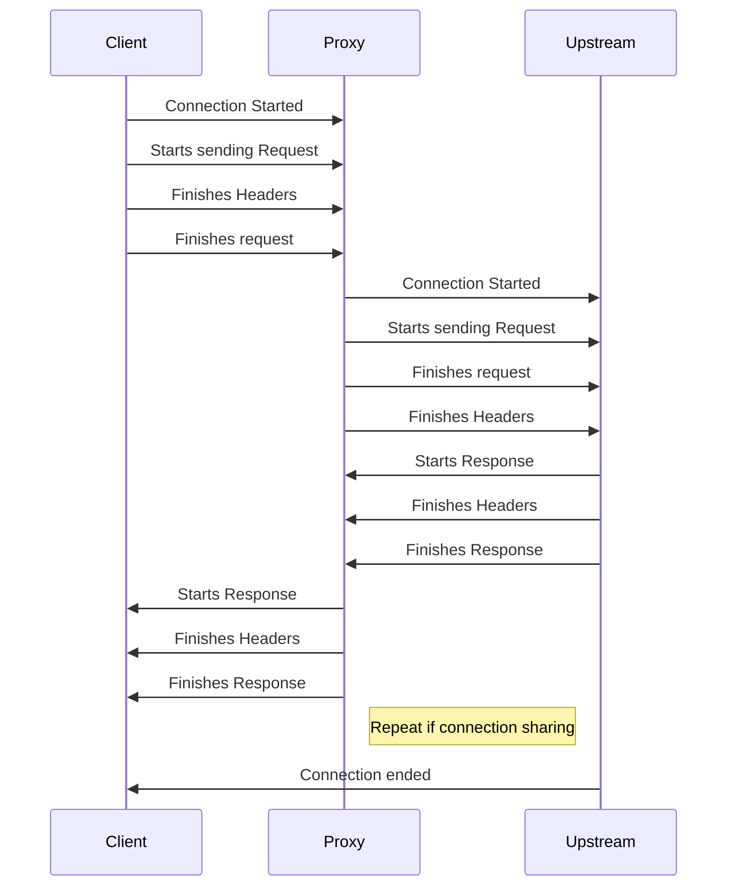
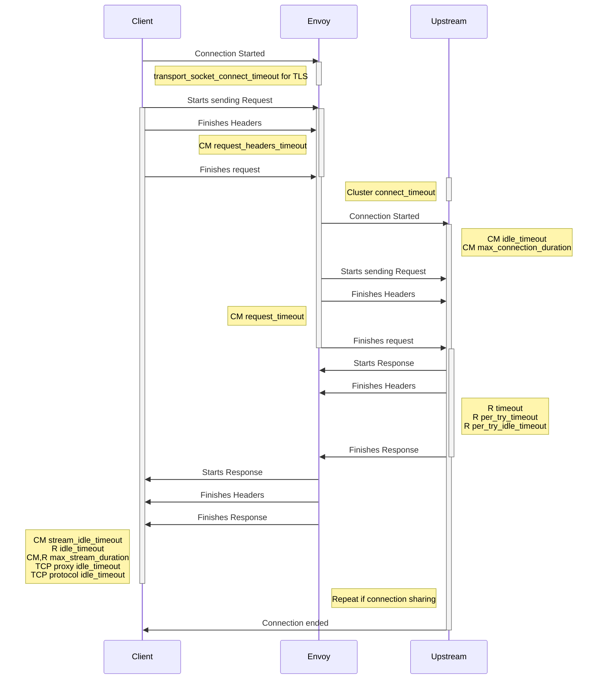
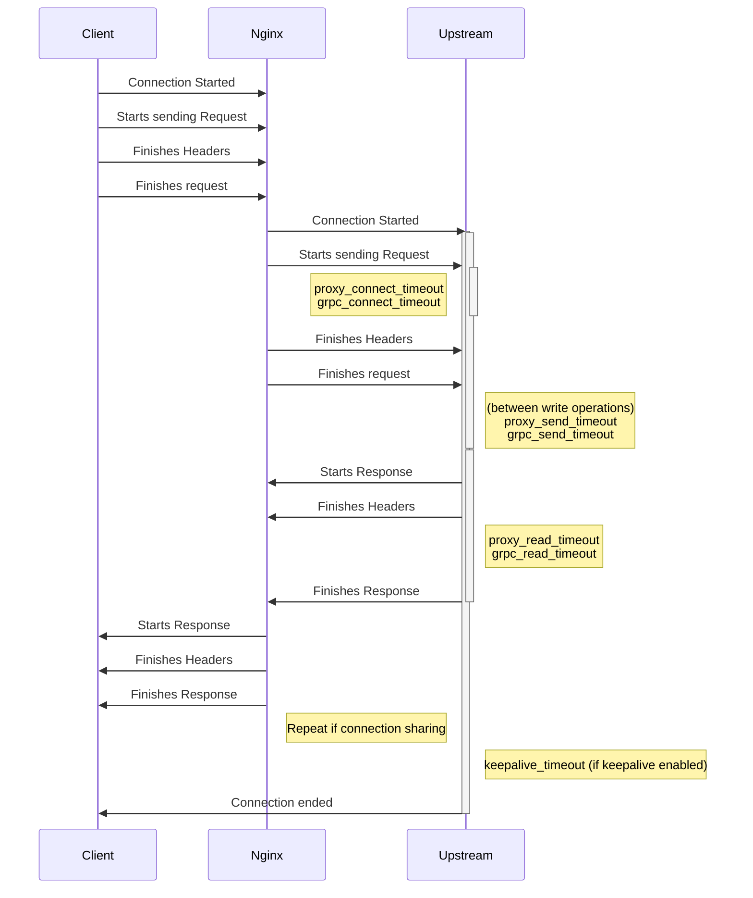
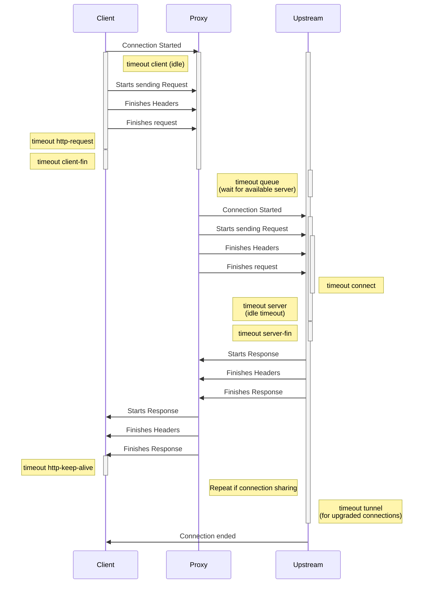
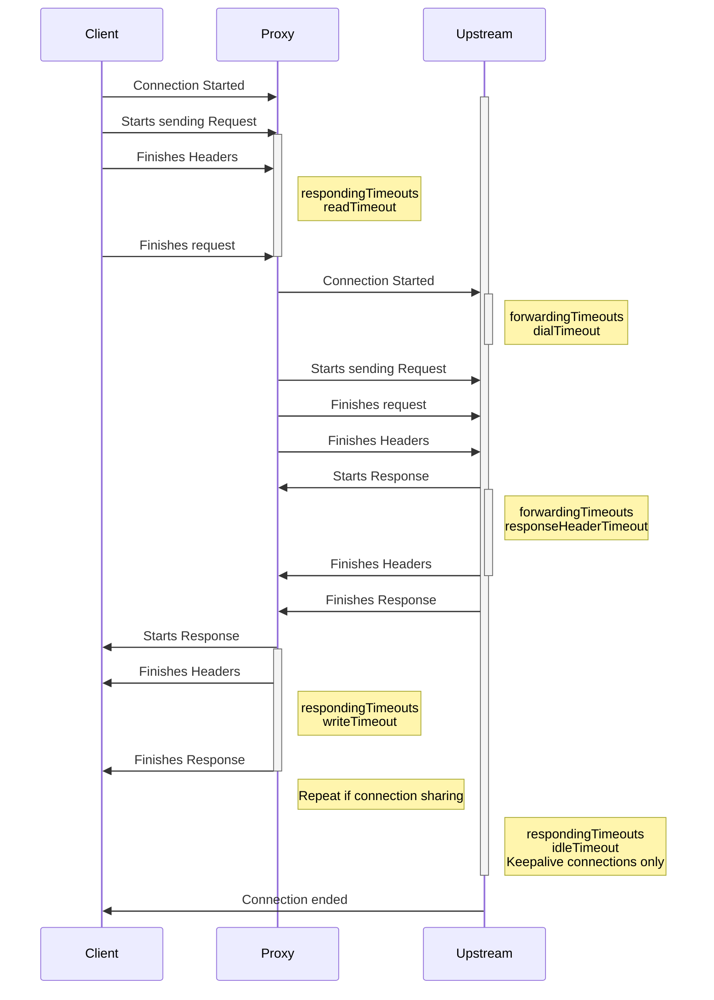

# GEP-1742: Timeouts

* Issue: [#1742](https://github.com/kubernetes-sigs/gateway-api/issues/1742)
* Status: Provisional

(See status definitions [here](overview.md#status).)

## TLDR

Create some sort of design so that Gateway API objects can be used to configure
timeouts for different types of connection.

## Goals

- Create some method to configure some timeouts
- Timeout config must be applicable to most if not all Gateway API implementations.

## Non-Goals

- TBD

## Introduction

In talking about Gateway API objects, particularly HTTPRoute, we've mentioned
timeout configuration many times in the past as "too hard" to find the common
ground necessary to make more generic configuration. This GEP intends firstly
to make this process less difficult, then to find common timeouts that we can
build into Gateway API.

For this initial round, we'll focus on Layer 7 HTTP traffic, while acknowledging
that Layer 4 connections have their own interesting timeouts as well.

The following sections will review all the implementations, then document what
timeouts are _available_ for the various data planes.

### Background on implementations

Most implementations that handle HTTPRoute objects use a proxy as the data plane
implementation, that actually forwards flows as directed by Gateway API configuration.

The following table is a review of all the listed implementations of Gateway API
at the time of writing, with the data plane they use for Layer 7, based on what information
could be found online. If there are errors here, or if the implementation doesn't
support layer 7, please feel free to correct them.

| Implementation | Data Plane       |
|----------------|------------|
| Acnodal EPIC   | Envoy      |
| Apache APISIX  | Nginx      |
| BIG-IP Kubernetes Gateway| F5 BIG-IP  |
| Cilium         | Envoy      |
| Contour        | Envoy      |
| Emissary Ingress| Envoy     |
| Envoy Gateway  | Envoy      |
| Flomesh Service Mesh | Pipy |
| Gloo Edge      | Envoy      |
| Google Kubernetes Engine (GKE) | Similar to Envoy Timeouts |
| HAProxy Ingress | HAProxy   |
| Hashicorp Consul | Envoy    |
| Istio          | Envoy      |
| Kong           | Nginx      |
| Kuma           | Envoy      |
| Litespeed      | Litespeed WebADC |
| Nginx Kubernetes Gateway | Nginx |
| Traefik        | Traefik    |

### Flow diagrams with available timeouts

The following flow diagrams are based off the basic diagram below, with all the
timeouts I could find included.

In general, timeouts are recorded with the setting name or similar that the data
plane uses for them, and are correct as far as I've parsed the documentation
correctly.

Idle timeouts are marked as such.

#### Envoy Timeouts

For Envoy, some timeouts are configurable at either the HTTP Connection Manager
(very, very roughly equivalent to a Listener), the Route (equivalent to a HTTPRoute)
level, or the Cluster (usually close to the Service) or some combination. These
are noted in the below diagram with a `CM`, `R`, or `Cluster` prefix respectively.

#### Nginx timeouts

Nginx allows setting of GRPC and general HTTP timeouts separately, although the
purposes seem to be roughly equivalent.

#### HAProxy timeouts

#### Traefik timeouts

#### F5 BIG-IP Timeouts

Could not find any HTTP specific timeouts. PRs welcomed. 😊

#### Pipy Timeouts

Could not find any HTTP specific timeouts. PRs welcomed. 😊

#### Litespeed WebADC Timeouts

Could not find any HTTP specific timeouts. PRs welcomed. 😊

## API

TBD.

## Alternatives

(List other design alternatives and why we did not go in that
direction)

## References

(Add any additional document links. Again, we should try to avoid
too much content not in version control to avoid broken links)
