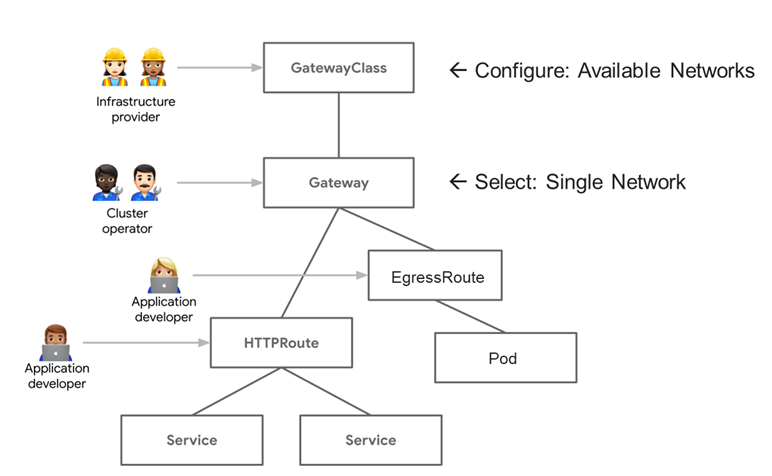

# GEP 1856: Egress Route
Issue: [#1856](https://github.com/kubernetes-sigs/gateway-api/issues/1856)

Status: Provisional

## TLDR
Egress traffic is any traffic that originates inside a Kubernetes cluster that is bound for a resource outside of the cluster. Egress Traffic in Kubernetes is a common use case for Service Providers to provision outbound traffic that requires a Gateway resource to provide Source Network Address Translation (SNAT) capabilities.

This GEP intends to provide formal rules for how an application can reach an endpoint outside of the cluster via a Gateway. The egress path is protocol agnostic and the Gateway can be connected to multiple external networks.

## Goals
- Provide a standardize configuration for provisioning egress for any protocol through a single Gateway.
- Egress Gateways can be connected to different external networks.
- Provision for using SNAT to allow for identification of cloud-native network functions (CNFs) via engineered IP assignments for security purposes.
- Allow CNFs to be addressed by their external IPs regardless of whether they are being access from within the cluster or from outside the cluster.

## Non-Goals
Security functionality should be kept outside this "route". We can have these be referenced as appropriate.

IP address management for SNATing will not duplicate non-trivial IPAM (IP address management) capabilities, only simple capability will be provided here.

Potential future use cases such as:

- Provision for using SNAT to allow for IPv4 to IPv6 translation on the way out of the cluster.
- Allow CNFs using peering protocols like Diameter to function by allowing connections to originate in either direction.
- Allow attaching policies (specifics to come later).

## Introduction
There are a number of scenarios where it is very useful to control and direct access to multiple external network domains. This is explained, in some detail for Telco use cases in the linked document, below, but it is also true for other scenarios – for example, any time you have an isolated network (vlan, vrf, etc.) that should be accessed by certain apps on not others. An example might be a front-end server that is exposed to the Internet versus a back-end database that is isolated.

Telco use cases: https://docs.google.com/document/d/13xAF_pqH2bV8x4MfXWde47esCdVwow1-nig6iy_rafA/edit

When there are multiple external networks involved, there needs to be a model for how to control access to the different networks. The suggested model in this GEP is to allow the Infrastructure Provider to define what networks are available for a Gateway Class. Each Gateway instantiated would then connect to a single one of the networks, with those Gateways allowing routes to/from defined K8S namespaces. This allows the Cluster Operator to control who accesses each of the external networks. In the model, the application developers need only to request routes to/from the right Gateways.

Diagram: EgressRoute with Highlevel Gateway API

Beyond connecting to multiple external network domains, it is very important in many scenarios (specifically including Telco) to be able to identify individual applications egressing a cluster, based on the source IP. In scenarios where firewalls and access control lists (ACLs) are in use, it is standard to control access based on source/destination IP addresses. For those firewall policies to be meaningful, it is vital for application traffic to be individually identifiable, based on source IP. Because of this, controlling the source IP (SNAT) on egressing traffic is a key use case.

## API
(... details, can point to PR with changes)

## Alternatives
(List other design alternatives and why we did not go in that direction)

## References
(Add any additional document links. Again, we should try to avoid too much content not in version control to avoid broken links)
