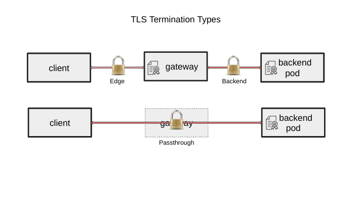

# GEP-1897: TLS from Gateway to Backend for ingress

* Issue: [#1897](https://github.com/kubernetes-sigs/gateway-api/issues/1897)
* Status: Provisional

## TLDR

This document specifically addresses the topic of conveying HTTPS from the Gateway
dataplane to the backend (backend TLS termination), and intends to satisfy the single
use case “As a client implementation of Gateway API, I need to know how to connect to
a backend pod that has its own certificate”. TLS configuration can be a nebulous topic,
so in order to drive resolution this GEP focuses only on this single piece of functionality.

## Immediate Goals

1. The solution must satisfy the following use case: the backend pod has its own
certificate and the gateway implementation client needs to know how to connect to the
backend pod. (Use case #4 in [Gateway API TLS Use Cases](#references))
2. In terms of the Gateway API personas, only the application developer persona in this
solution. The application developer should control the gateway to backend TLS settings,
not the cluster operator, as requiring a cluster operator to manage certificate renewals
and revocations would be extremely cumbersome.
3. The solution should consider client certificate settings used in the TLS handshake **from
Gateway to backend**, such as TLS versions and cipher suites. (Use case #5 in [Gateway API TLS Use Cases](#references))

## Longer Term Goals

These are worthy goals, but may need a different GEP for proper attention.

1. TCPRoute use cases (completed by GA)
2. Mutual TLS use cases
3. Service mesh use cases

## Non-Goals

These are worthy goals, but will not be covered by this GEP.

1. Changes to the existing mechanisms for edge or passthrough TLS termination
2. Providing a mechanism to decorate multiple route instances
3. TLSRoute use cases
4. UDPRoute use cases 
5. Controlling certificates used by more than one workload (#6 in [Gateway API TLS Use Cases](#references))
6. Client certificate settings used in TLS **from external clients to the
Listener** (#7 in [Gateway API TLS Use Cases](#references))
7. Providing a mechanism for the cluster operator to override gateway to backend TLS settings.

## Already Solved TLS Use Cases

These are worthy goals that are already solved and thus will not be modified by the implementation.

1. Termination of TLS for HTTP routing (#1 in [Gateway API TLS Use Cases](#references))
2. HTTPS passthrough use cases (#2 in [Gateway API TLS Use Cases](#references))
3. Termination of TLS for non-HTTP TCP streams (#3 in [Gateway API TLS Use Cases](#references))

## Overview - what do we want to do?

Given that the current ingress solution specifies **edge** TLS termination (from the client to
the gateway), and how to handle **passthrough** TLS (from the client to the backend pod), this
proposed ingress solution specifies TLS origination to the **backend** (from the gateway to the
backend pod).  As mentioned, this solution satisfies the use case in which the backend pod
has its own certificate and the gateway client needs to know how to connect to the backend pod.

Gateway API is missing a mechanism for separately providing the details for the backend TLS handshake,
including:
* use of TLS
* destination CA (certificate authority) or CA bundle
* SANs for validating upstream service (server authentication)
* client certificate of the gateway (client authentication)

## Purpose - why do we want to this?

This proposal is _very_ tightly scoped because we have tried and failed to address this well-known
gap in the API specification. The lack of support for this fundamental concept is holding back
Gateway API adoption by users that require a solution to the use case. One of the recurring themes
that has held up the prior art has been interest related to service mesh and as such this proposal
focuses only on the ingress use case to avoid contention there.  Another reason for the tight scope
is that we have been too focused on a generic representation of everything that TLS can do, which
covers too much ground to address in a single GEP.

## The history of backend TLS

Work on this topic has spanned over three years, as documented in our repositories and other references,
and summarized below.

In January 2020, in issue [TLS Termination Policy #52](https://github.com/kubernetes-sigs/gateway-api/issues/52),
this use case was discussed.  The discussion ended after being diverted by
[KEP: Adding AppProtocol to Services and Endpoints #1422](https://github.com/kubernetes/enhancements/pull/1422),
which was implemented and later reverted.

In February 2020, [HTTPRoute: Add Reencrypt #81](https://github.com/kubernetes-sigs/gateway-api/pull/81)
added the dataplane feature as “reencrypt”, but it went stale and was closed in favor of the work done in the
next paragraph, which unfortunately didn’t implement the backend TLS termination feature.

In August 2020, it resurfaced with a [comment](https://github.com/kubernetes-sigs/gateway-api/pull/256/files#r472734392)
on this pull request: [tls: introduce mode and sni to cert matching behavior](https://github.com/kubernetes-sigs/gateway-api/pull/256/files#top).
The backend TLS termination feature was deferred at that time.  Other TLS discussion was documented in
[[SIG-NETWORK] TLS config in service-apis](https://docs.google.com/document/d/15fkzMrhN_7tA-i2mHKwZpqcjN1o2Pe9Am9Qt828x1lo/edit#heading=h.wym7wehwll44)
, a list of TLS features that had been collected in June 2020, itself based on spreadsheet
[Service API: TLS related issues](https://docs.google.com/spreadsheets/d/18KE61Y6InCmoQHZcbrYYRZS5Cnt7n33s5dTxUlhHgIA/edit#gid=0).

In December 2021, this was discussed as a beta blocker in issue
[Docs mentions Reencrypt for HTTPRoute and TLSRoute is available #968](https://github.com/kubernetes-sigs/gateway-api/issues/968).

A March 2022 issue documents another request for it: [Provide a way to configure TLS from a Gateway to Backends #1067](https://github.com/kubernetes-sigs/gateway-api/issues/1067)

A June 2022 issue documents a documentation issue related to it:
[Unclear how to specify upstream (webserver) HTTP protocol #1244](https://github.com/kubernetes-sigs/gateway-api/discussions/1244)

A July 2022 discussion [Specify Re-encrypt TLS Termination (i.e., Upstream TLS) #1285](https://github.com/kubernetes-sigs/gateway-api/discussions/1285)
collected most of the historical context preceding the backend TLS termination feature, with the intention of
collecting evidence that this feature is still unresolved.  This was followed by
[GEP: Describe Backend Properties #1282](https://github.com/kubernetes-sigs/gateway-api/issues/1282).

In August 2022, [Add Provisional GEP-1282 document #1333](https://github.com/kubernetes-sigs/gateway-api/pull/1333)
was created, and in October 2022, a GEP update with proposed implementation
[GEP-1282 Backend Properties - Update implementation #1430](https://github.com/kubernetes-sigs/gateway-api/pull/1430)
was followed by intense discussion and closed in favor of a downsize in scope.

In January 2023 we closed GEP-1282 and began a new discussion on enumerating TLS use cases in
[Gateway API TLS Use Cases](#references), for the purposes of a clear definition and separation of concerns.
This GEP is the outcome of the TLS use cases #4 and #5 in
[Gateway API TLS Use Cases](#references) as mentioned in the Goals section above.

## API

Details deferred until we reach consensus on what we want to do, and why we want to do this.

## Prior Art

TLS from gateway to backend for ingress exists in several implementations, and was developed independently.

### Istio Gateway supports this with a DestinationRule:

* A secret representing a certificate/key pair, where the certificate is valid for the route host
* Set Gateway spec.servers[].port.protocol: HTTPS, spec.servers[].tls.mode=SIMPLE, spec.servers[].tls.credentialName
* Set DestinationRule spec.trafficPolicy.tls.mode: SIMPLE

Ref: [Istio / Understanding TLS Configuration](https://istio.io/latest/docs/ops/configuration/traffic-management/tls-configuration/#gateways)
and [Istio / Destination Rule](https://istio.io/latest/docs/reference/config/networking/destination-rule/#ClientTLSSettings)

### OpenShift Route (comparable to GW API Gateway) supports this with the following route configuration items:

* A certificate/key pair, where the certificate is valid for the route host
* A separate destination CA certificate enables the Ingress Controller to trust the destination’s certificate
* An optional, separate CA certificate that completes the certificate chain

Ref: [Secured routes - Configuring Routes | Networking | OpenShift Container Platform 4.12](https://docs.openshift.com/container-platform/4.12/networking/routes/secured-routes.html#nw-ingress-creating-a-reencrypt-route-with-a-custom-certificate_secured-routes)

### Contour supports this from Envoy to the backend using:

* An Envoy client certificate
* A CA certificate and SubjectName which are both used to verify the backend endpoint’s identity
* Kubernetes Service annotation: projectcontour.io/upstream-protocol.tls

Ref: [Upstream TLS](https://projectcontour.io/docs/v1.21.1/config/upstream-tls/)

### GKE supports a way to encrypt traffic to the backend pods using:

* `AppProtocol` on Service set to HTTPS
* Load balancer does not verify the certificate used by backend pods

Ref: [Secure a Gateway](https://cloud.google.com/kubernetes-engine/docs/how-to/secure-gateway#load-balancer-tls)

### Emissary supports encrypted traffic to services

* In the `Mapping` definition, set https:// in the spec.service field
* A spec.tls in the `Mapping` definition, with the name of a `TLSContext`
* A `TLSContext` to provide a client certificate, set minimum TLS version support, SNI

Ref: [TLS Origination](https://www.getambassador.io/docs/emissary/latest/topics/running/tls/origination)

### NGINX implementation through CRDs (Comparable to Route or Policy of Gateway API) supports both TLS and mTLS

* In the Upstream section of a VirtualServer or VirtualServerRoute (equivalent to HTTPRoute) there is a simple toggle to enable TLS.  This does not validate the certificate of the backend and implictly trusts the backend in order to form the SSL tunnel.  This is not about validating the certificate but obfuscating the traffic with TLS/SSL.
* A Policy attachment can be provided when certification validation is required that is called egressMTLS (egress from the proxy to the upstream).  This can be tuned to perform various certificate validation tests.  It was created as a Policy becuase it implies some type of AuthN/AuthZ due to the additional checks.  This was also compatible with Open Service Mesh and NGINX Service Mesh and removed the need for a sidecar at the ingress controller.
* A corresponding 'IngressMTLS' policy also exists for mTLS verification of client connections to the proxy.  The Policy object is used for anything that implies AuthN/AuthZ.

Ref: [Upstream.TLS](https://docs.nginx.com/nginx-ingress-controller/configuration/virtualserver-and-virtualserverroute-resources/#upstreamtls)
Ref: [EgressMTLS](https://docs.nginx.com/nginx-ingress-controller/configuration/policy-resource/#egressmtls)
Ref: [IngressMTLS](https://docs.nginx.com/nginx-ingress-controller/configuration/policy-resource/#ingressmtls)

## Open Questions (TODO)

This section is to record issues that should be discussed in the implementation section before this GEP moves
out of `Provisional` status.

1. Bowei recommended that we mention the approach of cross-namespace referencing between Route and Service.
Be explicit about using the standard rules with respect to attaching policies to resources.
2. Costin recommended that Gateway SHOULD authenticate with either a JWT with audience or client cert
or some other means - so gateway added headers can be trusted, etc.
3. Costin mentioned we need to answer the question - is configuring the connection to a backend and TLS
something the route author decides - or the backend owner?  Same for SANs.  However, providing a mechanism
for the cluster operator to override gateway to backend TLS settings is already listed as a Non-Goal.

## References

[Gateway API TLS Use Cases](https://docs.google.com/document/d/17sctu2uMJtHmJTGtBi_awGB0YzoCLodtR6rUNmKMCs8/edit#heading=h.cxuq8vo8pcxm)
