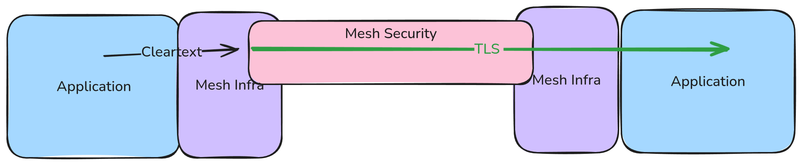

# GEP-1897: BackendTLSPolicy - Explicit Backend TLS Connection Configuration

* Issue: [#1897](https://github.com/kubernetes-sigs/gateway-api/issues/1897)
* Status: Experimental

## TLDR

This document aims to address the use case of origination of TLS to backends from implementations.
This is accomplished by a new `BackendTLSPolicy` API.

This API solves the question "As an implementation, when I establish a connection to a backend, should I originate a TLS connection? If so, with what properties?"

## Goals

This API aims to solve use cases around connecting to services that serve HTTPS/TLS traffic.
These could be in-cluster applications (typically a `Service`) or external services (such as `https://google.com`).
In many cases, communication going through gateway implementations is not TLS encrypted, so we expect the implementation itself to *originate* the TLS directly.
This is in contrast with the TLS Passthrough cases, which remain supported.

Some common examples that would utilize this API:
* A Gateway terminates HTTPS, does routing based on the HTTP traffic, then originates HTTPS to the backend.
* A service mesh accepts plaintext traffic (`http://google.com:80`) from a client, then originates HTTPS to that destination (`https://google.com:443`).

Letting the gateway implementation handle TLS ensures it has visibility into the traffic (for observability and traffic manipulation) and offloads the concerns of TLS from the clients.

1. The solution must satisfy the following use case: the backend pod has its own
certificate and the gateway implementation client needs to know how to connect to the
backend pod. (Use case #4 in [Gateway API TLS Use Cases](#references))
2. The gateway implementation (`Gateway` instance or service mesh client proxy) must have final control over security properties
3. The application developer may provide *hints* or *defaults* to consumers on how to connect to their application.

## Non-Goals

A major non-goal for this proposal is for configuration of the service mesh transport security.
It is very common for service mesh implementations to implement some form of transparent transport security, whether that is WireGuard, mTLS, or others.
This is completely orthogonal to the use cases being tackled by this GEP.

* The "mesh transport security" is something invisible to the users application, and is simply used to secure communication between components in the mesh.
* This proposal, instead, explicitly calls for sending TLS **to the users application**.

Whether the service mesh implementation uses mTLS for it's implementation is not relevant to this proposal.
A service mesh using mTLS can *additionally* originate TLS that is terminated by the users application (that is, two layers of TLS!).



Possible future goals outside of the scope of this GEP include:

1. Changes to the existing mechanisms for edge or passthrough TLS termination
2. Controlling TLS versions or cipher suites used in TLS handshakes. (Use case #5 in [Gateway API TLS Use Cases](#references))
3. Controlling ALPN used in TLS handshakes.
4. Controlling certificates used by more than one workload (#6 in [Gateway API TLS Use Cases](#references))
5. Client certificates (Mutual TLS) (#7 in [Gateway API TLS Use Cases](#references))

## Already Solved TLS Use Cases

These are worthy goals that are already solved and thus will not be modified by the implementation.

1. Termination of TLS for HTTP routing (#1 in [Gateway API TLS Use Cases](#references))
2. HTTPS passthrough use cases (#2 in [Gateway API TLS Use Cases](#references))
3. Termination of TLS for non-HTTP TCP streams (#3 in [Gateway API TLS Use Cases](#references))

These existing use cases all relate to how a Gateway implementation should handle a downstream connection.
This GEP, instead, focuses on the handling of upstream connections.

## Overview - what do we want to do?

Given that the current ingress solution specifies **edge** TLS termination (from the client to
the gateway), and how to handle **passthrough** TLS (from the client to the backend pod), this
proposed ingress solution specifies TLS origination to the **backend** (from the gateway to the
backend pod).  As mentioned, this solution satisfies the use case in which the backend pod
has its own certificate and the gateway client needs to know how to connect to the backend pod.


This includes the intent to originate TLS on the connection to the backend, as well as various properties of the TLS connection:
* If using mutual TLS, the client certificate to use during the TLS handshake
* How to verify the peer certificate (trusted certificates, trusted subject names, etc).
* Server Name indication

## Purpose - why do we want to do this?

This proposal is _very_ tightly scoped because we have tried and failed to address this well-known
gap in the API specification. The lack of support for this fundamental concept is holding back
Gateway API adoption by users that require a solution to the use case. One of the recurring themes
that has held up the prior art has been interest related to service mesh, and as such this proposal
focuses explicitly on the ingress use case in the initial round.  Another reason for the tight scope
is that we have been too focused on a generic representation of everything that TLS can do, which
covers too much ground to address in a single GEP.

## API

To allow the gateway client to know how to connect to the backend pod, when the backend pod has its own
certificate, we implement a metaresource named `BackendTLSPolicy`, that was previously introduced with the name
`TLSConnectionPolicy` as a hypothetical Direct Policy Attachment example in
[GEP-713: Metaresources and PolicyAttachment](../gep-713/index.md).

With TLS, there are two components involved: the client (the gateway implementation) and the server (an application, likely running in the cluster).
The Gateway API cannot control the server behavior;
This is a choice the application developer makes in their code, whether or not (and how) they serve TLS.
The application developer may not even be aware of the Gateway API at all.

Therefor, the goal of this API is to tell the client *whether or not* and *how* to originate TLS to the backend.

However, in many common cases these roles are actually inverted.
While it is ultimately the client that must decide how to connect, commonly they are unaware of the details of the destination.
In these situations, an application developer may wish to actually tell the clients how *they* should connect.

Fortunately, these two scenarios can co-exist.
`BackendTLSPolicy` will allow an application developer to present a *default* for clients that have not configured their own, but also allow clients to explicitly configure their own settings.

This serves a variety of use cases:
* A service producer may be unaware or unwilling to provide a `BackendTLSPolicy` for clients, despite serving TLS. In this case, a client can provide their own settings to connect
  * Alternatively, a service producer may be unsure of how clients are connecting to them. `BackendTLSPolicy` implies *originating* TLS from the implementation, but the implementation could already be handling passthrough TLS.
* A service producer may provide TLS settings that are unacceptable to the client. For example, an `insecureSkipVerify` option. The client can override this with their own more secure settings.
* A service may be connected from a variety of context, some requiring TLS origination and others not. Allowing client-driven control allows both of these to co-exist.

The `BackendTLSPolicy` must contain these configuration items to allow the Gateway to operate successfully
as a TLS Client:

- An explicit signal that TLS should be used by this connection.
- A hostname the Gateway should use to connect to the backend.
- How to verify the peer certificate, including signing certificate verification and other properties of the certificate (subject alt names).
  - Support for referencing a CA certificate, as well as a help to use the default trusted system certificates.

Two serve these dual roles, `BackendTLSPolicy` is usable as a Direct Policy Attachment that can be *cross namespace*.
* `BackendTLSPolicy` can be applied to a Service in the same namespace to provide defaults to clients.
* `BackendTLSPolicy` can be applied to a Service in a different namespace to provide explicit configuration for clients in that namespace.

Policies in the consumer namespace will be preferred over the producer namespace.
For Gateways, this is the Gateway namespace (and **not** the ListenerSet or Route namespace).
For mesh, this is the calling client namespace.

For example, given the following (condensed) configuration:
```yaml
kind: Gateway
namespace: gateway-ns
---
kind: BackendTLSPolicy
name: gateway-pol
namespace: gateway-ns
targetRef:
  name: svc
  namespace: app
---
kind: Service
name: svc
namespace: app
---
kind: BackendTLSPolicy
name: app-pol
namespace: gateway-ns
targetRef:
  name: svc
```

For requests from Gateways in the `gateway-ns` to `svc.app`, the `gateway-pol` will be used.
For requests from Gateways in other namespaces, the `app-pol` will be used.

There will be no merging of policies. Exactly one policy will apply.

This mirrors the [producer and consumer route](/concepts/glossary#consumer-route) semantics.

This will be implemented by a new API type, `PolicyTargetReferenceWithSectionName`, as there is no existing policy that utilizes a cross-namespace reference.

Failures during the TLS handshake may be handled with implementation-specific error codes, such as 500 or 503, or
other signal that makes the failure sufficiently clear to the requester without revealing too much about the transaction,
based on established security requirements.

BackendTLSPolicySpec contains the `Mode`, `TargetRefs` and `Validation` fields.

* The `Validation` field is a `BackendTLSPolicyValidation` and contains `CACertificateRefs`, `WellKnownCACertificates`, and `Hostname`.
* The `TargetRefs` is optional. It must be set when providing defaults for a Service, and must not be set when providing route level overrides.
* The `Mode` field allows configuring the TLS mode. To start with, this will include `None` and `TLS`, though future versions will likely include a `MutualTLS` option. The `None` mode is useful when overriding on the route level; it is rejected if `TargetRefs` is ste.


The `CACertificateRefs` and `WellKnownCACertificates` fields are both optional, but one of them must be set for a valid TLS
configuration. CACertificateRefs is an implementation-specific slice of
named object references, each containing a single cert. We originally proposed to follow the convention established by the
[CertificateRefs field on Gateway](https://github.com/kubernetes-sigs/gateway-api/blob/18e79909f7310aafc625ba7c862dfcc67b385250/apis/v1beta1/gateway_types.go#L340)
, but the CertificateRef requires both a tls.key and tls.crt and a certificate reference only requires the tls.crt.
WellKnownCACertificates is an optional enum that allows users to specify whether to use the set of CA certificates trusted by the
Gateway (WellKnownCACertificates specified as "System"), or to use the existing CACertificateRefs (WellKnownCACertificates
specified as "").  The use and definition of system certificates is implementation-dependent, and the intent is that
these certificates are obtained from the underlying operating system. CACertificateRefs contains one or more
references to Kubernetes objects that contain PEM-encoded TLS certificates, which are used to establish a TLS handshake
between the gateway and backend pod. References to a resource in a different namespace are invalid.
If ClientCertificateRefs is unspecified, then WellKnownCACertificates must be set to "System" for a valid configuration.
If WellKnownCACertificates is unspecified, then CACertificateRefs must be specified with at least one entry for a valid configuration.
If WellKnownCACertificates is set to "System" and there are no system trusted certificates or the implementation doesn't define system
trusted certificates, then the associated TLS connection must fail.

The `Hostname` field is required and is to be used to configure the SNI the Gateway should use to connect to the backend.
Implementations must validate that at least one name in the certificate served by the backend matches this field.
We originally proposed using a list of allowed Subject Alternative Names, but determined that this was [not needed in
the first round](https://github.com/kubernetes-sigs/gateway-api/pull/2113#issuecomment-1696127092),
but may be added in the future.

We originally proposed allowing the configuration of expected TLS versions, but determined that this was [not needed in
the first round](https://github.com/kubernetes-sigs/gateway-api/pull/2113#issuecomment-1696127092).

Thus, the following additions would be made to the Gateway API:

```go
//TODO: Will update this section once API changes from PR 2955 are approved.
```

## Request Flow

Step 6 would be changed in the typical client/gateway API request flow for a gateway implemented using a
reverse proxy. This is shown as **bolded** additions in step 6 below.

1. A client makes a request to http://foo.example.com.
2. DNS resolves the name to a Gateway address.
3. The reverse proxy receives the request on a Listener and uses the Host header to match an HTTPRoute.
4. Optionally, the reverse proxy can perform request header and/or path matching based on match rules of the HTTPRoute.
5. Optionally, the reverse proxy can modify the request, i.e. add/remove headers, based on filter rules of the HTTPRoute.
6. Lastly, the reverse proxy **optionally performs a TLS handshake** and forwards the request to one or more objects,
i.e. Service, in the cluster based on backendRefs rules of the HTTPRoute **and the TargetRefs of the BackendTLSPolicy**.

## Alternatives
Most alternatives are enumerated in the section "The history of backend TLS".  A couple of additional
alternatives are also listed here.

1. Expand BackendRef, which is already an expansion point.  At first, it seems logical that since listeners are handling
the client-gateway certs, BackendRefs could handle the gateway-backend certs.  However, when multiple Routes to target
the same Service, there would be unnecessary copying of the BackendRef every time the Service was targeted.  As well,
there could be multiple bBackendRefs with multiple rules on a rRoute, each of which might need the gateway-backend cert
configuration, so it is not the appropriate pattern.
2. Extend HTTPRoute to indicate TLS backend support. Extending HTTPRoute would interfere with deployed implementations
too much to be a practical solution.
3. Add a new type of Route for backend TLS.  This is impractical because we might want to enable backend TLS on other
route types in the future, and because we might want to have both TLS listeners and backend TLS on a single route.

## Prior Art

TLS from gateway to backend for ingress exists in several implementations, and was developed independently.

### Istio Gateway supports this with a DestinationRule:

* A secret representing a certificate/key pair, where the certificate is valid for the route host
* Set Gateway spec.servers[].port.protocol: HTTPS, spec.servers[].tls.mode=SIMPLE, spec.servers[].tls.credentialName
* Set DestinationRule spec.trafficPolicy.tls.mode: SIMPLE

Ref: [Istio / Understanding TLS Configuration](https://istio.io/latest/docs/ops/configuration/traffic-management/tls-configuration/#gateways)
and [Istio / Destination Rule](https://istio.io/latest/docs/reference/config/networking/destination-rule/#ClientTLSSettings)

### OpenShift Route (comparable to GW API Gateway) supports this with the following route configuration items:

* A certificate/key pair, where the certificate is valid for the route host
* A separate destination CA certificate enables the Ingress Controller to trust the destination’s certificate
* An optional, separate CA certificate that completes the certificate chain

Ref: [Secured routes - Configuring Routes | Networking | OpenShift Container Platform 4.12](https://docs.openshift.com/container-platform/4.12/networking/routes/secured-routes.html#nw-ingress-creating-a-reencrypt-route-with-a-custom-certificate_secured-routes)

### Contour supports this from Envoy to the backend using:

* An Envoy client certificate
* A CA certificate and SubjectName which are both used to verify the backend endpoint’s identity
* Kubernetes Service annotation: projectcontour.io/upstream-protocol.tls

Ref: [Upstream TLS](https://projectcontour.io/docs/v1.21.1/config/upstream-tls/)

### GKE supports a way to encrypt traffic to the backend pods using:

* `AppProtocol` on Service set to HTTPS
* Load balancer does not verify the certificate used by backend pods

Ref: [Secure a Gateway](https://cloud.google.com/kubernetes-engine/docs/how-to/secure-gateway#load-balancer-tls)

### Emissary supports encrypted traffic to services

* In the `Mapping` definition, set https:// in the spec.service field
* A spec.tls in the `Mapping` definition, with the name of a `TLSContext`
* A `TLSContext` to provide a client certificate, set minimum TLS version support, SNI

Ref: [TLS Origination](https://www.getambassador.io/docs/emissary/latest/topics/running/tls/origination)

### NGINX implementation through CRDs (Comparable to Route or Policy of Gateway API) supports both TLS and mTLS

* In the Upstream section of a VirtualServer or VirtualServerRoute (equivalent to HTTPRoute) there is a simple toggle to enable TLS.  This does not validate the certificate of the backend and implicitly trusts the backend in order to form the SSL tunnel.  This is not about validating the certificate but obfuscating the traffic with TLS/SSL.
* A Policy attachment can be provided when certification validation is required that is called egressMTLS (egress from the proxy to the upstream).  This can be tuned to perform various certificate validation tests.  It was created as a Policy because it implies some type of AuthN/AuthZ due to the additional checks.  This was also compatible with Open Service Mesh and NGINX Service Mesh and removed the need for a sidecar at the ingress controller.
* A corresponding 'IngressMTLS' policy also exists for mTLS verification of client connections to the proxy.  The Policy object is used for anything that implies AuthN/AuthZ.

Ref: [Upstream.TLS](https://docs.nginx.com/nginx-ingress-controller/configuration/virtualserver-and-virtualserverroute-resources/#upstreamtls)

Ref: [EgressMTLS](https://docs.nginx.com/nginx-ingress-controller/configuration/policy-resource/#egressmtls)

Ref: [IngressMTLS](https://docs.nginx.com/nginx-ingress-controller/configuration/policy-resource/#ingressmtls)

## Answered Questions

Q. Bowei recommended that we mention the approach of cross-namespace referencing between Route and Service.
Be explicit about using the standard rules with respect to attaching policies to resources.

A. This is mentioned in the
API section.

Q. Costin recommended that Gateway SHOULD authenticate with either a JWT with audience or client cert
or some other means - so gateway added headers can be trusted, amongst other things.

A. This is out of scope for this
proposal, which centers around application developer persona resources such as HTTPRoute and Service.

Q. Costin mentioned we need to answer the question - is configuring the connection to a backend and TLS
something the route author decides - or the backend owner?

A. This is decided by the application developer persona,
which would more likely, but not exclusively, be the backend owner.

Q.Costin continued, same for SAN (Subject Alternative Name) certificates.
The backend owner is the application developer, and the route owner will have to collaborate with the application
developer to provide the appropriate configuration for TLS.  The implementation would need to take the certificate
provided by the application and verify that it satisfies the requirements of the route-as-client, including SAN
information.  Sometimes the backend owner and route owner are the same entity.

A. This was most recently addressed by
adding hostname for SNI and removing allowed SANs.

## Graduation Criteria

This section is to record issues that were requested for discussion in the API section before this GEP graduates
out of `Provisional` status.

1. Rob Scott is interested in extending the TargetRef to optionally include port, since we are targeting the entirety
of a Service. See the discussion in https://github.com/kubernetes-sigs/gateway-api/pull/2113/files#r1231594914,
and follow up issue in https://github.com/kubernetes-sigs/gateway-api/issues/2147
2. Michael Pleshakov asked about conflicts that could arise when multiple implementations are running in a cluster.
This is a gap in our policy attachment model that needs to be addressed.  See the discussion in
https://github.com/kubernetes-sigs/gateway-api/pull/2113/files#r1235750540. Graduating this GEP to implementable
requires an update to the Policy GEP to define how status can be nested to support multiple implementations. This will
likely look very similar to Route status.
See [comment](https://github.com/kubernetes-sigs/gateway-api/pull/2113#issuecomment-1696127092).
3. Rob Scott [wanted to note](https://github.com/kubernetes-sigs/gateway-api/pull/2113#issuecomment-1696127092) that
when this graduates to the standard channel, implementations of HTTPRoute may also be
required to watch the BackendTLSPolicy. If one of these policies is attached to a Service targeted by an HTTPRoute,
the implementation would be required to fully implement the policy or mark the backend invalid.

## References

[Gateway API TLS Use Cases](https://docs.google.com/document/d/17sctu2uMJtHmJTGtBi_awGB0YzoCLodtR6rUNmKMCs8/edit#heading=h.cxuq8vo8pcxm)

[GEP-713: Metaresources and PolicyAttachment](../gep-713/index.md)

[Policy Attachment](../../reference/policy-attachment.md#direct-policy-attachment)

[Gateway API TLS](../../guides/tls.md)

[SIG-NET Gateway API: TLS to the K8s.Service/Backend](https://docs.google.com/document/d/1RTYh2brg_vLX9o3pTcrWxtZSsf8Y5NQvIG52lpFcZlo)

[SAN vs SNI](https://serverfault.com/questions/807959/what-is-the-difference-between-san-and-sni-ssl-certificates)


### The history of backend TLS

Work on this topic has spanned over three years, as documented in our repositories and other references,
and summarized below.

In January 2020, in issue [TLS Termination Policy #52](https://github.com/kubernetes-sigs/gateway-api/issues/52),
this use case was discussed.  The discussion ended after being diverted by
[KEP: Adding AppProtocol to Services and Endpoints #1422](https://github.com/kubernetes/enhancements/pull/1422),
which was implemented and later reverted.

In February 2020, [HTTPRoute: Add Reencrypt #81](https://github.com/kubernetes-sigs/gateway-api/pull/81)
added the dataplane feature as “reencrypt”, but it went stale and was closed in favor of the work done in the
next paragraph, which unfortunately didn’t implement the backend TLS termination feature.

In August 2020, it resurfaced with a [comment](https://github.com/kubernetes-sigs/gateway-api/pull/256/files#r472734392)
on this pull request: [tls: introduce mode and sni to cert matching behavior](https://github.com/kubernetes-sigs/gateway-api/pull/256/files#top).
The backend TLS termination feature was deferred at that time.  Other TLS discussion was documented in
[[SIG-NETWORK] TLS config in service-apis](https://docs.google.com/document/d/15fkzMrhN_7tA-i2mHKwZpqcjN1o2Pe9Am9Qt828x1lo/edit#heading=h.wym7wehwll44)
, a list of TLS features that had been collected in June 2020, itself based on spreadsheet
[Service API: TLS related issues](https://docs.google.com/spreadsheets/d/18KE61Y6InCmoQHZcbrYYRZS5Cnt7n33s5dTxUlhHgIA/edit#gid=0).

In December 2021, this was discussed as a beta blocker in issue
[Docs mentions Reencrypt for HTTPRoute and TLSRoute is available #968](https://github.com/kubernetes-sigs/gateway-api/issues/968).

A March 2022 issue documents another request for it: [Provide a way to configure TLS from a Gateway to Backends #1067](https://github.com/kubernetes-sigs/gateway-api/issues/1067)

A June 2022 issue documents a documentation issue related to it:
[Unclear how to specify upstream (webserver) HTTP protocol #1244](https://github.com/kubernetes-sigs/gateway-api/discussions/1244)

A July 2022 discussion [Specify Re-encrypt TLS Termination (i.e., Upstream TLS) #1285](https://github.com/kubernetes-sigs/gateway-api/discussions/1285)
collected most of the historical context preceding the backend TLS termination feature, with the intention of
collecting evidence that this feature is still unresolved.  This was followed by
[GEP: Describe Backend Properties #1282](https://github.com/kubernetes-sigs/gateway-api/issues/1282).

In August 2022, [Add Provisional GEP-1282 document #1333](https://github.com/kubernetes-sigs/gateway-api/pull/1333)
was created, and in October 2022, a GEP update with proposed implementation
[GEP-1282 Backend Properties - Update implementation #1430](https://github.com/kubernetes-sigs/gateway-api/pull/1430)
was followed by intense discussion and closed in favor of a downsize in scope.

In January 2023 we closed GEP-1282 and began a new discussion on enumerating TLS use cases in
[Gateway API TLS Use Cases](#references), for the purposes of a clear definition and separation of concerns.
This GEP is the outcome of the TLS use case #4 in
[Gateway API TLS Use Cases](#references) as mentioned in the Immediate Goals section above.

