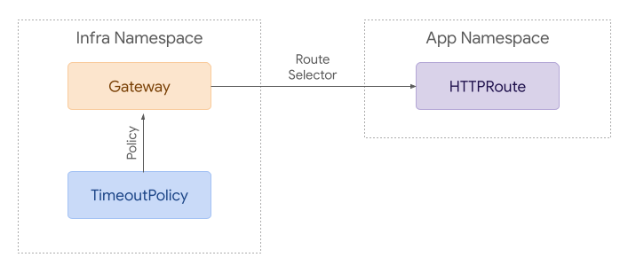
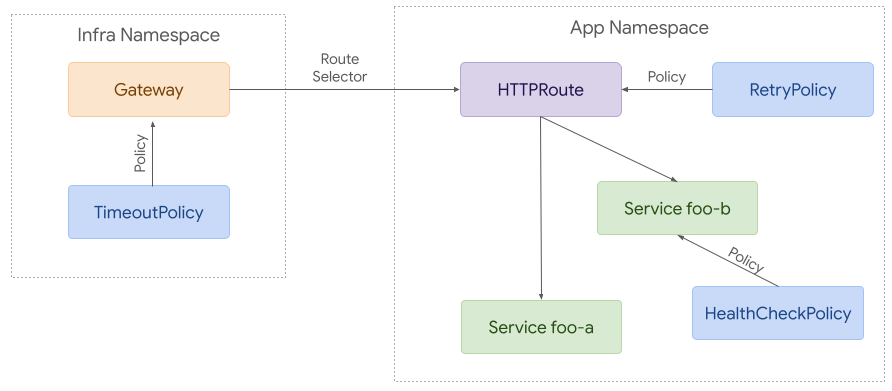
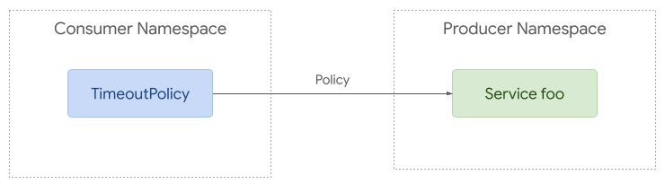
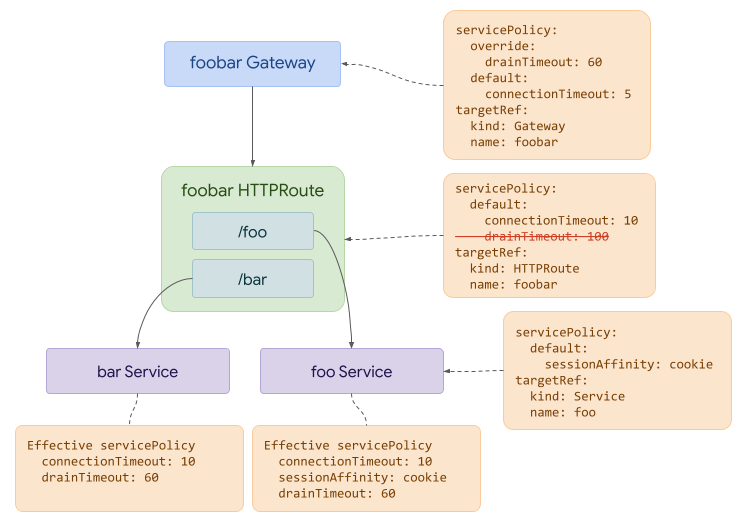

# GEP-2649: Inherited Policy Attachment

* Issue: [#2649](https://github.com/kubernetes-sigs/gateway-api/issues/2649)
* Status: Experimental

(See status definitions [here](/geps/overview/#gep-states)

## TLDR

Describe and specify a design pattern for a class of metaresource that can
affect specific settings across a multiple target objects.

This is a design for a _pattern_, not an API field or new object.

!!! danger
    This GEP is in the process of being updated.
    Please see the discussion at https://github.com/kubernetes-sigs/gateway-api/discussions/2927
    and expect further changes.
    Some options under discussion there may make the distinction between Direct
    and Inherited Policies moot, which would require a rework.

## Goals

* Specify what common properties all Inherited Policies MUST have
* Recommend design patterns for areas that cannot be mandated but that could
  cause problems for API designers.

## Non-Goals

* Fully specify the entire design space for Inherited Policy Attachment

## Inherited Policy Attachment requirements in brief

The following parts of GEP-713 also apply here. Inherited Policy Attachments:

- MUST be their own CRDs (e.g. `TimeoutPolicy`, `RetryPolicy` etc),
- MUST include both `spec` and `status` stanzas
- MUST have the `status` stanza include a `conditions` section using the standard
  upstream Condition type
- MUST use the `targetRef` struct to specify their target resource.
- MUST follow the naming requirements (MUST be named to clearly indicate that the
kind is a Policy, and SHOULD use the `Policy` suffix at the end of the Kind and
`policies` at the end of the Resource names).

Additionally, Inherited Policy Attachment:

- MAY specify a `defaults` stanza, an `overrides` stanza, or both. If it does not,
  it MUST specify if its fields are defaults or overrides in each field's godoc.

## Inherited Policy Attachment

Because a Inherited Policy is a metaresource, it targets some other resource
and _augments_ its behavior.

But why have this distinct from other types of metaresource? Because Inherited
Policy resources are designed to have a way for settings to flow down a hierarchy.

_Any_ object that affects settings outside of the object that it attaches to is
an Inherited Policy.

Note that the same object may be have some properties of both an Inherited Policy
_and_ a Direct Policy if it can attach to multiple points of a hierarchy, such
as if the same Policy can be atttached to a Gateway (where it affects all Routes
attached to that Gateway) or to a Route (where it affects only that Route).

If a Policy _can be_ used as an Inherited Policy, it MUST be treated as an
Inherited Policy, regardless of whether a specific instance of the Policy is
only affecting a single object.

This is because all of the rules about inheritance apply to the object, regardless
of where it is attached in the hierarchy.

Regardless of exactly how they are designed, settings in an Inherited Policy
generally fall into two categories, Defaults and Overrides.

Defaults set the default value for something, and can be overridden by the
“lower” objects (like a connection timeout default policy on a Gateway being
overridable inside a HTTPRoute), and Overrides cannot be overridden by “lower”
objects (like setting a maximum client timeout to some non-infinite value at the
Gateway level to stop HTTPRoute owners from leaking connections over time).

Note that while both types of setting are valid, both also come with difficulties
in communicating the currently active setting to the owners of the modified
objects. These are discussed in more detail below.

## Inherited Policy design guidelines

Here are some guidelines for when to consider using a Inherited Policy object:

* The settings or configuration are bound to one containing object, but affect
  other objects attached to that one (for example, affecting HTTPRoutes attached
  to a single Gateway, or all HTTPRoutes in a GatewayClass).
* The settings need to able to be defaulted, but can be overridden on a per-object
  basis.
* The settings must be enforced by one persona, and not modifiable or removable
  by a lesser-privileged persona. (For example, The owner of a GatewayClass may
  want to restrict something about all Gateways in a GatewayClass, regardless of
  who owns the Gateway, or a Gateway owner may want to enforce some setting
  across all attached HTTPRoutes).
* In terms of status, a good accounting for how to record that the Policy is
  attached is easy, but recording what resources the Policy is being applied to
  is not, and needs to be carefully designed to avoid fanout apiserver load.

When multiple Inherited Policies are used, they can interact in various ways,
which are governed by the following rules, which will be expanded on later in
this document.

* If a Policy does not affect an object's fields directly, then the resultant
  Policy MUST be the set of all distinct fields inside the relevant Policy objects,
  as set out by the rules below.
* For Policies that affect an object's existing fields, multiple instances of the
  same Policy Kind affecting an object's fields MUST be evaluated as
  though only a single Policy "wins" the right to affect each field. This operation
  is performed on a _per-distinct-field_ basis.
* Settings in `overrides` stanzas MUST win over the same setting in a `defaults`
  stanza.
* `overrides` settings operate in a "less specific beats more specific" fashion -
  Policies attached _higher_ up the hierarchy beat the same type of Policy
  attached further down the hierarchy.
* `defaults` settings operate in a "more specific beats less specific" fashion -
  Policies attached _lower down_ the hierarchy beat the same type of Policy
  attached further _up_ the hierarchy.
* For `defaults`, the _most specific_ value is the one _inside the object_ that
  the Policy applies to; that is, if a Policy specifies a `default`, and an object
  specifies a value, the _object's_ value wins.
* When Policies interact with _fields_ in other objects (for example, if they
  set a default or override for a field in a HTTPRoute), they MUST do so in a
  "replace value" fashion.
    * For fields where the `value` is a scalar, (like a string or a number)
      MUST have their value _replaced_ by the value in the Policy if it wins.
      Notably, this means that a `default` will only ever replace an empty or unset
      value in an object. Note also that, as in Go, the empty string value is _only_
      a string of length 0, generally represented as `""`.
    * For fields where the value is an object, the Policy should include the fields
      in the object in its definition, so that the replacement can be performed
      on each field inside the object as a simple field rather than the object as
      a whole.
    * For fields where the final value is non-scalar, but is not an _object_ with
      fields of its own, the value MUST be entirely replaced, _not_ merged. This
      means that lists of strings or lists of ints specified in a Policy overwrite
      the empty list (in the case of a `default`) or any specified list (in the case
      of an `override`). The same applies to `map[string]string` fields. An example
      here would be a field that stores a map of annotations - specifying a Policy
      that overrides annotations will mean that a final object specifying those
      annotations will have its value _entirely replaced_ by an `override` setting.
* In the case that two Policies of the same type specify different fields, then
  _all_ of the specified fields MUST take effect on the affected object, using
  the precedence rules given above.

Examples to further illustrate these rules are given below.

#### Attaching Policy to GatewayClass
GatewayClass may be the trickiest resource to attach policy to. Policy
attachment relies on the policy being defined within the same scope as the
target. This ensures that only users with write access to a policy resource in a
given scope will be able to modify policy at that level. Since GatewayClass is a
cluster scoped resource, this means that any policy attached to it must also be
cluster scoped.

GatewayClass parameters provide an alternative to policy attachment that may be
easier for some implementations to support. These parameters can similarly be
used to set defaults and requirements for an entire GatewayClass.

### Merging into existing `spec` fields

It's possible (even likely) that configuration in a Policy may need to be merged
into an existing object's fields somehow, particularly for Inherited policies.

When merging into an existing fields inside an object, Policy objects should
merge values at a scalar level, not at a struct or object level.

For example, in the `CDNCachingPolicy` example below, the `cdn` struct contains
a `cachePolicy` struct that contains fields. If an implementation was merging
this configuration into an existing object that contained the same fields, it
should merge the fields at a scalar level, with the `includeHost`,
`includeProtocol`, and `includeQueryString` values being defaulted if they were
not specified in the object being controlled. Similarly, for `overrides`, the
values of the innermost scalar fields should overwrite the scalar fields in the
affected object.

Implementations should not copy any structs from the Policy object directly into the
affected object, any fields that _are_ overridden should be overridden on a per-field
basis.

In the case that the field in the Policy affects a struct that is a member of a list,
each existing item in the list in the affected object should have each of its
fields compared to the corresponding fields in the Policy.

For non-scalar field _values_, like a list of strings, or a `map[string]string`
value, the _entire value_ must be overwritten by the value from the Policy. No
merging should take place. This mainly applies to `overrides`, since for
`defaults`, there should be no value present in a field on the final object.

There is one exception here: the listMapType list. These are lists of structs
that, in their API definitions, define one string in the struct as a key, and
are defined to be treated the same as a map (only one entry for each value in
the key can be present, and patches that duplicate the key overwrite the rest
of the struct).

For these values, and these values _only_, implementations SHOULD treat the list
like a map and merge values into the corresponding entry, by the key field.

This table shows how this works for various types:

|Type|Object config|Override Policy config|Result|
|----|-------------|----------------------|------|
|string| `key: "foo"` | `key: "bar"`  | `key: "bar"` |
|list| `key: ["a","b"]` | `key: ["c","d"]` | `key: ["c","d"]` |
|`map[string]string`| `key: {"foo": "a", "bar": "b"}` | `key: {"foo": "c", "bar": "d"}` | `key: {"foo": "c", "bar": "d"}` |
|listMapType| `listMaps: [{"name": "o1", "foo": "a", "bar": "b"},{"name": "o2", "foo": "c", "bar": "d"}]` | `listMaps: [{"name": "o1", "foo": "e", "bar": "f", "baz": "g"}]` | `listMaps: [{"name": "o1", "foo": "e", "bar": "f", "baz": "g"},{"name": "o2", "foo": "c", "bar": "d"}]` |


### Conflict Resolution

Other conflict resolution between Policy objects must also follow the rules
outlined in GEP-713, in its Conflict Resolution section.

## Policy Attachment examples and behavior

This approach is building on concepts from all of the alternatives discussed
below. This is very similar to the (now removed) BackendPolicy resource in the API,
but also borrows some concepts from the [ServicePolicy
proposal](https://github.com/kubernetes-sigs/gateway-api/issues/611).

### Policy Attachment for Ingress
When talking about Direct Attached Policy attaching to Gateway resources for
ingress use cases (as discussed in GEP-2648), the flow is relatively 
straightforward. A policy can reference the resource it wants to apply to, and
only affects that resource.




However, an Inherited Policy can attach to a parent resource, and then each policy
applies to the referenced resource and everything below it in terms of hierarchy.

In the simple example above, the TimeoutPolicy _attaches_ to the Gateway but
_affects_ the HTTPRoute. That's the very thing that makes this an Inherited
Policy.

Although the next example is likely more complex than many real world
use cases, it helps demonstrate how policy attachment can work across
namespaces.



In this example, the Gateway has a TimeoutPolicy attached, which affects the
HTTPRoute in the App namespace. That HTTPRoute also has the Direct Attached 
RetryPolicy attached, which affects the HTTPRoute itself, and one of the backends
has a HealthCheckPolicy attached to the Service, which is also a Direct Attached
Policy.

This shows how Direct and Inherited Policies can be attached to varied objects
and still apply the relevant configuration.

As a preview of a later section though, ask yourself: If I was the owner of the
HTTPRoute, how would I know what Policy was affecting it at any point in time?

### Policy Attachment for Mesh
Although there is a great deal of overlap between ingress and mesh use cases,
mesh enables more complex policy attachment scenarios. For example, you may want
to apply policy to requests from a specific namespace to a backend in another
namespace.



Policy attachment can be quite simple with mesh. Policy can be applied to any
resource in any namespace but it can only apply to requests from the same
namespace if the target is in a different namespace.

At the other extreme, policy can be used to apply to requests from a specific
workload to a backend in another namespace. A route can be used to intercept
these requests and split them between different backends (foo-a and foo-b in
this case).


### Policy TargetRef API

Each Policy resource MUST include a single `targetRef` field. It must not
target more than one resource at a time, but it can be used to target larger
resources such as Gateways or Namespaces that may apply to multiple child
resources.

As with most APIs, there are countless ways we could choose to expand this in
the future. This includes supporting multiple targetRefs and/or label selectors.
Although this would enable compelling functionality, it would increase the
complexity of an already complex API and potentially result in more conflicts
between policies. Although we may choose to expand the targeting capabilities
in the future, at this point it is strongly preferred to start with a simpler
pattern that still leaves room for future expansion.

The `targetRef` field MUST have the following structure:

```go
// PolicyTargetReference identifies an API object to apply policy to.
type PolicyTargetReference struct {
    // Group is the group of the target resource.
    //
    // +kubebuilder:validation:MinLength=1
    // +kubebuilder:validation:MaxLength=253
    Group string `json:"group"`

    // Kind is kind of the target resource.
    //
    // +kubebuilder:validation:MinLength=1
    // +kubebuilder:validation:MaxLength=253
    Kind string `json:"kind"`

    // Name is the name of the target resource.
    //
    // +kubebuilder:validation:MinLength=1
    // +kubebuilder:validation:MaxLength=253
    Name string `json:"name"`

    // Namespace is the namespace of the referent. When unspecified, the local
    // namespace is inferred. Even when policy targets a resource in a different
    // namespace, it may only apply to traffic originating from the same
    // namespace as the policy.
    //
    // +kubebuilder:validation:MinLength=1
    // +kubebuilder:validation:MaxLength=253
    // +optional
    Namespace string `json:"namespace,omitempty"`
}
```

### Sample Policy API
The following structure can be used as a starting point for any Policy resource
using this API pattern. Note that the PolicyTargetReference struct defined above
will be distributed as part of the Gateway API.

```go
// ACMEServicePolicy provides a way to apply Service policy configuration with
// the ACME implementation of the Gateway API.
type ACMEServicePolicy struct {
    metav1.TypeMeta   `json:",inline"`
    metav1.ObjectMeta `json:"metadata,omitempty"`

    // Spec defines the desired state of ACMEServicePolicy.
    Spec ACMEServicePolicySpec `json:"spec"`

    // Status defines the current state of ACMEServicePolicy.
    Status ACMEServicePolicyStatus `json:"status,omitempty"`
}

// ACMEServicePolicySpec defines the desired state of ACMEServicePolicy.
type ACMEServicePolicySpec struct {
    // TargetRef identifies an API object to apply policy to.
    TargetRef gatewayv1a2.PolicyTargetReference `json:"targetRef"`

    // Override defines policy configuration that should override policy
    // configuration attached below the targeted resource in the hierarchy.
    // +optional
    Override *ACMEPolicyConfig `json:"override,omitempty"`

    // Default defines default policy configuration for the targeted resource.
    // +optional
    Default *ACMEPolicyConfig `json:"default,omitempty"`
}

// ACMEPolicyConfig contains ACME policy configuration.
type ACMEPolicyConfig struct {
    // Add configurable policy here
}

// ACMEServicePolicyStatus defines the observed state of ACMEServicePolicy.
type ACMEServicePolicyStatus struct {
    // Conditions describe the current conditions of the ACMEServicePolicy.
    //
    // +optional
    // +listType=map
    // +listMapKey=type
    // +kubebuilder:validation:MaxItems=8
    Conditions []metav1.Condition `json:"conditions,omitempty"`
}
```

### Hierarchy
Each policy MAY include default or override values. Default values are given
precedence from the bottom up, while override values are top down. That means
that a default attached to a Backend will have the highest precedence among
default values while an override value attached to a GatewayClass will have the
highest precedence overall.


To illustrate this, consider 3 resources with the following hierarchy:
A > B > C. When attaching the concept of defaults and overrides to that, the
hierarchy would be expanded to this:

A override > B override > C override > C default > B default > A default.

Note that the hierarchy is reversed for defaults. The rationale here is that
overrides usually need to be enforced top down while defaults should apply to
the lowest resource first. For example, if an admin needs to attach required
policy, they can attach it as an override to a Gateway. That would have
precedence over Routes and Services below it. On the other hand, an app owner
may want to set a default timeout for their Service. That would have precedence
over defaults attached at higher levels such as Route or Gateway.

If using defaults _and_ overrides, each policy resource MUST include 2 structs
within the spec. One with override values and the other with default values.

In the following example, the policy attached to the Gateway requires cdn to
be enabled and provides some default configuration for that. The policy attached
to the Route changes the value for one of those fields (includeQueryString).

```yaml
kind: CDNCachingPolicy # Example of implementation specific policy name
spec:
  override:
    cdn:
      enabled: true
  default:
    cdn:
      cachePolicy:
        includeHost: true
        includeProtocol: true
        includeQueryString: true
  targetRef:
    kind: Gateway
    name: example
---
kind: CDNCachingPolicy
spec:
  default:
    cdn:
      cachePolicy:
        includeQueryString: false
  targetRef:
    kind: HTTPRoute
    name: example
```

In this final example, we can see how the override attached to the Gateway has
precedence over the default drainTimeout value attached to the Route. At the
same time, we can see that the default connectionTimeout attached to the Route
has precedence over the default attached to the Gateway.

Also note how the different resources interact - fields that are not common across
objects _may_ both end up affecting the final object.



#### Supported Resources
It is important to note that not every implementation will be able to support
policy attachment to each resource described in the hierarchy above. When that
is the case, implementations MUST clearly document which resources a policy may
be attached to.

## Examples

This section provides some examples of various types of Policy objects, and how
merging, `defaults`, `overrides`, and other interactions work.

### Inherited Policy Attachment

It also could be useful to be able to _default_ the `minimumTLSVersion` setting
across multiple Gateways.

This version of the above Policy allows this:
```yaml
apiVersion: networking.example.io/v1alpha1
kind: TLSMinimumVersionPolicy
metadata:
  name: minimum12
  namespace: appns
spec:
  defaults:
    minimumTLSVersion: 1.2
  targetRef:
    name: appns
    group: ""
    kind: namespace
```

This Inherited Policy is using the implicit hierarchy that all resources belong
to a namespace, so attaching a Policy to a namespace means affecting all possible
resources in a namespace. Multiple hierarchies are possible, even within Gateway
API, for example Gateway -> Route, Gateway -> Route -> Backend, Gateway -> Route
-> Service. GAMMA Policies could conceivably use a hierarchy of Service -> Route
as well.

Note that this will not be very discoverable for Gateway owners in the absence of
a solution to the Policy status problem. This is being worked on and this GEP will
be updated once we have a design.

Conceivably, a security or admin team may want to _force_ Gateways to have at least
a minimum TLS version of `1.2` - that would be a job for `overrides`, like so:

```yaml
apiVersion: networking.example.io/v1alpha1
kind: TLSMinimumVersionPolicy
metadata:
  name: minimum12
  namespace: appns
spec:
  overrides:
    minimumTLSVersion: 1.2
  targetRef:
    name: appns
    group: ""
    kind: namespace
```

This will make it so that _all Gateways_ in the `default` namespace _must_ use
a minimum TLS version of `1.2`, and this _cannot_ be changed by Gateway owners.
Only the Policy owner can change this Policy.

### Handling non-scalar values

In this example, we will assume that at some future point, HTTPRoute has grown
fields to configure retries, including a field called `retryOn` that reflects
the HTTP status codes that should be retried. The _value_ of this field is a
list of strings, being the HTTP codes that must be retried. The `retryOn` field
has no defaults in the field definitions (which is probably a bad design, but we
need to show this interaction somehow!)

We also assume that a Inherited `RetryOnPolicy` exists that allows both
defaulting and overriding of the `retryOn` field.

A full `RetryOnPolicy` to default the field to the codes `501`, `502`, and `503`
would look like this:
```yaml
apiVersion: networking.example.io/v1alpha1
kind: RetryOnPolicy
metadata:
  name: retryon5xx
  namespace: appns
spec:
  defaults:
    retryOn:
      - "501"
      - "502"
      - "503"
  targetRef:
    kind: Gateway
    group: gateway.networking.k8s.io
    name: we-love-retries
```

This means that, for HTTPRoutes that do _NOT_ explicitly set this field to something
else, (in other words, they contain an empty list), then the field will be set to
a list containing `501`, `502`, and `503`. (Notably, because of Go zero values, this
would also occur if the user explicitly set the value to the empty list.)

However, if a HTTPRoute owner sets any value other than the empty list, then that
value will remain, and the Policy will have _no effect_. These values are _not_
merged.

If the Policy used `overrides` instead:
```yaml
apiVersion: networking.example.io/v1alpha1
kind: RetryOnPolicy
metadata:
  name: retryon5xx
  namespace: appns
spec:
  overrides:
    retryOn:
      - "501"
      - "502"
      - "503"
  targetRef:
    kind: Gateway
    group: gateway.networking.k8s.io
    name: you-must-retry
```

Then no matter what the value is in the HTTPRoute, it will be set to `501`, `502`,
`503` by the Policy override.

### Interactions between defaults, overrides, and field values

All HTTPRoutes that attach to the `YouMustRetry` Gateway will have any value
_overwritten_ by this policy. The empty list, or any number of values, will all
be replaced with `501`, `502`, and `503`.

Now, let's also assume that we use the Namespace -> Gateway hierarchy on top of
the Gateway -> HTTPRoute hierarchy, and allow attaching a `RetryOnPolicy` to a
_namespace_. The expectation here is that this will affect all Gateways in a namespace
and all HTTPRoutes that attach to those Gateways. (Note that the HTTPRoutes
themselves may not necessarily be in the same namespace though.)

If we apply the default policy from earlier to the namespace:
```yaml
apiVersion: networking.example.io/v1alpha1
kind: RetryOnPolicy
metadata:
  name: retryon5xx
  namespace: appns
spec:
  defaults:
    retryOn:
      - "501"
      - "502"
      - "503"
  targetRef:
    kind: Namespace
    group: ""
    name: appns
```

Then this will have the same effect as applying that Policy to every Gateway in
the `default` namespace - namely that every HTTPRoute that attaches to every
Gateway will have its `retryOn` field set to `501`, `502`, `503`, _if_ there is no
other setting in the HTTPRoute itself.

With two layers in the hierarchy, we have a more complicated set of interactions
possible.

Let's look at some tables for a particular HTTPRoute, assuming that it does _not_
configure the `retryOn` field, for various types of Policy at different levels.

#### Overrides interacting with defaults for RetryOnPolicy, empty list in HTTPRoute

||None|Namespace override|Gateway override|HTTPRoute override|
|----|-----|-----|----|----|
|No default|Empty list|Namespace override| Gateway override Policy| HTTPRoute override|
|Namespace default| Namespace default| Namespace override | Gateway override | HTTPRoute override |
|Gateway default| Gateway default | Namespace override | Gateway override | HTTPRoute override |
|HTTPRoute default| HTTPRoute default | Namespace override | Gateway override | HTTPRoute override|

#### Overrides interacting with other overrides for RetryOnPolicy, empty list in HTTPRoute
||No override|Namespace override A|Gateway override A|HTTPRoute override A|
|----|-----|-----|----|----|
|No override|Empty list|Namespace override| Gateway override| HTTPRoute override|
|Namespace override B| Namespace override B| Namespace override<br />first created wins<br />otherwise first alphabetically | Namespace override B | Namespace override B|
|Gateway override B| Gateway override B | Namespace override A| Gateway override<br />first created wins<br />otherwise first alphabetically | Gateway override B|
|HTTPRoute override B| HTTPRoute override B | Namespace override A| Gateway override A| HTTPRoute override<br />first created wins<br />otherwise first alphabetically|

#### Defaults interacting with other defaults for RetryOnPolicy, empty list in HTTPRoute
||No default|Namespace default A|Gateway default A|HTTPRoute default A|
|----|-----|-----|----|----|
|No default|Empty list|Namespace default| Gateway default| HTTPRoute default A|
|Namespace default B| Namespace default B| Namespace default<br />first created wins<br />otherwise first alphabetically | Gateway default A | HTTPRoute default A|
|Gateway default B| Gateway default B| Gateway default B| Gateway default<br />first created wins<br />otherwise first alphabetically | HTTPRoute default A|
|HTTPRoute default B| HTTPRoute default B| HTTPRoute default B| HTTPRoute default B| HTTPRoute default<br />first created wins<br />otherwise first alphabetically|


Now, if the HTTPRoute _does_ specify a RetryPolicy,
it's a bit easier, because we can basically disregard all defaults:

#### Overrides interacting with defaults for RetryOnPolicy, value in HTTPRoute

||None|Namespace override|Gateway override|HTTPRoute override|
|----|-----|-----|----|----|
|No default| Value in HTTPRoute|Namespace override| Gateway override | HTTPRoute override|
|Namespace default|  Value in HTTPRoute| Namespace override | Gateway override | HTTPRoute override |
|Gateway default|  Value in HTTPRoute | Namespace override | Gateway override | HTTPRoute override |
|HTTPRoute default| Value in HTTPRoute | Namespace override | Gateway override | HTTPRoute override|

#### Overrides interacting with other overrides for RetryOnPolicy, value in HTTPRoute
||No override|Namespace override A|Gateway override A|HTTPRoute override A|
|----|-----|-----|----|----|
|No override|Value in HTTPRoute|Namespace override A| Gateway override A| HTTPRoute override A|
|Namespace override B| Namespace override B| Namespace override<br />first created wins<br />otherwise first alphabetically | Namespace override B| Namespace override B|
|Gateway override B| Gateway override B| Namespace override A| Gateway override<br />first created wins<br />otherwise first alphabetically | Gateway override B|
|HTTPRoute override B| HTTPRoute override B | Namespace override A| Gateway override A| HTTPRoute override<br />first created wins<br />otherwise first alphabetically|

#### Defaults interacting with other defaults for RetryOnPolicy, value in HTTPRoute
||No default|Namespace default A|Gateway default A|HTTPRoute default A|
|----|-----|-----|----|----|
|No default|Value in HTTPRoute|Value in HTTPRoute|Value in HTTPRoute|Value in HTTPRoute|
|Namespace default B|Value in HTTPRoute|Value in HTTPRoute|Value in HTTPRoute|Value in HTTPRoute|
|Gateway default B|Value in HTTPRoute|Value in HTTPRoute|Value in HTTPRoute|Value in HTTPRoute|
|HTTPRoute default B|Value in HTTPRoute|Value in HTTPRoute|Value in HTTPRoute|Value in HTTPRoute|


## User discoverability and status

### Standard label on CRD objects

Each CRD that defines an Inherited Policy object MUST include a label that specifies
that it is a Policy object, and that label MUST specify that the object is an
`inherited` one.

The label is `gateway.networking.k8s.io/policy: inherited`.

This solution is intended to allow both users and tooling to identify which CRDs
in the cluster should be treated as Policy objects, and so is intended to help
with discoverability generally. It will also be used by the forthcoming `kubectl`
plugin.

### Conditions

Implementations using Policy objects MUST include a `spec` and `status` stanza,
and the `status` stanza MUST contain a `conditions` stanza, using the standard
Condition format.

Policy authors should consider namespacing the `conditions` stanza with a
`controllerName`, as in Route status, if more than one implementation will be
reconciling the Policy type.

#### On `Policy` objects

Each Inherited Policy MUST populate the `Accepted` condition and reasons
as defined in the Go spec, a snapshot of which is included below. The canonical
representation is in the actual Go files. (At the time of writing, this is in
`apis/v1alpha2/policy_types.go`)

This allows the responsible controller to indicate that the Policy has been
accepted for processing.

```go
// PolicyConditionType is a type of condition for a policy.
type PolicyConditionType string

// PolicyConditionReason is a reason for a policy condition.
type PolicyConditionReason string

const (
  // PolicyConditionAccepted indicates whether the policy has been accepted or rejected
  // by a targeted resource, and why.
  //
  // Possible reasons for this condition to be True are:
  //
  // * "Accepted"
  //
  // Possible reasons for this condition to be False are:
  //
  // * "Conflicted"
  // * "Invalid"
  // * "TargetNotFound"
  //
  PolicyConditionAccepted PolicyConditionType = "Accepted"

  // PolicyReasonAccepted is used with the "Accepted" condition when the policy has been
  // accepted by the targeted resource.
  PolicyReasonAccepted PolicyConditionReason = "Accepted"

  // PolicyReasonConflicted is used with the "Accepted" condition when the policy has not
  // been accepted by a targeted resource because there is another policy that targets the same
  // resource and a merge is not possible.
  PolicyReasonConflicted PolicyConditionReason = "Conflicted"

  // PolicyReasonInvalid is used with the "Accepted" condition when the policy is syntactically
  // or semantically invalid.
  PolicyReasonInvalid PolicyConditionReason = "Invalid"

  // PolicyReasonTargetNotFound is used with the "Accepted" condition when the policy is attached to
  // an invalid target resource
  PolicyReasonTargetNotFound PolicyConditionReason = "TargetNotFound"
)
```
#### On targeted resources

Implementations that use Inherited Policy objects SHOULD put a Condition into
`status.Conditions` of any objects affected by a Inherited Policy, if that field
is present.

If they do, that Condition MUST have a `type` ending in `PolicyAffected` (like
`gateway.networking.k8s.io/PolicyAffected`),
and have the optional `observedGeneration` field kept up to date when the `spec`
of the Policy-attached object changes.

Implementations SHOULD use their own unique domain prefix for this Condition
`type` - it is recommended that implementations use the same domain as in the
`controllerName` field on GatewayClass (or some other implementation-unique
domain for implementations that do not use GatewayClass).

For objects that do _not_ have a `status.Conditions` field available (`Secret`
is a good example), that object SHOULD instead have a label of
`gateway.networking.k8s.io/PolicyAffected: true` (or with an
implementation-specific domain prefix) added instead.

Because these Conditions or labels are namespaced per-implementation,
implementations SHOULD:

- Add the Condition or label if an object is policy affected when it is not
  already present
- Remove the Condition or label when the last policy object stops referencing
  the targeted object.

The intent here is to give _some_ feedback that the object is affected by a Policy,
even if the details are difficult to communicate.

#### Further status design

Further status design for Inherited Policy is required, but needs to solve the
complexity and fanout problems listed above. Further design is therefore currently
up for discussion.

Community members are encouraged to submit updates to this GEP with further patterns.
