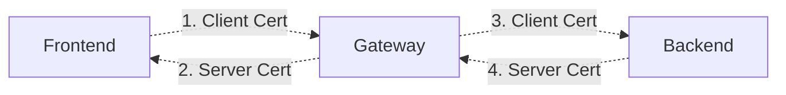

# GEP-2907: TLS Configuration Placement and Terminology

* Issue: [#2907](https://github.com/kubernetes-sigs/gateway-api/issues/2907)
* Status: Memorandum

## TLDR
This GEP aims to define high level TLS terminology and structure within Gateway
API to ensure that all our independent proposals related to TLS result in a
coherent set of APIs. This will result in some adjustments to provisional and
experimental TLS-related GEPs, specifically [BackendTLSPolicy](../gep-1897/index.md)

## Goals
1. Define high-level terminology for how we refer to TLS in Gateway API.
2. Define top level fields where TLS configuration can live for all below cases:
* Client to Gateway (Frontend) TLS configuration.
* Gateway to Client TLS configuration (Client Certificate Validation)
* Gateway to backend (Gateway Client Certificate)
3. Document how to use `BackendTLSPolicy` to support Gateway to Backend TLS configuration.

## Non-Goals
* Add or change fields directly. (This may inspire changes in other GEPs
  though).
* Commit to including specific parts of TLS configuration in Gateway API. (This
  is merely to provide space for future configuration, not a commitment that we
  will add it to the API.)

## Out of Scope
There are a variety of related TLS concepts in Gateway API that are not currently
in scope for this GEP. In the future, this GEP may be expanded to include:

1. Automatic mTLS (often associated with Service mesh)
2. TLSRoute

## Introduction

### TLS mode

TLS can be configured with two distinct modes:
* **Passthrough**: The Gateway forwards encrypted traffic directly to the backend from the entity originating the connection (called later a client). The TLS connection is established between the client and the backend; the Gateway does not participate in the TLS handshake.

* **Terminate**: The Gateway acts as a man-in-the-middle, terminating the client's TLS connection and originating a separate connection to the backend when routing the traffic. Both connections can independently support TLS and mutual TLS due to their distinct TLS configurations. The Gateway's dual role as a client or server affects the placement of TLS settings needed for given connection.

### "Frontend" and "Backend"
A guiding principle in this naming is to use consistent naming for both TLS connections “Downstream” (1+2) and “Upstream” (3+4) handled by the Gateway (similar to Envoy). To avoid the confusion with what is upstream and downstream, Gateway API will use “Frontend” (1+2) and “Backend”
(3+4).

*  **Frontend:** The entity connecting to a Gateway, typically a client
   application and/or web browser.
*  **Backend:** The entity a Gateway is routing traffic to, typically the
   endpoints behind a Service.

There are essentially 4 different segments that could be relevant to TLS
configuration in Gateway API:

The above diagram depicts these four segments as edges in a graph.

#### Frontend configuration

In the Frontend TLS connection Gateway acts as a server and presents Server certificate during TLS handshake. Client connects to the Gateway on domain basis and this is desired to configure Server certificates on the Listener.
In the mutual frontend TLS Gateway needs to verify client certificates with configured CA. It was expected that CA configuration would be also defined on Listener but due to connection coalescing this solution was not secure. We decided to move client certificate validation configuration on the Gateway level and allow for per port overrides.

#### Backend configuration

In the Backend connection Gateway acts as a client. The nature of the connection (HTTP or HTTPS) is configured on the Service using BackendTLSPolicy. If BackendTLSPolicy is defined for a Service, the Gateway must establish an HTTPS connection with the backend. During the TLS handshake, the backend presents a Server certificate. The Gateway validates this certificate against a CA certificate (and optionally SANs) configured by BackendTLSPolicy.
For mutual backend TLS, the Gateway's identity must be configured. This identity, a client certificate set on the Gateway object, will be presented by the Gateway. The Gateway uses the same client certificate for all backend connections originating mutual TLS.

## Proposed Segments

### 1. Gateway level configuration

Gateway-level configurations are required for both Frontend and Backend connections. We propose a top-level GatewayTLSConfig that is divided into independent Backend and Frontend configurations.

| Proposed Placement | Name | Status |
|-|-|-|
| Gateway | `Gateway.TLS.Frontend` | Proposed |
| Gateway | `Gateway.TLS.Backend` | Proposed |

#### Rationale
From the security point of view both TLS configurations require a Gateway level field. The configurations are independent and can coexist.

#### Why Not Listener.Frontend?
Due to connection coalescing, the client certificate validation for the frontend was moved to a Gateway level field to address security concerns. [GEP-91 Update PR](https://github.com/kubernetes-sigs/gateway-api/pull/3942)

#### Why Not FrontendTLSPolicy?
It could be reasonable to try to mirror BackendTLSPolicy for Frontend TLS. As we
considered that possibility, we evaluated why BackendTLSPolicy exists as a
separate policy resource:

1. Some parts of the config, such as the SNI that should be used to connect to
   the Service/backend only make sense when attached per Service - it's very
   unlikely that you'd want to use the same SNI to connect to all backends from
   a Gateway.
1. The Service API is overloaded and very slow to change, Gateway API has taken
   the approach of exposing config at that level via policy resources that are
   tied to specific personas (why Session Persistence config and Backend TLS are
   in different resources).

We don't think either of those reasons really apply to frontend TLS. Instead,
frontend TLS could theoretically be configured either for an entire Gateway, or
a specific Gateway listener. Given that many implementations already support
distinguishing this config per SNI, it seems to make sense to start with
Listener level attachment. We think that the persona that would be responsible
for a Gateway is not sufficiently different than the persona that would be
responsible for frontend TLS, so the current proposal is likely the best option
available to us.

### 2. Configure TLS Termination, including Server Certificate

| Proposed Placement | Name | Status |
|-|-|-|
| Gateway Listener | `Listener.TLS` | GA |

#### Rationale
This is already finalized in the API and so we're stuck with this name. In
hindsight a name that was more clearly tied to frontend TLS would have been
ideal here.

### 3. Configure Client Certificate Validation for Frontend

Client certificate validation will reside at the Gateway level. This configuration will be
either applied globally to all Listeners in the Gateway or can be overridden on a per-port basis.

| Proposed Placement | Name | Status |
|-|-|-|
| Gateway | `Gateway.TLS.Frontend.Default.Validation` | Proposed |
| Gateway | `Gateway.TLS.Frontend.PerPort` | Proposed |

#### Rationale
Gateway level configuration for client certificate validation was chosen due to security issue.

#### Why per port override
HTTPS connection can be reused between multiple Listeners sharing the same port. This might lead to bypassing client certificate validation configuration for a given Listener becasue new TLS handshake will not be triggered for different hostname.

### 4. Configure Client Certificate that Gateway should use to connect to Backend

| Proposed Placement | Name | Status |
|-|-|-|
| Gateway | `Gateway.Spec.TLS.Backend.ClientCertificateRef` | Proposed |

#### Rationale
Client certificate is part of Gateway identity and should not be overriden per backend.

#### Why Not Listener level to match FrontendValidation?
In general, we'd expect this identity to represent a Gateway as a whole, and
thus per-Listener configuration probably does not make sense here. Having
FrontendValidation at the Listener level allows a Gateway to accept different
client certs per SNI (a matching attribute of the frontend -> Gateway
connection). On the other hand, when determining the identity a Gateway should
use when connecting to a backend, it should likely either be tied directly to
the Gateway or Backend, but the Listener is not particularly relevant in this
context.

### 5. Validate Server Certificate that is provided by Backend
| Proposed Placement | Name | Status |
|-|-|-|
| Gateway | `Gateway.Spec.BackendTLS.Validation` | Not Proposed |
| BackendTLSPolicy | `BackendTLSPolicy.Spec.Validation` | Experimental (Different Name) |

#### Rationale
Rename `BackendTLSPolicy.TLS` to `BackendTLSPolicy.Validation`. Because this is
already clearly backend-focused, config like TLS Version, ALPN, and cipher
suites, could live at the same level without confusion. It's also plausible that
some Gateways may want to express Gateway-wide CAs that are trusted.

### 6. Configure TLS mode

| Proposed Placement | Name | Status |
|-|-|-|
| Gateway Listener | `Listener.TLS.Mode` | GA |

#### Rationale

Similarly to the broader [TLS termination](#2-configure-tls-termination-including-server-certificate)
segment, this field is already finalized in the API. In hindsight, along with a
different naming of `Listener.TLS`, we could have moved this field out of the broader
frontend TLS configuration, as it is not bound to it.

#### How the TLS configuration is affected

The TLS mode affects how the frontend TLS should be configured. In case `Terminate`
is set, the `Listener.TLS.CertificateRefs` field has to be populated, as the connection
is intended to be terminated at the Gateway level, while for `Passthrough`, the Certificate
does not need to be provided, as the TLS termination is handled by the backend.

## Routes and TLS

Multiple routes can be attached to Listeners specifying TLS configuration. This section
intends to clearly state how and when Routes can attach to Listeners with TLS configuration.

### Context

The `*Route` objects refer the Gateway (or a specific Listener of the Gateway) they
want to be attached to. A successful attachment can be granted by one of the two
following conditions:

* the `Listener.AllowedRoutes` field allows that specific Route `GroupKind` to be
  attached to it, or
* the `Listener.Protocol` field allows that specific Route to be attached to the
  Listener. This applies only in case the Gateway's AllowedRoutes field is not set.

In case the First condition is not satisfied (the Route references a Gateway that
does not explicitly allow such an attachment), the Route `Accepted` condition
is set to False with reason `NotAllowedByListeners`. In case the Route references
a Gateway with no Listener matching the protocol needed by the Route, the Route
`ResolvedRefs` condition is set to False with reason `UnsupportedProtocol`.

### What Routes are allowed by Listeners with TLS

The following is a summary of all the Routes and the TLS termination mode they support, along
with the compatible protocol.

| Protocol  |  Routes | TLS Terminate | TLS Passthough |
|-----------|---------|---------------|----------------|
| HTTP      | `HTTPRoute`/`GRPCRoute` | no  | no  |
| HTTPS     | `HTTPRoute`/`GRPCRoute` | yes | no  |
| TLS       | `TLSRoute`  | yes | yes |
| TCP       | `TCPRoute`  | yes | no  |
| UDP       | `UDPRoute`  | no  | no  |

> [!NOTE]
> When the traffic is routed to the backend via a Listener configured with TLS `Passthrough`
> and a compatible route, the packets are left untouched by the Gateway. In order to
> terminate the TLS connection to the Gateway and forward the traffic unencrypted to the backend,
> a Listener configured with TLS `Terminate` and a compatible route must be used.
