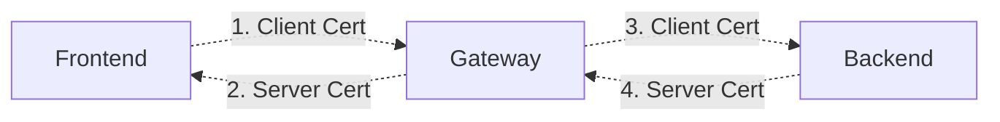

# GEP-2907: TLS Configuration Placement and Terminology

* Issue: [#2907](https://github.com/kubernetes-sigs/gateway-api/issues/2907)
* Status: Memorandum

## TLDR
This GEP aims to define high level TLS terminology and structure within Gateway
API to ensure that all our independent proposals related to TLS result in a
coherent set of APIs. This will result in some adjustments to provisional and
experimental TLS-related GEPs, specifically [BackendTLSPolicy](/geps/gep-1897)
and [Client Certificate Verification](/geps/gep-91).

## Goals
* Define high-level terminology for how we refer to TLS in Gateway API.
* Define top level fields where TLS configuration can live.

## Non-Goals
* Add or change fields directly. (This may inspire changes in other GEPs
  though).
* Commit to including specific parts of TLS configuration in Gateway API. (This
  is merely to provide space for future configuration, not a commitment that we
  will add it to the API.)

## Out of Initial Scope
There are a variety of related TLS concepts in Gateway API that are not currently
in scope for this GEP. In the future, this GEP may be expanded to include:

1. Automatic mTLS (often associated with Service mesh)
1. TLS Passthrough
1. TLSRoute


## Introduction

### Where TLS could be configured
We have three different places where we might want to configure TLS:

#### A. Gateways
Config attached at this layer will apply to everything behind a single address
such as a virtual IP.

#### B. Gateway Listeners
Each Gateway contains multiple “Listeners”. Each HTTPS Listener in a Gateway
must have a unique combination of protocol, port, and SNI (Server Name
Indication). TLS configuration attached at this layer should be [isolated via
SNI](/guides/implementers/#listener-isolation).

#### C. BackendTLSPolicy
This policy allows us to attach unique TLS configuration per Backend. Depending
on the organization, this policy may be owned by the application owner or the
cluster operator. Note that this configuration will be used by all Gateways
(potentially from different implementations) that are connecting to the backend.

### "Frontend" and "Backend"
A guiding principle in this naming is to use consistent naming for “Downstream”
(1+2) and “Upstream” (3+4), similar to Envoy. To avoid the confusion with what
is upstream and downstream, Gateway API will use “Frontend” (1+2) and “Backend”
(3+4).

*  **Frontend:** The entity connecting to a Gateway, typically a client
   application and/or web browser.
*  **Backend:** The entity a Gateway is routing traffic to, typically the
   endpoints behind a Service.

There are essentially 4 different segments that could be relevant to TLS
configuration in Gateway API:



The above diagram depicts these four segments as edges in a graph.

## Proposed Segments
Note that this does not represent any form of commitment that any of these
fields or concepts will exist within Gateway API. If or when they do, we propose
the following naming structure:

### 1. Validate Client Certificate provided by Frontend

| Proposed Placement | Name | Status |
|-|-|-|
| Gateway Listener | `Listener.TLS.FrontendValidation` | Proposed |

#### Rationale
Use FrontendValidation to leave room for concepts like trust anchors and trust
domains. Anything not strictly tied to validation would belong to Listener.TLS
which is now reserved exclusively for “Frontend” TLS configuration (1+2).

#### Why Not Frontend.Validation?
Part of the idea behind this GEP is that Listener.TLS is really entirely focused
on 1+2 - the bits of TLS between frontend and Gateway. That means that if we
were to add any additional TLS configuration in the Listener.TLS struct, it
would tied to that limited scope, and thus we don't really need a separate
Frontend struct.

One could make an argument that Listener.TLS.Validation should be the field name
here to avoid any ambiguity, but in this specific context, we think that it's
probably helpful to specifically spell out frontend.

#### Why Not FrontendTLSPolicy?
It could be reasonable to try to mirror BackendTLSPolicy for Frontend TLS. As we
considered that possibility, we evaluated why BackendTLSPolicy exists as a
separate policy resource:

1. Some parts of the config, such as the SNI that should be used to connect to
   the Service/backend only make sense when attached per Service - it's very
   unlikely that you'd want to use the same SNI to connect to all backends from
   a Gateway.
1. The Service API is overloaded and very slow to change, Gateway API has taken
   the approach of exposing config at that level via policy resources that are
   tied to specific personas (why Session Persistence config and Backend TLS are
   in different resources).

We don't think either of those reasons really apply to frontend TLS. Instead,
frontend TLS could theoretically be configured either for an entire Gateway, or
a specific Gateway listener. Given that many implementations already support
distinguishing this config per SNI, it seems to make sense to start with
listener level attachment. We think that the persona that would be responsible
for a Gateway is not sufficiently different than the persona that would be
responsible for frontend TLS, so the current proposal is likely the best option
available to us.


### 2. Configure TLS Termination, including Server Certificate

| Proposed Placement | Name | Status |
|-|-|-|
| Gateway Listener | `Listener.TLS` | GA |

#### Rationale
This is already finalized in the API and so we're stuck with this name. In
hindsight a name that was more clearly tied to frontend TLS would have been
ideal here.


### 3. Configure Client Certificate that Gateway should use to connect to Backend

| Proposed Placement | Name | Status |
|-|-|-|
| Gateway | `Gateway.Spec.BackendTLS.ClientCertificateRef` | Not Proposed |
| BackendTLSPolicy | `BackendTLSPolicy.Spec.ClientCertificateRef` | Not Proposed |

#### Rationale
It's not yet obvious which of the above options are preferable, but a case could
be made for either or both. If we add a `BackendTLS` struct to Gateway it would
leave room for concepts like TLS version, ALPN, cipher suites, etc.

#### Why Not Listener level to match FrontendValidation?
In general, we'd expect this identity to represent a Gateway as a whole, and
thus per-Listener configuration probably does not make sense here. Having
FrontendValidation at the Listener level allows a Gateway to accept different
client certs per SNI (a matching attribute of the frontend -> Gateway
connection). On the other hand, when determining the identity a Gateway should
use when connecting to a backend, it should likely either be tied directly to
the Gateway or Backend, but the Listener is not particularly relevant in this
context.


### 4. Validate Server Certificate that is provided by Backend
| Proposed Placement | Name | Status |
|-|-|-|
| Gateway | `Gateway.Spec.BackendTLS.Validation` | Not Proposed |
| BackendTLSPolicy | `BackendTLSPolicy.Spec.Validation` | Experimental (Different Name) |

#### Rationale
Rename `BackendTLSPolicy.TLS` to `BackendTLSPolicy.Validation`. Because this is
already clearly backend-focused, config like TLS Version, ALPN, and cipher
suites, could live at the same level without confusion. It's also plausible that
some Gateways may want to express Gateway-wide CAs that are trusted.

#### Why BackendTLS on Gateways?
Although this GEP is intentionally not committing to adding new fields or
features, it's possible that at some point in the future we may want to have
some kind of Backend TLS config at the Gateway level. For example, it may be
useful to configure a set of CAs that a Gateway trusts or a client cert that a
Gateway should use to connect to all backends. If this existed, there would
likely be some overlap in config with BackendTLSPolicy, and if a future GEP
proposed this, it would need to include how overlapping config should be
handled.

#### Why the inconsistency between Frontend and Backend TLS config on Gateways?
If we were to populate all the possible fields described in this GEP, we'd end
up with the following config on Gateways:

```
Gateway.Spec.Listeners.TLS.FrontendValidation
Gateway.Spec.Listeners.TLS
Gateway.Spec.BackendTLS.ClientCertificateRef
Gateway.Spec.BackendTLS.Validation
```

This is all tied to the need to provide backwards compatibility with the TLS
config that is already GA on Listeners (`Listener.TLS`). If we were naming that
field today with the broader vision of TLS configuration throughout Gateway API
we would almost certainly choose a more descriptive name that was more clearly
tied to Frontend TLS. Unfortunately we're too late to change that name, but we
can try to make the rest of the terminology clearly tied to frontend or backend
TLS.

One [suggestion by @candita](https://github.com/kubernetes-sigs/gateway-api/pull/2910#discussion_r1552534017)
would be to introduce a Listener like resource for BackendTLS, resulting in a
more consistent naming scheme within Gateway TLS configuration. Although it's
not yet clear if we need this additional layer, we should reconsider it as we're
further developing Backend TLS.
