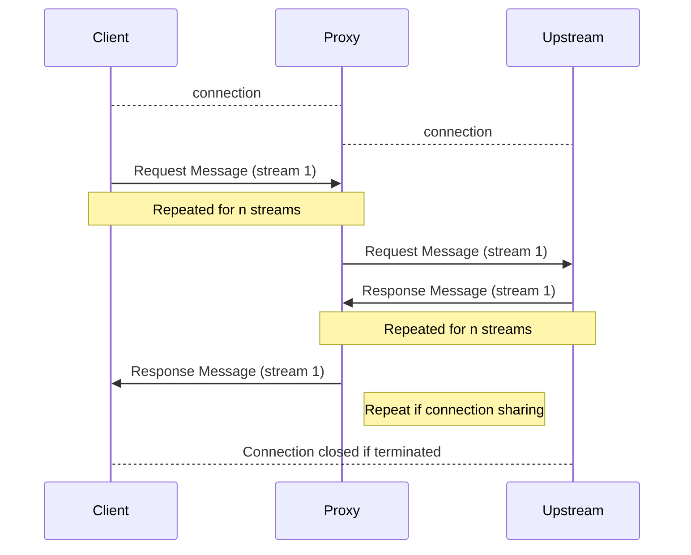
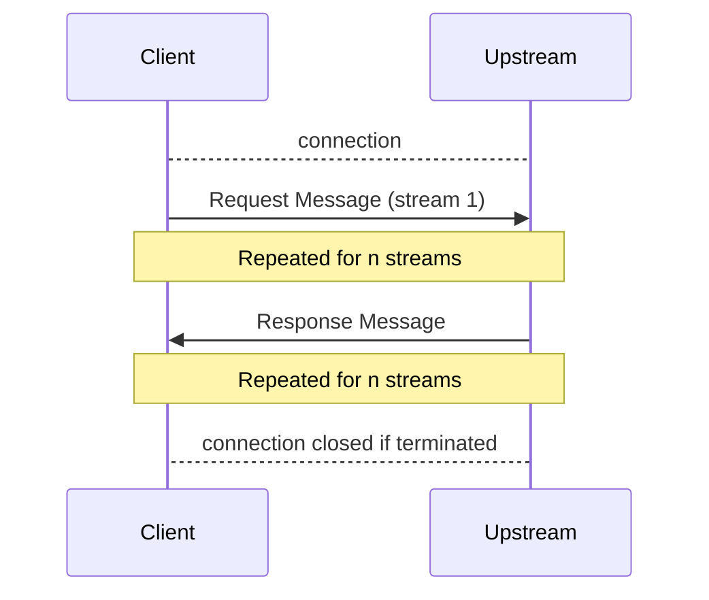

# GEP-3139: GRPCRoute Timeouts

* Issue: [#3139](https://github.com/kubernetes-sigs/gateway-api/issues/3139)
* Status: Implementable

(See status definitions [here](/geps/overview/#gep-states).)

## TL;DR

Similar to the HTTPRoute Timeouts ([GEP #1742](https://gateway-api.sigs.k8s.io/geps/gep-1742/)), the goal of this GEP is to create a design for implementing GRPCRoute Timeouts

## Goals
@arkodg (original requester of this experimental feature) had the following listed in the discussion, which is a good starting point the API of GRPCRoute timeouts

- The ability to set a request timeout for unary RPC
- The ability to set a request timeout for bidirectional streaming
- The ability to disable timeouts (set to 0s) for streaming RPC
- Define GRPCRoute timeouts in a manner supporting the semantics of the gRPC 

## Non-Goals

Define the overall structure of handling streaming for other routes. For example, we should look into streaming for HTTP, and update GEP 1742 as well.

## Introduction

In order to stay [aligned with gRPC](https://grpc.io/docs/what-is-grpc/core-concepts/#deadlines), we define a timeout as how a client is willing to wait for an RPC to complete before a `DEADLINE_EXCEEDED` error.

A timeout in terms of gRPC is the maximum duration for the peer to respond to a gRPC request. This timeout is relative to when the client application initiates the RPC or, in the case of a proxy, when the proxy first receives the stream. If the stream has not entered the closed state this long after the timer has started, the RPC MUST be terminated with gRPC status 4 (DEADLINE_EXCEEDED).

This GEP intends to define timeout semantics that we can build into the Gateway API for GRPCRoute.

gRPC has the following 4 cases:
- Unary (single req, single res)
- Client Stream (Client sends a stream of messages, server replies with a res)
- Server Stream (Client sends a single req, Server replies with a stream)
- Bidirectional Streaming 

Read the [gRPC docs on more details](https://grpc.io/docs/what-is-grpc/core-concepts/#rpc-life-cycle)

### gRPC with Proxy
Currently, Gateway API implementations utilize a proxy (different proxies are listed in [GEP 1742](https://gateway-api.sigs.k8s.io/geps/gep-1742/#background-on-implementations)). Implementations rely on either Envoy, Nginx, F5 BigIP, Pipy, HAProxy, Litespeed, or Traefik as their proxy. 

Below is a (generic) sequence diagram of gRPC timeouts from a client (outside the cluster), to the gateway (a proxy implementation), then to a service over an HTTP/2 connection:


Multiple streams share the same connection, and depending on if a unary request/response or a stream request/response is sent, the flow of messages may be independent of each other. 
Note that streams do not have to execute in order. The Proxy or Upstream can choose to send back its intial metadata _or_ wait for for the client to start streaming messages. 

### gRPC without Proxy
Below is a high level sequance diagram of a HTTP/2 stream connection that occurs between a client and upstream (no proxy):


Note that streams do not have to execute in order. The Upstream can choose to send back its intial metadata _or_ wait for for the client to start streaming messages. 

Some differences from HTTPRoute timeouts:

Noted by [@gnossen](https://github.com/kubernetes-sigs/gateway-api/discussions/3103#discussioncomment-9732739), the semantics should be "timeout from when the first request message is started" (not when the first request is finished).

Nginx uses [grpc_<>_timeout](https://nginx.org/en/docs/http/ngx_http_grpc_module.html) is used to configure of gRPC timeouts, which occurs between the proxy and upstream (`grpc_connect_timeout,grpc_send_timeout, grpc_read_timeout`)

## API

The proxy implementations for the dataplane for the majority have some way to configure gRPC timeouts.

### Timeout Values

Timeout values will be of type [Duration](https://gateway-api.sigs.k8s.io/geps/gep-2257/). Similar to HTTPRoute timeouts, a zero-valued timeout ("0s") MUST be interpreted as disabling the timeout. A valid non-zero-valued timeout MUST be >= 1ms.

`timeout.maxStreamDuration`

- The timeout value to allow users to configure streaming duration. If a GatewayAPI implementation and a [gRPC header timeout](https://github.com/grpc/grpc/blob/master/doc/PROTOCOL-HTTP2.md#requests) are both present, the "stricter" of the values will take precedence . A value of `0s` will disable a timeout - meaning a client's request will not timeout. This field is optional. 

`timeout.strictEnforcement`

- An enum value for specifying between GRPCRoute timeouts and grpc-timeout metadata timeoutsm. If set to `allow`, the timeout value that is stricter of two. If set to `deny`, it is assumed the implementation does not allow for this features. 

If no timeout values are specified in the GRPCRoute, then the `grpc-timeout` header (from the client) will determine a request's timeout.


GO
```
type GRPCRouteRule struct {
    // Timeouts defines the timeouts that can be configured for an gRPC request.
    //
    // Support: Extended
    //
    // +optional
    // <gateway:experimental>
    Timeouts *GRPCRouteTimeouts `json:"timeouts,omitempty"`

    // ...
}

// GRPCRouteTimeouts defines timeouts that can be configured for an GRPCRoute.
// Timeout values are represented with Gateway API Duration formatting.
// Specifying a zero value such as "0s" is interpreted as no timeout.
//
// +kubebuilder:validation:XValidation:message="backendRequest timeout cannot be longer than request timeout",rule="!(has(self.request) && has(self.backendRequest) && duration(self.request) != duration('0s') && duration(self.backendRequest) > duration(self.request))"
type GRPCRouteTimeouts struct {
    // MaxStreamDuration specifies the maximum duration for upstream to respond to an gRPC request from a client.
    // If upstream has not been able to respond before this deadline is met, upstream
    // MUST return a timeout error.
    //
    // For example, setting the `rules.timeouts.MaxStreamRequest` field to the value `10s` in an
    // `GRPCRoute` will cause a timeout if a client request is taking longer than 10 seconds
    // to complete.
    //
    // This timeout is intended to cover as close to the whole request-response transaction
    // as possible although an implementation MAY choose to start the timeout after the entire
    // request stream has been received instead of immediately after the transaction is
    // initiated by the client.
    //
    // When omitted, the timeout value will default to the `grpc-timeout` value in the request. 
    //
    // Support: Extended
    //
    // +optional
    MaxStreamDuration *Duration `json:"maxStreamDuration,omitempty"`

    // StrictEnforcement enum specifies which timeout to use request from a client 
    // to upstream if 2 are specified. This occurs when a gRPC timeout is specified in the GRPCRoute  
    // and a gRPC timeout is specified in the grpc-timeout header of the request.
    // The values permitted are "allow" and "deny".
    //
    // A propagated gRPC request may result in other services being called upon. If 
    // StrictEnforcement is set to "allow", then the MaxStreamDuration will be the stricter value of 
    // either the specified `grpc-timeout` metadata, or the timeout specified by the GRPCRoute.
    // If set to "deny", it is assumed that this is not implemented, and the timeout will 
    // default to the value in in the grpc-timeout metadata.
    //
    // Support: Extended
    //
    // +optional
    StrictEnforcement *StrictEnforcement `json:"strictEnforcement,omitempty"`

}

// StrictEnforcement specifies enum of Allow or Deny 
//
// +kubebuilder:validation:Enum=Allow;Deny
type StrictEnforcement string

const(
  StrictEnforcementAllow StrictEnforcement = "Allow"

  StrictEnforcementDeny StrictEnforcement = "Deny"
)

// Duration is a string value representing a duration in time. The format is as specified
// in GEP-2257, a strict subset of the syntax parsed by Golang time.ParseDuration.
//
// +kubebuilder:validation:Pattern=`^([0-9]{1,5}(h|m|s|ms)){1,4}$`
type Duration string
```
YAML
```
apiVersion: gateway.networking.k8s.io/v1beta1
kind: GRPCRoute
metadata:
  name: timeout-example
spec:
  ...
  rules:
  - backendRefs:
    - name: some-service
      port: 8080
    timeouts:
      maxStreamDuration: 10s
      strictEnforcement: allow
```
## Conformance Details
The feature name for this feature is GRPCRouteTimeout, and its support is Extended.
Gateway implementations can indicate support for this feautre using the following:
- `GRPCRouteMaxStreamDuration`
- `GRPCRouteStrictEnforcement`


## Alternatives


## References

