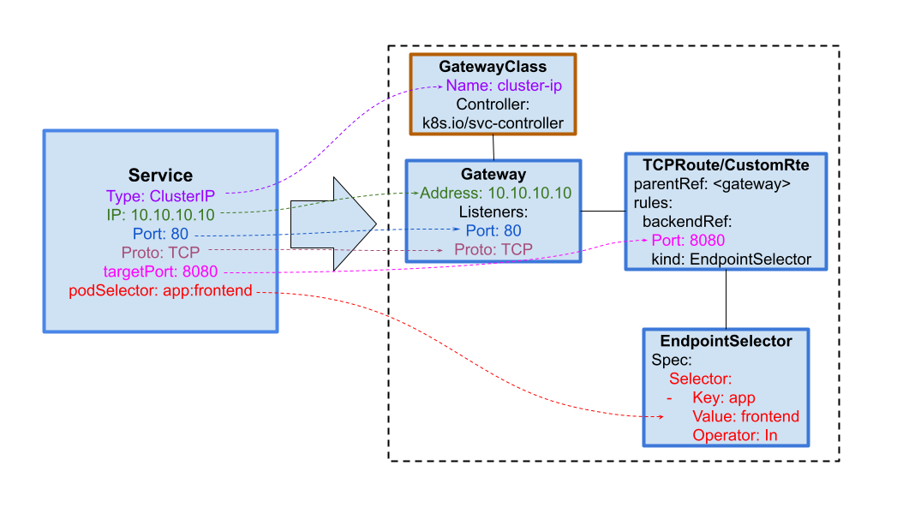
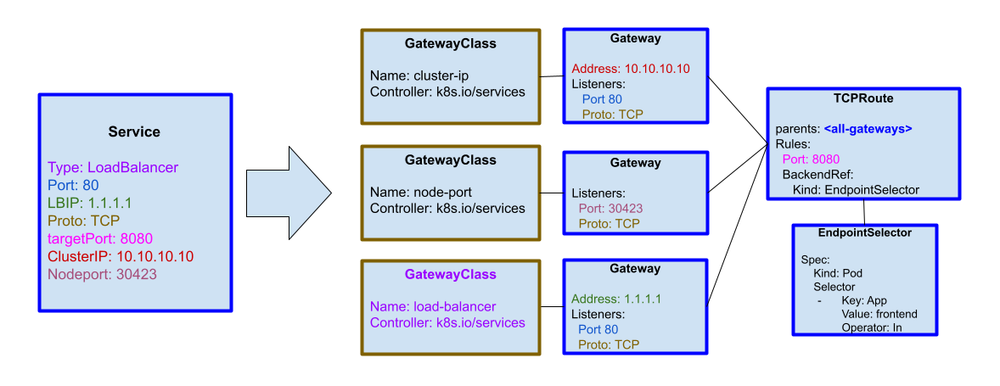

# GEP-3539: ClusterIP Gateway - Gateway API to Expose Pods on Cluster-Internal IP Address

* Issue: [#3539](https://github.com/kubernetes-sigs/gateway-api/issues/3539)
* Status: Experimental

## TLDR

Gateway API enables advanced traffic routing and can be used to expose a 
logical set of pods on a single IP address within a cluster. It can be seen 
as the next generation ClusterIP providing more flexibility and composability 
than Service API. This comes at the expense of some additional configuration 
and manageability burden.

## Goals

* Define Gateway API usage to accomplish ClusterIP Service style behavior
* Propose DNS layout and record format for ClusterIP Gateway
* Extend the use of Gateway API to provide NodePort and LoadBalancer Service 
  type of functionality

## Non-Goals

* Make significant changes to Gateway API
* Provide path for existing ClusterIP Services in a cluster to migrate to 
  Gateway API model

## API Changes

* EndpointSelector is recognized as a backend
* DNS record format for ClusterIP Gateways 

## Introduction

Gateway API provides a generic and composable model for defining L4 and L7 
routing in Kubernetes. Very simply, it describes how to get traffic into pods. 
ClusterIP provides similar functionality of an ingress point for routing traffic 
into pods. As the Gateway API has evolved, there have been discussions around whether 
it can be a substitute for the increasingly complex and overloaded Service API. This 
document aims to describe what this could look like in practice, with a focus on 
ClusterIP and a brief commentary on how the concept design can be extended to 
accommodate LoadBalancer and NodePort Services.

## Overview

Gateway API can be thought of as decomposing Service API into multiple separable 
components that allow for definition of the ClusterIP address and listener configuration 
(Gateway resource), implementation specifics and common configuration (GatewayClass 
resource), and routing traffic to backends (Route resource).

### Limitations of Service API

Besides what has been discussed in the past about Service API maintainability, evolvability, 
and complexity concerns, see: https://www.youtube.com/watch?v=Oslwx3hj2Eg, we ran into 
additional practical concerns that rendered Service API insufficient for the needs at hand.

Service IPs can only be assigned out of the ServiceCIDR range configured for the API server. 
While Kubernetes 1.31 added a Beta feature that allows for the Extension of Service IP Ranges, 
there have been use cases where multi-NIC pods (pods with multiple network interfaces) require 
the flexibility of specifying different ServiceCIDR ranges to be used for ClusterIP services 
corresponding to the multiple different networks. There are strict traffic splitting and network 
isolation requirements that demand non-overlapping ServiceCIDR ranges for per-network ClusterIP 
service groups. Because of the way service definition and IP address allocation are tightly 
coupled in API server, it is not possible to use the current Service API to achieve this model 
without resorting to inelegant and klugey implementations.

Gateway API also satisfies, in a user-friendly and uncomplicated manner, the need for advanced 
routing and load balancing capabilities in order to enable canary rollouts, weighted traffic 
distribution, isolation of access and configuration.

### Service Model to Gateway API Model



### EndpointSelector as Backend

A Route can forward traffic to the endpoints selected via selector rules defined in EndpointSelector. 
While Service is the default resource kind of the referent in backendRef, EndpointSelector is 
suggested as an example of a custom resource that implementations could have to attach pods (or 
potentially other resource kinds) directly to a Route via backendRef. 

```yaml

```

The EndpointSelector object is defined as follows. It allows the user to specify which endpoints 
should be targeted for the Route.

```yaml

```

To allow more granular control over traffic routing, there have been discussions around adding 
support for using Kubernetes resources besides Service (or external endpoints) directly as backendRefs. 
Gateway API allows for this flexibility, so having a generic EndpointSelector resource supported as a 
backendRef would be a good evolutionary step.

### User Journey

Infrastructure provider supplies a GatewayClass corresponding to the type of service-like behavior to 
be supported.

Below is the example of a GatewayClass for ClusterIP support:
```yaml

```

The user must then create a Gateway in order to configure and enable the behavior as per their intent:
```yaml

```

By default, IP address(es) from a pool specified by a CIDR block will be assigned unless a static IP is 
configured in the _addresses_ field as shown above. The CIDR block may be configured using a custom CR. 
Subject to further discussion, it may make sense to have a GatewayCIDR resource available upstream to 
specify an IP address range for Gateway IP allocation.

Finally the specific Route and EndpointSelector resources must be created in order to set up the backend 
pods for the configured ClusterIP.
```yaml

```

### Backends on Listeners

As seen above, Gateway API requires at least three CRs to be defined. This introduces some complexity. 
GEP-1713 proposes the addition of a ListenerSet resource to allow sets of listeners to attach to a Gateway. 
As a part of discussions around this topic, the idea of directly adding backendRefs to listeners has come 
up. Allowing backendRefs directly on the listeners eliminates the need to have Route objects for simple 
cases. More complex traffic splitting and advanced load balancing cases can still use Route attachments via 
allowedRoutes. 

### DNS

ClusterIP Gateways in the cluster need to have consistent DNS names assigned to allow ClusterIP lookup by 
name rather than IP address. DNS A and/or AAAA record creation needs to happen when Kubernetes publishes 
information about Gateways, in a manner similar to ClusterIP Service creation behavior. DNS nameservers 
in pods’ /etc/resolv.conf need to be programmed accordingly by kubelet.

```
<name of gateway>.<gateway-namespace>.gw.cluster.local
```

This results in the following search option entries in Pods’ /etc/resolv.conf:
```
search <ns>.gw.cluster.local  gw.cluster.local  cluster.local
```

### Cross-namespace References

Gateway API allows for Routes in different namespaces to attach to the Gateway. 

When modeling ClusterIP service networking, the simplest recommendation might be to keep Gateway and Routes 
within the same namespace. While cross namespace routing would work and allow for evolved functionality, 
it may make supporting certain cases tricky. One specific example for this case is the pod DNS resolution 
support of the following format 

```
pod-ipv4-address.gateway-name.my-namespace.gw.cluster-domain.example
```

If Gateway and Routes (and hence the backing pods) are in different namespaces, there arises ambiguity in 
whether and how to support this pod DNS resolution format.

## LoadBalancer and NodePort Services

Extending the concept further to LoadBalancer and NodePort type services follows a similar pattern. The idea 
is to have a GatewayClass corresponding to each type of service networking behavior that needs to be modeled 
and supported.


Note that Gateway API allows flexibility and clear separation of concerns so that one would not need to 
configure cluster-ip and node-port when configuring a load-balancer.

But for completeness, the case shown below demonstrates how load balancer functionality analogous to 
LoadBalancer Service API can be achieved using Gateway API.



## Additional Service API Features

Services natively provide additional features as listed below (not an exhaustive list). Gateway API can be 
extended to provide some of these features natively, while others may be left up to the specifics of 
implementations. 

| Feature | ServiceAPI options | Gateway API possibilities |
|---|---|---|
| sessionAffinity | ClientIP <br /> NoAffinity | Route level
| allocateLoadBalancerNodePorts | True <br /> False | Not supported for ClusterIP Gateway <br /> Supported for LoadBalancer Gateway |
| externalIPs | List of externalIPs for service | Not supported? |
| externalTrafficPolicy | Local <br /> Cluster | Supported for LB Gateways only, Route level |
| internalTrafficPolicy | Local <br /> Cluster | Supported for ClusterIP Gateways only, Route level |
| ipFamily | IPv4 <br /> IPv6 | Route level |
| publishNotReadyAddresses | True <br /> False | Route or EndpointSelector level |
| ClusterIP (headless service) | IPAddress <br /> None | GatewayClass definition for Headless Service type |
| externalName | External name reference <br /> (e.g. DNS CNAME) | GatewayClass definition for ExternalName Service type |

## References

* [Original Doc](https://docs.google.com/document/d/1N-C-dBHfyfwkKufknwKTDLAw4AP2BnJlnmx0dB-cC4U/edit)
