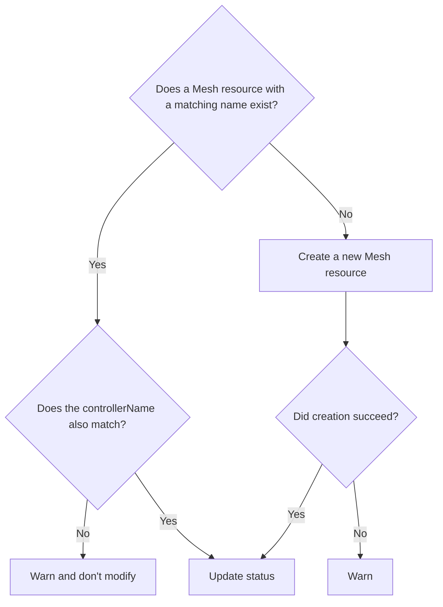

# GEP-3949: Mesh Resource

* Issue: [#3949](https://github.com/kubernetes-sigs/gateway-api/issues/3949)
* Status: Implementable

(See [status definitions](../overview.md#gep-states).)

[Chihiro]: ../../concepts/roles-and-personas/#chihiro
[Ian]: ../../concepts/roles-and-personas/#ian
[Ana]: ../../concepts/roles-and-personas/#ana

The key words "MUST", "MUST NOT", "REQUIRED", "SHALL", "SHALL NOT", "SHOULD",
"SHOULD NOT", "RECOMMENDED", "NOT RECOMMENDED", "MAY", and "OPTIONAL" in this
document are to be interpreted as described in BCP 14 ([RFC8174]) when, and
only when, they appear in all capitals, as shown here.

[RFC8174]: https://www.rfc-editor.org/rfc/rfc8174

## User Story

**[Chihiro] and [Ian] would like a Mesh resource,
parallel to the Gateway resource,
that allows them to
supply mesh-wide configuration
and
shows what features
a given mesh implementation supports.**

## Background

Gateway API has long had a GatewayClass resource
that represents a class of Gateways
that can be instantiated in a cluster.
GatewayClass both
allows configuring the class as a whole
and provides a way for [Chihiro] and [Ian] to see
what features Gateways in that class support.
We have,
to date,
avoided such a resource for meshes,
but as we work on
improving mesh conformance tests and reports
and start work on
supporting Out-of-Cluster Gateways (OCGs),
we will need ways to
show what features a given mesh implementation supports
and represent mesh-wide configuration.

This GEP therefore defines a Mesh resource
which represents a running instance of a service mesh,
allowing [Chihiro] and [Ian] to
supply mesh-wide configuration,
and allowing the mesh implementation
to indicate what features it supports.

Unlike Gateways, we do not expect
multiple instances of meshes to be instantiated
in a single cluster.
This implies that a MeshClass resource is not needed;
instead, we will simply define a Mesh resource.

## Goals

- Define a Mesh resource
  that allows for
  mesh-wide configuration
  and feature discovery.

- Avoid making it more difficult for [Chihiro] and [Ian]
  to adopt a mesh
  (or to experiment with adopting a mesh).

## Non-Goals

- Support meshes interoperating with each other.

    As always,
    we will not rule out future work
    in this area,
    but it is out of scope
    for this GEP.

- Support off-cluster gateways.

    This is covered in a separate GEP
    and will not be discussed here.

- Change GAMMA's position on
  multiple meshes running simultaneously
  in a single cluster.

    GAMMA has always taken the position
    that multiple meshes running simultaneously
    in a single cluster
    is not an explicit goal, but neither is it forbidden.
    This GEP does not change that position.

## API

The purpose
of the Mesh resource
is to support both
mesh-wide configuration
as well as feature discovery.
However,
as of the writing of this GEP,
there is
no mesh-wide configuration
that is portable across implementations.
Therefore,
the Mesh resource
is currently pretty simple:

```yaml
apiVersion: gateway.networking.x-k8s.io/v1alpha1
kind: XMesh
metadata:
  name: one-mesh-to-mesh-them-all
spec:
  # required, must be domain-prefixed
  controllerName: one-mesh.example.com/one-mesh
  parametersRef:
    # optional ParametersReference
    ...
```

- The Mesh resource is cluster-scoped,
  so there is no `metadata.namespace` field.

- Although we call this the Mesh resource,
  as an experimental API
  it must be named XMesh
  in the `gateway.networking.x-k8s.io` API group.

    When the API graduates to standard,
    it will be renamed to `Mesh`
    in the `gateway.networking.k8s.io` API group.

- The `controllerName` field
  is analogous to
  the `controllerName` field
  in the GatewayClass resource:
  it defines the name
  of the mesh implementation
  that is responsible for
  this Mesh resource.

    A given mesh implementation will define its controller name
    at build time.
    It MUST be a domain-prefixed path,
    for example `linkerd.io/linkerd` or `istio.io/istio`.
    It MUST NOT be empty.
    It MAY be configurable at runtime,
    although this is not expected to be common.

    Although we expect
    that there will be
    only one mesh
    in a given cluster, the
    `controllerName` field
    MUST be supplied,
    and a given mesh implementation
    MUST ignore
    a Mesh resource
    that does not have
    a `controllerName` field
    that matches its own name.

- The `parametersRef` field
  is analogous to
  the `parametersRef` field
  in the GatewayClass resource:
  it allows optionally specifying
  a reference to a resource
  that contains configuration
  specific to the mesh
  implementation.

### `status`

The `status` stanza
of the Mesh resource
is used to indicate
whether the Mesh resource
has been accepted by
a mesh implementation,
whether the mesh is
ready to use,
and
what features
the mesh supports.

```yaml
apiVersion: gateway.networking.x-k8s.io/v1alpha1
kind: XMesh
metadata:
  name: one-mesh-to-mesh-them-all
spec:
  controllerName: one-mesh.example.com/one-mesh
status:
  conditions:
    # MUST include Accepted condition if the Mesh resource is active.
    - type: Accepted  # Becomes true when the controller accepts the Mesh resource
      status: "True"
      reason: Accepted
      lastTransitionTime: "2023-10-01T12:00:00Z"
      message: Mesh resource accepted by one-mesh v1.2.3 in namespace one-mesh
    ...
  supportedFeatures:
    # List of SupportedFeature
    - name: MeshConsumerRoute
    - name: MeshHTTPRoute
    - name: OffClusterGateway
    ...
```

Although GAMMA does not fully support multiple meshes
running in the same cluster at the same time,
meshes still MUST provide
human-readable information
in the `Accepted` condition
about which mesh instance
has claimed a given Mesh resource.
This information is meant to be used
by [Chihiro] and [Ian] as confirmation
that the mesh instance
is doing what they expect it to do.

Mesh implementations MUST
reject Mesh resources in which `spec.parametersRef`
references a resource that does not exist
or is not supported by the mesh implementation,
setting the `Reason` to `InvalidParameters`.

The mesh implementation
MUST set `status.SupportedFeatures`
to indicate which features
the mesh supports.

### Life Cycle

One of the explicit goals of this GEP
is to avoid making it more difficult for [Chihiro] and [Ian]
to adopt a mesh.
In turn, this implies that we MUST NOT require [Chihiro] or [Ian]
to manually create a Mesh resource in order to use a mesh.

The simplest way to achieve this is
for the mesh implementation to create a Mesh resource
when it starts up,
if one does not already exist
with a matching `controllerName` field.
This raises questions around
what the Mesh resource should be named,
and how the mesh implementation can avoid overwriting
any modifications [Chihiro] or [Ian] make
to the Mesh resource after it is created.

To manage these concerns
while still minimizing added friction,
mesh implementations MUST define a default `metadata.name`
for the Mesh resource they will look for,
and SHOULD allow overriding this name at install time.
This default name SHOULD be
an obvious derivative of the mesh implementation name,
such as "linkerd" or "istio";
its purpose is to make it easy for [Chihiro] and [Ian]
to find the Mesh resource
while also allowing for the possibility
that there will need to be more than one
Mesh resource in a cluster.

At startup, then:

- The mesh implementation MUST look for a Mesh resource
  with the expected `metadata.name` field.

- If no Mesh resource exists with the expected `metadata.name`,
  the implementation MUST create a Mesh resource
  with the expected `metadata.name`
  and `spec.controllerName` fields.

  - The mesh MUST NOT set any other fields
    in the `spec` of the Mesh resource
    that it creates.

    In particular, the mesh MUST NOT set `parametersRef`
    when it creates the Mesh resource.

- Otherwise
  (a Mesh resource already exists with the expected `metadata.name`),
  the implementation MUST NOT modify the `spec`
  of that Mesh resource
  in **any way**.
  Instead, it MUST check the `spec.controllerName` field:

  - If the Mesh resource has a matching `spec.controllerName` field:

      - The implementation MUST set the `status` stanza
        of the Mesh resource
        to indicate whether or not it has accepted the Mesh resource
        and, if accepted, what features the mesh supports.

  - Otherwise
    (the Mesh resource does not have
    a matching `spec.controllerName` field):

      - The implementation MUST NOT modify the Mesh resource
        in any way,
        and it SHOULD warn the user
        (in whatever way is appropriate for the mesh)
        that there is a mismatch in the Mesh resource



If, at the end of this process,
there is no Mesh resource with both
a matching `metadata.name` and
a matching `spec.controllerName`,
the implementation MUST act as if
a Mesh resource was found with an empty `spec`
(other than the `controllerName` field).
Optional configuration MUST remain in its default state,
and features that require a Mesh resource
(such as OCG support)
MUST NOT be enabled.

Obviously, if no matching Mesh resource exists,
the mesh will not be able to publish support features,
which may lead to assumptions
that the mesh does not support any features.

The mesh implementation MUST NOT,
under any circumstances,
modify the `spec` of a Mesh resource
other than by creating a new Mesh resource
when one does not exist.

Mesh implementations SHOULD
respond to changes in the Mesh resource
without requiring the mesh to be restarted.

### API Type Definitions

```go
// Mesh defines mesh-wide characteristics of a GAMMA-compliant service mesh.
// It is a cluster-scoped resource.
type Mesh struct {
  metav1.TypeMeta   `json:",inline"`
  metav1.ObjectMeta `json:"metadata,omitempty"`

  // Spec defines the desired state of Mesh.
  Spec MeshSpec `json:"spec"`

  // Status defines the current state of Mesh.
  //
  // Implementations MUST populate status on all Mesh resources which
  // specify their controller name.
  //
  // Defaults to Accepted condition with status Unknown and reason Pending.
  Status MeshStatus `json:"status,omitempty"`
}

// MeshSpec defines the desired state of a Mesh.
type MeshSpec struct {
  // ControllerName is the name of the controller that is managing this
  // Mesh. The value of this field MUST be a domain prefixed path.
  //
  // Example: "example.com/awesome-mesh".
  //
  // This field is not mutable and cannot be empty.
  //
  // Support: Core
  //
  // +kubebuilder:validation:XValidation:message="Value is immutable",rule="self == oldSelf"
  ControllerName string `json:"controllerName"`

  // ParametersRef is an optional reference to a resource that contains
  // implementation-specific for this Mesh. If no implementation-specific
  // parameters are needed, this field MUST be omitted.
  //
  // ParametersRef can reference a standard Kubernetes resource, i.e.
  // ConfigMap, or an implementation-specific custom resource. The resource
  // can be cluster-scoped or namespace-scoped.
  //
  // If the referent cannot be found, refers to an unsupported kind, or when
  // the data within that resource is malformed, the Mesh MUST be rejected
  // with the "Accepted" status condition set to "False" and an
  // "InvalidParameters" reason.
  //
  // Support: Implementation-specific
  //
  // +optional
  ParametersRef *ParametersReference `json:"parametersRef,omitempty"`

  // Description optionally provides a human-readable description of a Mesh.
  //
  // +kubebuilder:validation:MaxLength=64
  // +optional
  Description *string `json:"description,omitempty"`
}

// MeshConditionType is the type for status conditions on Mesh resources.
// This type should be used with the MeshStatus.Conditions field.
type MeshConditionType string

// MeshConditionReason defines the set of reasons that explain why a
// particular Mesh condition type has been raised.
type MeshConditionReason string

const (
  // The "Accepted" condition indicates whether the Mesh has been accepted
  // by the controller requested in the `spec.controllerName` field.
  //
  // This condition defaults to Unknown, and MUST be set by a controller
  // when it sees a Mesh using its controller string. The status of this
  // condition MUST be set to True if the controller will accept the Mesh
  // resource. Otherwise, this status MUST be set to False. If the status
  // is set to False, the controller MUST set a Message and Reason as an
  // explanation.
  //
  // Possible reasons for this condition to be true are:
  //
  // * "Accepted"
  //
  // Possible reasons for this condition to be False are:
  //
  // * "InvalidParameters"
  //
  // Possible reasons for this condition to be Unknown are:
  //
  // * "Pending"
  //
  // Controllers should prefer to use the values of MeshConditionReason
  // for the corresponding Reason, where appropriate.
  MeshConditionAccepted MeshConditionType = "Accepted"

  // This reason is used with the "Accepted" condition when the condition is
  // true.
  MeshReasonAccepted MeshConditionReason = "Accepted"

  // This reason is used with the "Accepted" condition when the Mesh
  // was not accepted because the parametersRef field refers to
  //
  // * a namespaced resource but the Namespace field is not set, or
  // * a cluster-scoped resource but the Namespace field is set, or
  // * a nonexistent object, or
  // * an unsupported resource or kind, or
  // * an existing resource but the data within that resource is malformed.
  MeshReasonInvalidParameters MeshConditionReason = "InvalidParameters"

  // This reason is used with the "Accepted" condition when the status is
  // "Unknown" and the requested controller has not yet made a decision
  // about whether to accept the Mesh. It is the default Reason on a new
  // Mesh.
  MeshReasonPending MeshConditionReason = "Pending"
)

// MeshStatus is the current status for the Mesh.
type MeshStatus struct {
  // Conditions is the current status from the controller for
  // this Mesh.
  //
  // Controllers should prefer to publish conditions using values
  // of MeshConditionType for the type of each Condition.
  //
  // +optional
  // +listType=map
  // +listMapKey=type
  // +kubebuilder:validation:MaxItems=8
  // Defaults to Accepted condition with status Unknown and reason Pending.
  Conditions []metav1.Condition `json:"conditions,omitempty"`

  // SupportedFeatures is the set of features the Mesh support.
  // It MUST be sorted in ascending alphabetical order by the Name key.
  // +optional
  // +listType=map
  // +listMapKey=name
  // <gateway:experimental>
  // +kubebuilder:validation:MaxItems=64
  SupportedFeatures []SupportedFeature `json:"supportedFeatures,omitempty"`
}

// +kubebuilder:object:root=true

// MeshList contains a list of Mesh
type MeshList struct {
  metav1.TypeMeta `json:",inline"`
  metav1.ListMeta `json:"metadata,omitempty"`
  Items           []Mesh `json:"items"`
}
```

## Conformance Details

TBA.

#### Feature Names

No feature name is defined
for the Mesh resource itself;
filling out the `status` stanza
of the Mesh resource
is a conformance requirement,
and is sufficient indication
that the Mesh resource is supported.

### Conformance tests

TBA.

## Alternatives

We did not find any
particularly compelling alternatives
to having a Mesh resource
to meet these needs.
We considered having both
MeshClass and Mesh resources,
but decided that
there was no clear need for both,
and that a Mesh resource
better served the use cases.

If a MeshClass resource
is later defined,
the Mesh resource
will need to be updated.
One potential approach to such an update might be:

- Add a `meshClassName` field to the Mesh resource;
- Deprecate the `controllerName` field; and
- Define that a Mesh resource with both fields set is invalid.

## References

TBA.
