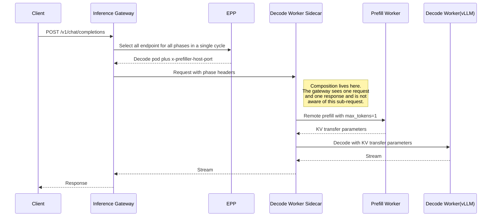
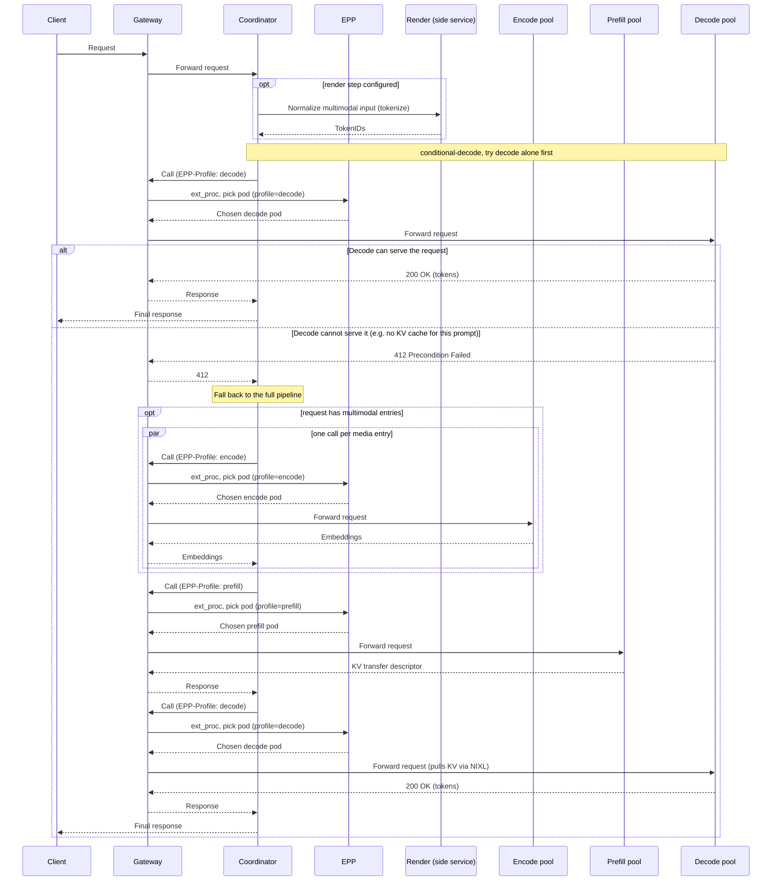
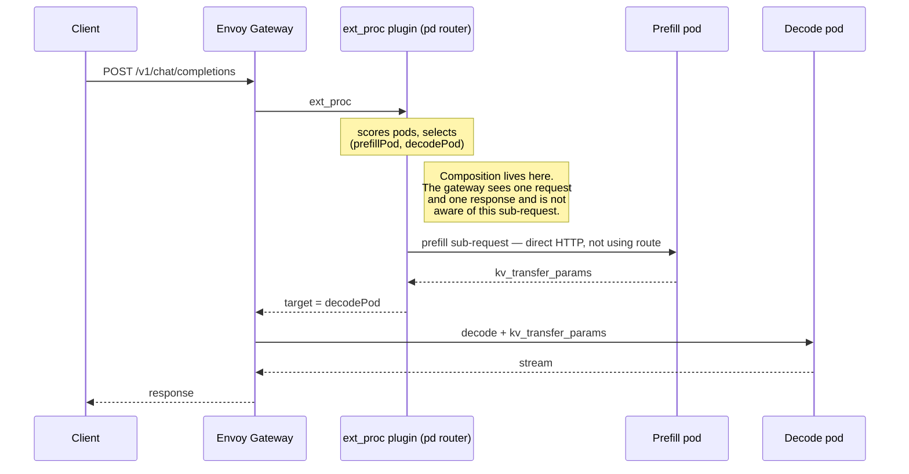
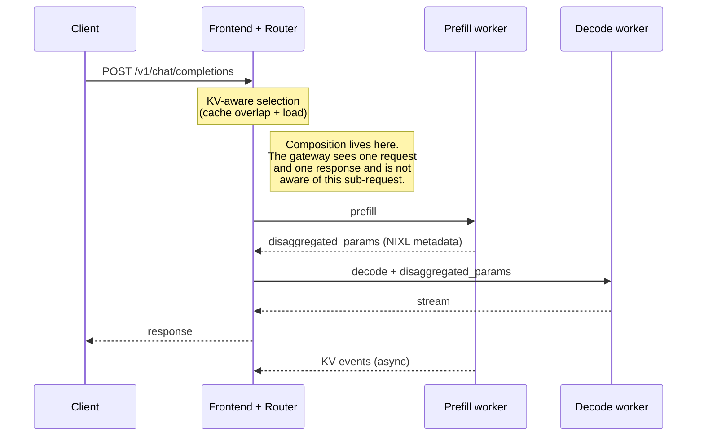
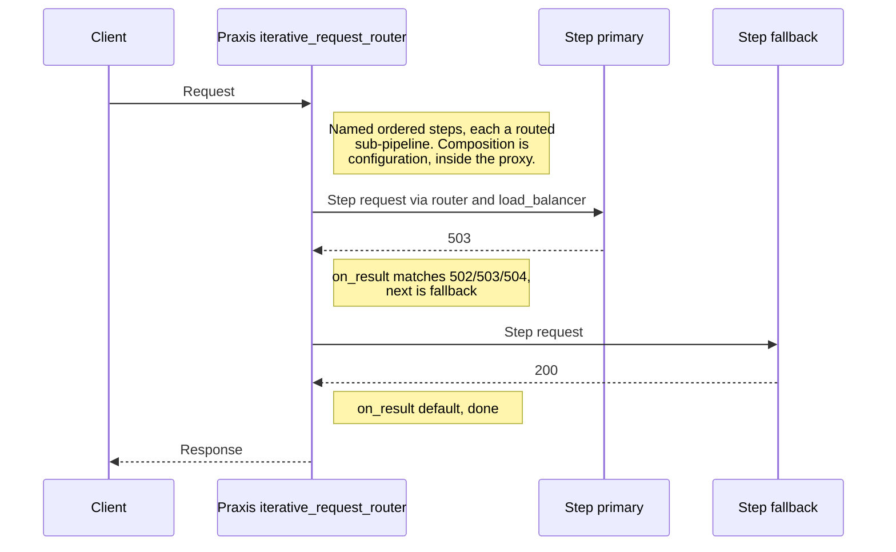
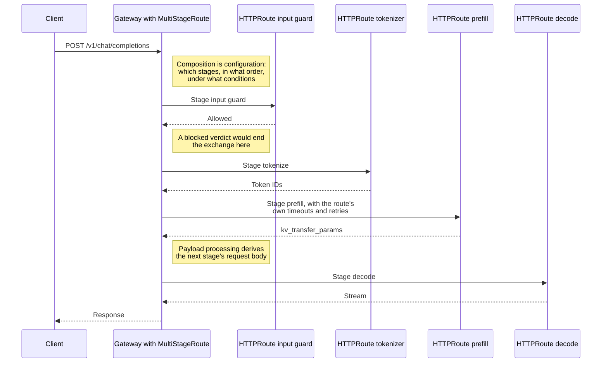

* Issue: [#5250](https://github.com/kubernetes-sigs/gateway-api/issues/5250)
  * Related to [GEP-5091: PayloadProcessor Resource](https://github.com/kubernetes-sigs/gateway-api/issues/5091)
  * Related to [#5194: Filter ordering](https://github.com/kubernetes-sigs/gateway-api/issues/5194)
* Status: Provisional

## TLDR

This GEP was incubated in [WG AI-Gateway](https://github.com/kubernetes-sigs/wg-ai-gateway), and proposes to define standards in Gateway API for expressing a single logical client request that is fulfilled by multiple, ordered backend
interactions, rather than by a single backend interaction. Routing in Kubernetes today assumes that one client request maps to one backend interaction,
and that assumption is deeply embedded in how routes, policies and observability are defined. A growing class of workloads breaks it: what the client
sees as one request is fulfilled by a sequence of distinct backend interactions, each independently routable, and each potentially needing its own
networking configuration.

The organizing idea is a split between **composition** and **interaction**. The composition is which stages exist, in what order they may execute, under
what conditions, and how one stage's input is derived from what came before. The interaction is everything about a single backend exchange: its protocol,
matching, backend, filters, timeouts and retries. Keeping the two apart is what allows multi-stage routing to reuse existing routing semantics per stage
rather than restate them.

This provisional revision is scoped to the *what*, *who* and *why*. It establishes that multi-stage request processing is a gap in the Kubernetes
networking substrate, and that the gap is being filled today by duplicated, non-portable effort in every project that needs it. The concrete API shape is
deliberately left open here, and the option under consideration in this doc is just one possible option; it will be resolved at the Experimental stage.

This GEP consumes the payload-processing work rather than competing with it. It introduces no vocabulary of its own for inspecting or mutating payloads:
deriving one stage's input from an earlier stage's response is expressed with whatever [GEP-5091] lands on, in the phase established by [GEP-5224]. Fan-out
is a motivating use case but is deferred to a follow-up, so that this GEP stays scoped to expressing multiple ordered stages within a single logical
request.

## Motivation

Routing in Kubernetes today assumes that a client request maps to one backend interaction:

```
Client Request → Route → Backend
```

This assumption has served traditional applications well, and it is deeply embedded in how routes, 
policies and observability are defined. A growing class of workloads breaks it. 
For these workloads, what the client sees as one request is fulfilled by a sequence of distinct backend interactions, 
each of which is independently routable and may need its own networking configuration:

* **Inference disaggregation**: a single inference request is served by separate prefill and decode backends, 
  and increasingly by separate encode, prefill and decode backends, each is a distinct pool of endpoints with distinct routing and scaling characteristics, and selecting the right
  endpoint within a pool is itself a load-aware decision made per request. The interactions are also coupled: state established 
  while serving one is consumed by the next.

* **Representation and protocol transformation**: an inference request arrives over HTTP and is first sent to a tokenizer service, 
  after which later interactions operate on a tokens-in/tokens-out representation, potentially over a different protocol like gRPC.

* **Service composition and fan-out**: a single client request requires calls to several independent backends, possibly in parallel, 
  before a response can be constructed. This case is not AI specific, and predates the AI workloads above.

  > **Note**: fan-out is a motivating use case, but it is deliberately deferred to a follow-up proposal so that this one stays scoped to expressing 
  > multiple stages within a single logical request. See [Open Points](#open-points).

Today there are several projects in CNCF landscape that are trying to solve these issues. Taking llm-d as an example, llm-d started 
with having a sidecar in each decode pod to orchestrate a sub-request to prefill pod before running the decode phase, later on it evolved
to having a separate coordinator component which is now used to orchestrate sub-requests. 

Because there is no way to express this in routing configuration, every project builds the capability outside the gateway. 
This has three consequences, and together they are the motivation for this proposal:

**It fragments the ecosystem.** Projects solving the same problem arrive at incompatible architectures. Prefill/decode disaggregation is 
the clearest example: each project (like llm-d, AIBrix or Dynamo) implements it differently, with no shared configuration surface between them. 
A platform team that adopts one of these cannot carry its routing configuration to another, and a gateway implementation cannot support the 
pattern generically because there is nothing generic to support. The pattern is common; only the expression of it is bespoke.

**It duplicates capabilities the gateway already provides.** Once orchestration lives outside the gateway, the sub-requests it issues 
fall outside the gateway's reach — so retries, backoff, timeouts, fail-open/close behavior, connection management and traffic policy 
all have to be reimplemented alongside it, per project. This is a substantial amount of subtle, load-bearing behavior to rebuild, 
and rebuilding it is not the point of any of these projects.

**It leaves operators without a coherent view of a request.** The stages of a logical request are where the interesting behavior 
lives: which backend was slow, which interaction failed, where the request was retried, where it ended. When those interactions are 
invisible to the gateway, they cannot be uniformly observed, and an operator is left correlating them by hand across whatever each 
project happens to expose.

Kubernetes has a strong tradition of standardizing the networking substrate so that workloads do not each solve it again. Multi-stage request 
processing is a gap in that substrate, and it is being filled today by duplicated, non-portable effort.

## Definitions

* **Logical request**: the request as the client issues and perceives it. One logical request, one client-visible response.

* **Stage**: one of the backend interactions that together fulfill a logical request. A stage is independently routable and may carry its 
  own networking configuration.

* **Orchestration**: the per-request decisions taken while a logical request is being fulfilled: which stage runs next, whether a stage is skipped, 
  how the input to a stage is derived from what came before, and whether the exchange should end early. Configuration declares the rules for these 
  decisions; the decisions themselves are made per request, against that request's data.

> **Note**: these definitions are intended to describe the shape of the problem, not to prescribe a mechanism. In particular, "stage" is not meant 
> to imply any existing filter, chain, or extension mechanism in any specific implementation.

## Goals

* Provide a declarative way to express that a logical request is fulfilled by multiple backend interactions, including which stages exist, in what order
  they may execute, and what each targets.

* Allow each stage to carry its own networking configuration, so that stages with different performance and failure characteristics can be configured differently.

* Establish a clear separation between the rules declared in configuration — the boundaries of the workflow, and the conditions under which each stage runs —
  and the evaluation of those rules against an individual request as it is served.

* Reuse existing Kubernetes routing semantics for each stage, so that capabilities such as retries, timeouts and failure behavior do not have to be reimplemented.

* Remain workload agnostic. The abstraction must be usable for service composition and fan-out, and must not require any AI-specific understanding to implement.

* Make the stages of a logical request observable as related parts of one exchange.

## Non-Goals

* **Becoming a workflow engine.** Stages are forward-only and each runs at most once per logical request: no loops, no re-entry, and no branching DAG.
  Configuration declares the boundaries of the composition; the per-request decisions taken within those boundaries may skip a stage or end the exchange
  early, but never go back.

* **Encoding application semantics.** Tokens, KV cache, model state, scheduling algorithms, model placement and model-serving protocols are all out of
  scope. The abstraction must be implementable without understanding any particular workload.

* **Defining a new vocabulary for payloads.** Inspecting, rewriting or rejecting request and response content remains the concern of payload processing
  ([GEP-5091]) and of the phase established by [GEP-5224]. This GEP adds exactly one thing to that expression context — a way to refer to an earlier
  stage, and nothing else.

* **Replacing configuration that belongs in a single route.** If a piece of networking configuration can be expressed in one route, it should stay there.
  Multi-stage routing is not a second way to configure what a route already configures.

* **Replacing endpoint selection.** Choosing which endpoint within a pool serves a given interaction stays where it is today. This GEP is concerned with
  how many interactions a logical request consists of, not with which endpoint serves any one of them.

* **Defining a Gateway-to-orchestrator protocol.** The composition is expressed declaratively in configuration. This GEP does not introduce an external
  component that the gateway consults per request, nor a protocol for communicating with one. External callouts are a separate piece of the
  payload-processing split and are out of scope here.

## User Stories

* As an **application developer** consuming an AI Gateway:

  * I want to send one request and receive one response, without knowing how many backend interactions were required to serve it, so that the serving
    architecture can evolve without changing my client.

* As an **inference platform provider**:

  * I want to express that requests to a model are served by a prefill backend followed by a decode backend, so that I can adopt disaggregated serving
    while reducing the overhead of building networking behavior myself.

  * I want each stage to carry its own routing and networking configuration, so that a prefill interaction and a decode interaction can have different
    timeouts and failure behavior, as they have genuinely different performance characteristics.

  * I want this expressed in a portable way, so that I can change gateway implementation without rewriting how my workload is composed.

* As a **cluster or gateway administrator**:

  * I want to see the backend interactions caused by a logical request, so that I can attribute latency and failures to a specific stage rather than to 
    the request as a whole.

  * I want to apply policy to individual stages, so that an interaction with an external service and an interaction with an in-cluster backend can be
    governed differently within the same logical request.

* As a **Gateway API implementer**:

  * I want a standard way for a workload to describe that its requests span multiple backend interactions, so that I can support these workloads
    generically instead of integrating with each project's bespoke mechanism.

  * I want the boundary between what the routing layer decides and what the workload decides to be explicit, so that I can implement the routing side
    without encoding any workload's semantics.


## Prior Art

Multi-stage request processing is not hypothetical. Four projects implement it today, three of them are distributed inference stacks and one general-purpose proxy,
each with a different architecture and no shared configuration surface between them.
Disaggregated serving is the most visible case, but the same structural problem appears in representation transformation and  guardrail pipelines,
and the difference between those cases is what exposes the gap most clearly.

### llm-d (CNCF Sandbox project)

llm-d has implemented this twice, in this section we walkthrough both implementations.

#### First Try - The sidecar model

Orchestration lived in a sidecar running only on the vLLM decode worker; no coordination logic ran on prefill or encode nodes.
The EPP's `disagg-profile-handler` selected pods for every phase the request needed in a single workers selection cycle: decode always, then encode if multimodal content was detected, then prefill if the P/D decider judged it beneficial — and passed them to the sidecar as request headers.
The gateway forwarded the request to the decode pod and took no further part.



#### Second Try - The coordinator model

The sidecar is removed and orchestration is pulled out to a standalone coordinator in front of the Inference Gateway.
Client traffic enters through the Gateway: an HTTPRoute sends the client-facing inference paths to the coordinator, which then
makes one EPP-mediated call per phase back through the same Gateway, tagging each with an EPP-Profile header.
Each call is single-phase worker selection, so a pod is selected only when that phase's call is made.
Cross-phase state (which is essentially payload processing) lives on the coordinator's code and is very tailored to inference phases.

Two kinds of stage behave differently, and the difference matters. The inference phases are routed through the Gateway, because they need
EPP endpoint selection against an InferencePool. The render (tokenization service) step is called directly by the coordinator — llm-d's own
diagram labels the tokenizer a "side service".

The pipeline also begins with a conditional probe: the coordinator first tries decode alone, and only falls back to the full encode,
prefill and decode sequence when decode answers 412 Precondition Failed. That is the same control flow this proposal expresses
declaratively with onResponse, implemented here as application logic in a project-specific service.



Every inference phase is a real routed request through the Gateway, with an EPP worker selection decision of its own.
The loop that drives them is not, the conditional-decode fallback is not, and the render stage is not.
Eight Gateway round-trips in the worst case, while the order decisions and payload processing lives outside the Gateway entirely.

llm-d is the only one of the three distributed inference projects that attempts to describe its stages in routing configuration,
and it takes two cooperating HTTPRoutes to do it. Abbreviated from the coordinator disaggregation guide:

#### The client-facing paths go to the coordinator.

```yaml
kind: HTTPRoute
metadata: {name: coordinator}
spec:
  parentRefs: [{kind: Gateway, name: llm-d-inference-gateway}]
  rules:
  - matches:
    - {path: {type: Exact, value: /v1/completions}}
    - {path: {type: Exact, value: /v1/chat/completions}}
    - {path: {type: Exact, value: /inference/v1/generate}}
    backendRefs: [{kind: Service, name: llm-d-coordinator, port: 8080}]
    timeouts: {request: 300s}
```

#### The coordinator's own per-phase calls come back in, distinguished only by a header.
```yaml
kind: HTTPRoute
spec:
  rules:
  - backendRefs: [{group: inference.networking.k8s.io, kind: InferencePool, name: <pool>}]
    matches:
    - path: {type: Exact, value: /v1/completions}
      headers: [{type: Exact, name: EPP-Profile, value: encode}]
    - path: {type: Exact, value: /v1/completions}
      headers: [{type: Exact, name: EPP-Profile, value: prefill}]
    - path: {type: Exact, value: /v1/completions}
      headers: [{type: Exact, name: EPP-Profile, value: decode}]
    # ... the same three profiles repeated for each of the other two paths
    - path: {type: PathPrefix, value: /}
    timeouts: {request: 300s}
```

Several limits are visible in this example:

- The stage selector is client-forgeable. A stage can only be expressed as a header match, and a header is whatever the client sends,
  so the composition can be bypassed from outside. This is also an independent witness for the premise of [GEP-5224]: the reason it cannot
  be defended is that filters run after route selection.
- Stage dispatch rides on match-precedence arithmetic. The two routes must tie on path specificity so that the header match breaks the
  tie; as the guide notes, a prefix match "would lose to the Coordinator's exact match even when EPP-Profile is present." The composition
  works because of precedence rules, not because anything declares it.
- Combinatorial match explosion. Three paths times three profiles, plus a catch-all, to say that a request has three stages.
- One timeout for every stage. Each rule carries request: 300s, because there is nowhere to say that a prefill interaction and a
  decode interaction have different budgets.

### AIBrix

AIBrix puts orchestration inside the gateway, as a routing algorithm in its Envoy ext_proc plugin (pd_disaggregation.go, RouterPD = "pd").
Per request it groups pods by roleset, scores both groups and produces a (prefillPod, decodePod) pair, then issues the prefill request itself,
synchronously for vLLM, extracting kv_transfer_params, and for TRT-LLM, extracting disaggregated_params;
asynchronously for SGLang, which performs a bootstrap handshake instead before setting the target to the decode pod.



AIBrix HttpRoute as it looks today:
```yaml
kind: HTTPRoute
metadata: {name: qwen3-8b-router, namespace: aibrix-system}
spec:
  parentRefs: [{kind: Gateway, name: aibrix-eg, namespace: aibrix-system}]
  rules:
  - backendRefs: [{kind: Service, name: qwen3-8b, namespace: brixbench-adhoc, port: 8000}]
    matches:
    - headers: [{name: model, type: Exact, value: qwen3-8b}]
      path: {type: PathPrefix, value: /v1/chat/completions}
    timeouts: {request: 120s}
```

The prefill call is a plain HTTP request made from an extension process. It has no route, no retry policy, no timeout configuration, no
traffic policy and no status, because nothing in the routing layer knows it happened.
The 120s timeout covers the pair as though it were one exchange, and there is no way to give the prefill call a different budget, a different
retry policy, or a status of its own. An operator reading this cluster's routing configuration has no way to learn that disaggregation is happening at all.

### Dynamo

Dynamo uses a bespoke Frontend with an integrated Router. The frontend activates an internal prefill router when it discovers a decode
worker registered as WorkerType.Decode alongside a prefill service in the same namespace with a matching model name and
WorkerType.Prefill. The router selects a prefill worker by KV-aware routing on cache-overlap scores and load, receives NIXL transfer
metadata in disaggregated_params, injects it into the decode request and routes to the decode worker. Failure handling is deliberately
narrow: once dispatched to prefill, a prefill or handoff failure is returned to the client rather than retried through a decode-only path.



An earlier documented design placed the decision in the decode worker instead: based on prefill length and queue depth it chose local
versus remote prefill, pushing a RemotePrefillRequest onto a global PrefillQueue that prefill workers consumed.

Dynamo HttpRoute as it looks today:
```yaml
kind: HTTPRoute
metadata: {name: qwen3-0-6b-agg}
spec:
  parentRefs: [{kind: Gateway, name: inference-gateway}]
  rules:
  - matches:
    - headers: [{name: X-Gateway-Model-Name, type: Exact, value: Qwen/Qwen3-0.6B}]
      path: {type: PathPrefix, value: /}
    backendRefs: [{group: inference.networking.k8s.io, kind: InferencePool, name: qwen3-0-6b-agg-pool, port: 8000}]
    timeouts: {request: 300s}
```

Dyanmo is sharing the same shape and same gaps with AIBrix - one visible request while the networking configuration is completely invisible for the sub-request.

### Beyond disaggregation

Prefill and decode is the loudest example, but not the only one.
The other shapes expose the problem more sharply because they are exposing the broader repeating patterns.

#### Representation transformation
A request arrives as HTTP and JSON and must be tokenized before any inference stage runs, after which later stages operate on a
tokens-in and tokens-out representation, potentially over gRPC.
The tokenizer is an ordinary service: no InferencePool, no KV cache, no load-aware endpoint selection. It is simply a stage that happens first.
This is not an invented use case - it is a common pattern happening today in inference projects (e.g., dynamo is also doing sub-request for tokenization).

#### Guardrails
An input guard inspects the prompt and may end the exchange with a canned response, so that a detected jailbreak attempt never reaches a model,
while an output guard inspects the response before it reaches the client. Both guards are themselves inference calls, to different models,
with latency and failure characteristics quite unlike the main model's. This is a stage before, a stage after, and early termination in between.

Neither is exotic, and neither is AI-specific in structure: one logical request, several ordered backend interactions, with the input of
one derived from the output of the last. The question is whether the existing implementations can express them.

AIBrix cannot. pd is one routing algorithm among many, selected by name, and its stages are "a prefill pod" and "a decode pod",
identified by roleset labels. There is no notion of an arbitrary stage to configure.

Dynamo cannot. Composition activates when the frontend discovers a WorkerType.Prefill service alongside a WorkerType.Decode worker,
so the set of expressible stages is the worker-type enumeration. There is no WorkerType.Guardrail, and adding one is a change to the
frontend rather than to configuration.

llm-d partly can, and the way it manages is the evidence. Its coordinator is a configurable pipeline of reorderable plugin steps, and
it already tokenizes through the render step described above — but that step is a side service called directly, outside the Gateway, and so
it receives no route, no retry policy, no timeout configuration and no status. The stages that the Gateway can see are exactly the ones backed
by an InferencePool. Adding a guardrail stage means writing a Go plugin for llm-d's coordinator, which does nothing for a platform team
running AIBrix or Dynamo.

The specificity is the problem. Each project solved the composition it needed, in the vocabulary of that composition: roleset labels, a
worker-type enumeration, a profile header. None produced a way to say "an input guard, then a tokenizer, then prefill, then decode, then an
output guard", and a platform team that wants exactly that has nowhere to ask for it.

### Praxis

The three projects above are distributed inference systems, and each built request composition because its workload demanded it.
Praxis is a different kind of witness: It is a [CNCF Sandbox project][cncf-sandbox-praxis], general-purpose proxy and gateway, the same category of
software as a Gateway API implementation, the same category of Gateways as the implementations that would have to support this GEP.
Praxis arrived at this Multi-Stage-Routing abstraction independently.

Praxis builds it in three layers.

#### A sub-request primitive
provides request and response types, a client with a bounded execution API, a pooled connector, pull-based streaming bodies, and
typed transport errors: admission timeout, connect, I/O, deadline exceeded, stream idle timeout, circuit open, response too large. 

#### An executor
runs a named filter pipeline against a sub-request, reconstructs a nested filter context, runs the request, request-body, response and
response-body phases, and applies the same forwarding boundary as the normal upstream path — a stage is not a side call, it is a request through the proxy's own machinery.

#### A composition filter
iterative_request_router, holds named steps, each backed by a pre-built sub-pipeline; per request it executes a step's filters, makes the call, executes the step's
response filters, evaluates transition rules, and either continues to another step or returns the response.



Two things distinguish this from the three implementations above.

It is general. A step is an arbitrary filter sub-pipeline, not a role. Nothing in the mechanism knows what prefill is, and nothing
would need to change to express a guardrail, a tokenizer, or a plain service composition — precisely the cases the inference stacks cannot
reach without new code. This is what it looks like when composition is a primitive rather than a special case.

It converged on the same vocabulary this GEP proposes: named ordered steps, per-step routing and networking configuration,
response-driven transitions, and both a whole-exchange deadline and a per-step one. Steps may reference reusable named chains or define
them inline, mixed freely, which is the reference-and-reuse model this proposal argues for, already shipping.

It also answers two questions this proposal lists as open. On streaming, header-safe failover rules run before any bytes are exposed
downstream, while remaining transition rules run after clean EOF and may resume another step inside the same already-committed response;
the end-to-end deadline explicitly covers a streamed final response, not only the step exchanges. On accumulated state, cross-stage
state is bounded by an explicit ceiling. Two differences are instructive: Praxis permits backward re-entrance between steps and therefore
needs both an iteration cap and a reserved depth header to prevent loops, mechanisms this proposal does not need because stages are
forward-only and run at most once; and its transitions match response origin (upstream, local, transport) and transport error kind, a finer
distinction than status alone can express.

And none of it is expressible in Gateway API. Praxis implements Gateway API and configures this in its own YAML, because Gateway API
has no vocabulary for it. That is the gap in one sentence: an implementation has already built the capability, shipped documentation for
it, and still cannot let an operator ask for it portably. The feature is experimental and gated behind an off-by-default build flag, so the
right weight to give it is not a production deployment, but a considered design by maintainers of a Gateway API implementation who had to
answer the same questions this GEP raises.

Takeaway

The same thing is being built four times, in four places. A pod sidecar, an ext_proc plugin, a bespoke frontend process, and a proxy
filter. The handle carried between stages differs per engine — kv_transfer_params for vLLM, disaggregated_params for TRT-LLM, a
bootstrap room for SGLang — which is why this proposal keeps payload shaping in payload processing and stays agnostic to what is carried.

They are converging on the front door, and on the same vocabulary. Dynamo moved the decision out of the decode worker into its
frontend router; llm-d moved it out of the decode pod's sidecar into a coordinator that dispatches every phase through the Inference
Gateway. Praxis independently defined named ordered steps with response-driven transitions. The shape is not in dispute. Only its expression is.

The one general implementation is the one that is not an inference project. The three inference stacks each encoded their use case into
the mechanism, so none extends to a tokenizer, a guardrail, or any composition outside inference without new code. Praxis, a Gateway API
implementation with no inference workload, built the general form. Standardizing this is therefore not a matter of inventing an abstraction
and hoping implementations adopt it: one has already built it, and three more have built use-case-specific approximations because they had
no portable alternative.

This can already be done — and that is precisely the problem. Nothing here required a new primitive. What none of these projects could
do is express the composition in routing configuration, so each reimplemented retries, backoff, timeouts, fail-open/closed behavior and
connection management alongside its own orchestrator, in its own language, with no portability between them and no uniform way for an
operator to observe a logical request as one exchange. A platform team that adopts one cannot carry its configuration to another. The
pattern is common; only the expression of it is bespoke.

What this proposal is aiming at



No component beside the Gateway, no sub-request nor payload processing outside its reach, and every stage an ordinary route that could be used on its own.


## API

**TODO**: Concrete definitions will be added once there is consensus on the previous sections. 
The following section is written here for completeness with the purpose of helping the understanding of how a solution could look like, including the guiding principles.
As this is a provisional GEP, it's not intended to reach to a consensus on the final API, but just to serve as an example.
The text below should be updated with concrete details as we move to Experimental stage.

The following principles are followed:

- A network configuration that can be in a single route should stay there. Multi stage route shouldn't be a replacement or another way to configure the same thing.
- Payload processing should remain the single way to process request/response payloads, whether it's headers or body.
- Multi stage routing should reference route(s) per stage and reuse payload processor in between stages to emphasize how a request/response is processed between stages, 
e.g., how response of previous stage is used to build the request for the next stage.

### Mental Model

This proposal adds as little as it can, and reuses the existing building blocks of Gateway API, including the payload processing GEP ([GEP-5091]).

The split it draws is this: **`MultiStageRoute` owns the composition, and each referenced route owns the interaction.** Composition means the orchestration of different interactions: which stages exist, in what order, under what conditions, and how one stage's input is derived from what came before. The
interaction is everything about a single backend exchange: its protocol, matching, backend, filters, timeouts and retries.

Every placement decision below follows from that split, and there is a single test for where a piece of configuration belongs:

> Would this still make sense if this stage ran on its own, as a standalone route?

A timeout would, so it belongs on the route. Setting `max_tokens: 1` on a prefill call would, so it belongs on the route.  
A body field derived from a previous stage's response would not, so it belongs on the stage.

### MultiStageRoute is a Route

It attaches to a Gateway through `parentRefs` and selects traffic with `matches`, like [HTTPRoute] and [GRPCRoute]. It differs only in being fulfilled by an
ordered list of stages rather than by a `backendRef`. A Gateway listener opts in to it through `allowedRoutes.kinds`, exactly as it opts in to any other route kind.

### Stages reference routes; routes do not attach to stages

A stage references the route that fulfills it. The referenced route is unmodified and unaware that it takes part in a composition. Three reasons:

**It avoids duplicating the route schema.** If a stage declared its own backend, matching, filters and networking configuration inline, `MultiStageRoute` would
have to restate most of a route, and restate it again for every protocol it wanted to support. Referencing gives each stage exactly the schema of the route
kind it names, and picks up future additions to those kinds for free.

**Route kinds are not identical.** [HTTPRoute] rules carry `timeouts` and `retry`; [GRPCRoute] rules carry neither. An inline stage schema would have to choose one shape, 
and would then either promise capabilities a given protocol does not have or grow its own parallel versions of them. Referencing sidesteps the question: a stage has 
exactly the capabilities its route kind has, and gains them when that kind does.

**Composition is not the route author's concern.** A route should not have to declare that it is stage three of some pipeline. Keeping the reference in the
composition lets one route be used standalone, or by several different `MultiStageRoute` objects, without modification.

Cross-namespace references follow the existing rules for references made from a route ([GEP-709], [ReferenceGrant]).

A route used as a stage doesn't necessarily need to be attached to a Gateway; whether it's additionally reachable on its own follows the normal route-attachment rules, including [GEP-3793].

### Relationship to Payload Processing (reuse, not redefine)

`MultiStageRoute` introduces no vocabulary of its own for inspecting or mutating payloads. It reuses whatever [GEP-5091] lands on, and adds exactly one thing to
the expression context: a binding that lets an expression refer to an earlier stage, written here as `stage(<name>)`.

Stage-level payload processors are the same ones a route uses. They sit on the stage rather than on the route precisely because they reference other stages, which is
composition knowledge.

The following sections assume filters as the mechanism for implementing `Payload Processor` GEP. If that GEP lands on a different implementation, the yaml examples would be updated accordingly.   

[GEP-5091] introduces an ordered list of processing steps that read and mutate a request. Its current
scope is in-process evaluation of CEL expressions in the data plane; external processing is deferred to a follow-up GEP. The shape of the resource is still
under discussion, with maintainers leaning toward expressing it as filters rather than as an attached policy.

The two are complementary, and the division of responsibility is straightforward:

* **This proposal** defines which stages a logical request consists of, the order in which they may execute, and the networking configuration of each.

* **Payload processing** defines what happens to request and response content, including between stages. Whether a payload processor runs inline or as an external
  processor is a payload processing concern, and this proposal does not restate it.

Multi-stage routing doesn't introduce a mechanism of its own for inspecting, rewriting or rejecting payloads. Gateway API should have a single
declarative vocabulary for that, and it is payload processing's.

Composing the two needs work on both sides. [GEP-5091] predates this proposal, so it has no notion of a stage boundary to attach processing to. Its expression
context is also request-only: it exposes the request body, headers, method and path, with no way to refer to a response at all, let alone to the response of an
earlier stage - which is exactly what deriving one stage's input from a previous one requires. Both look like natural extensions rather than conflicts, and should
be worked out together with the payload processing authors.

### What a stage declares

| Field | Purpose |
|---|---|
| `name` | Identifies the stage, for `stage()` references and for status. |
| `routeRefs` | The route(s), and optionally the named rule that fulfills this stage. Route is referenced by group/kind/namespace/name/sectionName, with defaults similar to `ParentReference`, notably `namespace`, which defaults to the local namespace when omitted. |
| `when` | Condition under which the stage runs. Omitted means always. |
| `filters` | Payload processing applied when building this stage's request, typically deriving fields from earlier stages. |
| `onResponse` | What this stage's outcome means for the rest of the logical request. |

### Option Under Consideration

This section assumes [GEP-5091] lands on expressing payload processing as filters in Gateway API, and reuses that shape. Two filters are used below:
- **RequestHeaderModifier** — the existing filter, extended with a `valueFrom` option so a header can be set from a value in the body. `valueFrom` is a
  distinct field from `value` so an implementation can tell statically whether it needs to buffer the body, and so the two can carry different support levels.
- **RequestBodyModifier** — a new filter with the same look and feel as `RequestHeaderModifier`, setting body fields rather than headers.

Field addressing is written as a [JSON Pointer] (`/max_tokens`), which identifies exactly one location and therefore matches what these filters do.
Where a value is *read* out of a document, it is a query, and JSONPath is used for that. The final choice belongs to [GEP-5091], and this proposal
follows whatever it lands on.

If payload processing lands on a different shape, the schema below can be updated accordingly. Nothing in the mental model depends on which shape it takes.

A new CRD may be added to declare multi-stage routing as follows:

```yaml
apiVersion: gateway.networking.k8s.io/v1alpha1
kind: MultiStageRoute
metadata: {name: pd, namespace: ai-gateway-ns}
spec:
  parentRefs: [{name: ai-gateway}]
  matches:
  - path: {type: PathPrefix, value: /v1/chat/completions}

  timeouts:
    request: 300s ## whole logical request timeout, timeout per stage is within the referenced routes.

  stages:
  - name: render
    routeRefs: [{kind: HTTPRoute, name: tokenizer, sectionName: render}]

  - name: decode-probe
    routeRefs: [{kind: HTTPRoute, name: decode, sectionName: probe}]
    filters: ## this is an example of how a payload processor between stages could look like.
    - type: RequestBodyModifier
      requestBodyModifier:
        set:
        - name: /token_ids
          valueFrom: extractFromJSON(stage("render").response.body, "$.token_ids")
    onResponse: ## conditional completion example
    - {match: {status: 200}, action: Complete}
    - {match: {status: 412}, action: Continue}

  - name: prefill
    routeRefs: [{kind: HTTPRoute, name: prefill, sectionName: generate}]
    filters:
    - type: RequestBodyModifier
      requestBodyModifier:
        set:
        - name: /token_ids
          valueFrom: extractFromJSON(stage("render").response.body, "$.token_ids")

  - name: decode
    routeRefs: [{kind: HTTPRoute, name: decode, sectionName: full}]
    filters:
    - type: RequestBodyModifier
      requestBodyModifier:
        set:
        - name: /token_ids
          valueFrom: extractFromJSON(stage("render").response.body, "$.token_ids")
        - name: /kv_transfer_params
          valueFrom: extractFromJSON(stage("prefill").response.body, "$.kv_transfer_params")
```

The routes stay exactly as they were: standalone, owning only their own interaction. The prefill route shows the split most clearly — it sets
`max_tokens` to `1` because that is what makes an exchange a prefill, and it would set it whether or not it were part of a pipeline. The `token_ids`
on the stage above, by contrast, only mean anything relative to the `render` stage.

```yaml
kind: HTTPRoute
metadata: {name: prefill, namespace: ai-gateway-ns}
spec:
  rules:
  - name: generate
    filters:
    - type: RequestHeaderModifier
      requestHeaderModifier:
        set: [{name: EPP-Profile, value: prefill}]
    - type: RequestBodyModifier
      requestBodyModifier:
        set:
        - name: /max_tokens
          value: '1'
    backendRefs: [{group: inference.networking.k8s.io, kind: InferencePool, name: vllm, port: 8000}]
    timeouts: {request: 60s}
```

The decode route carries two named rules, referenced by the `decode-probe` and `decode` stages through `sectionName`. They differ only in the `Prefer`
header and in how long they are allowed to take, which is exactly the kind of difference a route is there to express:

```yaml
kind: HTTPRoute
metadata: {name: decode, namespace: ai-gateway-ns}
spec:
  rules:
  - name: probe
    filters:
    - type: RequestHeaderModifier
      requestHeaderModifier:
        set:
        - {name: Prefer, value: if-available}
        - {name: EPP-Profile, value: decode}
    backendRefs: [{group: inference.networking.k8s.io, kind: InferencePool, name: vllm, port: 8000}]
    timeouts: {request: 5s}
  - name: full
    filters:
    - type: RequestHeaderModifier
      requestHeaderModifier:
        set: [{name: EPP-Profile, value: decode}]
    backendRefs: [{group: inference.networking.k8s.io, kind: InferencePool, name: vllm, port: 8000}]
    timeouts: {request: 60s}
```

`onResponse` on the `decode-probe` stage above expresses the one piece of control flow this example needs. The probe asks a decode backend to serve the
request only if it can do so immediately; `Complete` ends the logical request and returns that response to the client, and `Continue` moves on to the
next stage. Both actions are decided per request, from that request's actual response status.

## Open Points

**Fan-out is deferred to a follow-up proposal.** It is listed above as a motivating use case, but this proposal covers stages that execute at most once
per logical request. A follow-up would add the fan-out configuration itself, an accessor for the resulting collection of responses, aggregation across
them, a per-branch failure policy, and per-branch status.

**Filter ordering.** Stage-level filters must be applied in the order they are listed: a filter that derives a body field from an earlier stage and a
filter that sets a routing header are not commutative. Gateway API currently states that implementations SHOULD apply filters in listed order, not
MUST. This is being discussed in [gateway-api#5194], which this proposal depends on. That issue also asks how filters at different levels are ordered
relative to each other; stage-level filters add a level to that question.

**Streaming.** A single whole-request timeout is blunt when the last stage streams its response to the client, and there is no portable way today to
express a budget that covers the earlier stages but not the stream. This is the same gap [GEP-1742] and the draft GRPCRoute timeout work both leave
open, and it should be resolved with them rather than separately here.

## References

* [GEP-5091: PayloadProcessor Resource](https://github.com/kubernetes-sigs/gateway-api/issues/5091) — the Gateway API GEP incubated from the Payload Processing proposal.
* [Gateway API Inference Extension](https://github.com/kubernetes-sigs/gateway-api-inference-extension) — establishes inference-aware endpoint
  selection for a single backend pool.
* [gateway-api#5194: Filter ordering](https://github.com/kubernetes-sigs/gateway-api/issues/5194) — whether listed filter order is a guarantee.
  Stage-level filters depend on it.

[GEP-5091]:https://github.com/kubernetes-sigs/gateway-api/issues/5091
[GEP-5224]:https://github.com/kubernetes-sigs/gateway-api/issues/5224
[HTTPRoute]:https://gateway-api.sigs.k8s.io/reference/api-types/httproute/
[GRPCRoute]:https://gateway-api.sigs.k8s.io/reference/api-types/grpcroute/
[ReferenceGrant]:https://gateway-api.sigs.k8s.io/reference/api-types/referencegrant/
[GEP-709]:https://gateway-api.sigs.k8s.io/geps/gep-709/
[GEP-1742]:https://gateway-api.sigs.k8s.io/geps/gep-1742/
[GEP-3793]:https://gateway-api.sigs.k8s.io/geps/gep-3793/
[gateway-api#5194]:https://github.com/kubernetes-sigs/gateway-api/issues/5194
[JSON Pointer]:https://www.rfc-editor.org/rfc/rfc6901
[cncf-sandbox-praxis]: https://github.com/cncf/sandbox/issues/506
