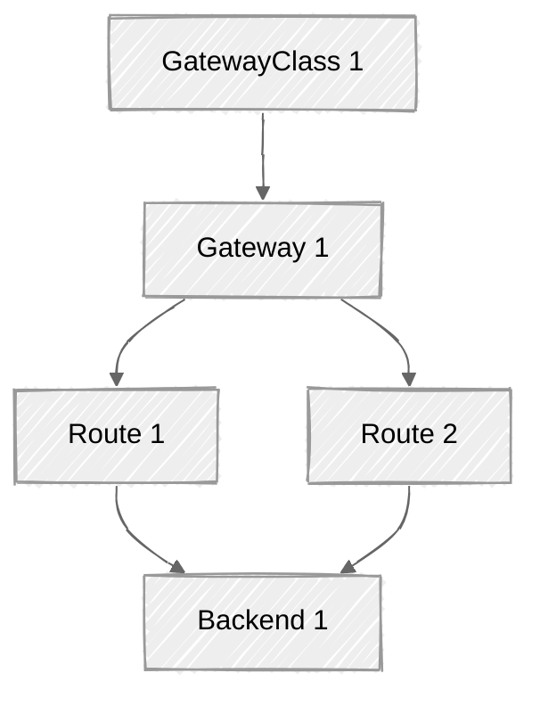
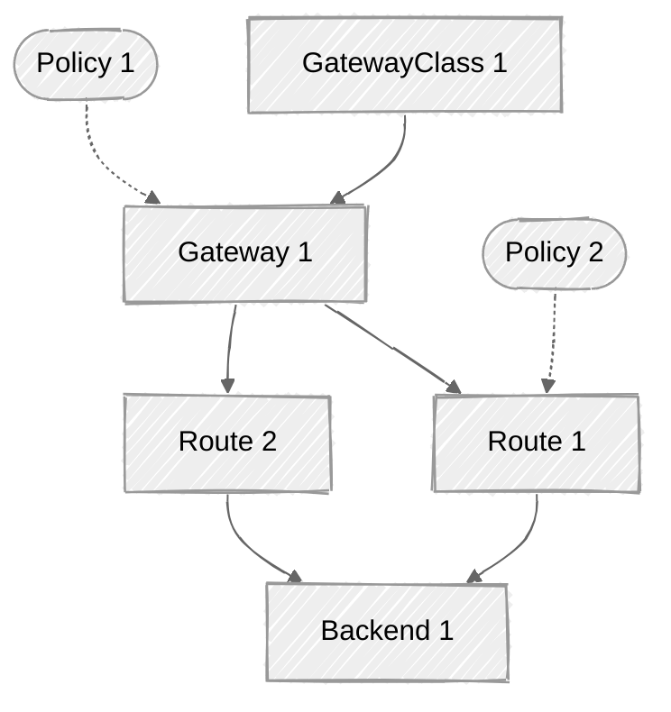
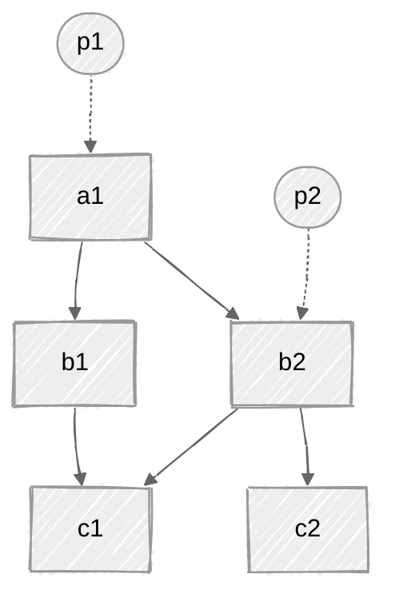
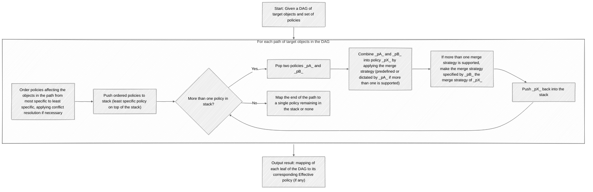
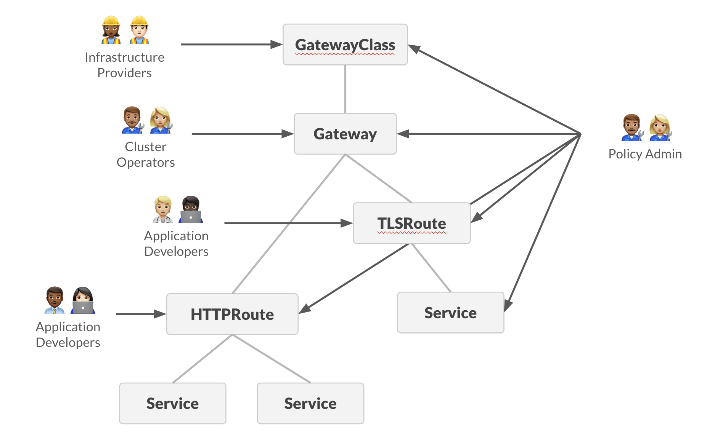
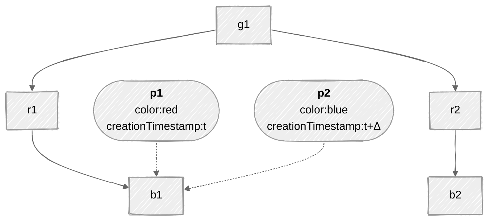
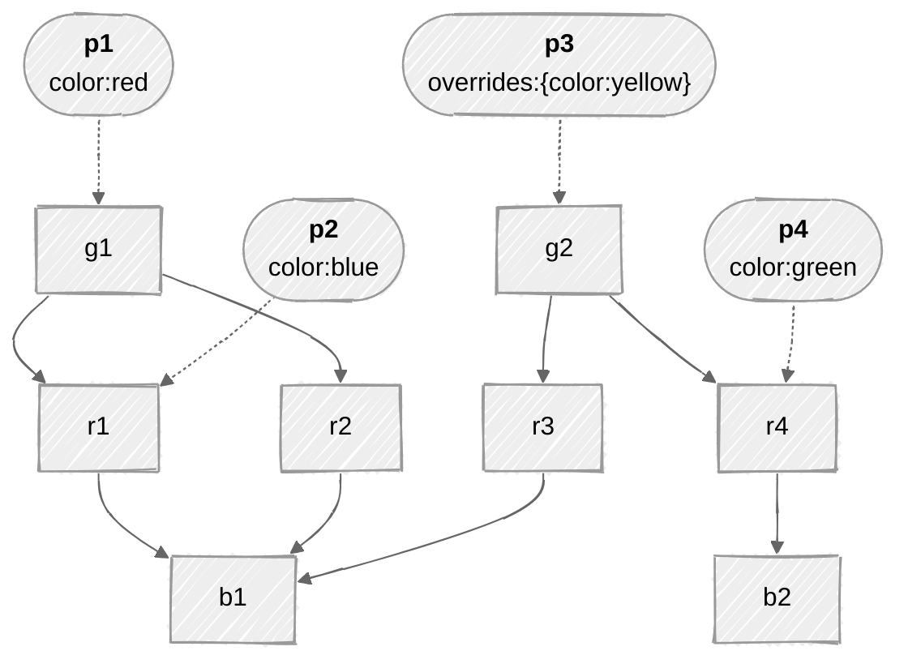
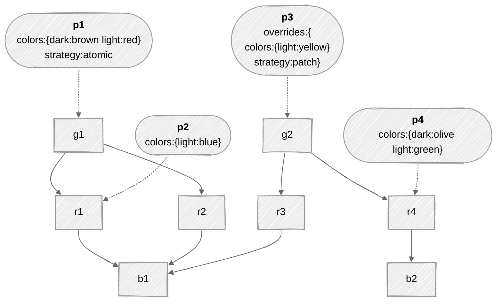

# GEP-713: Metaresources and Policy Attachment

* Issue: [#713](https://github.com/kubernetes-sigs/gateway-api/issues/713)
* Status: Memorandum

(See status definitions [here](/geps/overview/#gep-states))

## TL;DR

This GEP aims to standardize terminology and processes around "metaresources", i.e., using one Kubernetes object to modify the functions of one or more other objects.

It lays out guidelines for Gateway API implementations and other stakeholders for the design and/or handling of custom resources in compliance with a pattern known as Policy Attachment.

This GEP specifies a _pattern_, not an API field or new object. It defines some terms, including _Metaresource_, _Policies_ and _Policy Attachment_, and their related concepts.

This pattern is currently unique to the Gateway API community. It's possible that, in the future, a better and broader form of extending Kubernetes APIs will emerge that could make this one obsolete.

Policy attachment is the best way we've found to extend Gateway API resources so far, but it does come with meaningful challenges, such as the [Discoverability problem](#policy-discoverability) and the [Fanout status update problem](#fanout-status-update-problems).

In many cases, it will be better to work to include configuration directly inside upstream APIs instead of resorting to policy attachment.

Some of the features of Metaresources and Policy Attachment are **Standard** features of Gateway API, while others are **Experimental** or even **Provisional**, still lacking wider adoption by the implementations. Features supported by the [BackendTLSPolicy (GEP-1897)](../gep-1897/index.md) kind are examples of Standard features.

While this GEP tries to focus on features that are at least Experimental, it also lays out some Provisional features and features that are merely examples of known practices adopted by some individual Policy implementations. The latter are still provided as reference though despite some of these features never being expected to become core in Gateway API, due to one of the inherent natures of Metaresources and Policies of being a framework for introducing gateway capabilities that are implementation-specific. These examples are still useful to the overall community though, which can draw analogies for their own particular cases and designs.

## Overview

### Background

When designing Gateway API, a recurring challenge became apparent. There was often a need to change or augment the behavior of objects without modifying their specs.

There are several cases where this happens, such as:

- when changing the spec of the object to hold the new piece of information is not possible (e.g., `ReferenceGrant`, from [GEP-709](../gep-709/index.md), when affecting Secrets and Services);
- when the new specification applies at different scopes (different object kinds), making it more maintainable if the declaration is extracted to a separate object, rather than adding new fields representing the same functionality across multiple objects;
- when the augmented behavior is intended to [span across relationships of an object](#spanning-behavior-across-relationships-of-a-target) other than the object that is directly referred in the declaration;
- when the augmented behavior is subject to different RBAC rules than the object it refers to;
- to circumvent having to enforce hard changes to established implementations.

To put this another way, sometimes we need ways to be able to affect how an object is interpreted in the API, without representing the description of those effects inside the spec of the object. This document describes the ways to design objects to meet use cases like these.

This document introduces the concept of a "metaresource", a term used to describe the class of objects that _only_ augment the behavior of another Kubernetes object, regardless of what they are targeting.

"Meta" here is used in its Greek sense of "more comprehensive" or "transcending", and "resource" rather than "object" because "metaresource" is more pronounceable than "meta object".

Moreover, this document defines a particular class of metaresource, called "policies". Policy kinds have a well-defined structure and behavior, both specified in this GEP.

From policies emerges the concept of Policy Attachment, which consists of augmenting the behavior of other Kubernetes resources by attaching policies to them.

After multiple iterations of Gateway API experimenting with policies—whether through common kinds of policies like `BackendTLSPolicy` and `XBackendTrafficPolicy`, or various implementation-specific ones (see [Current use of policies](#current-use-of-policies))—and after rounds of discussion (such as [kubernetes-sigs/gateway-api/discussions#2927](https://github.com/kubernetes-sigs/gateway-api/discussions/2927)), the pattern has evolved into its current form.

### User stories

- [Ana](../../concepts/roles-and-personas.md#ana) or [Chihiro](../../concepts/roles-and-personas.md#Chihiro) would like to specify some new behavior for a standard Kubernetes resource, but that resource doesn't have a way to specify the behavior and neither Ana nor Chihiro can modify it.
  E.g., Ana may want to add a rate limit to a Kubernetes Service. The Service object itself doesn't have a field for rate limiting, and Ana can't modify the Service object's definition.

- A Gateway API implementer would like to define some implementation-specific behaviors for Gateway API objects that are already standard.
  E.g., an implementer might want to provide a way for Chihiro to plug in a WebAssembly module to a particular Gateway listener, including all the configuration required by the module. Support for WebAssembly modules is a feature of this implementation specifically and the Gateway listener spec does not contain fields to declare WebAssembly configuration.

- Chihiro would like a way to allow Ana to specify certain behaviors, but not others, in a very fine-grained way.
  E.g., Chihiro might want to allow Ana to specify rate limits for a Service, but not to specify the Service's ports.

- A Gateway API implementer would like to define a way to specify a behavior that applies to a whole hierarchy of objects.
  E.g., an implementer might want to define a way to specify a behavior that applies to all HTTPRoutes that are attached to a Gateway.

- A Gateway API implementer would like to define a way to specify a behavior that applies to multiple kinds of objects with a single declaration.
  E.g., an implementer might want to define a way to specify a behavior that applies to selected HTTPRoutes and selected TCPRoutes. Even though the HTTPRoute object could otherwise be extended via an implementation-specific filter, the TCPRoute object cannot.

- A third-party provider would like to offer a way to independently extend the behavior of Gateways controlled by one or more Gateway API implementers.
  E.g., a provider that knows how to configure Gateways controlled by one or more Gateway API implementers might want to define a way for Gateway API users to activate this feature in a standard way across the supported implementations, without direct involvement of the implementers.

All [risks and caveats](#tldr) considered, these are in general a few reasons for using metaresources and policies over another (possibly more direct) way to modify the spec ("augment the behavior") of an object:

* Extending otherwise stable APIs－e.g. to specify additional network settings for the Kubernetes Service object.
* Defining implementation-specific functionalities for otherwise common APIs－e.g. to specify implementation-specific behavior for Gateway API HTTPRoute objects.
* Decoupling concerns for targeting personas with specific functionality and configuration－delegation of responsibilities, fine-grained RBAC, etc.
* Decoupling responsibility over the management and implementation of the metaresources themselves.
* Avoid alternatives based on annotations which are often non-standardized, poorly documented, and generally hard to maintain, in favor of proper, expressive APIs (self-documenting intents) instead.

### Goals

* Establish a pattern which will be used for any Policy resources included in the Gateway API spec.
* Establish a pattern that should be adopted for any implementation-specific Policy resources used with Gateway API resources.
* Discuss the problems with communicating status for metaresource and policy objects, and suggest mechanisms that APIs can use to mitigate some of them.
* Provide a way to distinguish between required and default values for all policy API implementations.
* Enable Policy Attachment at all relevant scopes in Gateway API, including Gateways, Routes, Backends, along with how values should flow across a hierarchy if necessary.
* Ensure the Policy Attachment specification is generic and forward thinking enough that it could be easily adapted to other grouping mechanisms like Namespaces in the future.
* Provide a means of attachment that works for both ingress and mesh implementations of Gateway API.
* Provide a consistent specification that will ensure familiarity between both API-defined and implementation-specific Policy resources so they can both be interpreted the same way.
* Provide a reference pattern to other implementations of metaresource and policy APIs outside of Gateway API, that are based on similar concepts (i.e., augmenting the behavior of other Kubernetes objects, attachment points, nested contexts and inheritance, Defaults & Overrides, etc.)
* Facilitate the development of tooling that help circumvent known challenges of Policy Attachment such as the [Discoverability problem](#policy-discoverability) without requiring any predefined understanding or awareness of the implementation-specific policies.

### Out of scope

* Define all potential metaresource and/or policy kinds that may be attached to resources.

## Concepts

#### Metaresource

A resource that augments the behavior of another resource without modifying the definition of the augmented resource. Metaresources typically specify a _target_ and an _intent_:

- The _target_ of a metaresource is the resource or resources whose behavior the metaresource intends to augment.
- The _intent_ of a metaresource is what augmentation the metaresource will apply.

#### Policy

An instance of a subclass of metaresources ("policies") whose intent is to specify _rules that control the behavior_ of the target resources.

Policies are Custom Resource Definitions (CRDs) that MUST comply with a particular [structure](#policy-structure). This structure includes standardized fields for specifying the target(s), policy-specific fields to describe the intended augmentation, and standardized status fields to communicate whether or not the augmentation is happening.

Policy kinds are typically named _xPolicy_, such as `BackendTLSPolicy` (a policy kind implemented by Gateway API to augment Backends with TLS configuration.)

#### Policy Attachment

The application of policies, implemented by a controller, to augment the behavior of other Kubernetes objects.

#### Policy scope

A resource (or resource section) that belongs to a hierarchy whose root is targeted by a policy, within the range of effect of the policy kind across levels of the hierarchy. Also known as _effective target_ of a policy (as opposed to the _declared target_ of the policy). It is not the same as the target of the policy.

#### Merge strategy

A function that receives two policy specs and returns a new spec, i.e., `𝑓(spec, spec) → spec`.

Merge strategies are often invoked to resolve conflicts and thus compute an _effective policy_ to enforce at particular scope.

This GEP defines the following basic merge strategies:

* **Defaults:** (Standard) a policy spec that challenges an accepted and established another as the one to specify the behavior to augment a particular scope with _wins_ over the accepted and established other.
* **Overrides:** (Experimental) a policy spec that is accepted and established and is challenged by another as the one to specify the behavior to augment a particular scope with _wins_ over the challenger other.

Implementations MAY derive variations of the basic merge strategies with different levels of _granularity_ other than the full policy spec treated as an atomic unit. For example, instead of (or additionally to) a challenger policy spec fully winning over an established one (_Atomic defaults_), an implementation MAY support merging the two policy specs together by applying [JSON Merge Patch (RFC 7386)](https://datatracker.ietf.org/doc/html/rfc7386) strategy.

These other merge strategies, such as **None** and **Custom** are further described in section _Implementation guide_ > [Designing a merge strategy](#designing-a-merge-strategy).

#### Effective policy

A combinatorial spec computed from a set of policies that affect a same policy scope, by orderly invoking defined merge strategies to resolve the conflict.

See _Implementation guide_ > [Understanding Effective policies](#understanding-effective-policies) for details.

#### Classes of policies

While the notion of classes of policy kinds was more central in previous iterations of this GEP (see [GEP-2648](../gep-2648/index.md) and [GEP-2649](../gep-2649/index.md)), it here serves primarily as a communicative and organizational aid. The classification reflects patterns that emerge from the properties and behaviors described in sections of this GEP, but it does not impose any prescriptive or normative requirements on the implementations. These classes—namely _Direct_ and _Inherited_—remain in the specification to support clarity and shared understanding, especially for implementations and users familiar with earlier versions.

<table>
  <thead>
    <tr>
      <th>Direct</th>
      <th>Inherited</th>
    </tr>
  </thead>
  <tbody>
    <tr>
      <td>
        <ul>
          <li>A single kind supported in <code>spec.targetRefs.kind</code></li>
          <li>Effects of the policies do not <a href="#spanning-behavior-across-relationships-of-a-target">span across the hierarchy</a>, i.e. the <i>Declared target kind</i> is equal to the <i>Effective target kind</i></li>
          <li><b>None</b> is the only merge strategy supported</li>
          <li>If supported, could typically be implemented by directly extending the API of the target kind with the fields otherwise defined at the policy (e.g. Gateway API xRoute filter)</li>
        </ul>
      </td>
      <td>
        <ul>
          <li>Superset of <i>Direct</i></li>
          <li>Any policy kind that do not comply with at least one characteristic of the Direct class of policies</li>
        </ul>
      </td>
    </tr>
  </tbody>
</table>

## Implementation guide

As defined above, a metaresource is a resource whose purpose is to augment the behavior of some other resource. At its most basic level, the metaresource pattern consists of:

- A user defines a metaresource describing both the target resource(s) they want to augment, and the intent of the augmentation.
- The controller(s) implementing the metaresource notices the metaresource and applies the intent to the target resource(s).
- The controller(s) implementing the metaresource reports the status of the metaresource, indicating whether or not the intent is being applied.

In the real world, of course, things can be much more complex. There may be multiple conflicting metaresources, or the user might attempt to apply a metaresource that they aren't allowed to, or there may be errors in the metaresources. The controller(s) implementing the metaresources MUST be able to handle all of these cases, and MUST communicate status correctly in all situations.

This section describes concepts and aspects for implementing metaresource and policy objects.

### Responsibility

Metaresources and policies are typically implemented and managed by a custom controller. This controller can be the same controller that is responsible for managing the objects that are targeted by the metaresources or another controller specifically responsible for the aspect of the object that the metaresource augments or modifies. For policy kinds of metaresources, this controller is often referred to as the "policy controller".

Ultimately, it is the responsibility of the controller to provide enough information to resource owners that help circumvent or mitigate the discoverability problem (described in the next section). This typically involves populating the status stanza of the target objects, although may as well resort to additional tools (e.g. CRDs, CLI tools) that help visualize the hierarchical topology of target objects and policies, effective policies, etc.

### Policy structure

since this GEP defines a pattern rather than an API field or resource, it is not possible to enumerate all possible metaresource and/or policy kinds in this GEP. This means that policies MUST follow a well-known structure so that Gateway API users and implementations can work with them in a consistent way, and this GEP focuses on that well-known structure.

A typical Policy resource contains:

- Kubernetes metadata elements: `apiVersion`, `kind`, and `metadata`;
- a `spec` stanza, where the targets and other fields ("spec proper") of the policy are declared;
- a `status` stanza.

A particular Policy resource might look like the following:

```yaml
apiVersion: policies.example.com/v1
kind: ColorPolicy
metadata:
  name: my-color-policy
spec:
  targetRefs: ## target objects whose behaviour to augment
  - group: gateway.networking.k8s.io/v1
    kind: Gateway
    name: my-gateway
  color: blue ## the "spec proper", i.e., one or more fields that specify the intent – e.g. to color the traffic flowing through the my-gateway Gateway blue
status:
  conditions:
  - type: Accepted
    status: "True"
    reason: Accepted
    message: Policy has been accepted
  - type: Programmed
    status: "False"
    reason: Reconciling
    message: Policy is being reconciled
```

_(This is a hypothetical example: no ColorPolicy resource is defined in Gateway API.)_

- Every policy MUST include a [`targetRefs`](#the-targetrefs-stanza) stanza specifying which resource(s) the policy intends to augment.
- Every policy MUST include one or more implementation-specific fields specifying how the policy will augment the behavior of the target resource(s). This is informally referred to as the "spec proper."
- A policy MAY include additional fields specifying a so-called [_merge strategy_](#designing-a-merge-strategy), i.e., how the policy should be combined with other policies that affect the same target resource(s). This typically include directives for dealing with conflicting and/or missing specs.
- A policy MUST include a [`status`](#the-status-stanza-of-policy-objects) stanza.

### Scoping the intent

The targets of a policy must be interpreted within a given semantics that is proper to the policy kind. Sometimes the declared targets directly define the scope of application of the policy and no other. Inversely, a policy kind may use the targets as indirections to the actual scope of application of its policy objects.

The _scope_ of a policy is the most granular unit perceived by users/owners of target resources, which an implementation either requires to build configuration for, for conditionally enforcing the policy, and/or chooses to adopt for reasoning about the status of the policy. It is a resource (or resource section) that belongs to a hierarchy whose root is targeted by a policy, within the range of effect of the policy kind across levels of this hierarchy.

Users do not specify _scopes_ in the policy objects; they declare an intent in association to a _target_ (or list of targets). Therefore, implementations MUST calculate the scope (multiple scopes) of effect of a policy for each declared target, given a _hierarchy of nested contexts_. In its simplest form, there is one scope for each target.

#### Spanning behavior across relationships of a target

Typically, the relationships between direct and indirect target kinds are organized in a _hierarchy of nested contexts_.

An example of such is a policy that targets a Namespace. Depending on the design of the policy kind, the policy object may declare intent to affect the behavior of the namespace itself (for what concerns the implementation of Namespaces in Kubernetes) or alternatively it can act as a means to affect the behavior of other objects that exist in the referred namespace (e.g. ConfigMaps). While in the former case, the (direct) target object is the Namespace itself, in the latter the (indirect) target is a set of objects of a different kind (e.g. ConfigMaps.)

Another example of this semantic difference in the context of Gateway API objects is a policy that targets the `Gateway` kind, which can be:

* a way to augment the behavior of the `Gateway` object itself (e.g. reconcile cloud infrastructure provider settings from the spec declared by the `Gateway` according to the rules specified by the policy attached to the `Gateway`), or
* a means to augment the behavior of all `HTTPRoute` objects attached to the `Gateway` (in a way that every new `HTTPRoute` that gets created or modified so it enters the context of the `Gateway` is automatically put in the scope of the policy.)

Objects may participate in multiple hierarchies, including other hierarchies not targeted by a policy. This means an object may be partially _in the scope_ of a policy and partially _outside of the scope_ of the policy. For example, for a policy kind that _targets_ a Gateway resource ultimately with _intent_ to augment the behavior of xRoute rules, any individual route rule under the targeted gateway object is in the scope of the policy. Inversely, any route rule and route object not linked to the targeted gateway are outside of the scope of the policy. Similarly, this same set of routes and route rules, that are _in the scope of the policy_ when activated within the context of the target gateway, if a route has a second gateway as parent which is not targeted by the policy, then this route and route rules are _outside the scope of the policy_ within the context of the non-target gateway.

#### Declared targets versus Effective targets

The target kinds specified in the `targetRefs` stanza of a policy are referred to as *Declared target* kinds.

These are distinct from *Effective target* kinds, which are the kinds of target objects whose behaviors are actually augmented by the policy. That occurs when declared targets are not equal to the actual targets augmented by the policy, but rather serve as a means for reaching other levels (typically lower levels) of a hierarchy of related object kinds ("hierarchy of nested contexts").

To avoid ambiguity in the interpretation of the targets, policy designs MUST clearly define the extent of the effects of the policy respectively to the object kinds they can target (semantics of scoping a policy). This can be done via documentation and it typically refers to a known hierarchy of resource kinds.

### The `targetRefs` stanza

_Status:_ Standard

The targets of a Policy object are other Kubernetes objects (or parts of objects), including virtual kinds. They are referenced in the policies by name or using other referencing mechanisms.

To conform with this specification, targets MUST be declared in a `targetRefs` field within the spec of the Policy object.

Alternatively, a singular `targetRef` field MAY be used in Policy objects that are not intended to support multiple targets. However, relying on the singular form can lead to duplication of Policy objects when users want to repeatedly apply policy specs across multiple targets, increasing the risk of inconsistency and maintenance burden. Additionally, transitioning from `targetRef` to `targetRefs` at a later stage may introduce compatibility and migration challenges.

All kinds of references SHOULD also specify Group, Version and Kind (GVK) information as part of the target (unless the API ensures no more than one kind of object can be targeted).

#### Reference by name

The target reference includes the exact name of an object whose behavior to augment. E.g.:

```yaml
apiVersion: policies.example.com/v1
kind: ColorPolicy
metadata:
  name: my-color-policy
spec:
  targetRefs:
  - group: gateway.networking.k8s.io/v1
    kind: Gateway
    name: my-gateway ## name of the target object of Gateway kind
  color: blue
```

<details>
  <summary>Implementation tip</summary>

  This targeting method can be implemented in Golang by using a type such as Gateway API's <a href="https://pkg.go.dev/sigs.k8s.io/gateway-api/apis/v1alpha2#LocalPolicyTargetReference"><code>LocalPolicyTargetReference</code></a> type. E.g.:

  ```go
  package color

  import (
    metav1 "k8s.io/apimachinery/pkg/apis/meta/v1"
    gatewayapiv1alpha2 "sigs.k8s.io/gateway-api/apis/v1alpha2"
  )

  type ColorPolicy struct {
    metav1.TypeMeta   `json:",inline"`
    metav1.ObjectMeta `json:"metadata,omitempty"`

    // Spec defines the desired state of the policy.
    Spec ColorPolicySpec `json:"spec"`

    // Status defines the current state of the policy.
    Status ColorPolicyStatus `json:"status,omitempty"`
  }

  type ColorPolicySpec struct {
    // TargetRefs specify the targets of the policy by name.
    // The following kinds are supported: …
    // +listType=map
    // +listMapKey=group
    // +listMapKey=kind
    // +listMapKey=name
    // +kubebuilder:validation:MinItems=1
    // +kubebuilder:validation:MaxItems=16
    TargetRefs []gatewayapiv1alpha2.LocalPolicyTargetReference `json:"targetRefs"`

    // rest of the spec ("spec proper")…
  }
  ```
</details>

#### Cross namespace references

Policies can opt for allowing instances to target objects across Kubernetes namespaces, in which case an optional `namespace` field MUST be defined with the target reference.

!!! warning
    Although not strictly forbidden, this is in general discouraged due to [discoverability](#policy-discoverability) issues and security implications. Cross namespace references can often lead to escalation of privileges associated with the [Confused deputy problem](https://en.wikipedia.org/wiki/Confused_deputy_problem).

Implementations that opt for designing policies that allow for cross namespace references MUST support one of the following combined approaches, to address the security concern:

- The policy is paired with [ReferenceGrants](https://gateway-api.sigs.k8s.io/api-types/referencegrant/?h=referencegrant) or some other form of equivalent handshake that ensures that the target is accepting the policy.
- The policy applied is client-side and does not grant the client any additional access or permissions than it would otherwise have.

<details>
  <summary>Implementation tip</summary>

  This targeting method can be implemented in Golang by using a type such as Gateway API's <a href="https://pkg.go.dev/sigs.k8s.io/gateway-api/apis/v1alpha2#NamespacedPolicyTargetReference"><code>NamespacedPolicyTargetReference</code></a> type. E.g.:

  ```go
  package color

  import (
    metav1 "k8s.io/apimachinery/pkg/apis/meta/v1"
    gatewayapiv1alpha2 "sigs.k8s.io/gateway-api/apis/v1alpha2"
  )

  type ColorPolicy struct {
    metav1.TypeMeta   `json:",inline"`
    metav1.ObjectMeta `json:"metadata,omitempty"`

    // Spec defines the desired state of the policy.
    Spec ColorPolicySpec `json:"spec"`

    // Status defines the current state of the policy.
    Status ColorPolicyStatus `json:"status,omitempty"`
  }

  type ColorPolicySpec struct {
    // TargetRefs specify the targets of the policy by name.
    // The following kinds are supported: …
    // +listType=map
    // +listMapKey=group
    // +listMapKey=kind
    // +listMapKey=namespace
    // +listMapKey=name
    // +kubebuilder:validation:MinItems=1
    // +kubebuilder:validation:MaxItems=16
    TargetRefs []gatewayapiv1alpha2.NamespacedPolicyTargetReference `json:"targetRefs"`

    // rest of the spec ("spec proper")…
  }
  ```
</details>

#### Targeting sections of an object

Policy CRDs can offer the option to target a section of an object whose spec defines sections uniquely identifiable by name. These policies typically include a field `spec.targetRefs.sectionName` that can be used along with compatible kinds.

This pattern is known to work better with target kinds that specify exactly one list of named subobjects annotated as <code>listType=map</code>. The meaning of <code>sectionName</code> beyond those kinds of resources is implementation-specific.

E.g. – a policy that specifies additional behaviour for a given listener of a Gateway object, though not for all listeners of the Gateway, MUST (i) require the Gateway listener to be uniquely named and (ii) provide the `sectionName` field of target reference with the name of the targeted listener.

```yaml
apiVersion: policies.example.com/v1
kind: ColorPolicy
metadata:
  name: my-color-policy
spec:
  targetRefs:
  - group: gateway.networking.k8s.io/v1
    kind: Gateway
    name: my-gateway
    sectionName: https ## unique name of a listener specified in the object of Gateway kind
  color: blue
```

<details>
  <summary>Implementation tip</summary>

  This targeting method can be implemented in Golang by using a type such as Gateway API's <a href="https://pkg.go.dev/sigs.k8s.io/gateway-api/apis/v1alpha2#LocalPolicyTargetReferenceWithSectionName"><code>LocalPolicyTargetReferenceWithSectionName</code></a> type. E.g.:

  ```go
  package color

  import (
    metav1 "k8s.io/apimachinery/pkg/apis/meta/v1"
    gatewayapiv1alpha2 "sigs.k8s.io/gateway-api/apis/v1alpha2"
  )

  type ColorPolicy struct {
    metav1.TypeMeta   `json:",inline"`
    metav1.ObjectMeta `json:"metadata,omitempty"`

    // Spec defines the desired state of the policy.
    Spec ColorPolicySpec `json:"spec"`

    // Status defines the current state of the policy.
    Status ColorPolicyStatus `json:"status,omitempty"`
  }

  type ColorPolicySpec struct {
    // TargetRefs specify the targets of the policy by name.
    // The following kinds are supported: …
    // +listType=map
    // +listMapKey=group
    // +listMapKey=kind
    // +listMapKey=name
    // +listMapKey=sectionName
    // +kubebuilder:validation:MinItems=1
    // +kubebuilder:validation:MaxItems=16
    TargetRefs []gatewayapiv1alpha2.LocalPolicyTargetReferenceWithSectionName `json:"targetRefs"`

    // rest of the spec ("spec proper")…
  }
  ```
</details>

#### Targeting virtual types

_Virtual types_ are defined as those with a group unknown by the Kubernetes API server. They can be used to apply policies to objects that are not actual Kubernetes resources nor Kubernetes custom resources. Rather, virtual types have a meaning for the controller(s) responsible for implementing the policy.

An example of such, from Gateway API mesh case, would be a hypothetical need for defining a policy to "color requests" to external services. To accomplish this, implementations MAY choose to support a reference to a virtual resource type `ExternalService`, unknown by the Kubernetes API server but known by the controller. E.g.:

```yaml
apiVersion: policies.example.com/v1
kind: ColorPolicy
metadata:
  name: my-color-policy
spec:
  targetRefs:
  - group: networking.acme.io
    kind: ExternalService
    name: foo.com
  color: blue
```

As a pattern, targeting virtual types has prior art in Kubernetes with the Role Based Access Control (RBAC), where Roles and ClusterRoles can be used to specify permissions regarding any kind of resource including non-Kubernetes resources.

### Resolving conflicts

With policies (and metaresources in general), declaring additional specifications to objects from the outside will often yield conflicts that need to be addressed.

- Multiple policy resources may (directly or indirectly) affect the same object (same scope), thus posing a conflict to be resolved regarding which amongst the two declared intents the controller shall honor, i.e. which spec to use to augment the behavior of the object.

- Another way that conflicts may arise is by allowing policies to target different levels of the same hierarchy. This includes hierarchies between different kinds of objects, as well as hierarchies between objects and sections of these objects.

Conflicts MUST be resolved according to a defined [merge strategy](#designing-a-merge-strategy). This is typically done by traversing a [hierarchy of target resources](#hierarchy-of-target-kinds) and calculating an [effective policy](#understanding-effective-policies) for each relevant policy scope.

This section identifies the key concepts involved in this process and guides implementations through the mechanics of resolving policy conflicts.

#### Hierarchy of target kinds

Policy CRDs MUST clearly define the hierarchy of target resources they have effects upon, as well as the [semantics](#scoping-the-intent) of targeting each kind in this hierarchy.

The best way to visualize this hierarchy－and therefore the instances of objects organized by the hierarchy－is in the form of a Directed Acyclic Graph (DAG) whose roots are the least specific objects and the leaves are the most specific ones (and ultimately the effective targets of the policies). Using a DAG to represent the hierarchy of effective targets ensures that all the relevant objects are represented, and makes the calculation of corresponding combinatorial specs much easier.

Example of a DAG for Gateway API resources:



For any given path within the DAG, nodes closer to a root are considered "higher" in the hierarchy, while nodes closer to a leaf are "lower." Higher nodes define broader, less specific configurations, whereas lower nodes define more specific ones.

Lower levels in a hierarchy (e.g., more specific kinds) *inherit* the definitions applied at the higher levels (e.g. less specific kinds), in such a way that higher level rules may be understood as having an "umbrella effect" over everything beneath.

E.g., given the Gateway API's hierarchy of network resources for the ingress use case `GatewayClass` > `Gateway` > `HTTPRoute` > `Backend`. A policy that attaches to a `GatewayClass` object, if defined as a policy kind ultimately to augment the behavior of `HTTPRoute` objects, affects all `Gateways` under the `GatewayClass`, as well as all `HTTPRoutes` under those `Gateways`. Any other instance of this policy kind targeting a lower level than the `GatewayClass` (e.g. `Gateway` or `HTTPRoute`, assuming it's supported) should be treated as a conflict against the higher level policy spec in the specific scope that is rooted at the lower level target, i.e., for the subset of the topology that is affected by both policies.

In the face of a conflict due to multiple policy objects of a kind targeting different levels or same level in the hierarchy, the conflicting policy specs MUST be organized into [_established_ specs and _challenger_ ones](#established-and-challenger-policy-specs), so a single [effective policy](#understanding-effective-policies) can be calculated for each affected scope, give one or more [merge strategies](#designing-a-merge-strategy) applicable in the process. The next subsections guide implementations through these remaining concepts and the process that links them together.

#### _Established_ and _challenger_ policy specs

In a conflict resolution scenario between two specs (two policies), one spec MUST be assigned as the _established_ spec and the other one as the _challenger_ spec.

Knowing the distinction between _established_ and _challenger_ is useful to determine which and how a particular merge strategy will be applied.

With the exception of the [**None**](#merge-strategy-none) merge strategy, the following rules, continuing on ties, MUST be followed to assign which spec (which policy object) is the _established_ and which one is the _challenger_:

1. Between two policies targeting at different levels of the hierarchy, the one attached higher (less specific) MUST be assigned as the _established_ one.
2. Between two policies targeting at the same level of the hierarchy, the older policy based on creation timestamp MUST be assigned as the _established_ one.
3. Between two policies targeting at the same level of the hierarchy and identical creation timestamps, the policy appearing first in alphabetical order by `{namespace}/{name}` MUST be assigned as the _established_ one.

For Policy CRDs that let users specify merge strategies at individual Policy CRs, the spec assigned as _established_ MUST dictate the merge strategy to apply to resolve a conflict. I.e., `established ⇒ 𝑓`.

#### Understanding effective policies

The DAG that represents the hierarchy of targetable objects works as a map to orderly resolve, for each [effective target](#declared-targets-versus-effective-targets), a combinatorial spec that MUST be computed from the set of policies affecting the target. This combinatorial spec of each effective target is referred to as the *Effective policy*.

The process of calculating Effective policies consists of walking the hierarchy of target objects, from least specific to most specific (i.e., "top-down" or, equivalently, from the roots towards the leaves of the DAG of target objects) or from most specific to least specific ("bottom-up"), map reducing to a single policy spec each pair of policies adjacent to each other in the hierarchy, by applying at each step one of the supported merge strategies (described below), until no more than one spec remains for each effective target.

Example of Effective policies based on a hierarchy of Gateway API resources:



The above yields 2 Effective policies:

- For `Route 1`: some combination of `Policy 1` and `Policy 2`, according to a selected merge strategy
- For `Route 2`: equal to `Policy 1`

#### Abstract process for calculating Effective policies

_Status:_ Provisional

The following is a provisional abstract process for calculating effective policies, based on an example DAG for a hierarchy of target objects and policies.

Given:

* the target resource kinds `A`, `B` and `C`, organized in a hierarchy of resource kinds where `A` > `B` > `C`, i.e. `A` is the least specific kind (roots of the hierarchical tree) and `C` is the most specific kind (leaves of the tree)－without loss of generality for cases where these kinds are not necessarily proper Kubernetes kinds, but also possibly named sections of a proper Kubernetes kind or virtual kinds;
* the policy kind `P`, whose instances can target resources of kind `A`, `B` or `C`, ultimately intending to augment the behavior of instances of resource kind `C`;
* the tree of targetable resources `a1` > (`b1` > `c1`, `b2` > (`c1`, `c2`)), where `x` > `Y` represents all the directed relationships from targetable resource `x` of kind `X` and its children, and recursively for `Y`, without loss of generality for any other set of instances of target resources;
* the policy objects `p1` → `a1` and `p2` → `b2`, where `p` → `y` represents the attachment of policy `p` of kind `P` to the target resource `y` of kind `A`, `B` or `C`, without loss of generality for any other set of instances of policies.

Depicted in the following Directed Acyclic Graph (DAG):



For each expanded context that is induced by the instances of targetable resource of kind `C` and its relationships given by the hierarchy, i.e. for each of: `a1` > `b1` > `c1`, `a1` > `b2` > `c1`, and `a1` > `b2` > `c2`, stack the policies targeting the context at any level, ordered from the most specific level (i.e. `C`) to the least specific one (i.e. `A`), applying the [conflict resolution rules between established and challenger specs](#established-and-challenger-policy-specs) described before if necessary:

1. Pop two policies from the stack and combine them into one effective policy.
2. Push the calculated effective policy back into the stack.
3. Repeat until there is no more than one policy in the stack.

The last policy in each stack (if any) specifies the intended augmented behavior for the effective target resource of kind `C` within that corresponding context.

The following diagram generalizes the described process for calculating Effective policies:



In the example above, the expected outcome of the process is:

* `c1` is augmented by `p1`, whenever activated in the context of `b1`;
* `c1` is augmented by the combination of `p1` + `p2`, whenever activated in the context of `b2`;
* `c2` is augmented by the combination of `p1` + `p2`.

In the most trivial case where policies can only directly target the objects whose behavior they intend to augment (i.e. instances of `C` without any indirections) and no policy specs are merged at all, the outcome of the process of calculating effective policies is simplified to a 1:1 mapping between policy and target object at most, where the declared policy equals the effective one, with no combinatorial specs nor contextual variations.

#### Designing a merge strategy

Policy CRDs MUST implement at least one of the merge strategies described in this section.

Policy CRD that implement more than one merge strategy MUST provide a way for users to [select the merge strategy at runtime](#selecting-a-merge-strategy-at-runtime). This typically involves defining additional fields that users can configure at individual Policy CRs or settings of the controllers implementing the policy.

##### Merge strategy: None

_Status:_ Standard

_None_ is often used to describe the absence of a defined merge strategy, meaning the conflict cannot be strictly resolved.

Implementation-wise, the spec (policy resource) with the oldest creation timestamp MUST be considered the _established_ spec and that spec beats all _challenger_ specs (policy resources with newer creation timestamps). In short: `𝑓(established = oldest, challenger) → established`.

In case the conflicting policy resources have identical creation timestamps, the one appearing first in alphabetical order by `{namespace}/{name}` MUST be considered as the _established_ one and that spec beats all others (i.e., beats all _challenger_ specs).

In other words, for the **None** merge strategy, rules ② → ③ of the [conflict resolution rules between established and challenger specs](#established-and-challenger-policy-specs) MUST be used to assign the _established_ and _challenger_ specs, and the _established_ spec (policy resource) always wins. All _challenger_ specs (policy resources) MUST be rejected.

For all policies rejected due the application of the **None** merge strategy, the [`Accepted`](#status-conditions) status condition of the policy SHOULD be set to false.

The **None** merge strategy MUST NOT be implemented in combination with any other merge strategy. I.e., if the Policy CRD implements the **None** merge strategy, then no other merge strategy MUST be implemented by the Policy CRD.

Policy kinds that do not specify any merge strategy and only support targeting a single kind, with [Declared target equal to Effective target](#declared-targets-versus-effective-targets), by default MUST implement the **None** merge strategy. (See definition of the _Direct_ [class of policies](#classes-of-policies).)

##### Merge strategy: Atomic defaults

_Status:_ Standard

Between two specs (two policy resources) in conflict, the _challenger_ spec beats the _established_ one. The conflicting specs MUST be treated as atomic units (indivisible), therefore the effective policy's spec proper MUST be set to equal to the winning spec in its entirety (rather than parts ot it.) In short: `𝑓(established, challenger) → challenger`.

For example, if two policies are attached at different levels of the hierarchy, e.g. `Gateway` and `HTTPRoute`, by application of the [conflict resolution rules between established and challenger specs](#established-and-challenger-policy-specs), the policy attached to the `Gateway` (higher, less specific level) will be considered the _established_ spec, whereas the policy attached to the `HTTPRoute` (lower, more specific level) will be considered the _challenger_ spec. By applying the **Atomic defaults** merge strategy, the effective policy is set to equal to the spec proper of the policy attached to the `HTTPRoute`, and the policy attached to the `Gateway` MUST NOT be enforced in the scope of the `HTTPRoute` augmented by the effective policy (although occasionally it might in the scope of other effective targets, i.e., other HTTPRoutes).

Policy kinds that do not specify any merge strategy and support targeting multiple effective kinds MUST by default implement the **Atomic Defaults** merge strategy.

##### Merge strategy: Atomic overrides

_Status:_ Experimental

Between two specs (two policy resources) in conflict, the _established_ spec beats the _challenger_ one. The conflicting specs MUST be treated as atomic units (indivisible), therefore the effective policy's spec proper MUST be set to equal to the winning spec in its entirety (rather than parts ot it.) In short: `𝑓(established, challenger) → established`.

For example, if two policies are attached at different levels of the hierarchy, e.g. `Gateway` and `HTTPRoute`, by application of the [conflict resolution rules between established and challenger specs](#established-and-challenger-policy-specs), the policy attached to the `Gateway` (higher, less specific level) will be considered the _established_ spec, whereas the policy attached to the `HTTPRoute` (lower, more specific level) will be considered the _challenger_ spec. By applying the **Atomic overrides** merge strategy, the effective policy is set to equal to the spec proper of the policy attached to the `Gateway`, and the policy attached to the `HTTPRoute` MUST NOT be enforced in the scope of the `Gateway` augmented by the effective policy (although occasionally it might in the scope of other effective targets, i.e., other Gateways).

##### Merge strategy: Patch defaults

_Status:_ Experimental

Between two specs (two policy resources) in conflict, the _challenger_ spec is applied onto the _established_ one in a [JSON Merge Patch (RFC 7386)](https://datatracker.ietf.org/doc/html/rfc7386) operation. Therefore, the effective policy's spec proper MUST be set to a combination of both specs where the _challenger_ spec beats the _established_ one only for all conflicting fields, at the scalar level, with non-conflicting fields from both specs occasionally remaining. In short: `𝑓(established, challenger) → rfc7386(target = established, patch = challenger)`.

For example, if two policies are attached at different levels of the hierarchy, e.g. `Gateway` and `HTTPRoute`, by application of the [conflict resolution rules between established and challenger specs](#established-and-challenger-policy-specs), the policy attached to the `Gateway` (higher, less specific level) will be considered the _established_ spec, whereas the policy attached to the `HTTPRoute` (lower, more specific level) will be considered the _challenger_ spec. By applying the **Patch defaults** merge strategy, the effective policy is set to equal to the spec of the policy attached to the `Gateway` JSON-merge-patched using the spec of the policy attached to the `HTTPRoute`, i.e., with any conflicting fields at the scalar level set to their values as specified in the policy attached to the `HTTPRoute`.

##### Merge strategy: Patch overrides

_Status:_ Experimental

Between two specs (two policy resources) in conflict, the _established_ spec is applied onto the _challenger_ one in a [JSON Merge Patch (RFC 7386)](https://datatracker.ietf.org/doc/html/rfc7386) operation. Therefore, the effective policy's spec proper MUST be set to a combination of both specs where the _established_ spec beats the _challenger_ one only for all conflicting fields, at the scalar level, with non-conflicting fields from both specs occasionally remaining. In short: `𝑓(established, challenger) → rfc7386(target = challenger, patch = established)`.

For example, if two policies are attached at different levels of the hierarchy, e.g. `Gateway` and `HTTPRoute`, by application of the [conflict resolution rules between established and challenger specs](#established-and-challenger-policy-specs), the policy attached to the `Gateway` (higher, less specific level) will be considered the _established_ spec, whereas the policy attached to the `HTTPRoute` (lower, more specific level) will be considered the _challenger_ spec. By applying the **Patch overrides** merge strategy, the effective policy is set to equal to the spec of the policy attached to the `HTTPRoute` JSON-merge-patched using the spec of the policy attached to the `Gateway`, i.e., with any conflicting fields at the scalar level set to their values as specified in the policy attached to the `Gateway`.

##### Custom merge strategies

_Status:_ Implementation-specific

Implementations MAY specify **Custom** merge strategies. These are implementation-specific strategies where the specs of two policies in conflict are resolved into one following a custom merge algorithm specified by the policy kind.

##### Selecting a merge strategy at runtime

_Status:_ Experimental

Implementations that support multiple merge strategies associated with a particular Policy kind MUST define how a particular merge strategy can be selected at runtime. I.e., how users can specify their preferred merge strategy to use to resolve the conflicts between Policy CRs of that kind. One of the following approaches SHOULD be adopted for this:

- The Policy CRD allows specifying, at any individual Policy CR, one and only one of the merge strategies associated with the Policy CRD, and that specified merged strategy MUST be used to resolve conflicts involving this Policy CR according to the [conflict resolution rules between established and challenger specs](#established-and-challenger-policy-specs) specified in this GEP.
- The controller implementing the policy has its own predefined way to determine among multiple implemented merge strategies which merge strategy to apply to resolve the conflicts between the Policy CRs according to the [conflict resolution rules between established and challenger specs](#established-and-challenger-policy-specs) specified in this GEP. This approach MAY include configurations of the controller implementing the Policy kind or any other way other than specifying the merge strategy at individual Policy CRs.

Policy CRDs that let users specify at any individual Policy CR one of multiple implemented merge strategies MUST define a clear structure for the users to do so.

User MUST NOT be allowed to specify at any individual Policy CR more than one merge strategy at a time.

Two known patterns adopted by Policy implementations that support specifying one of multiple merge strategies in the Policy CRs are:

- The definition of `defaults` and/or `overrides` fields within the `spec` of the policy, wrapping the "spec proper" fields. (This is the pattern originally proposed by previous versions of this GEP.)
- The definition of a `strategy` field in the `spec` stanza of the Policy, or equivalently a `mergeType` field. (See, for example, [Kuadrant](#kuadrant) and [Envoy Gateway](#envoy-gateway) kinds of policies respectively)

Policy CRDs that define a `defaults` field to specify the merge strategy at individual Policy CRs, in the lack of further discrimination of a more specific strategy, SHOULD assume the **Atomic Defaults** merge strategy whenever this field is used to determine the merge strategy.

Policy CRDs that define an `overrides` field to specify the merge strategy at individual Policy CRs, in the lack of further discrimination of a more specific strategy, SHOULD assume the **Atomic Overrides** merge strategy whenever this field is used to determine the merge strategy.

For Policy kinds that implement multiple merge strategies, whenever the merge strategy is not specified, the first of the following merge strategies associated with the Policy kind, in order, SHOULD be assumed:

- Atomic Defaults
- Patch Defaults
- Atomic Overrides
- Patch Overrides
- Custom

#### Reflecting the applied merge strategy in the status stanza of the policy

_Status:_ Experimental

Policy implementations SHOULD reflect in the `status` stanza of the policies how the applied merge strategies are altering the effectiveness of the policy spec declared in that particular policy object. Merge strategies referred in the status message MUST use the same name of strategy as defined in this GEP.

Whenever possible, each scope targeted by a policy SHOULD be explained in the `status` stanza regarding how they are being affected by the policy due to applying the merge strategies.

Examples of policy status conditions include if a policy has been successfully programmed to be enforced or if has been overridden, partially or completely, given all the different scopes targeted by the policy and variations to the spec after occasionally merging with other policies.

See the section on [policy status](#the-status-stanza-of-policy-objects) for more details.

### Policy discoverability

A well-known problem of declaring specifications into separate objects, that ultimately will reshape or govern the behavior of their targeted ones, regards the discoverability of metaresources. That is, how an object owner gets to know what metaresource (or set of metaresources) is affecting their object and with what content.

Part of the solution involves [status reporting](#status-reporting), though it may require more than that. Even though Kubernetes has always had analogous problems－the most obvious example being Role Based Access Control (RBAC)－, the discoverability issue remains a challenging one to be addressed. To better understand it, consider the following parable described in the context of Gateway API, with thanks to [Flynn](https://github.com/kflynn):

#### The discoverability problem • A Parable

It's a sunny Wednesday afternoon, and the lead microservices developer for Evil Genius Cupcakes is windsurfing. Work has been eating Ana alive for the past two and a half weeks, but after successfully deploying version 3.6.0 of the `baker` service this morning, she's escaped early to try to unwind a bit.

Her shoulders are just starting to unknot when her phone pings with a text from Chihiro, down in the NOC. Waterproof phones are a blessing, but also a curse.

**Chihiro**: *Hey Ana. Things are still running, more or less, but latencies on everything in the `baker` namespace are crazy high after your last rollout, and `baker` itself has a weirdly high load. Sorry to interrupt you on the lake but can you take a look? Thanks\!\!*

Ana stares at the phone for a long moment, heart sinking, then sighs and turns back to shore.

What she finds when dries off and grabs her laptop is strange. `baker` does seem to be taking much more load than its clients are sending, and its clients report much higher latencies than they’d expect. She doublechecks the Deployment, the Service, and all the HTTPRoutes around `baker`; everything looks good. `baker`’s logs show her mostly failed requests... with a lot of duplicates? Ana checks her HTTPRoute again, though she's pretty sure you can't configure retries there, and finds nothing. But it definitely looks like clients are retrying when they shouldn’t be.

She pings Chihiro.

**Ana**: *Hey Chihiro. Something weird is up, looks like requests to `baker` are failing but getting retried??*

A minute later they answer.

**Chihiro**: 🤷 *Did you configure retries?*

**Ana**: *Dude. I don’t even know how to.* 😂

**Chihiro**: *You just attach a RetryPolicy to your HTTPRoute.*

**Ana**: *Nope. Definitely didn’t do that.*

She types `kubectl get retrypolicy -n baker` and gets a permission error.

**Ana**: *Huh, I actually don’t have permissions for RetryPolicy.* 🤔

**Chihiro**: 🤷 *Feels like you should but OK, guess that can’t be it.*

Minutes pass while both look at logs.

**Chihiro**: *I’m an idiot. There’s a RetryPolicy for the whole namespace – sorry, too many policies in the dashboard and I missed it. Deleting that since you don’t want retries.*

**Ana**: *Are you sure that’s a good–*

Ana’s phone shrills while she’s typing, and she drops it. When she picks it up again she sees a stack of alerts. She goes pale as she quickly flips through them: there’s one for every single service in the `baker` namespace.

**Ana**: *PUT IT BACK\!\!*

**Chihiro**: *Just did. Be glad you couldn't hear all the alarms here.* 😕

**Ana**: *What the hell just happened??*

**Chihiro**: *At a guess, all the workloads in the `baker` namespace actually fail a lot, but they seem OK because there are retries across the whole namespace?* 🤔

Ana's blood runs cold.

**Chihiro**: *Yeah. Looking a little closer, I think your `baker` rollout this morning would have failed without those retries.* 😕

There is a pause while Ana's mind races through increasingly unpleasant possibilities.

**Ana**: *I don't even know where to start here. How long did that RetryPolicy go in? Is it the only thing like it?*

**Chihiro**: *Didn’t look closely before deleting it, but I think it said a few months ago. And there are lots of different kinds of policy and lots of individual policies, hang on a minute...*

**Chihiro**: *Looks like about 47 for your chunk of the world, a couple hundred system-wide.*

**Ana**: 😱 *Can you tell me what they’re doing for each of our services? I can’t even* look *at these things.* 😕

**Chihiro**: *That's gonna take awhile. Our tooling to show us which policies bind to a given workload doesn't go the other direction.*

**Ana**: *...wait. You have to* build tools *to know if retries are turned on??*

Pause.

**Chihiro**: *Policy Attachment is more complex than we’d like, yeah.* 😐 *Look, how about roll back your `baker` change for now? We can get together in the morning and start sorting this out.*

Ana shakes her head and rolls back her edits to the `baker` Deployment, then sits looking out over the lake as the deployment progresses.

**Ana**: *Done. Are things happier now?*

**Chihiro**: *Looks like, thanks. Reckon you can get back to your sailboard.* 🙂

Ana sighs.

**Ana**: *Wish I could. Wind’s died down, though, and it'll be dark soon. Just gonna head home.*

**Chihiro**: *Ouch. Sorry to hear that.* 😐

One more look out at the lake.

**Ana**: *Thanks for the help. Wish we’d found better answers.* 😢

#### The Problem, restated

What this parable makes clear is that, in the absence of information about what metaresource is affecting an object, it’s very easy to make poor decisions.

It’s critical that this proposal solve the problem of showing up to three things, listed in increasing order of desirability:

* *That* some metaresource/policy is affecting a particular object
* *Which* metaresource/policy is (or metaresources/policies are) affecting a particular object
* *What* settings in the metaresource/policy are affecting the object.

In the parable, if Ana and Chihiro had known that there were policies affecting the relevant object, then they could have gone looking for the relevant policies and things would have played out differently. If they knew which policies, they would need to look less hard, and if they knew what the settings being applied were, then the parable would have been able to be very short indeed.

(There’s also another use case to consider, in that Chihiro should have been able to see that the metaresource on the namespace was in use in many places before deleting it.)

To put this another way, Metaresources and Policy Attachment is effectively adding another persona among the stakeholders, the Policy Admin, and without a solution to the discoverability problem, their actions are largely invisible to the Application Developer. Not only that, but their concerns cut across the previously established levels.



From the Policy Admin’s point of view, they need to know across their whole remit (which conceivably could be the whole cluster):

* *What* metaresource/policy has been created
* *Where* it’s applied
* *What* the resultant (effective) metaresource/policy is saying

Which again, comes down to discoverability, and can probably be addressed in similar ways at an API level to the Application Developer's concerns.

An important note here is that a key piece of information for Policy Admins and Cluster Operators is "How many things does this Policy affect?". In the parable, this would have enabled Chihiro to know that deleting the Namespace policy would affect many other people than just Ana.

#### Gateway API personas and the discoverability problem

Let's go through the various users of Gateway API and what they need to know about policies affecting their objects.

In all of these cases, keeping the troubleshooting distance low is desired; that is, that there should be a minimum of hops required between objects from the one owned by the user to the one responsible for a setting.

Another way to think of the troubleshooting distance in this context is "How many `kubectl` commands would the user need to do to understand that a policy is relevant, which policy is relevant, and what configuration the full set of policy is setting?"

##### Application Developer Discoverability

How does Ana, or any Application Developer who owns one or more Route objects know that their object is affected by a policy, which policy is affecting it, and what the content of the policy is?

The best outcome is that Ana needs to look only at a specific route to know what policy settings are being applied to that Route, and where they come from. However, some of the other problems below make it very difficult to achieve this.

##### Policy Admin Discoverability

How does the Policy Admin know what policy is applied where, and what the content of that policy is? How do they validate that the policy is being used in ways acceptable to their organization? For any given policy object, how do they know how many places it is being used?

##### Cluster Admin Discoverability

The Cluster Admin has similar concerns to the Policy Admin, but with a focus on being able to determine what's relevant when something is broken.

How does the Cluster Admin know what policy is applied where, and what the content of that policy is?

For any given policy object, how do they know how many places it is being used?

#### Hinting on a solution for the discoverability problem

Querying the status of objects stored in the cluster may be the Kubernetes way of knowing the state of the system, in a world where objects are declarative and there are only so many links between objects to hop in between. However, this is still a proxy used to model a real life problem that often has otherwise different ways to be thought about as well.

In the context of traffic networking, for example, often the question asked by users is *"What happens when a network request X comes in?"*. There is an implicit expectation that a set of Kubernetes resources suffices to represent all the rules for a given workload to be activated and thus process request X, and often that is the case. For more complex cases however (e.g, multiple personas, application concerns separated into dedicated resource kinds, interaction between groups of users, etc), real life can get more complicated than a simple `kubectl get x`, or at least additional steps must be automated to encompass complexity into what can be achieved with a single declarative object.

With that in mind, a possible solution for the discoverability problem may involve designing tools (e.g. CLI tools/plugins), new CRDs, etc that let users ask questions in terms of the real life problems they have to deal with on a daily basis, rather than shaped by the underlying technologies used in the process. For instance, a simple Kubernetes object that is used to declare the rules to process a HTTP request cannot have its status reported simply as Ready/Not ready. By being a complex object composed of multiple routing rules, potentially affected by specifications declared from other objects as well, its status MUST account for that complexity and be structured in such a way that informs the owner with respect to each possible case, whether the ones induced by the internal specification declared by the object itself or its external relationships.

In other words, the discoverability problem exists and must be addressed in light of the complexity associated with the topology of nested contexts induced by a set of hierarchically related resources. One should always have that topology in mind while asking questions regarding the behavior of a given resource, because just like a routing object (e.g. HTTPRoute) does not exist independently from its parent contexts (e.g. Gateways) or its children (e.g. Backends), any resource in focus may be just a part of a whole.

### Status reporting

#### The `status` stanza of policy objects

_Status:_ Standard

Policy CRDs MUST define a `status` stanza, and the `status` stanza MUST contain a `conditions` stanza, using the standard Condition format, to report the status of the policy.

##### Status conditions

Policy implementations SHOULD use the following status conditions and reasons for policy objects are (represented in Go code):

```go
// PolicyConditionType is a type of condition for a policy.
type PolicyConditionType string

// PolicyConditionReason is a reason for a policy condition.
type PolicyConditionReason string

const (
  // PolicyConditionAccepted indicates whether the policy has passed both syntactic validation by the
  // API server and semantic validation enforced by the controller, such as whether the target objects exist.
  //
  // Possible reasons for this condition to be True are:
  //
  // * "Accepted"
  //
  // Possible reasons for this condition to be False are:
  //
  // * "Conflicted"
  // * "Invalid"
  // * "TargetNotFound"
  //
  // Non-accepted policy objects are also not **Programmed** and not **Overridden**
  PolicyConditionAccepted PolicyConditionType = "Accepted"

  // PolicyReasonAccepted is used with the "Accepted" condition when the policy has been
  // accepted by the targeted resource.
  PolicyReasonAccepted PolicyConditionReason = "Accepted"

  // PolicyReasonConflicted is used with the "Accepted" condition when the policy has not
  // been accepted by a targeted resource because there is another policy that targets the same
  // resource and a merge is not possible.
  PolicyReasonConflicted PolicyConditionReason = "Conflicted"

  // PolicyReasonInvalid is used with the "Accepted" condition when the policy is syntactically
  // or semantically invalid.
  PolicyReasonInvalid PolicyConditionReason = "Invalid"

  // PolicyReasonTargetNotFound is used with the "Accepted" condition when the policy is attached to
  // an invalid target resource
  PolicyReasonTargetNotFound PolicyConditionReason = "TargetNotFound"

  // PolicyConditionProgrammed indicated whether the policy's spec is guaranteed by the controller to
  // be fully programmed for enforcement.
  //
  // Possible reasons for this condition to be True are:
  //
  // * "Programmed"
  // * "PartiallyProgrammed"
  //
  // Possible reasons for this condition to be False are:
  //
  // * "Reconciling"
  // * "Overridden"
  //
  PolicyConditionProgrammed PolicyConditionType = "Programmed"

  // PolicyReasonProgrammed is used with the "Programmed" condition when the full spec of the policy has been
  // programmed to affect the entire scope under the associated target for the status, with no parts of the
  // policy overridden during conflict resolution against other policies of the same kind.
  // Inversely, it is used with the "Overridden" condition when the policy is not overridden due to been programmed.
  PolicyReasonProgrammed PolicyConditionReason = "Programmed"

  // PolicyReasonPartiallyProgrammed is used with the "Programmed" condition when parts of the policy's spec have
  // been programmed, while other parts are known to have been superseded by other specs during conflict resolution,
  // and/or only parts of the scope under the associated target for the status are expected to be affected by
  // the policy spec, with other parts of the scope affected by other specs preferred during conflict resolution.
  // The status message SHOULD include details highlighting which parts of the policy/scope are reconciled and
  // which parts have been superseded, with the references to all other related policies.
  PolicyReasonPartiallyProgrammed PolicyConditionReason = "PartiallyProgrammed"

  // PolicyReasonReconciling is used with the "Programmed" condition to indicate the policy is currently being
  // reconciled by the controller.
  PolicyReasonReconciling PolicyConditionReason = "Reconciling"

  // PolicyReasonOverridden is used with the "Programmed" condition to indicate the policy has been fully
  // overridden by other specs during conflict resolution.
  // The status message SHOULD include the references to the other related policies.
  PolicyReasonOverridden PolicyConditionReason = "Overridden"
)
```

The following table summarizes the possible statuses:

| Accepted                                      | Programmed                              |
|:---------------------------------------------:|:---------------------------------------:|
| False (Conflicted / Invalid / TargetNotFound) | ∅                                       |
| True                                          | False (Reconciling / Overridden)        |
| True                                          | True (Programmed / PartiallyProgrammed) |

##### Using upstream `PolicyAncestorStatus` struct

_Status:_ Experimental

Policy objects SHOULD use the upstream `PolicyAncestorStatus` struct in their respective Status structs. Please see the included `PolicyAncestorStatus` struct, and its use in the `BackendTLSPolicy` object for detailed examples. Included here is a representative version.

This pattern enables different conditions to be set for different "Ancestors" of the target resource. This is particularly helpful for policies that may be implemented by multiple controllers or attached to resources with different effects or capabilities. For example a Policy that could attach to Route or Service to set load balancing properties may be reconciled by multiple controllers, and so needs further namespacing of its status. This pattern also provides a clear view of what resources a policy is affecting.

For the best integration with community tooling and consistency across the broader community, we recommend that all implementations transition to Policy status with this kind of nested structure.

This is an `Ancestor` status rather than a `Parent` status, as in the Route status, because, for Policy Attachment, the relevant object may or may not be the direct parent.

For example, `BackendTLSPolicy` directly attaches to a Service, which may be included in multiple Routes, in multiple Gateways. However, for many implementations, the status of the `BackendTLSPolicy` will be different only at the Gateway level, so Gateway is the relevant Ancestor for the status. Each Gateway that has a Route that includes a backend with an attached `BackendTLSPolicy` SHOULD have a separate `PolicyAncestorStatus` section in the `BackendTLSPolicy`'s `status.ancestors` stanza, which mandates that entries must be distinct using the combination of the `AncestorRef` and the `ControllerName` fields as a key. See [GEP-1897](../gep-1897/index.md) for the exact details.

For other kinds of policies, `Ancestor` status may coincide with `Parent` status, as in having exactly one block of status conditions for each target in the `targetRefs` stanza of the policy suffices. This is usually the case of policy kinds that allow targeting only `Gateway` and/or gateway listeners (i.e. `Gateway` + `sectionName`).

#### Target object status

_Status:_ Experimental

To facilitate [policy discoverability](#policy-discoverability), implementations of Policies kinds SHOULD put a condition into `status.Conditions` of any objects affected by the policy.

That condition, if added, MUST be named according to the pattern `<metaresource-kind>Affected` (e.g. `colors.controller.k8s.io/ColorPolicyAffected`), and SHOULD include an `observedGeneration` field kept up to date when the spec of the target object changes.

Implementations SHOULD use their own unique domain prefix for this condition type. Gateway API implementations, for instance, SHOULD use the same domain as in the `controllerName` field on `GatewayClass` (or some other implementation-unique domain for implementations that do not use `GatewayClass`.)

E.g. – given a `Gateway` object that is targeted by a hypothetical `ColorPolicy` policy object named `policy-namespace/my-policy`, which is owned by a `colors.controller.k8s.io` controller and with status `Enforced` or `PartiallyEnforced`. The controller SHOULD add to the status of the `Gateway` object a condition `colors.controller.k8s.io/ColorPolicyAffected: true`, and reason ideally referring to the `policy-namespace/my-policy` by name.

Similarly, for a hypothetical `ColorPolicy` policy that targets a specific named section of the `Gateway` object (e.g., `http-listener`), the controller SHOULD add to the status of the listener section within the `Gateway` object a condition `colors.controller.k8s.io/ColorPolicyAffected: true`.

For objects that do not have a `status.Conditions` field available (`Secret` is a good example), that object SHOULD instead have an annotation of `colors.controller.k8s.io/ColorPolicyAffected: true` added instead.

#### Status needs to be namespaced by implementation

_Status:_ Experimental

Because an object can be affected by multiple implementations at once, any added status, to the policy objects or targets, MUST be namespaced by the implementation.

In Gateway API's Route Parent status, `parentRef` plus the controller name have been used for this.

For policies, something similar can be done, namespacing by the reference to the implementation's controller name.

#### A note on status representation patterns for the policy and target object statuses

Defining a _common_ pattern for including the details of an _arbitrarily defined_ object, to be included in a library for all possible implementations, is challenging, to say the least.

Structured data cannot be used because there is no way of knowing what the structure will be beforehand. This suggests a need to use unstructured data for representing the main body of the arbitrary policy objects. Practically, this will have to be a string representation of the YAML form (or JSON, equivalently) of the body of the policy object (absent the metadata part of every Kubernetes object).

Metaresources and Policy Attachment does not mandate anything about the design of the object's top level except that it must be a Kubernetes object, so the only possible thing to rely upon here is the presence of the Kubernetes metadata elements: `apiVersion`, `kind`, and `metadata`.

Therefore, a string representation of the rest of the file is likely the best that can be done here.

#### Fanout status update problems

The fanout problem is that, when an update takes place in a single object (a policy, or an object with a policy attached), an implementation may need to update _many_ objects if it needs to place details of what policy applies, or what the resultant set of policies is on _every_ object.

Historically, this is a risky strategy and needs to be carefully applied, as it's an excellent way to create apiserver load problems, which can produce a large range of bad effects for cluster stability.

This does not mean that nothing at all that affects multiple objects can be done, but that careful consideration of what information is stored in status, so that _every_ policy update does not require a corresponding status update, is advised.

## End-to-end examples

This section presents a series of synthetic examples of applications of policies for different kinds of topologies and contexts. The examples are implementations of the [Abstract process for calculating effective policies](#abstract-process-for-calculating-effective-policies). They are not prescriptive on exactly how policies must be designed, but rather illustrational of the different types of merge strategy and mechanics for calculating effective policies.

Consider for all the examples, the following hierarchy of network resource kinds: `Gateway` (`g`) > `Route` (`r`) > `Backend` (`b`), where `Gateway` is the least specific kind (instances denoted "`gX`") and `Backend` is the most specific kind (instances denoted "`bX`").

Moreover, a `ColorPolicy` kind is defined with variations in its semantics across examples to accommodate for each case. Instances of the `ColorPolicy` kind (denoted "`pX[spec]`" and referred to simply as "policies") may target one or more kinds of targetable resources, depending on each end-to-end example. A policy represents an intent to "color" the network traffic that flows through the portion of the network corresponding to the target with a given color or color set that is specified in the policy.

### Example 1. Direct Policy

In this example, the `ColorPolicy` policy kind is defined as an instance of the Direct class of policies. Instances of the `ColorPolicy` kind in this example can only target `Backend` resources.

Given:

the following state of targetable resources:

* `g1` > `r1` > `b1`
* `g1` > `r2` > `b2`

and the following state of `ColorPolicy` objects, where `pX[spec]` → `bX` denotes a policy `pX` attached to ("targeting") a `Backend` resource `bX`, intending to augment `bX`‘s behavior with `spec`:

* `p1[color:red]` → `b1`
* `p2[color:blue]` → `b1` (conflicting policy, `p2.creationTimestamp` > `p1.creationTimestamp`)

Depicted in the following Directed Acyclic Graph (DAG):



The expected outcome to be implemented by the controller is:

1. All traffic directed to `Backend` `b1` must be colored `red`.
2. Status of `Backend` `b1` should be reported as affected by the `ColorPolicy` `p1`.
3. Status of `Backend` `b2` should NOT be reported as affected by any policy.
4. Status of `ColorPolicy` `p1` must be reported as enforced.
5. Status of `ColorPolicy` `p2` must be reported as NOT enforced, due to conflict with `ColorPolicy` `p1`.

### Example 2. Defaults & Overrides

In this example, the `ColorPolicy` policy kind is defined as an instance of the Inherited class of policies. Instances of the `ColorPolicy` kind in this example can target resources of the `Gateway` and `Route` kinds, always aiming to augment the behavior of resources of the `Backend` kind in the hierarchy. The policies can specify either `defaults` (assumed unless specified otherwise) or `overrides`, that are always treated at the atomic level.

Given:

the following state of targetable resources:

* `g1` > `r1` > `b1`
* `g1` > `r2` > `b1`
* `g2` > `r3` > `b1`
* `g2` > `r4` > `b2`

and the following state of `ColorPolicy` objects, where `pX[spec]` → `yX` denotes a policy `pX` attached to ("targeting") a resource `yX`, `y` ∈ {`g`, `r`}, intending to augment with `spec` the behavior of `Backend` resources when activated via `yX`:

* `p1[color:red]` → `g1`
* `p2[color:blue]` → `r1`
* `p3[overrides:{color:yellow}]` → `g2`
* `p4[color:green]` → `r4`

Depicted in the following Directed Acyclic Graph (DAG):



The expected outcome to be implemented by the controller is:

1. Traffic directed to `g1` > `r1` > `b1` must be colored `blue` (more specific `p2` spec beats less specific defaults at `p1`).
2. Traffic directed to `g1` > `r2` > `b1` must be colored `red` (implicit defaults specified at `p1` not replaced by any other policy).
3. Traffic directed to `g2` > `r3` > `b1` must be colored `yellow` (overrides specified at `p3` not replaced by any other policy).
4. Traffic directed to `g2` > `r4` > `b2` must be colored `yellow` (overrides specified at `p3` beats more specific policy `p4`).
5. Status of `Backend` `b1` should be reported as affected by the `ColorPolicy` resources `p1`, `p2` and `p3`.
6. Status of `Backend` `b2` should be reported as affected by the `ColorPolicy` resource `p3`.
7. Status of `ColorPolicy` `p1` must be reported as partially enforced, due to in some cases beaten by `p2`.
8. Status of `ColorPolicy` `p2` must be reported as enforced.
9. Status of `ColorPolicy` `p3` must be reported as enforced.
10. Status of `ColorPolicy` `p4` must be reported as NOT enforced, due to being overridden by `ColorPolicy` `p3`.

### Example 3. Merged specs

In this example, the `ColorPolicy` policy kind is defined as an instance of the Inherited class of policies. Instances of the `ColorPolicy` kind in this example can target resources of the `Gateway` and `Route` kinds, always aiming to augment the behavior of resources of the `Backend` kind in the hierarchy. The policies can specify either `defaults` (assumed unless specified otherwise) or `overrides`. Moreover, policies specify a complex color scheme composed of `dark` and `light` entries, as well as a `strategy` field to specify one of two supported merge strategies, `atomic` (assumed unless specified otherwise) or `patch`.

Given:

the following state of targetable resources:

* `g1` > `r1` > `b1`
* `g1` > `r2` > `b1`
* `g2` > `r3` > `b1`
* `g2` > `r4` > `b2`

and the following state of `ColorPolicy` objects, where `pX[spec]` → `yX` denotes a policy `pX` attached to ("targeting") a resource `yX`, `y` ∈ {`g`, `r`}, intending to augment with `spec` the behavior of `Backend` resources when activated via `yX`:

* `p1[colors:{dark:brown,light:red},strategy:atomic]` → `g1`
* `p2[colors:{light:blue}]` → `r1`
* `p3[overrides:{colors:{light:yellow},strategy:patch}]` → `g2`
* `p4[colors:{dark:olive,light:green}]` → `r4`

Depicted in the following Directed Acyclic Graph (DAG):



The expected outcome to be implemented by the controller is:

1. Traffic directed to `g1` > `r1` > `b1` must be colored `dark:UNDEFINED,light:blue` (more specific `p2` spec beats less specific atomic defaults from `p1`.
2. Traffic directed to `g1` > `r2` > `b1` must be colored `dark:brown,light:red` (implicit atomic defaults specified at `p1` not replaced by any other policy).
3. Traffic directed to `g2` > `r3` > `b1` must be colored `dark:UNDEFINED,light:yellow` (patch overrides specified at `p3` not replaced, nor extended by any other policy).
4. Traffic directed to `g2` > `r4` > `b2` must be colored `dark:olive,light:yellow` (patch overrides specified by `p3` beats more specific policy `p4`, which still extends the spec with a specific value for `dark`.
5. Status of `Backend` `b1` should be reported as affected by the `ColorPolicy` resources `p1`, `p2` and `p3`.
6. Status of `Backend` `b2` should be reported as affected by the `ColorPolicy` resource `p3` and `p4`.
7. Status of `ColorPolicy` `p1` must be reported as partially enforced, due to in some cases atomically beaten by `p2`.
8. Status of `ColorPolicy` `p2` must be reported as enforced.
9. Status of `ColorPolicy` `p3` must be reported as enforced.
10. Status of `ColorPolicy` `p4` must be reported as partially enforced, due to being partially overridden by `ColorPolicy` `p3`.

## Current use of policies

### Implementations

These are a few known implementations of policies in compliance with this GEP.

Users should refer to the official documentation from each implementation for more up to date information.

#### Gateway API (core)

Gateway API defines two kinds of Direct policies, both for augmenting the behavior of Kubernetes `Service` resources:

| Policy kind               | Description                                                                                                     | Target kinds    | Merge strategies | Policy class |
| ------------------------- | --------------------------------------------------------------------------------------------------------------- |---------------- | ---------------- | ------------ |
| **BackendTLSPolicy**      | TLS configuration of the connection from the Gateway to a backend pod (set of pods) via the Service API object. | Service, _Port_ | None             | Direct       |
| **XBackendTrafficPolicy** | Configuration for how traffic to a target backend should be handled (retries and session persistence)           | _Port_          | None             | Direct       |

#### Envoy Gateway

[https://gateway.envoyproxy.io/docs/api/extension_types/](https://gateway.envoyproxy.io/docs/api/extension_types/)

Gateway API implementation that defines the following kinds of policies:

| Policy kind              | Description                                                                                        | Target kinds                                                | Merge strategies        | Policy class |
| ------------------------ | -------------------------------------------------------------------------------------------------- | ----------------------------------------------------------- | ----------------------- | ------------ |
| **ClientTrafficPolicy**  | Configure the behavior of the connection between the downstream client and Envoy Proxy listener.   | Gateway, _Listener_                                         | Atomic defaults         | Inherited    |
| **BackendTrafficPolicy** | Configure the behavior of the connection between the Envoy Proxy listener and the backend service. | Gateway, HTTPRoute, GRPCRoute, UDPRoute, TCPRoute, TLSRoute | Patch defaults, Custom  | Inherited    |
| **EnvoyExtensionPolicy** | Configure various envoy extensibility options for the Gateway.                                     | Gateway, HTTPRoute, GRPCRoute, UDPRoute, TCPRoute, TLSRoute | Atomic defaults, Custom | Inherited    |
| **EnvoyPatchPolicy**     | Modify the generated Envoy xDS resources by Envoy Gateway using this patch API.                    | GatewayClass, Gateway                                       | Custom                  | Inherited    |
| **SecurityPolicy**       | Configure various security settings for a Gateway.                                                 | Gateway, HTTPRoute, GRPCRoute                               | Atomic defaults         | Inherited    |

#### Istio

[https://istio.io/latest/docs/reference/config/](https://istio.io/latest/docs/reference/config/)

Gateway API implementation that defines the following kinds of policies:

| Policy kind                | Description                                                                                                                                                       | Target kinds                                 | Merge strategies | Policy class  |
| -------------------------- | ----------------------------------------------------------------------------------------------------------------------------------------------------------------- | -------------------------------------------- | ---------------- | ------------- |
| **EnvoyFilter**            | Customize the Envoy configuration generated by istiod, e.g. modify values for certain fields, add specific filters, or even add entirely new listeners, clusters. | GatewayClass, Gateway, Service, ServiceEntry | Custom           | Inherited     |
| **RequestAuthentication**  | Define request authentication methods supported by a workload.                                                                                                    | GatewayClass, Gateway, Service, ServiceEntry | Custom           | Inherited     |
| **AuthorizationPolicy**    | Enable access control on workloads in the mesh.                                                                                                                   | GatewayClass, Gateway, Service, ServiceEntry | Custom           | Inherited     |
| **WasmPlugin**             | Extend the functionality provided by the Istio proxy through WebAssembly filters.                                                                                 | GatewayClass, Gateway, Service, ServiceEntry | Custom           | Inherited     |
| **Telemetry**              | Defines how telemetry (metrics, logs and traces) is generated for workloads within a mesh.                                                                        | GatewayClass, Gateway, Service, ServiceEntry | Custom           | Inherited     |

#### NGINX Gateway Fabric

[https://docs.nginx.com/nginx-gateway-fabric/overview/custom-policies/](https://docs.nginx.com/nginx-gateway-fabric/overview/custom-policies/)

Gateway API implementation that supports Gateway API’s `BackendTLSPolicy` as well as the following kinds of policies:

| Policy kind                | Description                                              | Target kinds                  | Merge strategies   | Policy class |
| -------------------------- | -------------------------------------------------------- | ----------------------------- | ------------------ | ------------ |
| **ClientSettingsPolicy**   | Define settings related to tracing, metrics, or logging. | Gateway, HTTPRoute, GRPCRoute | Patch defaults     | Inherited    |
| **ObservabilityPolicy**    | Configure connection behavior between client and NGINX.  | HTTPRoute, GRPCRoute          | None               | Direct       |
| **UpstreamSettingsPolicy** | Configure connection behavior between NGINX and backend. | Service                       | None               | Direct       |

#### Gloo Gateway

[https://docs.solo.io/gateway/latest/about/custom-resources/#policies](https://docs.solo.io/gateway/latest/about/custom-resources/#policies)

Gateway API implementation that defines the following kinds of policies:

| Policy kind            | Description                                                                | Target kinds        | Merge strategies    | Policy class |
| ---------------------- | -------------------------------------------------------------------------- | ------------------- | ------------------- | ------------ |
| **ListenerOption**     | Augment behavior of one, multiple, or all gateway listeners.               | Gateway, _Listener_ | None                | Direct       |
| **HTTPListenerOption** | Augment behavior of one, multiple, or all HTTP and HTTPS listeners.        | Gateway, _Listener_ | None                | Direct       |
| **RouteOption**        | Augment behavior of one, multiple, or all routes in an HTTPRoute resource. | HTTPRoute           | None                | Direct       |
| **VirtualHostOption**  | Augment behavior of the hosts on one, multiple, or all gateway listeners.  | Gateway, _Listener_ | Atomic defaults     | Inherited    |

#### Kuadrant

[https://docs.kuadrant.io](https://docs.kuadrant.io)

First Gateway API integration entirely based on the Metaresources and Policy Attachment pattern. Defines the following kinds of policies:

| Policy kind          | Description                                                                                                   | Target kinds                                  | Merge strategies        | Policy class |
| -------------------- | ------------------------------------------------------------------------------------------------------------- | --------------------------------------------- | ----------------------- | ------------ |
| **DNSPolicy**        | Manage the lifecycle of DNS records in external DNS providers such as AWS Route53, Google DNS, and Azure DNS. | Gateway, _Listener_                           | Atomic defaults         | Inherited    |
| **TLSPolicy**        | Manage the lifecycle of TLS certificate configuration on gateways using CertManager.                          | Gateway, _Listener_                           | Atomic defaults         | Inherited    |
| **AuthPolicy**       | Specify authentication and authorization rules for Gateways and Routes                                        | Gateway, _Listener_, HTTPRoute, HTTPRouteRule | Atomic defaults, Custom | Inherited    |
| **RateLimitPolicy**  | Specify rate limiting rules for Gateways and Routes                                                           | Gateway, _Listener_, HTTPRoute, HTTPRouteRule | Atomic defaults, Custom | Inherited    |

### Other metaresource and policy-like implementations

#### Network Policy API (Working Group, SIG-NETWORK)

[https://network-policy-api.sigs.k8s.io/](https://network-policy-api.sigs.k8s.io/)

Defines two kinds of metaresources respectively for specifying *default* and *override* of networking policy rules: **AdminNetworkPolicy** and **BaselineAdminNetworkPolicy**. Builds on top of Kubernetes core `NetworkPolicy` kind.

Although the Network Policy API custom resources do not strictly implement the Metaresources and Policy Attachment pattern, they are based on similar concepts that involve policy rules for augmenting the behavior of other Kubernetes objects (pods), attachment points, nested contexts (through namespaces and pod selectors), and Defaults & Overrides.

#### Open Cluster Management

[https://open-cluster-management.io/docs/getting-started/integration/policy-controllers/policy-framework/](https://open-cluster-management.io/docs/getting-started/integration/policy-controllers/policy-framework/)

Does not implement Metaresources and Policy Attachment. However, defines a virtual policy kind (**ConfigurationPolicy**) and supports distributing other third-party kinds of policies such as Gatekeeper's **ConstraintTemplate** kind, via a **Policy** resource whose targets are nonetheless controlled by a separate set of resource (**Placement** and **PlacementBinding**).

## Tools

The following tools can be useful for implementing and supporting policies and policy custom controllers.

#### gwctl

[https://github.com/kubernetes-sigs/gwctl](https://github.com/kubernetes-sigs/gwctl)

CLI tool for visualizing and managing Gateway API resources in a Kubernetes cluster. Includes commands to visualize effective policies affecting the resources in compliance with the Metaresources and Policy Attachment pattern.

#### policy-machinery

[https://github.com/Kuadrant/policy-machinery](https://github.com/Kuadrant/policy-machinery)

Golang library for implementing policy controllers. Defines types and functions to build Directed Acyclic Graphs (DAG) to represent hierarchies of targetable resources and attached policies, calculate effective policies based on standard and custom merge strategies, etc. Includes helpers for applications based on Gateway API.

## References

**Issues**

* [Extensible Service Policy and Configuration](https://github.com/kubernetes-sigs/gateway-api/issues/611)

**Docs**

* [Policy Attachment and Binding](https://docs.google.com/document/d/13fyptUtO9NV_ZAgkoJlfukcBf2PVGhsKWG37yLkppJo/edit?resourcekey=0-Urhtj9gBkGBkSL1gHgbWKw)
