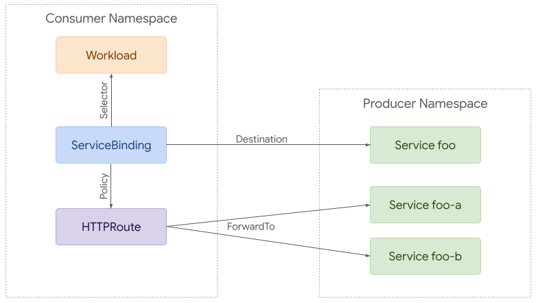

# GEP-713: Metaresources and Policy Attachment

* Issue: [#713](https://github.com/kubernetes-sigs/gateway-api/issues/713)
* Status: Memorandum

## TLDR

!!! danger
    This GEP is in the process of being updated.
    Please see the discussion at https://github.com/kubernetes-sigs/gateway-api/discussions/2927
    and expect further changes, although they will not be as extensive as the
    more focussed GEP-2648 and GEP-2649.
    Some options under discussion there may make the distinction between Direct
    and Inherited Policies moot, which would require a rework.

This GEP aims to standardize terminology and processes around using one Kubernetes
object to modify the functions of one or more other objects.

This GEP defines some terms, firstly: _Metaresource_.

A Kubernetes object that _augments_ the behavior of an object
in a standard way is called a _Metaresource_.

This document proposes controlling the creation of configuration in the underlying
Gateway data plane using two types of Policy Attachment.
A "Policy Attachment" is a specific type of _metaresource_ that can affect specific
settings across either one object (this is "Direct Policy Attachment"), or objects
in a hierarchy (this is "Inherited Policy Attachment").

Individual policy APIs:

- MUST be their own CRDs (e.g. `TimeoutPolicy`, `RetryPolicy` etc),
- MUST include both `spec` and `status` stanzas
- MUST have the `status` stanza include a `conditions` section using the standard
  upstream Condition type
- MAY be included in the Gateway API group and installation or be defined by
  implementations
- MUST include a common `TargetRef` struct in their specification to identify
  how and where to apply that policy.
- MAY affect more objects than the object specified in the `targetRef`. In this
  case, the Policy is an Inherited Policy. A common way to do this is to include
  either a `defaults` section, an `overrides` section, or both.
- Policy objects that affect _only_ the object specified in the `targetRef` are
  Direct Attached Policies (or more simply, Direct Policies.)

The biggest difference between the two types of Policy is that Direct Attached
Policies are a strict subset of Policy objects with criteria designed to make
it _much_ easier to understand the state of the system, and so are simpler to
use and can use a more simple `status` design.

However, Inherited Policies, because of the nature of the useful feature of having
settings cascade across multiple objects in a hierarchy, require knowledge of
more resources, and are consequently harder to understand and require a more
complex status design.

Splitting these two design patterns apart into separate GEPs is intended to
allow proceeding with stablizing the simpler (Direct) case while we work on
solving the status problem for the more complex (Inherited) case.

Direct Attached Policies are further specified in the addendum GEP GEP-2648,
Direct Policy Attachment.

Inherited Policies are further specified in the addendum GEP-2649, Inherited
Policy Attachment. GEP-2649 also describes a set of expected behaviors
for how settings can flow across a defined hierarchy.


## Goals

* Establish a pattern for Policy resources which will be used for any policies
  included in the Gateway API spec
* Establish a pattern for Policy attachment, whether Direct or Inherited,
  which must be used for any implementation specific policies used with
  Gateway API resources
* Discuss the problems with communicating status for Policy objects, and suggest
  mechanisms that Policy APIs can use to mitigate some of them.
* Provide a way to distinguish between required and default values for all
  policy API implementations
* Enable policy attachment at all relevant scopes, including Gateways, Routes,
  Backends, along with how values should flow across a hierarchy if necessary
* Ensure the policy attachment specification is generic and forward thinking
  enough that it could be easily adapted to other grouping mechanisms like
  Namespaces in the future
* Provide a means of attachment that works for both ingress and mesh
  implementations of this API
* Provide a consistent specification that will ensure familiarity between both
  included and implementation-specific policies so they can both be interpreted
  the same way.

## Deferred Goals and Discussions

* Should Policy objects be able to target more than one object? At the time of
  writing, the answer to this is _no_, in the interests of managing complexity
  in one change. But this rule can and should be discussed and reexamined in
  light of community feedback that users _really_ want this. Any discussion will
  need to consider the complexity tradeoffs here.

## Out of scope

* Define all potential policies that may be attached to resources
* Design the full structure and configuration of policies

## Background and concepts

When designing Gateway API, one of the things we’ve found is that we often need to be
able change the behavior of objects without being able to make changes to the spec
of those objects. Sometimes, this is because we can’t change the spec of the object
to hold the information we need ( ReferenceGrant, from
[GEP-709](https://gateway-api.sigs.k8s.io/geps/gep-709/), affecting Secrets
and Services is an example, as is Direct Policy Attachment), and sometimes it’s
because we want the behavior change to flow across multiple objects
(this is what Inherited Policy Attachment is for).

To put this another way, sometimes we need ways to be able to affect how an object
is interpreted in the API, without representing the description of those effects
inside the spec of the object.

This document describes the ways we design objects to meet these two use cases,
and why you might choose one or the other.

We use the term “metaresource” to describe the class of objects that _only_ augment
the behavior of another Kubernetes object, regardless of what they are targeting.

“Meta” here is used in its Greek sense of “more comprehensive”
or “transcending”, and “resource” rather than “object” because “metaresource”
is more pronounceable than “metaobject”. Additionally, a single word is better
than a phrase like “wrapper object” or “wrapper resource” overall, although both
of those terms are effectively synonymous with “metaresource”.

A "Policy Attachment" is a metaresource that affects the fields in existing objects
(like Gateway or Routes), or influences the configuration that's generated in an
underlying data plane.

"Direct Policy Attachment" is when a Policy object references a single object _only_,
and only modifies the fields of or the configuration associated with that object.

"Inherited Policy Attachment" is when a Policy object references a single object
_and any child objects of that object_ (according to some defined hierarchy), and
modifies fields of the child objects, or configuration associated with the child
objects.

In either case, a Policy may either affect an object by controlling the value
of one of the existing _fields_ in the `spec` of an object, or it may add
additional fields that are _not_ in the `spec` of the object.

### Why use Policy Attachment at all?


Consistent UX across GW implementations

Support for common tooling such as gwctl that can compute and display effective policies at each layer

Avoid annotation hell


### Direct Policy Attachment

For more description of the details of Direct Policy Attachment,
see [GEP-2648](https://gateway-api.sigs.k8s.io/geps/gep-2648/).

### Inherited Policy Attachment

For more description of the details of Inherited Policy Attachment,
see [GEP-2649](https://gateway-api.sigs.k8s.io/geps/gep-2649/).

### How to determine if a Policy is a Direct or Inherited one

The basic rule here is "Does the Policy affect _any_ other object aside from
the one it targets?" If not, it's Direct. If so, it's Inherited.

The reason for this is that Direct Attached Policies make it _much_ easier to
understand the state of the system, and so can use a more simple `status` design.
However, Inherited Policies require knowledge of more resources, and consequently
a more complex status design.

#### Policy type examples

The separate GEPs have more examples of policies of each type, but here are two
small examples. Please see the separated GEPs for more examples.

**BackendTLSPolicy** is the canonical example of a Direct Attached Policy because
it _only_ affects the Service that the Policy attaches to, and affects how that
Service is consumed. But you can know everything you need to about the Service
and BackendTLSPolicy just by looking at those two objects.

**Hypothetical max body size Policy**: Kate Osborn
[raised this on Slack](https://kubernetes.slack.com/archives/CR0H13KGA/p1708723178714389),
asking if a policy applied to a Gateway configures a data plane setting that
affects routes counts as an Inherited Policy, giving the example of a max body
size Policy.

In this sort of case, the object does count as an Inherited Policy because
it's affecting not just the properties of the Gateway, but properties of the
Routes attached to it (and you thus need to know about the Policy, the Gateway,
_and_ the Routes to be able to understand the system).


## Naming Policy objects

Although Direct and Inherited Policies behave differently in many respects, in
general they should be named using similar rules.

Policy objects MUST be clearly named so as to indicate that they are Policy
metaresources.

The simplest way to do that is to ensure that the type's name contains the `Policy`
string.

Implementations SHOULD use `Policy` as the last part of the names of object types
that use this pattern.

If an implementation does not, then they MUST clearly document what objects
are Policy metaresources in their documentation. Again, this is _not recommended_
without a _very_ good reason.

### Targeting Virtual Types
In some cases (likely limited to mesh) we may want to apply policies to requests
to external services. To accomplish this, implementations MAY choose to support
a reference to a virtual resource type. For example:

```yaml
apiVersion: networking.acme.io/v1alpha1
kind: RetryPolicy
metadata:
  name: foo
spec:
  default:
    maxRetries: 5
  targetRef:
    group: networking.acme.io
    kind: ExternalService
    name: foo.com
```

### Conflict Resolution
It is possible for multiple policies to target the same object _and_ the same
fields inside that object. If multiple policy resources target
the same resource _and_ have an identical field specified with different values,
precedence MUST be determined in order of the following criteria, continuing on
ties:

* Direct Policies override Inherited Policies. If preventing settings from
  being overwritten is important, implementations should only use Inherited
  Policies, and the `override` stanza that implies. Note also that it's not
  intended that Direct and Inherited Policies should overlap, so this should
  only come up in exceptional circumstances.
* Inside Inherited Policies, the same setting in `overrides` beats the one in
  `defaults`.
* The oldest Policy based on creation timestamp beats a newer one. For example,
  a Policy with a creation timestamp of "2021-07-15 01:02:03" MUST be given
  precedence over a Policy with a creation timestamp of "2021-07-15 01:02:04".
* The Policy appearing first in alphabetical order by `{namespace}/{name}`. For
  example, foo/bar is given precedence over foo/baz.

For a better user experience, a validating webhook can be implemented to prevent
these kinds of conflicts all together.

## Status and the Discoverability Problem

So far, this document has talked about what Policy Attachment is, different types
of attachment, and how those attachments work.

Probably the biggest impediment to this GEP moving forward is the discoverability
problem; that is, it’s critical that an object owner be able to know what policy
is affecting their object, and ideally its contents.

To understand this a bit better, let’s consider this parable, with thanks to Flynn:

### The Parable

It's a sunny Wednesday afternoon, and the lead microservices developer for
Evil Genius Cupcakes is windsurfing. Work has been eating Ana alive for the
past two and a half weeks, but after successfully deploying version 3.6.0 of
the `baker` service this morning, she's escaped early to try to unwind a bit.

Her shoulders are just starting to unknot when her phone pings with a text
from Charlie, down in the NOC. Waterproof phones are a blessing, but also a
curse.

**Charlie**: _Hey Ana. Things are still running, more or less, but latencies
on everything in the `baker` namespace are crazy high after your last rollout,
and `baker` itself has a weirdly high load. Sorry to interrupt you on the lake
but can you take a look? Thanks!!_

Ana stares at the phone for a long moment, heart sinking, then sighs and
turns back to shore.

What she finds when dries off and grabs her laptop is strange. `baker` does
seem to be taking much more load than its clients are sending, and its clients
report much higher latencies than they’d expect. She doublechecks the
Deployment, the Service, and all the HTTPRoutes around `baker`; everything
looks good. `baker`’s logs show her mostly failed requests... with a lot of
duplicates? Ana checks her HTTPRoute again, though she's pretty sure you
can't configure retries there, and finds nothing. But it definitely looks like
clients are retrying when they shouldn’t be.

She pings Charlie.

**Ana**: _Hey Charlie. Something weird is up, looks like requests to `baker`
are failing but getting retried??_

A minute later they answer.

**Charlie**: 🤷 _Did you configure retries?_

**Ana**: _Dude. I don’t even know how to._ 😂

**Charlie**: _You just attach a RetryPolicy to your HTTPRoute._

**Ana**: _Nope. Definitely didn’t do that._

She types `kubectl get retrypolicy -n baker` and gets a permission error.

**Ana**: _Huh, I actually don’t have permissions for RetryPolicy._ 🤔

**Charlie**: 🤷 _Feels like you should but OK, guess that can’t be it._

Minutes pass while both look at logs.

**Charlie**: _I’m an idiot. There’s a RetryPolicy for the whole namespace –
sorry, too many policies in the dashboard and I missed it. Deleting that since
you don’t want retries._

**Ana**: _Are you sure that’s a good–_

Ana’s phone shrills while she’s typing, and she drops it. When she picks it
up again she sees a stack of alerts. She goes pale as she quickly flips
through them: there’s one for every single service in the `baker` namespace.

**Ana**: _PUT IT BACK!!_

**Charlie**: _Just did. Be glad you couldn't hear all the alarms here._ 😕

**Ana**: _What the hell just happened??_

**Charlie**: _At a guess, all the workloads in the `baker` namespace actually
fail a lot, but they seem OK because there are retries across the whole
namespace?_ 🤔

Ana's blood runs cold.

**Charlie**: _Yeah. Looking a little closer, I think your `baker` rollout this
morning would have failed without those retries._ 😕

There is a pause while Ana's mind races through increasingly unpleasant
possibilities.

**Ana**: _I don't even know where to start here. How long did that
RetryPolicy go in? Is it the only thing like it?_

**Charlie**: _Didn’t look closely before deleting it, but I think it said a few
months ago. And there are lots of different kinds of policy and lots of
individual policies, hang on a minute..._

**Charlie**: _Looks like about 47 for your chunk of the world, a couple hundred
system-wide._

**Ana**: 😱 _Can you tell me what they’re doing for each of our services? I
can’t even_ look _at these things._ 😕

**Charlie**: _That's gonna take awhile. Our tooling to show us which policies
bind to a given workload doesn't go the other direction._

**Ana**: _...wait. You have to_ build tools _to know if retries are turned on??_

Pause.

**Charlie**: _Policy attachment is more complex than we’d like, yeah._ 😐
_Look, how ‘bout roll back your `baker` change for now? We can get together in
the morning and start sorting this out._

Ana shakes her head and rolls back her edits to the `baker` Deployment, then
sits looking out over the lake as the deployment progresses.

**Ana**: _Done. Are things happier now?_

**Charlie**: _Looks like, thanks. Reckon you can get back to your sailboard._ 🙂

Ana sighs.

**Ana**: _Wish I could. Wind’s died down, though, and it'll be dark soon.
Just gonna head home._

**Charlie**: _Ouch. Sorry to hear that._ 😐

One more look out at the lake.

**Ana**: _Thanks for the help. Wish we’d found better answers._ 😢

### The Problem, restated
What this parable makes clear is that, in the absence of information about what
Policy is affecting an object, it’s very easy to make poor decisions.

It’s critical that this proposal solve the problem of showing up to three things,
listed in increasing order of desirability:

- _That_ some Policy is affecting a particular object
- _Which_ Policy is (or Policies are) affecting a particular object
- _What_ settings in the Policy are affecting the object.

In the parable, if Ana and Charlie had known that there were Policies affecting
the relevant object, then they could have gone looking for the relevant Policies
and things would have played out differently. If they knew which Policies, they
would need to look less hard, and if they knew what the settings being applied
were, then the parable would have been able to be very short indeed.

(There’s also another use case to consider, in that Charlie should have been able
to see that the Policy on the namespace was in use in many places before deleting
it.)

To put this another way, Policy Attachment is effectively adding a fourth Persona,
the Policy Admin, to Gateway API’s persona list, and without a solution to the
discoverability problem, their actions are largely invisible to the Application
Developer. Not only that, but their concerns cut across the previously established
levels.


From the Policy Admin’s point of view, they need to know across their whole remit
(which conceivably could be the whole cluster):

- _What_ Policy has been created
- _Where_ it’s applied
- _What_ the resultant policy is saying

Which again, come down to discoverability, and can probably be addressed in similar
ways at an API level to the Application Developer's concerns.

An important note here is that a key piece of information for Policy Admins and
Cluster Operators is “How many things does this Policy affect?”. In the parable,
this would have enabled Charlie to know that deleting the Namespace Policy would
affect many other people than just Ana.

### Problems we need to solve

Before we can get into solutions, we need to discuss the problems that solutions
may need to solve, so that we have some criteria for evaluating those solutions.

#### User discoverability

Let's go through the various users of Gateway API and what they need to know about
Policy Attachment.

In all of these cases, we should aim to keep the troubleshooting distance low;
that is, that there should be a minimum of hops required between objects from the
one owned by the user to the one responsible for a setting.

Another way to think of the troubleshooting distance in this context is "How many
`kubectl` commands would the user need to do to understand that a Policy is relevant,
which Policy is relevant, and what configuration the full set of Policy is setting?"

##### Application Developer Discoverability

How does Ana, or any Application Developer who owns one or more Route objects know
that their object is affected by Policy, which Policy is affecting it, and what
the content of the Policy is?

The best outcome is that Ana needs to look only at a specific route to know what
Policy settings are being applied to that Route, and where they come from.
However, some of the other problems below make it very difficult to achieve this.

##### Policy Admin Discoverability

How does the Policy Admin know what Policy is applied where, and what the content
of that Policy is?
How do they validate that Policy is being used in ways acceptable to their organization?
For any given Policy object, how do they know how many places it's being used?

##### Cluster Admin Discoverability

The Cluster Admin has similar concerns to the Policy Admin, but with a focus on
being able to determine what's relevant when something is broken.

How does the Cluster Admin know what Policy is applied where, and what the content
of that Policy is?

For any given Policy object, how do they know how many places it's being used?

#### Evaluating and Displaying Resultant Policy

For any given Policy type, whether Direct Attached or Inherited, implementations
will need to be able to _calculate_ the resultant set of Policy to be able to
apply that Policy to the correct parts of their data plane configuration.
However, _displaying_ that resultant set of Policy in a way that is straightforward
for the various personas to consume is much harder.

The easiest possible option for Application Developers would be for the
implementation to make the full resultant set of Policy available in the status
of objects that the Policy affects. However, this runs into a few problems:

- The status needs to be namespaced by the implementation
- The status could get large if there are a lot of Policy objects affecting an
  object
- Building a common data representation pattern that can fit into a single common
  schema is not straightforward.
- Updating one Policy object could cause many affected objects to need to be
  updated themselves. This sort of fan-out problem can be very bad for apiserver
  load, particularly if Policy changes rapidly, there are a lot of objects, or both.

##### Status needs to be namespaced by implementation

Because an object can be affected by multiple implementations at once, any status
we add must be namespaced by the implementation.

In Route Parent status, we've used the parentRef plus the controller name for this.

For Policy, we can do something similar and namespace by the reference to the
implementation's controller name.

We can't easily namespace by the originating Policy because the source could be
more than one Policy object.

##### Creating common data representation patterns

The problem here is that we need to have a _common_ pattern for including the
details of an _arbitrarily defined_ object, that needs to be included in the base
API.

So we can't use structured data, because we have no way of knowing what the
structure will be beforehand.

This suggests that we need to use unstructured data for representing the main
body of an arbitrary Policy object.

Practically, this will need to be a string representation of the YAML form of the
body of the Policy object (absent the metadata part of every Kubernetes object).

Policy Attachment does not mandate anything about the design of the object's top
level except that it must be a Kubernetes object, so the only thing we can rely
on is the presence of the Kubernetes metadata elements: `apiVersion`, `kind`,
and `metadata`.

A string representation of the rest of the file is the best we can do here.

##### Fanout status update problems

The fanout problem is that, when an update takes place in a single object (a
Policy, or an object with a Policy attached), an implementation may need to
update _many_ objects if it needs to place details of what Policy applies, or
what the resultant set of policy is on _every_ object.

Historically, this is a risky strategy and needs to be carefully applied, as
it's an excellent way to create apiserver load problems, which can produce a large
range of bad effects for cluster stability.

This does not mean that we can't do anything at all that affects multiple objects,
but that we need to carefully consider what information is stored in status so 
that _every_ Policy update does not require a status update.

#### Solution summary

Because Policy Attachment is a pattern for APIs, not an API, and needs to address
all the problems above, the strategy this GEP proposes is to define a range of
options for increasing the discoverabilty of Policy resources, and provide
guidelines for when they should be used.

It's likely that at some stage, the Gateway API CRDs will include some Policy
resources, and these will be designed with all these discoverabiity solutions
in mind.


### Solution cookbook

This section contains some required patterns for Policy objects and some
suggestions. Each will be marked as MUST, SHOULD, or MAY, using the standard 
meanings of those terms.

Additionally, the status of each solution is noted at the beginning of the section.

#### Standard label on CRD objects

Status: Required

Each CRD that defines a Policy object MUST include a label that specifies that
it is a Policy object, and that label MUST specify the _type_ of Policy attachment
in use.

The label is `gateway.networking.k8s.io/policy: inherited|direct`.

This solution is intended to allow both users and tooling to identify which CRDs
in the cluster should be treated as Policy objects, and so is intended to help
with discoverability generally. It will also be used by the forthcoming `kubectl`
plugin.

##### Design considerations

This is already part of the API pattern, but is being lifted to more prominience
here.

#### Standard status struct

Status: Experimental

Included in the Direct Policy Attachment GEP.

Policy objects SHOULD use the upstream `PolicyAncestorStatus` struct in their respective
Status structs. Please see the included `PolicyAncestorStatus` struct, and its use in
the `BackendTLSPolicy` object for detailed examples. Included here is a representative
version.

This pattern enables different conditions to be set for different "Ancestors"
of the target resource. This is particularly helpful for policies that may be
implemented by multiple controllers or attached to resources with different
capabilities. This pattern also provides a clear view of what resources a
policy is affecting.

For the best integration with community tooling and consistency across
the broader community, we recommend that all implementations transition 
to Policy status with this kind of nested structure.

This is an `Ancestor` status rather than a `Parent` status, as in the Route status
because for Policy attachment, the relevant object may or may not be the direct
parent.

For example, `BackendTLSPolicy` directly attaches to a Service, which may be included
in multiple Routes, in multiple Gateways. However, for many implementations, 
the status of the `BackendTLSPolicy` will be different only at the Gateway level, 
so Gateway is the relevant Ancestor for the status.

Each Gateway that has a Route that includes a backend with an attached `BackendTLSPolicy`
MUST have a separate `PolicyAncestorStatus` section in the `BackendTLSPolicy`'s
`status.ancestors` stanza, which mandates that entries must be distinct using the
combination of the `AncestorRef` and the `ControllerName` fields as a key.

See [GEP-1897][gep-1897] for the exact details.

[gep-1897]: /geps/gep-1897

```go
// PolicyAncestorStatus describes the status of a route with respect to an
// associated Ancestor.
//
// Ancestors refer to objects that are either the Target of a policy or above it in terms
// of object hierarchy. For example, if a policy targets a Service, an Ancestor could be
// a Route or a Gateway. 

// In the context of policy attachment, the Ancestor is used to distinguish which
// resource results in a distinct application of this policy. For example, if a policy
// targets a Service, it may have a distinct result per attached Gateway.
// 
// Policies targeting the same resource may have different effects depending on the 
// ancestors of those resources. For example, different Gateways targeting the same
// Service may have different capabilities, especially if they have different underlying
// implementations. 
//
// For example, in BackendTLSPolicy, the Policy attaches to a Service that is
// used as a backend in a HTTPRoute that is itself attached to a Gateway.
// In this case, the relevant object for status is the Gateway, and that is the
// ancestor object referred to in this status.
//
// Note that a Target of a Policy is also a valid Ancestor, so for objects where
// the Target is the relevant object for status, this struct SHOULD still be used.
type PolicyAncestorStatus struct {
	// AncestorRef corresponds with a ParentRef in the spec that this
	// RouteParentStatus struct describes the status of.
	AncestorRef ParentReference `json:"ancestorRef"`

	// ControllerName is a domain/path string that indicates the name of the
	// controller that wrote this status. This corresponds with the
	// controllerName field on GatewayClass.
	//
	// Example: "example.net/gateway-controller".
	//
	// The format of this field is DOMAIN "/" PATH, where DOMAIN and PATH are
	// valid Kubernetes names
	// (https://kubernetes.io/docs/concepts/overview/working-with-objects/names/#names).
	//
	// Controllers MUST populate this field when writing status. Controllers should ensure that
	// entries to status populated with their ControllerName are cleaned up when they are no
	// longer necessary.
	ControllerName GatewayController `json:"controllerName"`

	// Conditions describes the status of the Policy with respect to the given Ancestor.
	//
	// +listType=map
	// +listMapKey=type
	// +kubebuilder:validation:MinItems=1
	// +kubebuilder:validation:MaxItems=8
	Conditions []metav1.Condition `json:"conditions,omitempty"`
}


// PolicyStatus defines the common attributes that all Policies SHOULD include
// within their status.
type PolicyStatus struct {
	// Ancestors is a list of ancestor resources (usually Gateways) that are
	// associated with the route, and the status of the route with respect to
	// each ancestor. When this route attaches to a parent, the controller that
	// manages the parent and the ancestors MUST add an entry to this list when
	// the controller first sees the route and SHOULD update the entry as
	// appropriate when the relevant ancestor is modified.
	//
	// Note that choosing the relevant ancestor is left to the Policy designers;
	// an important part of Policy design is designing the right object level at
	// which to namespace this status.
	//
	// Note also that implementations MUST ONLY populate ancestor status for 
	// the Ancestor resources they are responsible for. Implementations MUST
	// use the ControllerName field to uniquely identify the entries in this list
	// that they are responsible for.
	//
	// A maximum of 32 ancestors will be represented in this list. An empty list
	// means the Policy is not relevant for any ancestors.
	//
	// +kubebuilder:validation:MaxItems=32
	Ancestors []PolicyAncestorStatus `json:"ancestors"`
}
```

##### Design considerations

This is recommended as the base for Policy object's status. As Policy Attachment
is a pattern, not an API, "recommended" is the strongest we can make this, but
we believe that standardizing this will help a lot with discoverability.

Note that is likely that all Gateway API tooling will expect policy status to follow
this structure. To benefit from broader consistency and discoverability, we
recommend transitioning to this structure for all Gateway API Policies.

#### Standard status Condition on Policy-affected objects

Support: Provisional

This solution is IN PROGRESS and so is not binding yet.

However, a version of this proposal is now included in the Direct Policy
Attachment GEP.

This solution requires definition in a GEP of its own to become binding.
[GEP-2923](https://github.com/kubernetes-sigs/gateway-api/issues/2923) has been
opened to cover some aspects of this work.

**The description included here is intended to illustrate the sort of solution
that an eventual GEP will need to provide, _not to be a binding design.**

Implementations that use Policy objects MUST put a Condition into `status.Conditions`
of any objects affected by a Policy.

That Condition MUST have a `type` ending in `PolicyAffected` (like
`gateway.networking.k8s.io/PolicyAffected`),
and have the optional `observedGeneration` field kept up to date when the `spec`
of the Policy-attached object changes.

Implementations SHOULD use their own unique domain prefix for this Condition
`type` - it is recommended that implementations use the same domain as in the
`controllerName` field on GatewayClass (or some other implementation-unique
domain for implementations that do not use GatewayClass).)

For objects that do _not_ have a `status.Conditions` field available (`Secret`
is a good example), that object MUST instead have an annotation of
`gateway.networking.k8s.io/PolicyAffected: true` (or with an
implementation-specific domain prefix) added instead.


##### Design Considerations
The intent here is to add at least a breadcrumb that leads object owners to have
some way to know that their object is being affected by another object, while
minimizing the number of updates necessary.

Minimizing the object updates is done by only having an update be necessary when
the affected object starts or stops being affected by a Policy, rather than if
the Policy itself has been updated.

There is already a similar Condition to be placed on _Policy_ objects, rather
than on the _targeted_ objects, so this solution is also being included in the
Conditions section below.

#### GatewayClass status Extension Types listing

Support: Provisional

This solution is IN PROGRESS, and so is not binding yet.

Each implementation MUST list all relevant CRDs in its GatewayClass status (like
Policy, and other extension types, like paramsRef targets, filters, and so on). 

This is going to be tracked in its own GEP, https://github.com/kubernetes-sigs/gateway-api/discussions/2118
is the initial discussion. This document will be updated with the details once
that GEP is opened.

##### Design Considerations

This solution:

- is low cost in terms of apiserver updates (because it's only on the GatewayClass,
  and only on implementation startup)
- provides a standard place for all users to look for relevant objects
- ties in to the Conformance Profiles design and other efforts about GatewayClass 
  status

#### Standard status stanza

Support: Provisional

This solution is IN PROGRESS and so is not binding yet.

This solution requires definition in a GEP of its own to become binding.

**The description included here is intended to illustrate the sort of solution
that an eventual GEP will need to provide, _not to be a binding design. THIS IS
AN EXPERIMENTAL SOLUTION DO NOT USE THIS YET.**

An implementation SHOULD include the name, namespace, apiGroup and Kind of Policies
affecting an object in the new `effectivePolicy` status stanza on Gateway API
objects.

This stanza looks like this:
```yaml
kind: Gateway
...
status:
  effectivePolicy:
  - name: some-policy
    namespace: some-namespace
    apiGroup: implementation.io
    kind: AwesomePolicy
  ...
```

##### Design Considerations

This solution is designed to limit the number of status updates required by an
implementation to when a Policy starts or stops being relevant for an object,
rather than if that Policy's settings are updated.

It helps a lot with discoverability, but comes at the cost of a reasonably high
fanout cost. Implementations using this solution SHOULD ensure that status updates
are deduplicated and only sent to the apiserver when absolutely necessary.

Ideally, these status updates SHOULD be in a separate, lower-priority queue than
other status updates or similar solution.

#### PolicyBinding resource

Support: Provisional

This solution is IN PROGRESS and so is not binding yet.

This solution requires definition in a GEP of its own to become binding.

**The description included here is intended to illustrate the sort of solution
that the eventual GEP will need to provide, _not to be a binding design. THIS IS
AN EXPERIMENTAL SOLUTION DO NOT USE THIS YET.**

Implementations SHOULD create an instance of a new `gateway.networking.k8s.io/EffectivePolicy`
object when one or more Policy objects become relevant to the target object.

The `EffectivePolicy` object MUST be in the same namespace as the object targeted
by the Policy, and must have the _same name_ as the object targeted like the Policy.
This is intended to mirror the Services/Endpoints naming convention, to allow for
ease of discovery.

The `EffectivePolicy` object MUST set the following information:

- The name, namespace, apiGroup and Kind of Policy objects affecting the targeted
  object.
- The full resultant set of Policy affecting the targeted object.

The above details MUST be namespaced using the `controllerName` of the implementation
(could also be by GatewayClass), similar to Route status being namespaced by
`parentRef`.

An example `EffectivePolicy` object is included here - this may be superseded by
a later GEP and should be updated or removed in that case. Note that it does
_not_ contain a `spec` and a `status` stanza - by definition this object _only_
contains `status` information.

```yaml
kind: EffectivePolicy
apiVersion: gateway.networkking.k8s.io/v1alpha2
metadata:
  name: targeted-object
  namespace: targeted-object-namespace
policies:
- controllerName: implementation.io/ControllerName
  objects:
  - name: some-policy
    namespace: some-namespace
    apiGroup: implementation.io
    kind: AwesomePolicy
  resultantPolicy:
    awesomePolicy:
      configitem1:
        defaults:
          foo: 1
        overrides:
          bar: important-setting

```

Note here that the `resultantPolicy` setting is defined using the same mechanisms
as an `unstructured.Unstructured` object in the Kubernetes Go libraries - it's
effectively a `map[string]struct{}` that is stored as a `map[string]string` -
which allows an arbitrary object to be specified there.

Users or tools reading the config underneath `resultantPolicy` SHOULD display
it in its encoded form, and not try to deserialize it in any way.

The rendered YAML MUST be usable as the `spec` for the type given.

##### Design considerations

This will provide _full_ visibility to end users of the _actual settings_ being
applied to their object, which is a big discoverability win.

However, it relies on the establishment and communication of a convention ("An 
EffectivePolicy is right next to your affected object"), that may not be desirable.

Thus its status as EXPERIMENTAL DO NOT USE YET.

#### Validating Admission Controller to inform users about relevant Policy

Implementations MAY supply a Validating Admission Webhook that will return a
WARNING message when an applied object is affected by some Policy.

The warning message MAY include the name, namespace, apiGroup and Kind of relevant
Policy objects.

##### Design Considerations

Pro:

- This gives object owners a very clear signal that something some Policy is
  going to affect their object, at apply time, which helps a lot with discoverability.

Cons:

- Implementations would have to have a webhook, which is another thing to run.
- The webhook will need to have the same data model that the implementation uses,
  and keep track of which GatewayClasses, Gateways, Routes, and Policies are
  relevant. Experience suggests this will not be a trivial engineering exercise,and will add a lot of implementation complexity.

#### `kubectl` plugin or command-line tool
To help improve UX and standardization, a kubectl plugin will be developed that
will be capable of describing the computed sum of policy that applies to a given
resource, including policies applied to parent resources.

Each Policy CRD that wants to be supported by this plugin will need to follow
the API structure defined above and add the [corresponding label](https://gateway-api.sigs.k8s.io/geps/gep-713/#standard-label-on-crd-objects)
to the CRD.

### Conditions

Implementations using Policy objects MUST include a `spec` and `status` stanza,
and the `status` stanza MUST contain a `conditions` stanza, using the standard
Condition format.

Policy authors should consider namespacing the `conditions` stanza with a
`controllerName`, as in Route status, if more than one implementation will be
reconciling the Policy type.

#### On `Policy` objects

Controllers using the Gateway API policy attachment model MUST populate the 
`Accepted` condition and reasons as defined below on policy resources to provide
a consistent experience across implementations.

```go
// PolicyConditionType is a type of condition for a policy.
type PolicyConditionType string

// PolicyConditionReason is a reason for a policy condition.
type PolicyConditionReason string

const (
  // PolicyConditionAccepted indicates whether the policy has been accepted or rejected
  // by a targeted resource, and why.
  //
  // Possible reasons for this condition to be True are:
  //
  // * "Accepted"
  //
  // Possible reasons for this condition to be False are:
  //
  // * "Conflicted"
  // * "Invalid"
  // * "TargetNotFound"
  //
  PolicyConditionAccepted PolicyConditionType = "Accepted"

  // PolicyReasonAccepted is used with the "Accepted" condition when the policy has been
  // accepted by the targeted resource.
  PolicyReasonAccepted PolicyConditionReason = "Accepted"

  // PolicyReasonConflicted is used with the "Accepted" condition when the policy has not
  // been accepted by a targeted resource because there is another policy that targets the same
  // resource and a merge is not possible.
  PolicyReasonConflicted PolicyConditionReason = "Conflicted"

  // PolicyReasonInvalid is used with the "Accepted" condition when the policy is syntactically
  // or semantically invalid.
  PolicyReasonInvalid PolicyConditionReason = "Invalid"

  // PolicyReasonTargetNotFound is used with the "Accepted" condition when the policy is attached to
  // an invalid target resource
  PolicyReasonTargetNotFound PolicyConditionReason = "TargetNotFound"
)
```

#### On targeted resources

(copied from [Standard Status Condition][#standard-status-condition])

This solution requires definition in a GEP of its own to become binding.

**The description included here is intended to illustrate the sort of solution
that an eventual GEP will need to provide, _not to be a binding design.**

Implementations that use Policy objects MUST put a Condition into `status.Conditions`
of any objects affected by a Policy.

That Condition must have a `type` ending in `PolicyAffected` (like
`gateway.networking.k8s.io/PolicyAffected`),
and have the optional `observedGeneration` field kept up to date when the `spec`
of the Policy-attached object changes.

Implementations _should_ use their own unique domain prefix for this Condition
`type` - it is recommended that implementations use the same domain as in the
`controllerName` field on GatewayClass (or some other implementation-unique
domain for implementations that do not use GatewayClass).)

For objects that do _not_ have a `status.Conditions` field available (`Secret`
is a good example), that object MUST instead have an annotation of
`gateway.networking.k8s.io/PolicyAffected: true` (or with an
implementation-specific domain prefix) added instead.

### Interaction with Custom Filters and other extension points
There are multiple methods of custom extension in the Gateway API. Policy
attachment and custom Route filters are two of these. Policy attachment is
designed to provide arbitrary configuration fields that decorate Gateway API
resources. Route filters provide custom request/response filters embedded inside
Route resources. Both are extension methods for fields that cannot easily be
standardized as core or extended fields of the Gateway API. The following
guidance should be considered when introducing a custom field into any Gateway
controller implementation:

1. For any given field that a Gateway controller implementation needs, the
   possibility of using core or extended should always be considered before
   using custom policy resources. This is encouraged to promote standardization
   and, over time, to absorb capabilities into the API as first class fields,
   which offer a more streamlined UX than custom policy attachment.

2. Although it's possible that arbitrary fields could be supported by custom
   policy, custom route filters, and core/extended fields concurrently, it is
   recommended that implementations only use multiple mechanisms for
   representing the same fields when those fields really _need_ the defaulting
   and/or overriding behavior that Policy Attachment provides. For example, a
   custom filter that allowed the configuration of Authentication inside a
   HTTPRoute object might also have an associated Policy resource that allowed
   the filter's settings to be defaulted or overridden. It should be noted that
   doing this in the absence of a solution to the status problem is likely to
   be *very* difficult to troubleshoot.

## Removing BackendPolicy
BackendPolicy represented the initial attempt to cover policy attachment for
Gateway API. Although this proposal ended up with a similar structure to
BackendPolicy, it is not clear that we ever found sufficient value or use cases
for BackendPolicy. Given that this proposal provides more powerful ways to
attach policy, BackendPolicy was removed.

## Alternatives considered

### 1. ServiceBinding for attaching Policies and Routes for Mesh
A new ServiceBinding resource has been proposed for mesh use cases. This would
provide a way to attach policies, including Routes to a Service.

Most notably, these provide a way to attach different policies to requests
coming from namespaces or specific Gateways. In the example below, a
ServiceBinding in the consumer namespace would be applied to the selected
Gateway and affect all requests from that Gateway to the foo Service. Beyond
policy attachment, this would also support attaching Routes as policies, in this
case the attached HTTPRoute would split requests between the foo-a and foo-b
Service instead of the foo Service.



This approach can be used to attach a default set of policies to all requests
coming from a namespace. The example below shows a ServiceBinding defined in the
producer namespace that would apply to all requests from within the same
namespace or from other namespaces that did not have their own ServiceBindings
defined.


#### Advantages
* Works well for mesh and any use cases where requests don’t always transit
  through Gateways and Routes.
* Allows policies to apply to an entire namespace.
* Provides very clear attachment of polices, routes, and more to a specific
  Service.
* Works well for ‘shrink-wrap application developers’ - the packaged app does
  not need to know about hostnames or policies or have extensive templates.
* Works well for ‘dynamic’ / programmatic creation of workloads ( Pods,etc - see
  CertManager)
* It is easy to understand what policy applies to a workload - by listing the
  bindings in the namespace.

#### Disadvantages
* Unclear how this would work with an ingress model. If Gateways, Routes, and
  Backends are all in different namespaces, and each of those namespaces has
  different ServiceBindings applying different sets of policies, it’s difficult
  to understand which policy would be applied.
* Unclear if/how this would interact with existing the ingress focused policy
  proposal described below. If both coexisted, would it be possible for a user
  to understand which policies were being applied to their requests?
* Route status could get confusing when Routes were referenced as a policy by
  ServiceBinding
* Introduces a new mesh specific resource.

### 2. Attaching Policies for Ingress
An earlier proposal for policy attachment in the Gateway API suggested adding
policy references to each Resource. This works very naturally for Ingress use
cases where all requests follow a path through Gateways, Routes, and Backends.
Adding policy attachment at each level enables different roles to define
defaults and allow overrides at different levels.


#### Advantages
* Consistent policy attachment at each level
* Clear which policies apply to each component
* Naturally translates to hierarchical Ingress model with ability to delegate
  policy decisions to different roles

#### Disadvantages
* Policy overrides could become complicated
* At least initially, policy attachment on Service would have to rely on Service
  annotations or references from policy to Service(s)
* No way to attach policy to other resources such as namespace or ServiceImport
* May be difficult to modify Routes and Services if other components/roles are
  managing them (eg Knative)

### 3. Shared Policy Resource
This is really just a slight variation or extension of the main proposal in this
GEP. We would introduce a shared policy resource. This resource would follow the
guidelines described above, including the `targetRef` as defined as well as
`default` and `override` fields. Instead of carefully crafted CRD schemas for
each of the `default` and `override` fields, we would use more generic
`map[string]string` values. This would allow similar flexibility to annotations
while still enabling the default and override concepts that are key to this
proposal.

Unfortunately this would be difficult to validate and would come with many of
the downsides of annotations. A validating webhook would be required for any
validation which could result in just as much or more work to maintain than
CRDs. At this point we believe that the best experience will be from
implementations providing their own policy CRDs that follow the patterns
described in this GEP. We may want to explore tooling or guidance to simplify
the creation of these policy CRDs to help simplify implementation and extension
of this API.

## References

**Issues**
* [Extensible Service Policy and Configuration](https://github.com/kubernetes-sigs/gateway-api/issues/611)

**Docs**
* [Policy Attachment and Binding](https://docs.google.com/document/d/13fyptUtO9NV_ZAgkoJlfukcBf2PVGhsKWG37yLkppJo/edit?resourcekey=0-Urhtj9gBkGBkSL1gHgbWKw)
