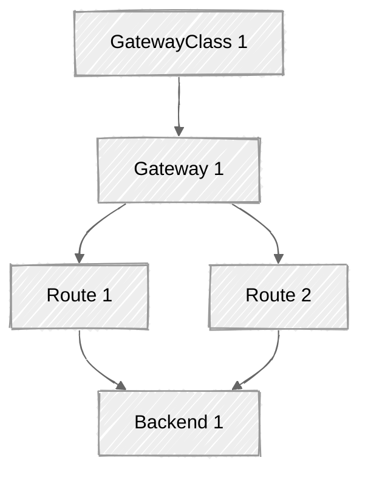
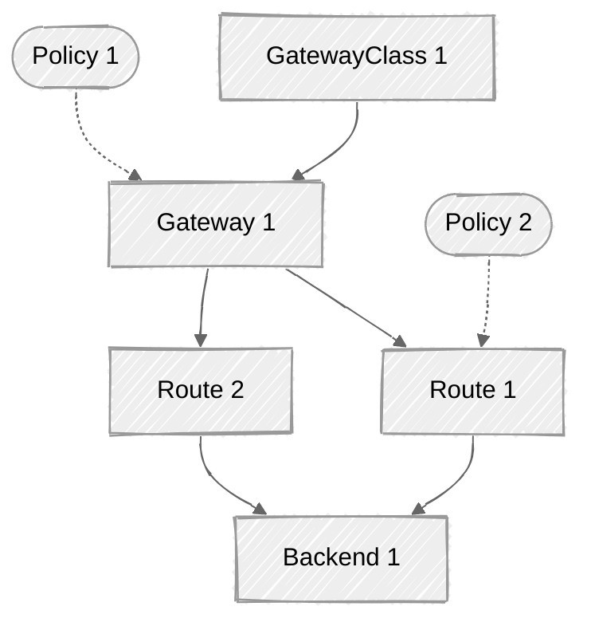
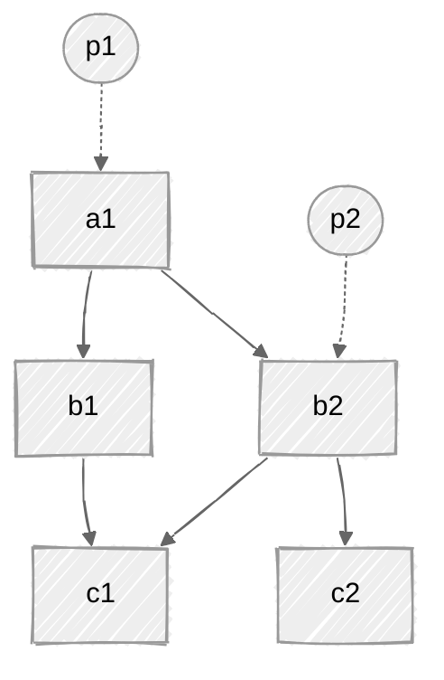
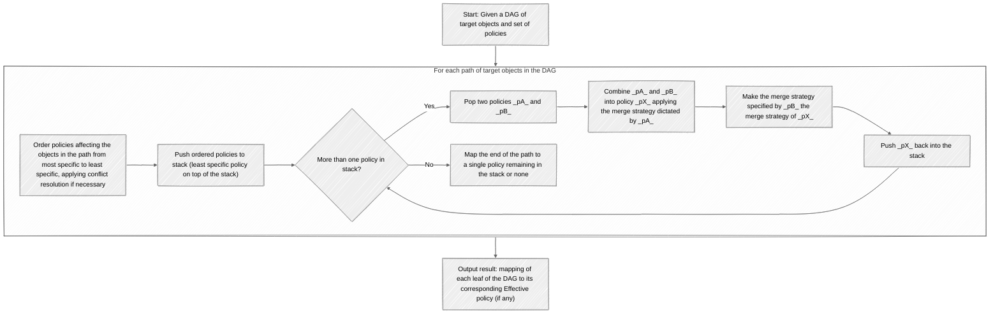
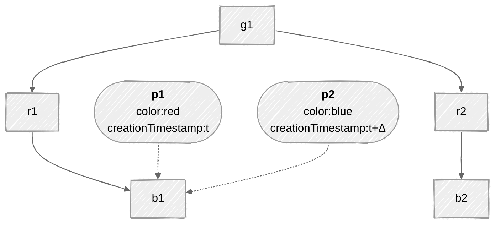
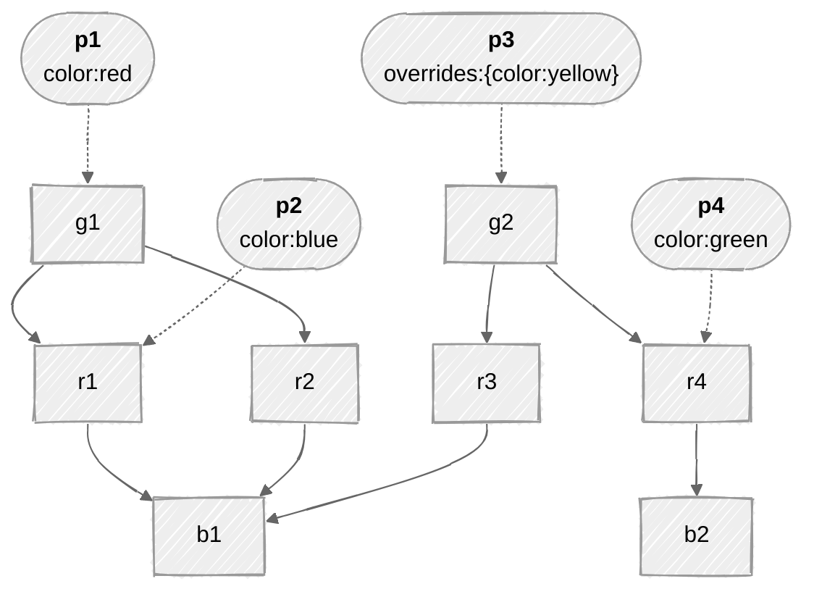

# GEP-713: Metaresources and Policy Attachment

* Issue: [#713](https://github.com/kubernetes-sigs/gateway-api/issues/713)
* Status: Memorandum

(See status definitions [here](/geps/overview/#gep-states))

## TL;DR

This GEP aims to standardize terminology and processes around "metaresources", i.e., using one Kubernetes object to modify the functions of one or more other objects.

It lays out guidelines for Gateway API implementations and other stakeholders for the design and/or handling of custom resources in compliance with a pattern known as Policy Attachment.

!!! warning
    This GEP specifies a _pattern_, not an API field or new object. It defines some terms, including _Metaresource_, _Policies_ and _Policy Attachment_, and their related concepts.

!!! danger
    This pattern is so far agreed upon only by Gateway API implementers who were in need of an immediate solution and didn't want all their solutions to be completely different and disparate, but does not have wide agreement or review from the rest of Kubernetes (particularly API Machinery).
    It is then conceivable that this problem domain gets a different solution in core in the future at which time this pattern might be considered obsoleted by that one.
    When implementations have need of something that is not in the spec and free from the [user stories](#user-stories) for which this pattern has been primarily thought, they are encouraged to explore other means (e.g. trying to work their feature into the upstream spec) before considering introducing their own custom metaresources.
    Examples of challenges associated with this pattern include the [Discoverability problem](#the-discoverability-problem) and the [Fanout status update problem](#fanout-status-update-problems).

## Overview and Concepts

### Background

When designing Gateway API, a recurring challenge became apparent. There was often a need to change ("augment") the behavior of objects without modifying their specs.

There are several cases where this happens, such as:
- when changing the spec of the object to hold the new piece of information is not possible (e.g., `ReferenceGrant`, from [GEP-709](../gep-709/index.md), when affecting Secrets and Services);
- when the new specification applies at different scopes (different object kinds), making it more maintainable if the declaration is extracted to a separate object, rather than adding new fields representing the same functionality across multiple objects;
- when the augmented behavior is intended to [span across relationships of an object](#spanning-behavior-across-relationships-of-a-target) other than the object that is directly referred in the declaration;
- when the augmented behavior is subject to different RBAC rules than the object it refers to;
- to circumvent having to enforce hard changes to established implementations.

To put this another way, sometimes we need ways to be able to affect how an object is interpreted in the API, without representing the description of those effects inside the spec of the object. This document describes the ways to design objects to meet use cases like these.

This document introduces the concept of a "metaresource", a term used to describe the class of objects that _only_ augment the behavior of another Kubernetes object, regardless of what they are targeting.

"Meta" here is used in its Greek sense of "more comprehensive" or "transcending", and "resource" rather than "object" because "metaresource" is more pronounceable than "meta object".

Moreover, this document defines a particular class of metaresource, called "policies". Policy kinds have a well-defined structure and behavior, both specified in this GEP.

From policies emerges the concept of Policy Attachment, which consists of augmenting the behavior of other Kubernetes resources by attaching policies to them.

After multiple iterations of Gateway API experimenting with policies—whether through common kinds of policies like `BackendTLSPolicy` and `BackendLBPolicy`, or various implementation-specific ones (see [Current use of policies](#current-use-of-policies))—and after rounds of discussion (such as [kubernetes-sigs/gateway-api/discussions#2927](https://github.com/kubernetes-sigs/gateway-api/discussions/2927)), the pattern has evolved into its current form.

### User stories

- [Ana](../../concepts/roles-and-personas.md#ana) or [Chihiro](../../concepts/roles-and-personas.md#Chihiro) would like to specify some new behavior for a standard Kubernetes resource, but that resource doesn't have a way to specify the behavior and neither Ana nor Chihiro can modify it.
  - For example, Ana may want to add a rate limit to a Kubernetes Service. The Service object itself doesn't have a field for rate limiting, and Ana can't modify the Service object's definition.
- A Gateway API implementer would like to define some implementation-specific behaviors for Gateway API objects that are already standard.
  - For example, an implementer might want to provide a way for Chihiro to plug in a WebAssembly module to a particular Gateway listener, including all the configuration required by the module. Support for WebAssembly modules is a feature of this implementation specifically and the Gateway listener spec does not contain fields to declare WebAssembly configuration.
- Chihiro would like a way to allow Ana to specify certain behaviors, but not others, in a very fine-grained way.
  - For example, Chihiro might want to allow Ana to specify rate limits for a Service, but not to specify the Service's ports.
- A Gateway API implementer would like to define a way to specify a behavior that applies to a whole hierarchy of objects.
  - For example, an implementer might want to define a way to specify a behavior that applies to all HTTPRoutes that are attached to a Gateway.
- A Gateway API implementer would like to define a way to specify a behavior that applies to multiple kinds of objects with a single declaration.
  - For example, an implementer might want to define a way to specify a behavior that applies to selected HTTPRoutes and selected TCPRoutes. Even though the HTTPRoute object could otherwise be extended via an implementation-specific filter, the TCPRoute object cannot.
- A third-party provider would like to offer a way to independently extend the behavior of Gateways controlled by one or more Gateway API implementers.
  - For example, a provider that knows how to configure Gateways controlled by one or more Gateway API implementers might want to define a way for Gateway API users to activate this feature in a standard way across the supported implementations, without direct involvement of the implementers.

All [risks and caveats](#tldr) considered, these are in general a few reasons for using metaresources and policies over another (possibly more direct) way to modify the spec ("augment the behavior") of an object:

* Extending otherwise stable APIs－e.g. to specify additional network settings for the Kubernetes Service object.
* Defining implementation-specific functionalities for otherwise common APIs－e.g. to specify implementation-specific behavior for Gateway API HTTPRoute objects.
* Decoupling concerns for targeting personas with specific functionality and configuration－delegation of responsibilities, fine-grained RBAC, etc.
* Decoupling responsibility over the management and implementation of the metaresources themselves.
* Avoid alternatives based on annotations which are often non-standardized, poorly documented, and generally hard to maintain, in favor of proper, expressive APIs (self-documenting intents) instead.

### Definitions

- _**Metaresource**_: a resource that augments the behavior of another resource without modifying the definition of the augmented resource. Metaresources typically specify a _target_ and an _intent_:
  - The _target_ of a metaresource is the resource or resources whose behavior the metaresource intends to augment.
  - The _intent_ of a metaresource is what augmentation the metaresource will apply.

- _**Policy**_: an instance of a subclass of metaresources ("policies") whose intent is to specify _rules that control the behavior_ of the target resources.

  Policies are Custom Resource Definitions (CRDs) that MUST comply with a particular [structure](#policy-structure). This structure includes standardized fields for specifying the target(s), policy-specific fields to describe the intended augmentation, and standardized status fields to communicate whether the augmentation is happening or not.

  Policy kinds are typically named _xPolicy_, such as `BackendTLSPolicy` (a policy kind implemented by Gateway API to augment Backends with TLS configuration.)

- _**Policy Attachment**_: the application of policies, implemented by a controller, to augment the behavior of other Kubernetes objects.

### Goals

* Establish a pattern which will be used for any xPolicy resources included in the Gateway API spec.
* Establish a pattern that must be adopted for any implementation-specific xPolicy resources used with Gateway API resources.
* Discuss the problems with communicating status for metaresource and policy objects, and suggest mechanisms that APIs can use to mitigate some of them.
* Provide a way to distinguish between required and default values for all policy API implementations.
* Enable Policy Attachment at all relevant scopes in Gateway API, including Gateways, Routes, Backends, along with how values should flow across a hierarchy if necessary.
* Ensure the Policy Attachment specification is generic and forward thinking enough that it could be easily adapted to other grouping mechanisms like Namespaces in the future.
* Provide a means of attachment that works for both ingress and mesh implementations of Gateway API.
* Provide a consistent specification that will ensure familiarity between both API-defined and implementation-specific Policy resources so they can both be interpreted the same way.
* Provide a reference pattern to other implementations of metaresource and policy APIs outside of Gateway API, that are based on similar concepts (i.e., augmenting the behavior of other Kubernetes objects, attachment points, nested contexts and inheritance, Defaults & Overrides, etc.)

### Out of scope

* Define all potential metaresource and/or policy kinds that may be attached to resources.

## Guide-level explanation

This section describes concepts and aspects for designing and using metaresource and policy objects.

It reinforces previously defined concepts and defines other important ones such as the concepts of [Hierarchy of target kinds](#hierarchy-of-target-kinds), [Merge strategy](#merge-strategies), and [Effective policies](#effective-policies). It also describes an [Abstract process for calculating effective specs](#abstract-process-for-calculating-effective-policies) out of a set of Policy objects.

Designers of new policy kinds are encouraged to read this section top-to-bottom while users of policies may refer to it more specifically, to further understand about the design decisions and thus make inferences about the behavior and alternatives for a given xPolicy kind.

### Metaresources

As defined above, a metaresource is a resource whose purpose is to augment the behavior of some other resource. At its most basic level, the metaresource pattern consists of:
- A user defines a metaresource describing both the target resource(s) they want to augment, and the intent of the augmentation.
- The controller(s) implementing the metaresource notices the metaresource and applies the intent to the target resource(s).
- The controller(s) implementing the metaresource reports the status of the metaresource, indicating whether the intent is being applied or not.

In the real world, of course, things can be much more complex. There may be multiple conflicting metaresources, or the user might attempt to apply a metaresource that they aren't allowed to, or there may be errors in the metaresources. The controller(s) implementing the metaresources MUST be able to handle all of these cases, and MUST communicate status correctly in all situations.

Additionally, since this GEP defines a pattern rather than an API field or resource, it is not possible to enumerate all possible metaresource and/or policy kinds in this GEP. This means that policies MUST follow a well-known structure so that Gateway API users and implementations can work with them in a consistent way, and this GEP focuses on that well-known structure.

#### Policy structure

A typical Policy resource might look like the following:

```yaml
apiVersion: policies.controller.io/v1
kind: ColorPolicy
metadata:
  name: my-color-policy
spec:
  targetRefs: ## target objects whose behaviour to augment
  - group: gateway.networking.k8s.io/v1
    kind: Gateway
    name: my-gateway
  color: blue ## the "spec proper", i.e., one or more fields that specify the intent – e.g. to color the traffic flowing through the my-gateway Gateway blue
```

_(This is a hypothetical example: no ColorPolicy resource is defined in Gateway API.)_

- Every policy MUST include a `targetRefs` stanza specifying which resource(s) the policy intends to augment.
- Every policy MUST include one or more implementation-specific fields specifying how the policy will augment the behavior of the target resource(s). This is informally referred to as the "spec proper."
- A policy MAY include additional fields specifying a so-called [_merge strategy_](#merge-strategies), i.e., how the policy should be combined with other policies that affect the same target resource(s). This typically include directives for dealing with conflicting and/or missing specs.

#### The `targetRefs` stanza

The targets of a Policy object are other Kubernetes objects (or parts of objects), including virtual kinds. They are referenced in the policies by name or using other referencing mechanisms.

In order to fit within the framework described in this document, the targets MUST be declared within a `targetRefs` field within the spec of the Policy object.

All kinds of references SHOULD also specify Group, Version and Kind (GVK) information as part of the target (unless the API ensures no more than one kind of object can be targeted).

##### Reference by name

The target reference includes the exact name of an object whose behavior to augment. E.g.:

```yaml
apiVersion: policies.controller.io/v1
kind: ColorPolicy
metadata:
  name: my-color-policy
spec:
  targetRefs:
  - group: gateway.networking.k8s.io/v1
    kind: Gateway
    name: my-gateway ## name of the target object of Gateway kind
  color: blue
```

<details>
  <summary>Implementation tip</summary>

  This targeting method can be implemented in Golang by using a type such as Gateway API's [`LocalPolicyTargetReference`](https://pkg.go.dev/sigs.k8s.io/gateway-api/apis/v1alpha2#LocalPolicyTargetReference) type. E.g.:

  ```go
  package color

  import (
    metav1 "k8s.io/apimachinery/pkg/apis/meta/v1"
    gatewayapiv1alpha2 "sigs.k8s.io/gateway-api/apis/v1alpha2"
  )

  type ColorPolicy struct {
    metav1.TypeMeta   `json:",inline"`
    metav1.ObjectMeta `json:"metadata,omitempty"`

    // Spec defines the desired state of the policy.
    Spec ColorPolicySpec `json:"spec"`

    // Status defines the current state of the policy.
    Status ColorPolicyStatus `json:"status,omitempty"`
  }

  type ColorPolicySpec struct {
    // TargetRefs specify the targets of the policy by name.
    // The following kinds are supported: …
    // +listType=map
    // +listMapKey=group
    // +listMapKey=kind
    // +listMapKey=name
    // +kubebuilder:validation:MinItems=1
    // +kubebuilder:validation:MaxItems=16
    TargetRefs []gatewayapiv1alpha2.LocalPolicyTargetReference `json:"targetRefs"`

    // rest of the spec ("spec proper")…
  }
  ```
</details>

##### Cross namespace references

Policies can opt for allowing instances to target objects across Kubernetes namespaces, in which case an optional `namespace` field MUST be defined with the target reference.

!!! warning
    Although not strictly forbidden, this is in general discouraged due to [discoverability](#the-discoverability-problem) issues and security implications. Cross namespace references can often lead to escalation of privileges associated with the [Confused deputy problem](https://en.wikipedia.org/wiki/Confused_deputy_problem).

Implementations that opt for designing policies that allow for cross namespace references MUST support one of the following combined approaches, to address the security concern:
- The policy is paired with [ReferenceGrants](https://gateway-api.sigs.k8s.io/api-types/referencegrant/?h=referencegrant) or some other form of equivalent handshake that ensures that the target is accepting the policy.
- The policy applied client-side and does not grant the client any additional access or permissions than it would otherwise have.

<details>
  <summary>Implementation tip</summary>

  This targeting method can be implemented in Golang by using a type such as Gateway API's [`NamespacedPolicyTargetReference`](https://pkg.go.dev/sigs.k8s.io/gateway-api/apis/v1alpha2#NamespacedPolicyTargetReference) type. E.g.:

  ```go
  package color

  import (
    metav1 "k8s.io/apimachinery/pkg/apis/meta/v1"
    gatewayapiv1alpha2 "sigs.k8s.io/gateway-api/apis/v1alpha2"
  )

  type ColorPolicy struct {
    metav1.TypeMeta   `json:",inline"`
    metav1.ObjectMeta `json:"metadata,omitempty"`

    // Spec defines the desired state of the policy.
    Spec ColorPolicySpec `json:"spec"`

    // Status defines the current state of the policy.
    Status ColorPolicyStatus `json:"status,omitempty"`
  }

  type ColorPolicySpec struct {
    // TargetRefs specify the targets of the policy by name.
    // The following kinds are supported: …
    // +listType=map
    // +listMapKey=group
    // +listMapKey=kind
    // +listMapKey=namespace
    // +listMapKey=name
    // +kubebuilder:validation:MinItems=1
    // +kubebuilder:validation:MaxItems=16
    TargetRefs []gatewayapiv1alpha2.NamespacedPolicyTargetReference `json:"targetRefs"`

    // rest of the spec ("spec proper")…
  }
  ```
</details>

##### Targeting sections of an object

Policy CRDs can offer the option to target a section of an object whose spec defines sections uniquely identifiable by name. These policies typically include a field `spec.targetRefs.sectionName` that can be used along with compatible kinds.

E.g. – a policy that specifies additional behaviour for a given listener of a Gateway API Gateway object, though not for all listeners of the Gateway, MUST (i) require the Gateway listener to be uniquely named and (ii) provide the `sectionName` field of target reference with the name of the targeted listener.

```yaml
apiVersion: policies.controller.io/v1
kind: ColorPolicy
metadata:
  name: my-color-policy
spec:
  targetRefs:
  - group: gateway.networking.k8s.io/v1
    kind: Gateway
    name: my-gateway
    sectionName: https ## unique name of a listener specified in the object of Gateway kind
  color: blue
```

<details>
  <summary>Implementation tip</summary>

  This targeting method can be implemented in Golang by using a type such as Gateway API's [`LocalPolicyTargetReferenceWithSectionName`](https://pkg.go.dev/sigs.k8s.io/gateway-api/apis/v1alpha2#LocalPolicyTargetReferenceWithSectionName) type. E.g.:

  ```go
  package color

  import (
    metav1 "k8s.io/apimachinery/pkg/apis/meta/v1"
    gatewayapiv1alpha2 "sigs.k8s.io/gateway-api/apis/v1alpha2"
  )

  type ColorPolicy struct {
    metav1.TypeMeta   `json:",inline"`
    metav1.ObjectMeta `json:"metadata,omitempty"`

    // Spec defines the desired state of the policy.
    Spec ColorPolicySpec `json:"spec"`

    // Status defines the current state of the policy.
    Status ColorPolicyStatus `json:"status,omitempty"`
  }

  type ColorPolicySpec struct {
    // TargetRefs specify the targets of the policy by name.
    // The following kinds are supported: …
    // +listType=map
    // +listMapKey=group
    // +listMapKey=kind
    // +listMapKey=name
    // +listMapKey=sectionName
    // +kubebuilder:validation:MinItems=1
    // +kubebuilder:validation:MaxItems=16
    TargetRefs []gatewayapiv1alpha2.LocalPolicyTargetReferenceWithSectionName `json:"targetRefs"`

    // rest of the spec ("spec proper")…
  }
  ```
</details>

##### Targeting virtual types

_Virtual types_ are defined as those with a group unknown by the Kubernetes API server. They can be used to apply policies to objects that are not actual Kubernetes resources nor Kubernetes custom resources. Rather, virtual types have a meaning for the controller(s) responsible for implementing the policy.

An example of such, from Gateway API mesh case, would be a hypothetical need for defining a policy to "color requests" to external services. To accomplish this, implementations MAY choose to support a reference to a virtual resource type `ExternalService`, unknown by the Kuberentes API server but known by the controller. E.g.:

```yaml
apiVersion: policies.controller.io/v1
kind: ColorPolicy
metadata:
  name: my-color-policy
spec:
  targetRef:
    group: networking.acme.io
    kind: ExternalService
    name: foo.com
  color: blue
```

As a pattern, targeting virtual types has prior art in Kubernetes with the Role Based Access Control (RBAC), where Roles and ClusterRoles can be used to specify permissions regarding any kind of resource including non-Kubernetes resources.

### Scoping the intent

The targets of a policy must be interpreted within a given semantics that is proper to the policy kind. Sometimes the declared targets define the direct scope of application of the policy. Inversely, depending on the policy kind, the targets can also represent indirections to the actual scope of application of the policy.

Two different policy kinds that support targeting the same kind X may have very different semantics. This is not only because the policy kinds' purposes differ, but also because the scopes induced by specifying instances of X as targets differ, with consequences to the entire mechanics of calculating and applying the augmented behavior in each case.

#### Spanning behavior across relationships of a target

Often, the semantics of scoping a policy is tightly related to the connections the target kind has with other kinds of objects. In this scenario, targeting a given resource kind may have the semantics of spanning effect across these other objects to which the target is related.

Typically, the relationships between direct and indirect target kinds are organized in a _hierarchy of nested contexts_.

An example of such is a policy that targets a Namespace. Depending on the design of the policy kind, the policy object may declare intent to affect the behavior of the namespace itself (for what concerns the implementation of Namespaces in Kubernetes) or alternatively it can act as a means to affect the behavior of other objects that exist in the referred namespace (e.g. ConfigMaps). While in the former case, the (direct) target object is the Namespace itself, in the latter the (indirect) target is a set of objects of a different kind (e.g. ConfigMaps.)

Another example of this semantic difference in the context of Gateway API objects is a policy that targets the `Gateway` kind, which can be:
* a way to augment the behavior of the `Gateway` object itself (e.g. reconcile cloud infrastructure provider settings from the spec declared by the `Gateway` according to the rules specified by the policy attached to the `Gateway`), or
* a means to augment the behavior of all `HTTPRoute` objects attached to the `Gateway` (in a way that every new `HTTPRoute` that gets created or modified so it enters the context of the `Gateway` is automatically put in the scope of the policy.)

#### Declared targets versus Effective targets

The target kinds specified in the `targetRefs` stanza of a policy are referred to as *Declared target* kinds.

These are distinct from *Effective target* kinds, which are the kinds of target objects whose behaviors are actually augmented by the policy. That occurs when declared targets are not equal to the actual targets augmented by the policy, but rather serve as a means for reaching other levels (typically lower levels) of a hierarchy of related object kinds ("hierarchy of nested contexts").

To avoid ambiguity in the interpretation of the targets, policy designs MUST clearly define the extent of the effects of the policy respectively to the object kinds they can target (semantics of scoping a policy). This can be done via documentation and it typically refers to a known hierarchy of resource kinds.

### Conflicting specs, Inheritance, Merge strategies, and Effective policies

With policies (and metaresources in general), declaring additional specifications to objects from the outside will often yield conflicts that need to be addressed.

Multiple policy resources may (directly or indirectly) affect the same object (same effective target), thus posing a conflict to be resolved regarding which amongst the two declared intents the controller shall honor, i.e. which spec to use to augment the behavior of the object.

Another way that conflicts may arise is by allowing policies to target different levels of the same hierarchy. This includes hierarchies between different kinds of objects, as well as hierarchies between objects and sections of these objects.

There are multiple ways to resolve these conflicts.

In some cases, for example, the most recent spec between two conflicting policies may be desired to win, whereas in other cases it might be the oldest. In a different scenario, the winning spec may not be based on creation timestamp but rather determined by the hierarchical level that the policy applies (e.g. specs defined higher in the hierarchy wins over specs defined lower, or the other way around). And sometimes other criteria must be adopted to resolve conflicts between policies that are ultimately affecting the same target.

This section describes the concepts and rules for dealing with conflicting specs, including the concept of [hierarchy and the semantics of inheritance](#hierarchy-of-target-kinds), and how to calculate so-called [_Effective policies_](#effective-policies) by applying [_Merge strategies_](#merge-strategies), two other concepts defined in this section.

#### Hierarchy of target kinds

Policy CRDs MUST clearly define the hierarchy of target resources they have effects upon, as well as the [semantics](#scoping-the-intent) of targeting each kind in this hierarchy.

The best way to visualize this hierarchy－and therefore the instances of objects organized by the hierarchy－is in the form of a Directed Acyclic Graph (DAG) whose roots are the least specific objects and the leaves are the most specific ones (and ultimately the effective targets of the policies). Using a DAG to represent the hierarchy of effective targets ensures that all the relevant objects are represented, and makes the calculation of corresponding combinatorial specs much easier.

Example of a DAG for Gateway API resources:



For any given path within the DAG, nodes closer to a root are considered "higher" in the hierarchy, while nodes closer to a leaf are "lower." Higher nodes define broader, less specific configurations, whereas lower nodes define more specific ones.

Lower levels in a hierarchy (e.g., more specific kinds) *inherit* the definitions applied at the higher levels (e.g. less specific kinds), in such a way that higher level rules may be understood as having an "umbrella effect" over everything beneath.

E.g., given the Gateway API’s hierarchy of network resources for the ingress use case `GatewayClass` > `Gateway` > `HTTPRoute` > `Backend`. A policy that attaches to a `GatewayClass` object, if defined as a policy kind ultimately to augment the behavior of `HTTPRoute` objects, affects all `Gateways` under the `GatewayClass`, as well as all `HTTPRoutes` under those `Gateways`. Any other instance of this policy kind targeting a lower level than the `GatewayClass` (e.g. `Gateway` or `HTTPRoute`, assuming it's supported) should be treated as a conflict against the higher level policy spec in the specific scope that is rooted at the lower level target, i.e., for the subset of the topology that is afftected by both policies.

Conflicts between policies ultimately affecting the same scope MUST be resolved into so-called [*Effective policies*](#effective-policies), according to some defined [*merge strategies*](#merge-strategies).

#### Effective policies

The DAG that represents the hierarchy of targetable objects works as a map to orderly resolve, for each [effective target](#declared-targets-versus-effective-targets), a combinatorial spec that MUST be computed from the set of policies affecting the target. This combinatorial spec of each effective target is referred to as the *Effective policy*.

The process of calculating Effective policies consists of walking the hierarchy of target objects, from least specific to most specific (i.e., "top-down" or, equivalently, from the roots towards the leaves of the DAG of target objects) or from most specific to least specific ("bottom-up"), map reducing to a single policy spec each pair of policies adjacent to each other in the hierarchy, by applying at each step one of the supported [*merge strategies*](#merge-strategies) (described below), until no more than one spec remains for each effective target.

Example of Effective policies based on a hierarchy of Gateway API resources:



The above yields 2 Effective policies:
- For `Route 1`: a combination of `Policy 1` and `Policy 2`
- For `Route 2`: equal to `Policy 1`

#### Merge strategies

If multiple policies have the same scope (that is, multiple CRs based on the same xPolicy kind affect the same effective target), this is considered to be a _conflict_.

Conflicts MUST be resolved according to some _merge strategy_. A merge strategy is a function that receives two conflicting specs and returns a new spec without conflict.

##### Basic merge strategies

3 *basic merge strategies* are defined:
* **None:** the spec (policy resource) with the oldest creation timestamp wins, while all the other specs (policy resources) MUST be rejected (i.e., the `Accepted` status condition of the policy SHOULD be set to false).
* **Defaults:** more specific specs (lower in the hiearchy) beats less specific ones (higher in the hierarchy).
* **Overrides:** less specific specs (higher in the hierarchy) beats more specific ones (lower in the hiearchy).

##### Atomicity level of merging specs

By default, the basic merge strategies treat the conflicting specs as atomic units. I.e., one spec is fully picked over another, and the disregarded spec is fully discarded. Differently put, the [effective policy](#effective-policies) calculated out of the two specs is equal to one spec or the other, but never to a combination of both.

In some cases, treating specs as atomic units is not good enough. Policy kinds that implement the **Defaults** and/or the **Overrides** basic merge strategies MAY require additional specification for more fine-grained atomicity levels on top of the supported basic merge strategies. One additional _atomicity level_ is defined for patch-like operations, therefore resulting in 2 standard atomicity levels for merging specs:
* **Atomic specs:** the spec of the policy is treated as atomic, i.e., either one spec wins or the other, but 2 specs are never mixed into a composition of specs. This MUST be the default atomicity applied if not specified otherwise.
* **Scalar values ("Patch"):** the specs of 2 policies are merged into one by applying the winning spec over the other spec, in a JSON patch operation. The winning spec is defined according to the basic merge strategy－i.e., more specific merged into less specific for **Defaults** and less specific merged into more specific for **Overrides**.

##### Well-known and custom merge strategies

Given the basic merge strategies and atomicity levels defined, xPolicy CRDs can support any subset of the following well-known merge strategies:
* None
* Atomic Defaults
* Atomic Overrides
* Patch Defaults
* Patch Overrides

Additionally, implementations MAY specify _custom_ merge strategies. These are implementation-specific strategies where the specs of 2 policies are mixed into a composition of both, following a custom merge algorithm specified by the policy kind.

##### Rules for implementing merge strategies

Policy kinds MAY opt to implement any of the well-known or custom merge strategies, including multiple strategies by the same policy kind.

Policy kinds that do not specify any merge strategy and only support targeting a single kind, with [Declared target equal to Effective target](#declared-targets-versus-effective-targets), by default MUST implement the **None** merge strategy. (See the definition of [Direct](#direct) class of policies below.)

Policy kinds that do not specify any merge strategy and support targeting multiple effective kinds, by default MUST implement the **Atomic Defaults** merge strategy.

Policy kinds that implement more than one merge strategy MUST define a clear structure for the policy CRs to specify which one of the supported strategies to apply. Policy CRs MUST NOT be allowed to declare more than one merge strategy at a time, but only one of the supported strategies. If no merge strategy is specified by a given policy CR, the **Atomic Defaults** merge strategy SHOULD be assumed, provided it's one of the supported merge strategies implemented by the policy kind.

For policy kinds that support merge strategy specified by the user at the CR, the following rules, continuing on ties, MUST be implemented to determine which merge strategy to apply between two policies in conflict:
1. Between two policies targeting at different levels of the hierarchy, the one attached higher (less specific) dictates the merge strategy to use to resolve the conflict.
2. Between two policies targeting at the same level of the hierarchy, the older policy based on creation timestamp dictates the merge strategy.
3. Between two policies targeting at the same level of the hierarchy and identical creation timestamps, the policy appearing first in alphabetical order by `{namespace}/{name}` dictates the merge strategy.

A known pattern adopted by policy CRDs that support multiple merge strategies is the definition of a `strategy` field in the policy spec for the instances to specify the merge strategy.

Policy implementations SHOULD reflect in the `status` stanza of the policies how the applied merge strategies are altering the effectiveness of the policy spec, if possible considering all the different scopes targeted by the policy－i.e., if policies are being enforced or overridden, partially or completely. (See [Policy status](#policy-status) section for details.)

#### Abstract process for calculating Effective policies

The following is a description of an abstract process for calculating effective policies.

Given:

* the target resource kinds `A`, `B` and `C`, organized in a hierarchy of resource kinds where `A` > `B` > `C`, i.e. `A` is the least specific kind (roots of the hierarchical tree) and `C` is the most specific kind (leaves of the tree)－without loss of generality for cases where these kinds are not necessarily proper Kubernetes kinds, but also possibly named sections of a proper Kubernetes kind or virtual kinds;
* the policy kind `P`, whose instances can target resources of kind `A`, `B` or `C`, ultimately intending to augment the behavior of instances of resource kind `C`;
* the tree of targetable resources `a1` > (`b1` > `c1`, `b2` > (`c1`, `c2`)), where `x` > `Y` represents all the directed relationships from targetable resource `x` of kind `X` and its children, and recursively for `Y`, without loss of generality for any other set of instances of target resources;
* the policy objects `p1` → `a1` and `p2` → `b2`, where `p` → `y` represents the attachment of policy `p` of kind `P` to the target resource `y` of kind `A`, `B` or `C`, without loss of generality for any other set of instances of policies.

Depicted in the following Directed Acyclic Graph (DAG):



For each expanded context that is induced by the instances of targetable resource of kind `C` and its relationships given by the hierarchy, i.e. for each of: `a1` > `b1` > `c1`, `a1` > `b2` > `c1`, and `a1` > `b2` > `c2`, stack the policies targeting the context at any level, ordered from the most specific level (i.e. `C`) to the least specific one (i.e. `A`), applying the [conflict resolution rules](#conflict-resolution-rules) described before if necessary:

1. Pop two policies from the stack and combine them into one effective policy.
2. Push the calculated effective policy back into the stack.
3. Repeat until there is no more than one policy in the stack.

The last policy in each stack (if any) specifies the intended augmented behavior for the effective target resource of kind `C` within that corresponding context.

The following diagram generalizes the described process for calculating Effective policies:



In the example above, the expected outcome of the process is:

* `c1` is augmented by `p1`, whenever activated in the context of `b1`;
* `c1` is augmented by the combination of `p1` + `p2`, whenever activated in the context of `b2`;
* `c2` is augmented by the combination of `p1` + `p2`.

In the most trivial case where policies can only directly target the objects whose behavior they intend to augment (i.e. instances of `C` without any indirections) and no policy specs are merged at all, the outcome of the process of calculating effective policies is simplified to a 1:1 mapping between policy and target object at most, where the declared policy equals the effective one, with no combinatorial specs nor contextual variations.

### Classes of policies

While the notion of classes of policy kinds was more central in previous iterations of this GEP (see [GEP-2648](../gep-2648/index.md) and [GEP-2649](../gep-2649/index.md)), it here serves primarily as a communicative and organizational aid. The classification reflects patterns that emerge from the properties and behaviors described in earlier sections, but it does not impose any prescriptive or normative requirements on the implementations. These classes—namely _Direct_ and _Inherited_—remain in the specification to support clarity and shared understanding, especially for implementations and users familiar with earlier versions.

#### Direct

* A single kind supported in `spec.targetRefs.kind`
* Effects of the policies do not span across the hierarchy, i.e. the _Declared target kind_ is equal to the _Effective target kind_
* *None* is the only merge strategy supported
* If supported, could typically be implemented by directly extending the API of the target kind with the fields otherwise defined at the policy (e.g. Gateway API xRoute filter)

#### Inherited

* Superset of the above
* Any policy kind that do not comply with at least one characteristic of the Direct class of policies

## End-to-end examples

This section presents a series of synthetic examples of applications of policies for different kinds of topologies and contexts.

In all cases, the background of targetable object kinds is assumed to be a hierarchy of network resource kinds `Gateway` (`g`) > `Route` (`r`) > `Backend` (`b`), where `Gateway` is the least specific kind (instances denoted "`gX`") and `Backend` is the most specific kind (instances denoted "`bX`").

Moreover, a `ColorPolicy` kind is defined however with variations in its semantics across examples to accommodate for each case. Instances of the `ColorPolicy` kind (denoted "`pX[spec]`" and referred to simply as "policies") may target one or more kinds of targetable resources, depending on each example. A policy represents an intent to "color" the network traffic that flows through the portion of the network corresponding to the target with a given color or color set that is specified in the policy.

### Example 1. Direct Policy

In this example, the `ColorPolicy` policy kind is defined as an instance of the Direct class of policies. Instances of the `ColorPolicy` kind in this example can only target `Backend` resources.

Given:

the following state of targetable resources:

* `g1` > `r1` > `b1`
* `g1` > `r2` > `b2`

and the following state of `ColorPolicy` objects, where `pX[spec]` → `bX` denotes a policy `pX` attached to ("targeting") a `Backend` resource `bX`, intending to augment `bX`‘s behavior with `spec`:

* `p1[color:red]` → `b1`
* `p2[color:blue]` → `b1` (conflicting policy, `p2.creationTimestamp` > `p1.creationTimestamp`)

Depicted in the following Directed Acyclic Graph (DAG):



The expected outcome to be implemented by the controller is:

1. All traffic directed to `Backend` `b1` must be colored `red`.
2. Status of `Backend` `b1` should be reported as affected by the `ColorPolicy` `p1`.
3. Status of `Backend` `b2` should NOT be reported as affected by any policy.
4. Status of `ColorPolicy` `p1` must be reported as enforced.
5. Status of `ColorPolicy` `p2` must be reported as NOT enforced, due to conflict with `ColorPolicy` `p1`.

### Example 2. Defaults & Overrides

In this example, the `ColorPolicy` policy kind is defined as an instance of the Inherited class of policies. Instances of the `ColorPolicy` kind in this example can target resources of the `Gateway` and `Route` kinds, always aiming to augment the behavior of resources of the `Backend` kind in the hierarchy. The policies can specify either `defaults` (assumed unless specified otherwise) or `overrides`, that are always treated at the atomic level.

Given:

the following state of targetable resources:

* `g1` > `r1` > `b1`
* `g1` > `r2` > `b1`
* `g2` > `r3` > `b1`
* `g2` > `r4` > `b2`

and the following state of `ColorPolicy` objects, where `pX[spec]` → `yX` denotes a policy `pX` attached to ("targeting") a resource `yX`, `y` ∈ {`g`, `r`}, intending to augment with `spec` the behavior of `Backend` resources when activated via `yX`:

* `p1[color:red]` → `g1`
* `p2[color:blue]` → `r1`
* `p3[overrides:{color:yellow}]` → `g2`
* `p4[color:green]` → `r4`

Depicted in the following Directed Acyclic Graph (DAG):



The expected outcome to be implemented by the controller is:

1. Traffic directed to `g1` > `r1` > `b1` must be colored `blue` (more specific `p2` spec beats less specific defaults at `p1`).
2. Traffic directed to `g1` > `r2` > `b1` must be colored `red` (implicit defaults specified at `p1` not replaced by any other policy).
3. Traffic directed to `g2` > `r3` > `b1` must be colored `yellow` (overrides specified at `p3` not replaced by any other policy).
4. Traffic directed to `g2` > `r4` > `b2` must be colored `yellow` (overrides specified at `p3` beats more specific policy `p4`).
5. Status of `Backend` `b1` should be reported as affected by the `ColorPolicy` resources `p1`, `p2` and `p3`.
6. Status of `Backend` `b2` should be reported as affected by the `ColorPolicy` resource `p3`.
7. Status of `ColorPolicy` `p1` must be reported as partially enforced, due to in some cases beaten by `p2`.
8. Status of `ColorPolicy` `p2` must be reported as enforced.
9. Status of `ColorPolicy` `p3` must be reported as enforced.
10. Status of `ColorPolicy` `p4` must be reported as NOT enforced, due to being overridden by `ColorPolicy` `p3`.

### Example 3. Merged specs

In this example, the `ColorPolicy` policy kind is defined as an instance of the Inherited class of policies. Instances of the `ColorPolicy` kind in this example can target resources of the `Gateway` and `Route` kinds, always aiming to augment the behavior of resources of the `Backend` kind in the hierarchy. The policies can specify either `defaults` (assumed unless specified otherwise) or `overrides`. Moreover, policies specify a complex color scheme composed of `dark` and `light` entries, as well as a `strategy` field to specify one of two supported merge strategies, `atomic` (assumed unless specified otherwise) or `patch`.

Given:

the following state of targetable resources:

* `g1` > `r1` > `b1`
* `g1` > `r2` > `b1`
* `g2` > `r3` > `b1`
* `g2` > `r4` > `b2`

and the following state of `ColorPolicy` objects, where `pX[spec]` → `yX` denotes a policy `pX` attached to ("targeting") a resource `yX`, `y` ∈ {`g`, `r`}, intending to augment with `spec` the behavior of `Backend` resources when activated via `yX`:

* `p1[colors:{dark:brown,light:red},strategy:atomic]` → `g1`
* `p2[colors:{light:blue}]` → `r1`
* `p3[overrides:{colors:{light:yellow},strategy:patch}]` → `g2`
* `p4[colors:{dark:olive,light:green}]` → `r4`

Depicted in the following Directed Acyclic Graph (DAG):


The expected outcome to be implemented by the controller is:

1. Traffic directed to `g1` > `r1` > `b1` must be colored `dark:UNDEFINED,light:blue` (more specific `p2` spec beats less specific atomic defaults from `p1`.
2. Traffic directed to `g1` > `r2` > `b1` must be colored `dark:brown,light:red` (implicit atomic defaults specified at `p1` not replaced by any other policy).
3. Traffic directed to `g2` > `r3` > `b1` must be colored `dark:UNDEFINED,light:yellow` (patch overrides specified at `p3` not replaced, nor extended by any other policy).
4. Traffic directed to `g2` > `r4` > `b2` must be colored `dark:olive,light:yellow` (patch overrides specified by `p3` beats more specific policy `p4`, which still extends the spec with a specific value for `dark`.
5. Status of `Backend` `b1` should be reported as affected by the `ColorPolicy` resources `p1`, `p2` and `p3`.
6. Status of `Backend` `b2` should be reported as affected by the `ColorPolicy` resource `p3` and `p4`.
7. Status of `ColorPolicy` `p1` must be reported as partially enforced, due to in some cases atomically beaten by `p2`.
8. Status of `ColorPolicy` `p2` must be reported as enforced.
9. Status of `ColorPolicy` `p3` must be reported as enforced.
10. Status of `ColorPolicy` `p4` must be reported as partially enforced, due to being partially overridden by `ColorPolicy` `p3`.

## Managing metaresources in real life

### Responsibility

Metaresources and policies are typically implemented and managed by a custom controller. This controller can be the same controller that is responsible for managing the objects that are targeted by the metaresources or another controller specifically responsible for the aspect of the object that the metaresource augments or modifies. For policy kinds of metaresources, this controller is often referred to as the "policy controller".

Ultimately, it is the responsibility of the controller to provide enough information to resource owners that help circumvent or mitigate the discoverability problem (described in the next section). This typically involves populating the status stanza of the target objects, although may as well resort to additional tools (e.g. CRDs, CLI tools) that help visualize the hierarchical topology of target objects and policies, effective policies, etc.

### The discoverability problem

A well-known problem of declaring specifications into separate objects, that ultimately will reshape or govern the behavior of their targeted ones, regards the discoverability of metaresources. That is, how an object owner gets to know what metaresource (or set of metaresources) is affecting their object and with what content.

Even though Kubernetes already has analogous problems in its core－the most obvious example being the Kubernetes Role Based Access Control (RBAC)－, the discoverability issue remains a challenging one to be addressed. To better understand it, consider the following parable described in the context of Gateway API, with thanks to [Flynn](https://github.com/kflynn):

#### The Parabol

It's a sunny Wednesday afternoon, and the lead microservices developer for Evil Genius Cupcakes is windsurfing. Work has been eating Ana alive for the past two and a half weeks, but after successfully deploying version 3.6.0 of the `baker` service this morning, she's escaped early to try to unwind a bit.

Her shoulders are just starting to unknot when her phone pings with a text from Chihiro, down in the NOC. Waterproof phones are a blessing, but also a curse.

**Chihiro**: *Hey Ana. Things are still running, more or less, but latencies on everything in the `baker` namespace are crazy high after your last rollout, and `baker` itself has a weirdly high load. Sorry to interrupt you on the lake but can you take a look? Thanks\!\!*

Ana stares at the phone for a long moment, heart sinking, then sighs and turns back to shore.

What she finds when dries off and grabs her laptop is strange. `baker` does seem to be taking much more load than its clients are sending, and its clients report much higher latencies than they’d expect. She doublechecks the Deployment, the Service, and all the HTTPRoutes around `baker`; everything looks good. `baker`’s logs show her mostly failed requests... with a lot of duplicates? Ana checks her HTTPRoute again, though she's pretty sure you can't configure retries there, and finds nothing. But it definitely looks like clients are retrying when they shouldn’t be.

She pings Chihiro.

**Ana**: *Hey Chihiro. Something weird is up, looks like requests to `baker` are failing but getting retried??*

A minute later they answer.

**Chihiro**: 🤷 *Did you configure retries?*

**Ana**: *Dude. I don’t even know how to.* 😂

**Chihiro**: *You just attach a RetryPolicy to your HTTPRoute.*

**Ana**: *Nope. Definitely didn’t do that.*

She types `kubectl get retrypolicy -n baker` and gets a permission error.

**Ana**: *Huh, I actually don’t have permissions for RetryPolicy.* 🤔

**Chihiro**: 🤷 *Feels like you should but OK, guess that can’t be it.*

Minutes pass while both look at logs.

**Chihiro**: *I’m an idiot. There’s a RetryPolicy for the whole namespace – sorry, too many policies in the dashboard and I missed it. Deleting that since you don’t want retries.*

**Ana**: *Are you sure that’s a good–*

Ana’s phone shrills while she’s typing, and she drops it. When she picks it up again she sees a stack of alerts. She goes pale as she quickly flips through them: there’s one for every single service in the `baker` namespace.

**Ana**: *PUT IT BACK\!\!*

**Chihiro**: *Just did. Be glad you couldn't hear all the alarms here.* 😕

**Ana**: *What the hell just happened??*

**Chihiro**: *At a guess, all the workloads in the `baker` namespace actually fail a lot, but they seem OK because there are retries across the whole namespace?* 🤔

Ana's blood runs cold.

**Chihiro**: *Yeah. Looking a little closer, I think your `baker` rollout this morning would have failed without those retries.* 😕

There is a pause while Ana's mind races through increasingly unpleasant possibilities.

**Ana**: *I don't even know where to start here. How long did that RetryPolicy go in? Is it the only thing like it?*

**Chihiro**: *Didn’t look closely before deleting it, but I think it said a few months ago. And there are lots of different kinds of policy and lots of individual policies, hang on a minute...*

**Chihiro**: *Looks like about 47 for your chunk of the world, a couple hundred system-wide.*

**Ana**: 😱 *Can you tell me what they’re doing for each of our services? I can’t even* look *at these things.* 😕

**Chihiro**: *That's gonna take awhile. Our tooling to show us which policies bind to a given workload doesn't go the other direction.*

**Ana**: *...wait. You have to* build tools *to know if retries are turned on??*

Pause.

**Chihiro**: *Policy Attachment is more complex than we’d like, yeah.* 😐 *Look, how about roll back your `baker` change for now? We can get together in the morning and start sorting this out.*

Ana shakes her head and rolls back her edits to the `baker` Deployment, then sits looking out over the lake as the deployment progresses.

**Ana**: *Done. Are things happier now?*

**Chihiro**: *Looks like, thanks. Reckon you can get back to your sailboard.* 🙂

Ana sighs.

**Ana**: *Wish I could. Wind’s died down, though, and it'll be dark soon. Just gonna head home.*

**Chihiro**: *Ouch. Sorry to hear that.* 😐

One more look out at the lake.

**Ana**: *Thanks for the help. Wish we’d found better answers.* 😢

#### The Problem, restated

What this parable makes clear is that, in the absence of information about what metaresource is affecting an object, it’s very easy to make poor decisions.

It’s critical that this proposal solve the problem of showing up to three things, listed in increasing order of desirability:

* *That* some metaresource/policy is affecting a particular object
* *Which* metaresource/policy is (or metaresources/policies are) affecting a particular object
* *What* settings in the metaresource/policy are affecting the object.

In the parable, if Ana and Chihiro had known that there were policies affecting the relevant object, then they could have gone looking for the relevant policies and things would have played out differently. If they knew which policies, they would need to look less hard, and if they knew what the settings being applied were, then the parable would have been able to be very short indeed.

(There’s also another use case to consider, in that Chihiro should have been able to see that the metaresource on the namespace was in use in many places before deleting it.)

To put this another way, Metaresources and Policy Attachment is effectively adding another persona among the stakeholders, the Policy Admin, and without a solution to the discoverability problem, their actions are largely invisible to the Application Developer. Not only that, but their concerns cut across the previously established levels.


From the Policy Admin’s point of view, they need to know across their whole remit (which conceivably could be the whole cluster):

* *What* metaresource/policy has been created
* *Where* it’s applied
* *What* the resultant (effective) metaresource/policy is saying

Which again, comes down to discoverability, and can probably be addressed in similar ways at an API level to the Application Developer's concerns.

An important note here is that a key piece of information for Policy Admins and Cluster Operators is "How many things does this Policy affect?". In the parable, this would have enabled Chihiro to know that deleting the Namespace policy would affect many other people than just Ana.

#### Gateway API personas and the discoverability problem

Let's go through the various users of Gateway API and what they need to know about policies affecting their objects.

In all of these cases, keeping the troubleshooting distance low is desired; that is, that there should be a minimum of hops required between objects from the one owned by the user to the one responsible for a setting.

Another way to think of the troubleshooting distance in this context is "How many `kubectl` commands would the user need to do to understand that a policy is relevant, which policy is relevant, and what configuration the full set of policy is setting?"

##### Application Developer Discoverability

How does Ana, or any Application Developer who owns one or more Route objects know that their object is affected by a policy, which policy is affecting it, and what the content of the policy is?

The best outcome is that Ana needs to look only at a specific route to know what policy settings are being applied to that Route, and where they come from. However, some of the other problems below make it very difficult to achieve this.

##### Policy Admin Discoverability

How does the Policy Admin know what policy is applied where, and what the content of that policy is? How do they validate that the policy is being used in ways acceptable to their organization? For any given policy object, how do they know how many places it's being used?

##### Cluster Admin Discoverability

The Cluster Admin has similar concerns to the Policy Admin, but with a focus on being able to determine what's relevant when something is broken.

How does the Cluster Admin know what policy is applied where, and what the content of that policy is?

For any given policy object, how do they know how many places it's being used?

#### Hinting on a solution for the discoverability problem

Querying the status of objects stored in the cluster may be the Kubernetes way of knowing the state of the system, in a world where objects are declarative and there are only so many links between objects to hop in between. However, this is still a proxy used to model a real life problem that often has otherwise different ways to be thought about as well.

In the context of traffic networking, for example, often the question asked by users is *"What happens when a network request X comes in?"*. There is an implicit expectation that a set of Kubernetes resources suffices to represent all the rules for a given workload to be activated and thus process request X, and often that is the case. For more complex cases however (e.g, multiple personas, application concerns separated into dedicated resource kinds, interaction between groups of users, etc), real life can get more complicated than a simple `kubectl get x`, or at least additional steps must be automated to encompass complexity into what can be achieved with a single declarative object.

With that in mind, a possible solution for the discoverability problem may involve designing tools (e.g. CLI tools/plugins), new CRDs, etc that let users ask questions in terms of the real life problems they have to deal with on a daily basis, rather than shaped by the underlying technologies used in the process. For instance, a simple Kubernetes object that is used to declare the rules to process a HTTP request cannot have its status reported simply as Ready/Not ready. By being a complex object composed of multiple routing rules, potentially affected by specifications declared from other objects as well, its status MUST account for that complexity and be structured in such a way that informs the owner with respect to each possible case, whether the ones induced by the internal specification declared by the object itself or its external relationships.

In other words, the discoverability problem exists and must be addressed in light of the complexity associated with the topology of nested contexts induced by a set of hierarchically related resources. One should always have that topology in mind while asking questions regarding the behavior of a given resource, because just like a routing object (e.g. HTTPRoute) does not exist independently from its parent contexts (e.g. Gateways) or its children (e.g. Backends), any resource in focus may be just a part of a whole.

### Status reporting

#### Policy status

Policy CRDs MUST define a status stanza that allows for reporting the status of the policy with respect to each scope the resource may apply.

The basic status conditions are:

* **Accepted**: the policy passed both syntactic validation by the API server and semantic validation enforced by the controller, such as whether the target objects exist.
* **Enforced**: the policy's spec is guaranteed to be fully enforced, to the extent of what the controller can ensure.
* **PartiallyEnforced**: parts of the policy's spec is guaranteed to be enforced, while other parts are known to have been superseded by other specs, to the extent of what the controller can ensure. The status should include details highlighting which parts of the policy are enforced and which parts have been superseded, with the references to all other related policies.
* **Overridden**: the policy's spec is known to have been fully overridden by other specs. The status should include the references to the other related policies.

Policy implementations SHOULD support these basic status conditions.

#### Target object status

Implementations of Policies kinds SHOULD put a condition into `status.Conditions` of any objects affected by the policy.

That condition, if added, MUST be named according to the pattern `<metaresource-kind>Affected` (e.g. `colors.controller.k8s.io/ColorPolicyAffected`), and SHOULD include an `observedGeneration` field kept up to date when the spec of the target object changes.

Implementations SHOULD use their own unique domain prefix for this condition type. Gateway API implementations, for instance, SHOULD use the same domain as in the `controllerName` field on `GatewayClass` (or some other implementation-unique domain for implementations that do not use `GatewayClass`.)

E.g. – given a `Gateway` object that is targeted by a hypothetical `ColorPolicy` policy object named `policy-namespace/my-policy`, which is owned by a `colors.controller.k8s.io` controller and with status `Enforced` or `PartiallyEnforced`. The controller SHOULD add to the status of the `Gateway` object a condition `colors.controller.k8s.io/ColorPolicyAffected: true`, and reason ideally referring to the `policy-namespace/my-policy` by name.

Similarly, for a hypothetical `ColorPolicy` policy that targets a specific named section of the `Gateway` object (e.g., `http-listener`), the controller SHOULD add to the status of the listener section within the `Gateway` object a condition `colors.controller.k8s.io/ColorPolicyAffected: true`.

For objects that do not have a `status.Conditions` field available (`Secret` is a good example), that object SHOULD instead have an annotation of `colors.controller.k8s.io/ColorPolicyAffected: true` added instead.

#### Status needs to be namespaced by implementation

Because an object can be affected by multiple implementations at once, any added status MUST be namespaced by the implementation.

In Gateway API's Route Parent status, `parentRef` plus the controller name have been used for this.

For a policy, something similar can be done, namespacing by the reference to the implementation's controller name.

Namespacing by the originating policy cannot easily be done because the source could be more than one policy object.

#### Creating common data representation patterns

Defining a _common_ pattern for including the details of an _arbitrarily defined_ object, to be included in a library for all possible implementations, is challenging, to say the least.

Structured data cannot be used because there is no way of knowing what the structure will be beforehand. This suggests a need to use unstructured data for representing the main body of the arbitrary policy objects. Practically, this will have to be a string representation of the YAML form (or JSON, equivalently) of the body of the policy object (absent the metadata part of every Kubernetes object).

Metaresources and Policy Attachment does not mandate anything about the design of the object's top level except that it must be a Kubernetes object, so the only possible thing to rely upon here is the presence of the Kubernetes metadata elements: `apiVersion`, `kind`, and `metadata`.

Therefore, a string representation of the rest of the file is likely the best that can be done here.

#### Fanout status update problems

The fanout problem is that, when an update takes place in a single object (a policy, or an object with a policy attached), an implementation may need to update _many_ objects if it needs to place details of what policy applies, or what the resultant set of policies is on _every_ object.

Historically, this is a risky strategy and needs to be carefully applied, as it's an excellent way to create apiserver load problems, which can produce a large range of bad effects for cluster stability.

This does not mean that nothing at all that affects multiple objects can be done, but that careful consideration of what information is stored in status, so that _every_ policy update does not require a corresponding status update, is advised.

## Current use of policies

### Implementations

These are a few known implementations of policies in compliance with this GEP:

#### Gateway API (core)

Gateway API defines two kinds of Direct policies, both for augmenting the behavior of Kubernetes `Service` resources:

* **BackendTLSPolicy:** Direct policy type for specifying the TLS configuration of the connection from the Gateway to a backend pod (set of pods) via the Service API object.
* **BackendLBPolicy:** Direct policy for Session Persistence (Experimental).

#### Envoy Gateway

<small>https://gateway.envoyproxy.io/docs/api/extension_types/</small>

Gateway API implementation that defines the following kinds of policies:

* **ClientTrafficPolicy:** to configure the behavior of the connection between the downstream client and Envoy Proxy listener.
* **BackendTrafficPolicy:** to configure the behavior of the connection between the Envoy Proxy listener and the backend service.
* **EnvoyExtensionPolicy:** to configure various envoy extensibility options for the Gateway.
* **EnvoyPatchPolicy:** to modify the generated Envoy xDS resources by Envoy Gateway using this patch API.
* **SecurityPolicy:** to configure various security settings for a Gateway.

#### Istio

<small>https://istio.io/latest/docs/reference/config/</small>

Gateway API implementation that defines the following kinds of policies:

* **EnvoyFilter:** to customize the Envoy configuration generated by istiod, e.g. modify values for certain fields, add specific filters, or even add entirely new listeners, clusters.
* **RequestAuthentication:** to define request authentication methods supported by a workload.
* **AuthorizationPolicy:** to enable access control on workloads in the mesh.
* **WasmPlugin:** to extend the functionality provided by the Istio proxy through WebAssembly filters.
* **Telemetry:** defines how telemetry (metrics, logs and traces) is generated for workloads within a mesh.

#### NGINX Gateway Fabric

<small>https://docs.nginx.com/nginx-gateway-fabric/overview/gateway-api-compatibility</small>

Gateway API implementation that supports Gateway API’s `BackendTLSPolicy` as well as the following kinds of policies:

* **ClientSettingsPolicy:** Inherited policy to configure connection behavior between client and NGINX.
* **ObservabilityPolicy:** Direct policy to define settings related to tracing, metrics, or logging.

#### Gloo Gateway

<small>https://docs.solo.io/gateway/latest/about/custom-resources/#policies</small>

Gateway API implementation that defines the following kinds of policies:

* **ListenerOption:** to augment behavior of one, multiple, or all gateway listeners.
* **HTTPListenerOption:** to augment behavior of one, multiple, or all HTTP and HTTPS listeners.
* **RouteOption:** to augment behavior of one, multiple, or all routes in an HTTPRoute resource.
* **VirtualHostOption:** to augment behavior of the hosts on one, multiple, or all gateway listeners.

#### Kuadrant

<small>https://docs.kuadrant.io</small>

First Gateway API integration entirely based on the Metaresources and Policy Attachment pattern. Defines the following kinds of policies:

* **DNSPolicy:** to manage the lifecycle of DNS records in external DNS providers such as AWS Route53, Google DNS, and Azure DNS.
* **TLSPolicy:** to manage the lifecycle of TLS certificate configuration on gateways using CertManager.
* **AuthPolicy:** Inherited policy with full support of Defaults & Overrides and merge strategies that can be attached to gateways and routes to specify authentication and authorization rules.
* **RateLimitPolicy:** Inherited policy with full support of Defaults & Overrides and merge strategies that can be attached to gateways and routes to specify rate limiting rules.

### Other metaresource and policy-like implementations

#### Network Policy API (Working Group, SIG-NETWORK)

<small>https://network-policy-api.sigs.k8s.io/</small>

Defines two kinds of metaresources respectively for specifying *default* and *override* of networking policy rules: **AdminNetworkPolicy** and **BaselineAdminNetworkPolicy**. Builds on top of Kubernetes core `NetworkPolicy` kind.

Although the Network Policy API custom resources do not strictly implement the Metaresources and Policy Attachment pattern, they are based on similar concepts that involve policy rules for augmenting the behavior of other Kubernetes objects (pods), attachment points, nested contexts (through namespaces and pod selectors), and Defaults & Overrides.

#### Open Cluster Management

<small>https://open-cluster-management.io/docs/getting-started/integration/policy-controllers/policy-framework/</small>

Does not implement Metaresources and Policy Attachment. However, defines a virtual policy kind (**ConfigurationPolicy**) and supports distributing other third-party kinds of policies such as Gatekeeper's **ConstraintTemplate** kind, via a **Policy** resource whose targets are nonetheless controlled by a separate set of resource (**Placement** and **PlacementBinding**).

## Tools

The following tools can be useful for implementing and supporting policies and policy custom controllers.

#### gwctl

<small>https://github.com/kubernetes-sigs/gwctl</small>

CLI tool for visualizing and managing Gateway API resources in a Kubernetes cluster. Includes commands to visualize effective policies affecting the resources in compliance with the Metaresources and Policy Attachment pattern.

#### policy-machinery

<small>https://github.com/Kuadrant/policy-machinery</small>

Golang library for implementing policy controllers. Defines types and functions to build Directed Acyclic Graphs (DAG) to represent hierarchies of targetable resources and attached policies, calculate effective policies based on standard and custom merge strategies, etc. Includes helpers for applications based on Gateway API.

## References

**Issues**
* [Extensible Service Policy and Configuration](https://github.com/kubernetes-sigs/gateway-api/issues/611)

**Docs**
* [Policy Attachment and Binding](https://docs.google.com/document/d/13fyptUtO9NV_ZAgkoJlfukcBf2PVGhsKWG37yLkppJo/edit?resourcekey=0-Urhtj9gBkGBkSL1gHgbWKw)
