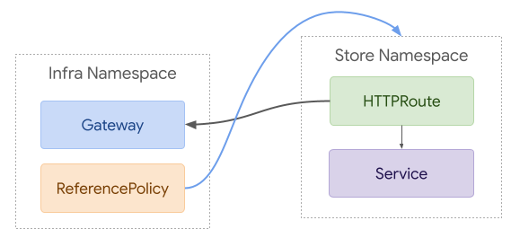

# GEP-724: Refresh Route-Gateway Binding

* Issue: [#724](https://github.com/kubernetes-sigs/gateway-api/issues/724)
* Status: Standard

## TLDR

This GEP proposes changes to Route-Gateway binding that will result in Routes
attaching to Gateways with direct references. When supporting Routes in multiple
namespaces, Gateways will need to specify the namespaces they trust Routes in.
These changes will slightly simplify the Route-Gateway relationship and make way
for the future addition of Route inclusion (Routes including other Routes).

## Goals

Refactor cross-namespace Route-Gateway binding to:

* Be more consistent with [cross-namespace references from
  Routes](/geps/gep-709)
* Provide a clear path to enable Route inclusion (Routes including Routes).
* Simplify user experience based on initial feedback.
* Enable other kinds of Route parents in addition to Gateway, this could include:
    * Routes (as part of one potential approach to Route inclusion)
    * Custom Gateway resources
    * Mesh resources

## Out of scope

* Defining how Route inclusion will work.

## Existing Approach

The existing API already supports cross-namespace references. Gateways configure
the following:

* A Route label selector
* Namespaces: Same, Selector, or All

Routes then have three options as far as which Gateways can bind to them:

* Same namespace (default)
* From a list of Gateways
* All

Although this enables a great deal of flexibility, it can lead to confusion. For
example, 2 separate label selectors from Gateway can be challenging for users to
compute. It requires users to do to label selector lookups and then compute the
intersection of that result. Additionally, the default behavior of selecting all
Routes in the same namespace makes it easy to accidentally expose applications
(see [#515](https://github.com/kubernetes-sigs/gateway-api/issues/515)).

## Proposed Changes

Although the API changes proposed here are relatively small, this represents a
larger conceptual change. Instead of Gateways selecting Routes, Routes would
directly reference the Gateways they wanted to attach to. This pattern was
already possible with the existing API, but not clearly documented.

One of the key concepts in the [cross-namespace references from Routes
GEP](/geps/gep-709) was that of a handshake for
references that cross namespace boundaries. A key part of that handshake was
that one direction included a direct reference, while the other direction
provided a way to denote trust for a set of Namespaces and kind of resources.

It seems to make sense to carry that same underlying principle through to the
Route - Gateway relationship. Given that each Gateway is likely to support many
Routes, it would not be practical to support direct references from Gateways to
Routes. Instead, it is simpler if Routes directly reference the Gateways they
want to attach to. Gateways can then specify the namespaces they trust Routes
to attach from.


In the following example, the lb Gateway indicates that it trusts Routes from
the foo Namespace, and the HTTPRoute in that namespace attaches directly to the
Gateway.

```yaml
kind: Gateway
metadata:
  name: lb
  namespace: infra
spec:
  listeners:
  - name: foo
    hostname: foo.com
    port: 80
    routes:
      namespaces:
        from: Selector
        selector:
          kubernetes.io/metadata.name: foo
---
kind: HTTPRoute
metadata:
  name: foo
  namespace: foo
spec:
  attachTo:
  - kind: Gateway
    namespace: infra
    name: lb
    sectionName: foo
  rules:
  - name: abc
    matches:
    - path: /bar
```

## Rationale

#### 1. Remove Complexity While it is Still Possible
A goal of v1alpha2 is to make any breaking changes we think we'll need to for
the lifetime of the API. After this release, we plan to provide a fully
convertible, and hopefully also fully backwards compatible, API. If we really
do need more advanced functionality in the future, it will be fairly
straightforward to add in a future release. On the other hand, it will be near
impossible to remove this complexity post-v1alpha2 if we were to leave it as is.

#### 2. Route Selection Added Confusion and Did Not Enhance Security
Although it was easy to look at the selector from Gateway -> Route as providing
Gateway admins some form of control over the Routes attached to their Gateway,
it was nothing but security theater. Route owners still had ultimate control by
deciding how their Routes were labeled. This also made it difficult to document
how Gateway and Route owners should interact. One possible explanation was that
Gateway owners should provide Route owners with a set of labels that they should
add to their Route to bind to a given Gateway. At that point, we were still
ultimately relying on Route owners to attach a Route to a Gateway, just making
it a rather clunky process.

It should be noted that this proposal does still retain the ability for Gateways
to restrict the namespaces they trust Routes to attach from. This was the only
real control Gateway admins had before this proposed change.

#### 3. The Existing Defaults Were Too Permissive
One of the common complaints about the existing API was that the defaults made
it far too easy to accidentally expose a Route. By default, a Gateway would be
bound to all Routes in the same namespace. Although that made the getting
started guide simple, it would inevitably lead to some unfortunate mistakes in
the future. As we've already learned with Kubernetes, it's very difficult to
recover from insecure defaults. Instead, it's much safer to start with more
explicit configuration that demonstrates clear intent to connect resources.

#### 4. We Need to Support non-Gateway Route Parents
With the expansion of this API, it's clear that a Route may have non-Gateway
parents. This may be other Routes, mesh implementations, or custom Gateways.
Although none of these concepts are well specified at this point, making this
change now will give us more flexibility in the future.

#### 5. Users Want Control over the Gateways Their Routes Are Attached To
Initial feedback we've received has shown that users want to have very clear
control over the Gateways their Routes are attached to. Even in the case of
Gateway replacement, many Route owners would prefer to be involved in the
process.

As we get more feedback and usage of the API, we may identify more users that
are interested in the more advanced capabilities that some form of selection may
enable, but at this point it's clear that a large portion of users value an
explicit way to attach a Route to a Gateway.

#### 6. We Need to Maintain a Handshake Between Gateways and Routes
Of course we do still need a handshake that will enable cross-namespace
references between Routes and Gateways. This proposal leaves in the core
capabilities of the v1alpha1 API for this. Gateways can specify the namespaces
they trust Routes to bind from, and Routes directly reference the Gateways they
want to attach to. This is largely similar to the ReferenceGrant model proposed
for Route->Service references, but is embedded within the Route and Gateway
resources. The alternatives below explore what this could look like with
ReferenceGrant.

## API Changes

The proposed changes here can be summarized as:

* Remove Route selector from the RouteBindingSelector in Gateway listeners.
* Replace Route kind and group with optional list of accepted kinds and groups
  in RouteBindingSelector.
* Rename RouteBindingSelector to ListenerRoutes.
* Replace the 3 options from Route -> Gateway (All, FromList, SameNamespace)
  with a reference list that supports arbitrary kinds.
* Add a name to Gateway listeners.
* Restructure listener status to include name, routeRefs, and supportedKinds
  fields.

### Gateway Spec

In Gateway spec, the only change involves removing the Route selector field.
Everything else remains the same.

#### Removed
The following fields would be removed from RouteBindingSelector:

```go
  // Selector specifies a set of route labels used for selecting
  // routes to associate with the Gateway. If this Selector is defined,
  // only routes matching the Selector are associated with the Gateway.
  // An empty Selector matches all routes.
  //
  // Support: Core
  //
  // +optional
  Selector *metav1.LabelSelector `json:"selector,omitempty"`
  // Group is the group of the route resource to select. Omitting the value or specifying
  // the empty string indicates the gateway.networking.k8s.io API group.
  // For example, use the following to select an HTTPRoute:
  //
  // routes:
  //   kind: HTTPRoute
  //
  // Otherwise, if an alternative API group is desired, specify the desired
  // group:
  //
  // routes:
  //   group: acme.io
  //   kind: FooRoute
  //
  // Support: Core
  //
  // +optional
  // +kubebuilder:default=gateway.networking.k8s.io
  // +kubebuilder:validation:MinLength=1
  // +kubebuilder:validation:MaxLength=253
  Group *string `json:"group,omitempty"`
  // Kind is the kind of the route resource to select.
  //
  // Kind MUST correspond to kinds of routes that are compatible with the
  // application protocol specified in the Listener's Protocol field.
  //
  // If an implementation does not support or recognize this
  // resource type, it SHOULD set the "ResolvedRefs" condition to false for
  // this listener with the "InvalidRoutesRef" reason.
  //
  // Support: Core
  Kind string `json:"kind"`
```

#### Added
Note: The ListMapKey annotation for listeners would also have to change to name
for this.

```go
type Listener struct {
    // Name is the name of the Listener. If more than one Listener is present
    // each Listener MUST specify a name. The names of Listeners MUST be unique
    // within a Gateway.
    //
    // Support: Core
    //
    // +kubebuilder:validation:MinLength=1
    // +kubebuilder:validation:MaxLength=253
    // +optional
    Name *string `json:"name,omitempty"`
    // ...
}
```

The RouteBindingSelector struct would be renamed to ListenerRoutes, and a Kinds
field would be added. Note that the Selector, Group, and Kind field would be
removed from this struct as described above.

```go
type ListenerRoutes struct {
  // ...
  // Kinds specifies the groups and kinds of Routes that are allowed to bind to
  // this Gateway listener. When unspecified or empty, the only limitation on
  // the kinds of Routes supported is the Listener protocol. Kind MUST
  // correspond to kinds of Routes that are compatible with the application
  // protocol specified in the Listener's Protocol field. If an implementation
  // does not support or recognize this resource type, it SHOULD set the
  // "ResolvedRefs" condition to false for this listener with the
  // "InvalidRoutesRef" reason.
  //
  // Support: Core
  //
  // +optional
  // +kubebuilder:validation:MaxItems=10
  Kinds []RouteGroupKind `json:"kinds,omitempty"`
}

type RouteGroupKind struct {
  // Group is the group of the Route.
  //
  // Support: Core
  //
  // +optional
  // +kubebuilder:default=gateway.networking.k8s.io
  // +kubebuilder:validation:MaxLength=253
  Group *string `json:"group,omitempty"`
  // Kind is the kind of the Route.
  //
  // Support: Core
  //
  // +kubebuilder:validation:MinLength=1
  // +kubebuilder:validation:MaxLength=253
  Kind string `json:"kind"`
}
```

### Gateway Status
The most significant addition to the Gateway resource is in status. It may be
helpful to share a sample of what the YAML would look like:

```yaml
status:
  listeners:
  - name: foo
    supportedKinds:
    - group: gateway.networking.k8s.io
      kind: HTTPRoute
    attachedRoutes: 1
    conditions:
    - ...
```

The key changes here all involve Listener status:

* Replace the `port`, `protocol`, and `hostname` field with `name` to take
  advantage of the new Listener name concept.
* Add a new `supportedKinds` field. This will be most useful when the
  corresponding field in the spec is left blank or when a user specifies kinds
  that a controller does not support.

Note: The ListMapKey annotation for listener status would also have to change to
name for this.

```go
// ListenerStatus is the status associated with a Listener.
type ListenerStatus struct {
    // Name is the name of the Listener.
    //
    // +kubebuilder:validation:MinLength=1
    // +kubebuilder:validation:MaxLength=253
    // +optional
    Name *string `json:"name,omitempty"`

    // SupportedKinds is the list indicating the Kinds supported by this
    // listener. When this is not specified on the Listener, this MUST represent
    // the kinds an implementation supports for the specified protocol. When
    // there are kinds specified on the Listener, this MUST represent the
    // intersection of those kinds and the kinds supported by the implementation
    // for the specified protocol.
    //
    // +kubebuilder:validation:MaxItems=10
    // +optional
    SupportedKinds []RouteGroupKind `json:"supportedKinds,omitempty"`

    // AttachedRoutes represents the total number of Routes that have been
    // successfully attached to this Listener.
    AttachedRoutes int32 `json:"attachedRoutes"`

    // Conditions...
}
```

### Routes

On Routes, we remove the `RouteGateways` struct and replace it with a list of
parent references to attach to.

#### Removed
From Route Specs:
```go
  // Gateways defines which Gateways can use this Route.
  //
  // +optional
  // +kubebuilder:default={allow: "SameNamespace"}
  Gateways *RouteGateways `json:"gateways,omitempty"`
```

And the structs that references:
```go
// RouteGateways defines which Gateways will be able to use a route. If this
// field results in preventing the selection of a Route by a Gateway, an
// "Admitted" condition with a status of false must be set for the Gateway on
// that Route.
type RouteGateways struct {
  // Allow indicates which Gateways will be allowed to use this route.
  // Possible values are:
  // * All: Gateways in any namespace can use this route.
  // * FromList: Only Gateways specified in GatewayRefs may use this route.
  // * SameNamespace: Only Gateways in the same namespace may use this route.
  //
  // +optional
  // +kubebuilder:validation:Enum=All;FromList;SameNamespace
  // +kubebuilder:default=SameNamespace
  Allow *GatewayAllowType `json:"allow,omitempty"`

  // GatewayRefs must be specified when Allow is set to "FromList". In that
  // case, only Gateways referenced in this list will be allowed to use this
  // route. This field is ignored for other values of "Allow".
  //
  // +optional
  GatewayRefs []GatewayReference `json:"gatewayRefs,omitempty"`
}
```

#### Added
To Route Specs:
```go
  // ParentRefs references the resources that can attach to this Route. The only
  // kind of parent resource with "Core" support is Gateway. This API may be
  // extended in the future to support additional kinds of parent resources such
  // as one of the route kinds. It is invalid to reference an identical parent
  // more than once. It is valid to reference multiple distinct sections within
  // the same parent resource, such as 2 Listeners within a Gateway.
  //
  // It is possible to separately reference multiple distinct objects that may
  // be collapsed by an implementation. For example, some implementations may
  // choose to merge compatible Gateway Listeners together. If that is the case,
  // the list of routes attached to those resources should also be merged.
  //
  // +optional
  // +kubebuilder:validation:MaxItems=16
  ParentRefs []ParentRef `json:"parentRefs,omitempty"`
```

And the struct that references:
```go
// ParentRef identifies an API object that should be considered a parent of this
// resource. The only kind of parent resource with "Core" support is Gateway.
// This API may be extended in the future to support additional kinds of parent
// resources, such as HTTPRoute.
type ParentRef struct {
  // Group is the group of the referent.
  //
  // Support: Core
  //
  // +kubebuilder:validation:MinLength=1
  // +kubebuilder:validation:MaxLength=253
  // +kubebuilder:default=gateway.networking.k8s.io
  Group string `json:"group"`

  // Kind is kind of the referent.
  //
  // Support: Core (Gateway)
  // Support: Extended (Other Resources)
  //
  // +kubebuilder:validation:MinLength=1
  // +kubebuilder:validation:MaxLength=253
  // +kubebuilder:default=Gateway
  // +optional
  Kind *string `json:"kind,omitempty"`

  // Namespace is the namespace of the referent. When unspecified (empty
  // string), this will either be:
  //
  // * local namespace of the target is a namespace scoped resource
  // * no namespace (not applicable) if the target is cluster-scoped.
  //
  // Support: Extended
  //
  // +kubebuilder:validation:MinLength=1
  // +kubebuilder:validation:MaxLength=253
  // +optional
  Namespace *string `json:"namespace,omitempty"`

  // Scope represents if this refers to a cluster or namespace scoped resource.
  // This may be set to "Cluster" or "Namespace".
  //
  // Support: Core (Namespace)
  // Support: Extended (Cluster)
  //
  // +kubebuilder:validation:Enum=Cluster;Namespace
  // +kubebuilder:default=Namespace
  // +optional
  Scope *string `json:"scope,omitempty"`

  // Name is the name of the referent.
  //
  // Support: Core
  //
  // +kubebuilder:validation:MinLength=1
  // +kubebuilder:validation:MaxLength=253
  Name string `json:"name"`

  // SectionName is the name of a section within the target resource. In the
  // following resources, SectionName is interpreted as the following:
  //
  // * Gateway: Listener Name
  //
  // Implementations MAY choose to support attaching Routes to other resources.
  // If that is the case, they MUST clearly document how SectionName is
  // interpreted.
  //
  // When unspecified (empty string), this will reference the entire resource.
  // For the purpose of status, an attachment is considered successful if at
  // least one section in the parent resource accepts it. For example, Gateway
  // listeners can restrict which Routes can bind to them by Route kind,
  // namespace, or hostname. If 1 of 2 Gateway listeners accept attachment from
  // the referencing Route, the Route MUST be considered successfully
  // attached. If no Gateway listeners accept attachment from this Route, the
  // Route MUST be considered detached from the Gateway.
  //
  // Support: Core
  //
  // +kubebuilder:validation:MinLength=1
  // +kubebuilder:validation:MaxLength=253
  // +optional
  SectionName *string `json:"sectionName,omitempty"`
}
```

#### Changed

To accomodate Routes with arbitrary types of parents, `RouteGatewayStatus` would
be renamed to `RouteParentStatus`. Similarly, the `GatewayRef` inside that
struct would be replaced with the `ParentRef` struct included above.

### Advantages

* Simplifies the API by providing a single way to attach Routes to Gateway.
* Assigns clear responsibilities to Gateway and Route owners.
* Consistent with pattern of direct references from Routes to all associated
  resources.
* Enables attaching Routes to arbitrary parents, such as custom Gateways, other
  Routes (to be defined), or Meshes.
* Prevents accidental exposure of Routes.
* Easy to understand which Gateways/parents a Route is attached to.
* Further simplifies path to Route inclusion.
* Follows pattern of direct reference in one direction with a broader trust
  reference in the other direction.
* Aligns with initial user feedback.

### Disadvantages

* Attaching a Route to a named listener with SectionName may be a bit confusing.
* Does not utilize existing ReferenceGrant mechanism.
* May be more difficult to understand which Routes are attached to a Gateway.
* Adding/replacing a Gateway requires changes to Routes.

### Potential Expansion
In the future, it may be useful to add a selector from Route -> Parent. Although
this would enable greater flexibility, it also significantly increases
complexity.

## Alternatives

### 1. ReferenceGrant with Gateways selecting Routes


A compelling alternative to this proposal would involve retaining the Route
selector in Gateway and replacing the trust concept in Routes with
ReferenceGrant. To represent the same example as above, we'd use a Route
selector on Gateway, a corresponding label on the HTTPRoute, and a
ReferenceGrant that allowed it:

```yaml
kind: Gateway
metadata:
  name: xlb
  namespace: infra
spec:
  listeners:
  - name: foo
    hostname: foo.com
    port: 80
    routes:
      kind: HTTPRoute
      selector:
        gateway: xlb
      namespaces:
        from: Selector
        selector:
          kubernetes.io/metadata.name: foo
---
kind: HTTPRoute
metadata:
  name: foo
  namespace: foo
  labels:
    gateway: xlb
spec:
  rules:
  - name: abc
    matches:
    - path: /bar
---
kind: ReferenceGrant
metadata:
  name: infra-gateways
  namespace: foo
spec:
  from:
  - group: gateway.networking.k8s.io
    kind: Gateway
    namespace: infra
  to:
  - group: gateway.networking.k8s.io
    kind: HTTPRoute
```

#### Advantages

* Consistent use of ReferenceGrant throughout the API.
* Provides a single way of binding Gateways to Routes.

#### Disadvantages

* Even the simplest cross-namespace reference from Gateway -> Route would
  require a ReferenceGrant in each target namespace.
* Existing demos and examples would become significantly more verbose.
* Does not suppport attaching Routes to arbitrary parents.
* Does not prevent accidental exposure of Routes.
* Route owners have limited control in terms of which Gateways their Route is
  attached to.

### 2. ReferenceGrant with Routes referencing Gateways



The other way we could use ReferenceGrant would be with Routes referencing
Gateways. Unfortunately the nested structure of Gateways makes this nearly
impossible to do effectively. A core concept for Gateways is that each listener
should be able to attach to an entirely different set of Routes. For example,
a Gateway may want to delegate foo.com to the foo namespace and bar.com to the
bar namespace. Unfortunately that would be very difficult to recreate with
ReferenceGrant.

ReferenceGrant is fundamentally about trusting references from resource of kind
Foo in to resources of kind Bar. Names and section names are intentionally
excluded. If we added both of those concepts to ReferenceGrant, this would be
possible, but quite complex and verbose. This is what the example from above
would look like with this approach:

```yaml
kind: Gateway
metadata:
  name: lb
  namespace: infra
spec:
  listeners:
  - name: foo
    hostname: foo.com
    port: 80
---
kind: ReferenceGrant
metadata:
  name: foo-lb
  namespace: infra
spec:
  from:
  - group: gateway.networking.k8s.io
    kind: HTTPRoute
    namespace: foo
  to:
  - group: gateway.networking.k8s.io
    kind: Gateway
    name: lb
    sectionName: foo
---
kind: HTTPRoute
metadata:
  name: foo
  namespace: foo
spec:
  parentRefs:
  - kind: Gateway
    namespace: infra
    name: lb
    sectionName: foo
  rules:
  - name: abc
    matches:
    - path: /bar
```

#### Advantages

* Consistent use of ReferenceGrant throughout the API.
* Provides a single way of binding Gateways to Routes.
* Supports attaching Routes to arbitrary parents.
* Prevents accidental exposure of Routes.

#### Disadvantages

* In most cases, each listener in a Gateway would require a unique
  ReferenceGrant resource.
* Even the simplest cross-namespace reference from Route -> Gateway would
  require a ReferenceGrant in each target namespace. This could either rule
  out or significantly complicate self-service use-cases.
* Existing demos and examples would become significantly more verbose.
* ReferenceGrant would become more complex for all other use cases.

## References

**GEPs**

* [GEP 709: ReferenceGrant + Cross Namespace References from Routes](/geps/gep-709)

**Docs:**

* [Gateway API References Doc](https://docs.google.com/document/d/18MoabVA-fr5XL9cYdf6cxclqRwFpOvHUXV_UYzSiooY/edit)
* [Simplifying Gateway Route Binding](https://docs.google.com/document/d/1YVyB2dizACWrn8Rj31hQFBwCYqgyFKsxKeeGlv-iQCs/edit)

**Issues:**

* [Simplify Gateway Route Binding](https://github.com/kubernetes-sigs/gateway-api/issues/594)
* [Route selector improvements on Gateway](https://github.com/kubernetes-sigs/gateway-api/issues/515)