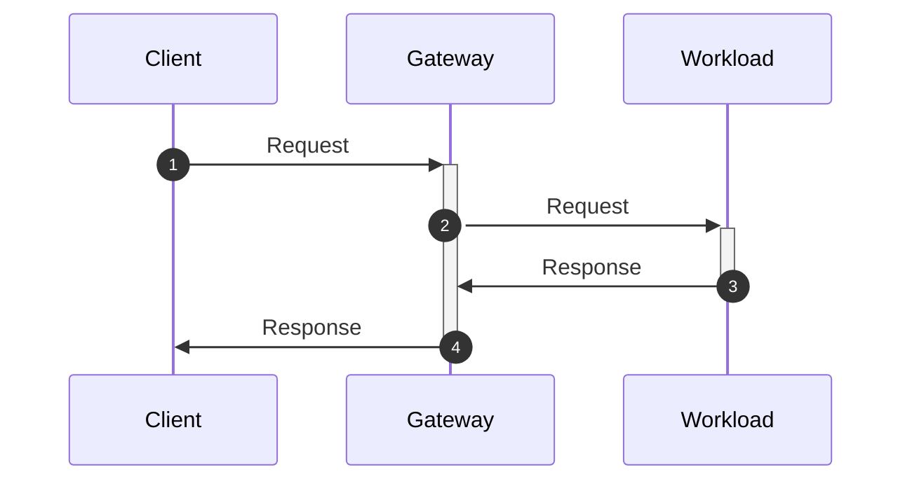
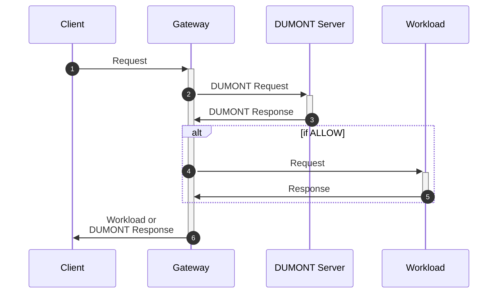
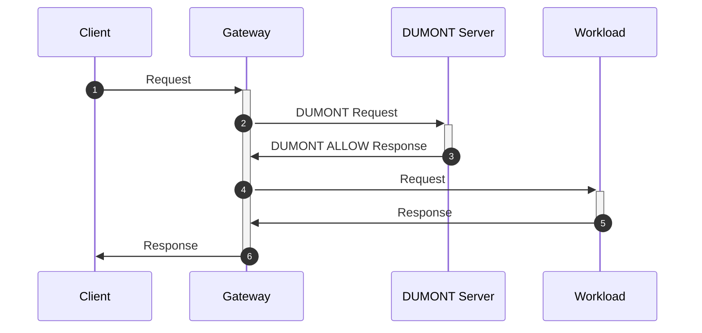
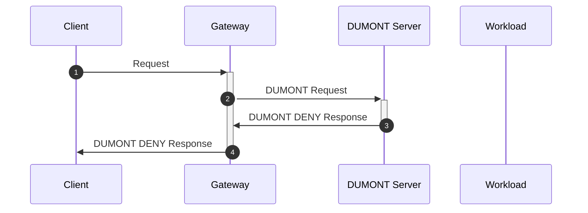

# GEP-9999: DUMONT

* Issue: [#9999](https://github.com/kubernetes-sigs/gateway-api/issues/9999)
* Status: Memorandum

(See [status definitions](../overview.md#gep-states).)

## Introduction

Authentication and authorization are necessary tasks for a great many
applications: it can obviously be critical to ensure that only authorized
users can access specific resources and perform certain actions. In a
distributed architecture, it is often very useful to centralize these tasks in
a single service, which can then be used by all components of the system. This
approach allows for consistent policy enforcement, easier management of access
control rules, and the ability to update policies dynamically without
requiring changes to individual services.

A common implementation pattern for centralized authentication and
authorization is to give a centralized API gateway or proxy the ability to
offload authorization decisions to an external service: when a request arrives
at the proxy, the proxy sends a request to this external service, and the
service responds with the authorization decision. This pattern is simple to
implement and to reason about, while still allowing a great amount of
flexibility in how authorization decisions are made.

The [Envoy Proxy] has had this ability since its 1.7.0 release in June 2018,
via its external authorization (`ext-authz`) filter. The `ext-authz` filter
can speak to an external authorization service using either HTTP or gRPC, but
the protocol used for communication was never been formally specified nor even
named. This document aims to fill that gap by providing the protocol with a
formal specification, as well as a name. Since the name is not yet finalized,
we will refer to the system as "DUMONT" for now.

Although DUMONT was first implemented in the Envoy Proxy, its design is not
specific to Envoy, and is suitable for use with any other proxy or API
gateway. However, one challenge with standardizing DUMONT is that its gRPC
variant currently uses message types that contain elements that _are_ specific
to Envoy, and in fact the messages are currently defined in the Envoy
repository. DUMONT MUST NOT be considered fully standardized until these
message types have found a home outside the Envoy repository, and the
Envoy-specific elements have been refactored out of the messages.

[Envoy Proxy]: https://www.envoyproxy.io/

## Terminology

The key words "MUST", "MUST NOT", "REQUIRED", "SHALL", "SHALL NOT",
"SHOULD", "SHOULD NOT", "RECOMMENDED", "MAY", and "OPTIONAL" in this
document are to be interpreted as described in BCP 14 ([RFC2119] and
[RFC8174]) when they appear in all capitals, as shown here.

[RFC2119]: https://www.rfc-editor.org/info/rfc2119
[RFC8174]: https://www.rfc-editor.org/info/rfc8174

In this document, we will refer to the following request flow, showing a basic
request from a _client_ to a _workload_ via a _gateway_:



When DUMONT is involved, the flow also includes a _DUMONT server_:



* **Client** always refers to the entity that first initiates a request.
    In most cases where DUMONT is used, the client will be taking action on
    behalf of a human user, though this is not a requirement of DUMONT.

* **Gateway** always refers to the entity responsible for implementing
    authorization, routing, etc. In the context of DUMONT, the gateway acts
    as a DUMONT client, sending requests to the DUMONT server for
    authorization decisions.

* **Workload** always refers to the entity that is the final destination
    of the request, which is typically a service or application that
    processes the request and returns a response. The workload is not
    directly involved in the DUMONT protocol but is the target of the
    request after authorization is granted by the DUMONT server.

* **DUMONT Server** always refers to the entity that implements the DUMONT
    protocol to receive authorization requests from gateways, evaluate
    them, and return authorization decisions. A single DUMONT server can
    typically be used by multiple gateways simultaneously.

## DUMONT Protocol Overview

When the gateway receives a request that needs to be authorized, it sends a
DUMONT Request to the DUMONT server with the details of the request. The DUMONT
server MUST respond with either a DUMONT ALLOW response, indicating that the
request is authorized to proceed, or a DUMONT DENY response, indicating that the
request is not authorized to proceed and providing a response which the
gateway MUST forward to the client.

If the DUMONT server responds with a DUMONT ALLOW response, the gateway forwards
the request to the workload. The gateway MUST NOT forward the DUMONT ALLOW
response to the client, but the DUMONT ALLOW response MAY include HTTP headers
which the gateway MUST include in the forwarded request to the workload.

If the DUMONT server responds with a DUMONT DENY response, the gateway MUST
forward the DUMONT DENY response to the client. The DUMONT DENY response includes
an HTTP status code, headers, and body, allowing the DUMONT server to control
the client's experience when a request is denied. The gateway MUST NOT forward
the original request to the workload in this case.

**Forwarding the DUMONT DENY response to the client is critical**. DUMONT is
intended to be applicable to a wide variety of authentication flows ranging
from (for example) HTTP Basic Auth to (for example) OAuth2. As such, the DUMONT
protocol deliberately gives the DUMONT server authority over what exactly must
be sent to the client in the case of a DUMONT DENY response, so that the system
can meaningfully participate in the widest possible set of authentication
flows.

## DUMONT Protocol Variants

DUMONT is defined with both HTTP and gRPC variants. Where possible,
implementations of DUMONT SHOULD support both variants, but they MAY support
only one.

The two variants serve the same function and are largely equivalent, with the
critical difference that the gRPC variant supports more features because it
encapsulates the client request in a gRPC message, where the HTTP variant
simply uses a standard HTTP request that mimics the client request. This
difference has important implications, which allow the DUMONT gRPC variant
to support more features than the HTTP variant.

As an illustration, consider the following example of a request from the
client:

```http
POST /api/v1/resource HTTP/1.1
Host: example.com
Authorization: Bearer <token>
Content-Type: application/json
Content-Length: 27
X-Custom-Header: custom-value

{
  "key": "value"
}
```

In the gRPC variant, this request would be encapsulated in a `CheckRequest`
gRPC message. Assuming that DUMONT client is not configured to forward the body,
the `CheckRequest` might look like this:

```yaml
CheckRequest:
  attributes:
    source: ...
    ...
    request:
      time: ...
      http:
        method: "POST"
        path: "/api/v1/resource"
        headers:
          Host: "example.com"
          Authorization: "Bearer <token>"
          Content-Type: "application/json"
          Content-Length: "27"
          X-Custom-Header: "custom-value"
```

However, in the HTTP variant, the request would be sent as a standard HTTP
request to the DUMONT server, and in that case, the headers MUST NOT all be
copied unmodified to the DUMONT request. Instead, the HTTP variant defines the
concept of _allowed request headers_, which is the subset of HTTP headers that
are explicitly configured to be forwarded. The DUMONT HTTP request might
therefore look like this:

```http
POST /api/v1/resource HTTP/1.1
Host: example.com
Authorization: Bearer <token>
Content-Length: 0

```

Since it has no body, the `Content-Length` header is set to `0`, and the
`Content-Type` header is omitted entirely. Likewise, `X-Custom-Header` would
typically not be configured as an allowed request header, so it would be
stripped from the request before forwarding it to the DUMONT server.

Suppose that in our example, the DUMONT server decides to allow the request. In
both variants, the DUMONT server responds with a DUMONT ALLOW response, which MAY
include a set of headers to be copied into the forwarded request to the
workload. For example, suppose that our DUMONT server wants to add a
`Set-Cookie` header and a custom `X-DUMONT-Magic` header:

```http
Set-Cookie: sessionId=abc123; Path=/; HttpOnly
X-DUMONT-Magic: 42
```

In the DUMONT gRPC variant, an `OK` status and the new headers are included in
the `CheckResponse` message:

```yaml
CheckResponse:
  status: OK
  http_response:
    ok_response:
      headers:
        - key: "Set-Cookie"
          value: "sessionId=abc123; Path=/; HttpOnly"
        - key: "X-DUMONT-Magic"
          value: "42"
```

However, in the DUMONT HTTP variant, the DUMONT ALLOW response is a standard HTTP
response, which MUST use an HTTP 200 status to indicate the DUMONT ALLOW
response, and which MUST include the headers to be copied into the request
inline as normal HTTP headers (because that's the only real way to use HTTP
for this). In turn, this requires the DUMONT HTTP variant to define a set of
_allowed authorization headers_, since it is not appropriate to copy all the
HTTP headers from the DUMONT server response to the forwarded request:

```http
HTTP/1.1 200 OK
Set-Cookie: sessionId=abc123; Path=/; HttpOnly
X-DUMONT-Magic: 42
Content-Length: 0
```

The DUMONT HTTP variant exists because it often provides a simpler path to
adoption: gateways generally already include everything needed to make DUMONT
HTTP requests, and in many cases, existing HTTP-based authorization services
can be used as DUMONT servers with minimal changes. The tradeoff is that the
DUMONT HTTP variant MUST be very careful indeed with handling HTTP headers -- in
particular, the DUMONT HTTP variant is not appropriate for use in cases where it
is not possible to define the allowed request headers ahead of time.

The DUMONT gRPC variant, by contrast, does not need to rely on the limited
capabilities of HTTP, and as such can be used in wider range of use cases. The
tradeoff is that the additional features come with additional complexity:
since the gRPC messages involved took considerable advantage of types that
were already available within the Envoy proxy, adopting the DUMONT gRPC variant
outside of Envoy involves a certain amount of work to set up data structures
in exactly the same way that Envoy does.

Given all of the above, the DUMONT gRPC variant is recommended for new
implementations, but **the DUMONT HTTP variant MUST be used as the reference
variant wherever this document leaves questions about the semantics of DUMONT.**
This is because the HTTP variant is more constrained by the transport
protocol: the gRPC variant should be able to support anything supported by the
HTTP variant, but the converse is not true.

### DUMONT Request Overview

The DUMONT request provides the DUMONT server with all the information it needs to
make an authorization decision, and includes:

- The HTTP verb (e.g., GET, POST, PUT, DELETE) of the request

- The HTTP path of the request (including any query parameters)

- The request headers (or, in DUMONT HTTP, the allowed request headers)

- A (usually configurable) section of the beginning of the request body, not
  to exceed the _maximum forwarded body size_

#### DUMONT HTTP Mandatory Request Headers

In DUMONT HTTP implementations, the following headers MUST always be included in
the allowed request headers, and as such MUST always be included in a DUMONT
HTTP request:

- `Authorization`
- `Cookie`
- `From`
- `Forwarded`
- `Proxy-Authorization`
- `User-Agent`
- `X-Forwarded-For`
- `X-Forwarded-Host`
- `X-Forwarded-Proto`

### DUMONT Response Overview

The DUMONT response is the response sent by the DUMONT server to the gateway in
response to a DUMONT request. It can be either a DUMONT ALLOW response or a
DUMONT DENY response.

#### DUMONT ALLOW Response

The DUMONT ALLOW response indicates that the request is authorized to proceed.



In addition to the ALLOW decision, a DUMONT ALLOW response includes a set of
headers that are to be copied from the DUMONT ALLOW response into the client
request before it is forwarded to the workload. In DUMONT HTTP, only headers
from the allowed authorization headers are copied, while in DUMONT gRPC, all the
headers supplied are copied.

If a header to be copied is already present in the original request, the value
from the DUMONT ALLOW response MUST replace the value from the original request.

##### DUMONT HTTP Mandatory Allowed Authorization Headers

In DUMONT HTTP implementations, the following headers MUST always be included in
the allowed authorization headers, and as such MUST always be copied from a
DUMONT HTTP ALLOW response to the client request before forwarding the request
to the workload:

- `Authorization`
- `Location`
- `Proxy-Authenticate`
- `Set-Cookie`
- `WWW-Authenticate`

#### DUMONT DENY

The DUMONT DENY response indicates that the request is **not** authorized to
proceed. In this case, the DUMONT server MUST provide a response that the
gateway MUST forward to the client: in DUMONT gRPC, the HTTP status code,
headers, and body are explicitly defined in the message, while in DUMONT HTTP,
the DUMONT DENY response is itself the custom response that MUST be forwarded to
the client.



The gateway MAY do further gateway-dependent processing of the DUMONT DENY
response before forwarding it to the client, but it MUST NOT alter the HTTP
status code defined by the DUMONT DENY response, and it SHOULD NOT alter the
headers from the DUMONT DENY response. Additionally, the gateway MUST NOT
forward the original request to the workload in any case where a DUMONT DENY
response is received from the DUMONT server.

As noted earlier, **forwarding the DUMONT DENY response to the client is
critical**. DUMONT is intended to be applicable to a wide variety of
authentication flows ranging from (for example) HTTP Basic Auth to (for
example) OAuth2. As such, the DUMONT protocol deliberately gives the DUMONT server
authority over what exactly must be sent to the client in the case of a DUMONT
DENY response, so that the system can meaningfully participate in the widest
possible set of authentication flows.

#### DUMONT Error Responses

Any response other than a DUMONT ALLOW or DUMONT DENY response (for example, a
connection reset, or a response that does not conform to the DUMONT protocol)
MUST be treated as an error. In this case, the gateway MUST return an HTTP
error response to the client, and MAY include additional information about the
error in the response body.

The gateway MAY permit configuring the HTTP status code to be returned in the
event of a DUMONT error response. If not explicitly configured otherwise, the
gateway MUST return a 403 Forbidden status code for a DUMONT error response.

### DUMONT HTTP Specifics

#### DUMONT HTTP ALLOW Response

The DUMONT HTTP ALLOW response is defined as a DUMONT response with an HTTP status
of 200 OK. **A DUMONT response with an HTTP status code other than 200 MUST NOT
be interpreted as a DUMONT ALLOW response.** This includes other 2yz status
codes, such as 201 Created or 202 Accepted, which MUST NOT be interpreted as
DUMONT ALLOW responses.

#### DUMONT HTTP DENY Response

DUMONT HTTP DENY responses are defined as DUMONT responses with an HTTP status
code other than 200 OK or 5yz server errors. Any such response MUST be
forwarded to the client as described above.

#### DUMONT HTTP Error Responses

Any other response to a DUMONT HTTP request (for example, a timeout, or a 503
Service Unavailable response) MUST be treated as an DUMONT error response. In
this case, the gateway MUST return an HTTP error response to the client, and
MAY include additional information about the error in the response body.

#### DUMONT HTTP Examples

##### DUMONT HTTP ALLOW Response Example

TBA

##### DUMONT HTTP DENY Response Example

TBA

### DUMONT gRPC Specifics

Although DUMONT as a protocol is applicable beyond Envoy, the DUMONT gRPC message
types are currently, and unfortunately, more tied to Envoy than the rest of
the protocol. In particular, the most authoritative protobuf definitions for
the DUMONT gRPC messages currently reside in the Envoy repo, and some elements of
the current protobuf definitions are more Envoy-specific than is appropriate
for an open standard.

In order for the DUMONT protocol to be considered standardized, the DUMONT gRPC
message definition MUST be moved out of the Envoy repository into a more
neutral location, and the Envoy-specific metadata MUST be refactored. For the
moment, though, rather than reproducing the message definitions in this
document, we will instead present high-level descriptions of the messages, and
give links to the Envoy repo for the full current protobuf definitions.

#### The DUMONT Authorization Service

At the highest level of the DUMONT gRPC variant is the `Authorization` service
defined in [api/envoy/service/auth/v3/external_auth.proto] in the Envoy
repository. This service defines a single `Check` RPC method, which takes a
`CheckRequest` message as an argument and returns a `CheckResponse` message.
Both of these messages are also defined in
[api/envoy/service/auth/v3/external_auth.proto].

[api/envoy/service/auth/v3/external_auth.proto]: https://raw.githubusercontent.com/envoyproxy/envoy/refs/heads/main/api/envoy/service/auth/v3/external_auth.proto


#### DUMONT gRPC `CheckReqest`

`CheckRequest` is a wrapper around the Envoy `AttributeContext` message,
defined in [api/envoy/service/auth/v3/attribute_context.proto]. This message
contains a _wide_ variety of information about the request:

- `source`: information about the original client of the request
- `destination`: information about where the gateway accepted the request
  (this is _not_ the destination workload; that won't be known yet)
- `request`: information about the request itself, including the HTTP verb,
  path, headers, and body
- `tls_session`: information about the TLS session, if any, that was used to
  establish the connection between the client and the gateway

There are also three elements that are very Envoy-specific, representing
metadata associated with the Envoy configuration at multiple levels. These
elements MUST be refactored before the DUMONT gRPC variant can be considered
standardized:

- `context_extensions`, `metadata_context`, and `route_metadata_context`:
  Envoy-specific metadata at several different levels

[api/envoy/service/auth/v3/attribute_context.proto]: https://github.com/envoyproxy/envoy/blob/main/api/envoy/service/auth/v3/attribute_context.proto

#### DUMONT gRPC `CheckResponse`

`CheckResponse` contains four elements:

- `status`: a `google.rpc.Status` message indicating the result of the
  authorization check.

- `ok_response`: an `OkHTTPResponse` message that MUST be provided if `status`
  is `OK`. This is the DUMONT gRPC ALLOW response.

- `denied_response`: a `DeniedHTTPResponse` message that MUST be provided if
  `status` is anything other than `OK`. This is the DUMONT gRPC DENY response.

- `dynamic_metadata`: gateway-dependent metadata that can be consumed by the
  gateway in its next routing step

Note that `dynamic_metadata` is _not_ particularly specific to Envoy; the DUMONT
protocol can be standardized without needing to refactor this element.

Exactly one of `ok_response` or `denied_response` MUST be provided in a
`CheckResponse`. The `status` field MUST be set to `OK` if `ok_response` is
present and MUST NOT be set to `OK` if `denied_response` is present.

`CheckResponse`, `OkHTTPResponse`, and `DeniedHTTPResponse` are all currently
defined in [api/envoy/service/auth/v3/external_auth.proto] in the Envoy
repository.

#### DUMONT gRPC ALLOW Response

The DUMONT gRPC ALLOW response is defined as a DUMONT response with `status` set to
`OK` and the `ok_response` field set to a valid `OkHTTPResponse` message.

The `OkHTTPResponse` message contains:

- `headers`: a list of `HeaderValueOption`s defining headers to added to the
  forwarded request to the workload

- `headers_to_remove`: a list of `string`s naming headers to be removed from
  the forwarded request to the workload

- `query_parameters_to_set`: a list of `QueryParameter`s defining query
  parameters to be added to the forwarded request to the workload

- `query_parameters_to_remove`: a list of `string`s naming query
  parameters to be removed from the forwarded request to the workload

  - `response_headers_to_add`: a list of `HeaderOptionValue`s defining headers
    to be added to the _response_ going back to the client

The `HeaderValueOption` and `QueryParameter` messages are defined in
[api/envoy/type/v3/base.proto] in the Envoy repository. Both contain a name
and a value, but the `HeaderValueOption` message also contains an
`append_action` element to indicate the action to take when the header to be
added is already present in the request.

The `OkHTTPResponse` message also contains some deprecated elements which MUST
be removed as part of the DUMONT standardization process:

- `dynamic_metadata`: superseded by the `dynamic_metadata` field in
  `CheckResponse`

[api/envoy/type/v3/base.proto]: https://raw.githubusercontent.com/envoyproxy/envoy/refs/heads/main/api/envoy/config/core/v3/base.proto

##### Headers that Cannot be Removed

A gateway MUST NOT remove HTTP/2 pseudo-headers (such as `:method`,
`:authority`, `:scheme`, and `:path`) or the `Host` header from the forwarded
request to the workload. If `headers_to_remove` mentions any of these headers,
the gateway MUST ignore the request to remove them.

##### Open Questions

- Should `response_headers_to_add` be part of the DUMONT standard? What are the
  use cases here?

#### DUMONT gRPC DENY Response

The DUMONT gRPC DENY response is defined as a DUMONT response with `status` set to
`DENIED` and the `denied_response` field set to a valid `DeniedHTTPResponse`
message.

The `DeniedHTTPResponse` message contains:

- `status`: the HTTP status to return to the client

- `headers`: a list of `HeaderValueOption`s providing the complete set of
  headers to be included in the response to the client

- `body`: a string containing the body to be included in the response to the
  client

As with the DUMONT HTTP DENY, the DUMONT gRPC DENY response is intended to give the
DUMONT server full authority over the response sent to the client in the case of
a denied request. The gateway MUST forward the DUMONT DENY response to the
client; it MUST NOT alter the HTTP status provided by the DUMONT server, and it
SHOULD NOT alter the headers or body provided by the DUMONT server.

#### DUMONT gRPC Error Responses

Any other response to a DUMONT gRPC request (for example, a timeout) MUST be
treated as an DUMONT error response. In this case, the gateway MUST return an
HTTP error response to the client, and MAY include additional information
about the error in the response body.

#### DUMONT gRPC Examples

##### DUMONT gRPC ALLOW Response Example

TBA

##### DUMONT gRPC DENY Response Example

TBA

## DUMONT Gateway Configuration

The gateway SHOULD allow its operator to configure the following
characteristics of the DUMONT client, at minimum:

- The DUMONT server to which the gateway should send requests

- The set of allowed request headers

- The set of allowed authorization headers

- The maximum forwarded body size

The gateway MAY allow configuring additional functionality (for example, Envoy
allows the operator to configure whether the gateway should truncate message
bodies longer than the maximum forwarded body size, or whether the gateway
should instead return a 413 Request Entity Too Large response in such cases).

The gateway MUST allow its operator to configure the DUMONT client at a global
level, and SHOULD allow configuring with finer granularities (for example, per
route).
