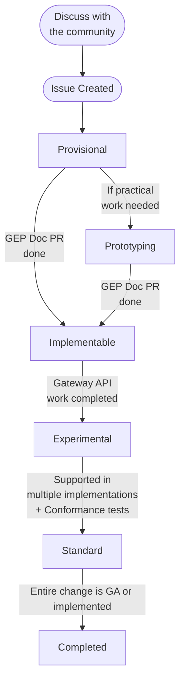

# Gateway Enhancement Proposal (GEP)

Gateway Enhancement Proposals (GEPs) serve a similar purpose to the [KEP][kep]
process for the main Kubernetes project:

1. Ensure that changes to the API follow a known process and discussion
  in the OSS community.
1. Make changes and proposals discoverable (current and future).
1. Document design ideas, tradeoffs, decisions that were made for
  historical reference.

## Process

This diagram shows the state diagram of the GEP process at a high level, but the details are below.

  

### 1. Discuss with the community
Before creating a GEP, share your high level idea with the community. This can
be in one of many forms:

- A [new GitHub Discussion](https://github.com/kubernetes-sigs/gateway-api/discussions/new)
- On our [Slack Channel](https://kubernetes.slack.com/archives/CR0H13KGA)
- On one of our [community meetings](https://gateway-api.sigs.k8s.io/contributing/?h=meetings#meetings)

### 2. Create an Issue
[Create a GEP issue](https://github.com/kubernetes-sigs/gateway-api/issues/new?assignees=&labels=kind%2Ffeature&template=enhancement.md) in the repo describing your change.
At this point, you should copy the outcome of any other conversations or documents
into this document.

### 3. Agree on the Goals
Although it can be tempting to start writing out all the details of your
proposal, it's important to first ensure we all agree on the goals. The first
version of your GEP should aim for a "Provisional" status and leave out any
implementation details, focusing primarily on "Goals" and "Non-Goals".

### 3. Document Implementation Details
Now that everyone agrees on the goals, it is time to start writing out your
proposed implementation details. These implementation details should be very
thorough, including the proposed API spec, and covering any relevant edge cases.
Note that it may be helpful to use a shared doc for part of this phase to enable
faster iteration on potential designs.

It is likely that throughout this process, you will discuss a variety of
alternatives. Be sure to document all of these in the GEP, and why we decided
against them. At this stage, the GEP should be targeting the "Implementable"
stage.

### 4. Implement the GEP as "Experimental"
With the GEP marked as "Implementable", it is time to actually make those
proposed changes in our API. In some cases, these changes will be documentation
only, but in most cases, some API changes will also be required. It is important
that every new feature of the API is marked as "Experimental" when it is
introduced. Within the API, we use `<gateway:experimental>` tags to denote
experimental fields.

Before these changes are released, they will also need to be documented.
GEPs that have not been both implemented and documented before a release
cut off will be excluded from the release.

### 5. Graduate the GEP to "Standard"
Once this feature has met the [graduation criteria](/concepts/versioning/#graduation-criteria), it is
time to graduate it to the "Standard" channel of the API. Depending on the feature, this may include
any of the following:

1. Graduating the resource to beta
2. Graduating fields to "standard" by removing `<gateway:experimental>` tags
3. Graduating a concept to "standard" by updating documentation

### 6. Close out the GEP issue

The GEP issue should only be closed once the feature has:
- Moved to the standard channel for distribution (if necessary)
- Moved to a "v1" `apiVersion` for CRDs
- been completely implemented and has wide acceptance (for process changes).

In short, the GEP issue should only be closed when the work is "done" (whatever
that means for that GEP).

## Status

Each GEP has a status field that defines it's current state. Each transition
will require a PR to update the GEP and should be discussed at a community
meeting before merging. Most GEPS will proceed through the following states:

* **Provisional:** The goals described by this GEP have consensus but
  implementation details have not been agreed to yet.
* **Prototyping:** An extension of `Provisional` which can be opted in to in
  order to indicate to the community that there are some active practical tests
  and experiments going on which are intended to be a part of the development
  of this GEP. This may include APIs or code, but that content _must_ not be
  distributed with releases.
* **Implementable:** The goals and implementation details described by this GEP
  have consensus but have not been fully implemented yet.
* **Experimental:** This GEP has been implemented and is part of the
  "Experimental" release channel. Breaking changes are still possible.
* **Standard:** This GEP has been implemented and is part of the
  "Standard" release channel. It should be quite stable.

Although less common, some GEPs may end up in one of the following states:

* **Deferred:** We do not currently have bandwidth to handle this GEP, it
  may be revisited in the future.
* **Rejected:** This proposal was considered by the community but ultimately
  rejected.
* **Replaced:** This proposal was considered by the community but ultimately
  replaced by a newer proposal.
* **Withdrawn:** This proposal was considered by the community but ultimately
  withdrawn by the author.

## Format

GEPs should match the format of the template found in [GEP-696](/geps/gep-696.md).

## Out of scope

What is out of scope: see [text from KEP][kep-when-to-use]. Examples:

* Bug fixes
* Small changes (API validation, documentation, fixups). It is always
  possible that the reviewers will determine a "small" change ends up
  requiring a GEP.

## FAQ

* Q: Why is it named GEP?
  * A: To avoid potential confusion if people start following the cross
    references to the full KEP process.
* Q: Why have a different process than mainline?
  * A: We would like to keep the machinery to an absolute minimum for now --
    this may change as we move to v1.
* Q: Is it ok to discuss using shared docs, scratch docs etc?
  * A: Yes, this can be a helpful intermediate step when iterating on design
    details. It is important that all major feedback, discussions, and
    alternatives considered in that step are represented in the GEP though. A
    key goal of GEPs is to show why we made a decision and which alternatives
    were considered. If separate docs are used, it's important that we can
    still see all relevant context and decisions in the final GEP.
* Q: When should I mark a GEP as `Prototyping` as opposed to `Provisional`?
  * A: The `Prototyping` status carries the same base meaning as `Provisional`
    in that consensus is not complete between stakeholders and we're not ready
    to move toward releasing content yet. You should use `Prototyping` to
    indicate to your fellow community members that we're in a state of active
    practical tests and experiments which are intended to help us learn and
    iterate on the GEP. These can include distributing content, but not under
    any release channel.

[kep]: https://github.com/kubernetes/enhancements
[kep-when-to-use]: https://github.com/kubernetes/enhancements/tree/master/keps#do-i-have-to-use-the-kep-process
