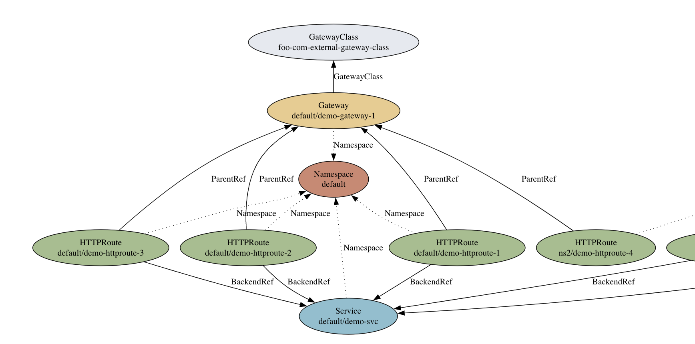

# gwctl

gwctl is a command-line tool for managing and understanding Gateway API
resources in your Kubernetes cluster. It allows you to create, view, describe,
analyze, and delete Gateway API and other Kubernetes resources. It also provides
advanced features like visualizing relationships with DOT graphs and warning
about potential issues.

> [!NOTE] gwctl is still considered an [experimental feature of the Gateway
> API](https://gateway-api.sigs.k8s.io/concepts/versioning/#release-channels-eg-experimental-standard).
> While we iterate on the early stages of this tool, bugs and incompatible
> changes will be more likely.

## Installation

1. Before you install gwctl, ensure that your system meets the following requirements:

   1. Install Git: Make sure Git is installed on your system to clone the
      project repository.
   2. Install Go. Make sure the Go language is installed on your system. You can
      download it from the [official website](https://golang.org/dl/) and follow
      the installation instructions.

2. Clone the project repository:
   
   ```bash
   git clone https://github.com/kubernetes-sigs/gateway-api.git && cd gateway-api/gwctl
   ```

3. Build the project:
   
   ```bash
   make build
   ```

4. Add binary to `PATH`:
   
   ```bash
   export PATH="${PWD}/bin:${PATH}"
   ```

5. Run gwctl:
   
   ```shell
   gwctl help
   ```

## Usage

### Example: Loading Resources

To demonstrate gwctl's capabilities, let's load some sample resources into your
Kubernetes cluster.

1. **Install Gateway API CRDs:** (gwctl can create resources and also supports
   the `-k` kustomize option)

   ```bash
   # (assumes you are inside the gwctl directory)
   gwctl apply -k ../config/crd/experimental
   ```

2. **Install Sample Resources**

   ```bash
   gwctl apply -f test/example/crds.yaml
   gwctl apply -f test/example/examples.yaml
   ```

Now that we have some resources, let's explore how gwctl can help you manage and
understand them.

### Basic Resource Management

Once your resources are loaded, gwctl offers a variety of ways to interact with
them:

```bash
# List all GatewayClasses
gwctl get gatewayclasses

# List all Gateways in the default namespace
gwctl get gateways

# List all HTTPRoutes in the 'ns2' namespace in yaml format
gwctl get httproutes -n ns2 -o yaml

# List all Services in wide format in the default namespace
gwctl get svc -o wide
```

### Policy Exploration

gwctl provides convenient shortcuts to view the policy types available and the
policies you've created:

```bash
# List all policy types
gwctl get policycrds

# List all policies in the default namespace
gwctl get policies

# See the yaml representation of a policy in a different namespace
gwctl get policies -n ns2 demo-tls-min-version-policy-2 -o yaml
```

### Beyond Gateway API Resources

gwctl's capabilities extend beyond just Gateway API resources. You can use it to
fetch any other Kubernetes resource:

```bash
# List all pods in yaml format in the 'ns2' namespace
gwctl get pods -n ns2 -o yaml

# List all CustomResourceDefinitions
gwctl get crds

# List all TimeoutPolicy resources in json format in the default namespace
gwctl get timeoutpolicy -o json
```

### Detailed Resource Descriptions

While `gwctl get` gives you the basic resource information, `gwctl describe`
provides a more in-depth view of Gateway resources, including related resources
and the policies that affect them.

```bash
gwctl describe gateways demo-gateway-1
```

This command's output might look like this:

```
.
.
.
AttachedRoutes:
  Kind       Name
  ----       ----
  HTTPRoute  default/demo-httproute-1
  HTTPRoute  default/demo-httproute-2
  HTTPRoute  default/demo-httproute-3
  HTTPRoute  ns2/demo-httproute-4
Backends:
  Kind     Name
  ----     ----
  Service  default/demo-svc
  Service  default/demo-svc
  Service  default/demo-svc
DirectlyAttachedPolicies:
  Type                       Name
  ----                       ----
  HealthCheckPolicy.foo.com  default/demo-health-check-1
  RetryOnPolicy.foo.com      default/demo-retry-policy-1
InheritedPolicies:
  Type                   Name                                 Target Kind   Target Name
  ----                   ----                                 -----------   -----------
  TimeoutPolicy.bar.com  demo-timeout-policy-on-gatewayclass  GatewayClass  foo-com-external-gateway-class
  TimeoutPolicy.bar.com  demo-timeout-policy-on-namespace     Namespace     default
EffectivePolicies:
  TimeoutPolicy.bar.com:
    timeout1: parent
    timeout2: child
    timeout3: parent
    timeout4: child
.
.
.
```

### Potential Issue Warnings

When applicable, `gwctl describe` also warns you about potential problems
related to the resource. For instance, if you delete a `ReferenceGrant` resource
that allows cross-namespace references and then describe an affected
`HTTPRoute`, you might see a warning message.

```bash
gwctl delete referencegrant -n default my-reference-grant && gwctl describe httproutes -n ns2 httproute-with-x-ns-backend

# OUTPUT:
...
Analysis:
- HTTPRoute(.gateway.networking.k8s.io) "ns2/httproute-with-x-ns-backend" is not permitted
  to reference Service "default/demo-svc"
- HTTPRoute(.gateway.networking.k8s.io) "ns2/httproute-with-x-ns-backend" references
  a non-existent Gateway(.gateway.networking.k8s.io) "ns2/demo-gateway-1"
...
```

### Resource Analysis with `gwctl analyze`

The `gwctl analyze` command lets you analyze resources *before* creating them,
revealing potential impacts or issues they might cause.

**Example: Analyzing a Single Resource**

You can analyze individual resources by piping their YAML definitions into
`gwctl analyze`. Let's illustrate this with a `Gateway` resource:

```bash
cat <<EOF | gwctl analyze -f -
kind: Gateway
apiVersion: gateway.networking.k8s.io/v1beta1
metadata:
  name: test-gateway-4
  namespace: default
spec:
  gatewayClassName: random-gateway-class  # This GatewayClass doesn't exist
  listeners:
  - name: http
    protocol: HTTP
    port: 80
EOF
```

The output will highlight potential problems:

```
Analyzing -...

Summary:

  - Created gateways/test-gateway-4 in namespace default

Potential Issues Introduced
(These issues will arise after applying the changes in the analyzed file.):

  - Gateway.gateway.networking.k8s.io/default/test-gateway-4: Gateway(.gateway.networking.k8s.io) "default/test-gateway-4" references a non-existent GatewayClass(.gateway.networking.k8s.io) "random-gateway-class":

Existing Issues Fixed
(These issues were present before the changes but will be resolved after applying them.):

  None

Existing Issues Unchanged
(These issues were present before the changes and will remain even after applying them.):

  None
```

**Example: Analyzing Multiple Resources**

You can also analyze entire YAML files containing multiple resources:

```bash
cat <<EOF > /tmp/gwctl-test.yaml
kind: ReferenceGrant
apiVersion: gateway.networking.k8s.io/v1beta1
metadata:
  name: my-reference-grant
  namespace: default
spec:
  from:
  - group: gateway.networking.k8s.io
    kind: HTTPRoute
    namespace: ns2
  to:
  - group: ""
    kind: Service
---
apiVersion: v1
kind: Service
metadata:
  name: demo-svc
spec:
  type: ClusterIP
  selector:
    app: demo-app
  ports:
  - name: tcp
    port: 80
    protocol: TCP
    targetPort: echo-port
EOF

gwctl analyze -f /tmp/gwctl-test.yaml
```

The output will summarize the changes the file would make, along with any
potential issues introduced or existing issues that would be fixed:

```
Analyzing /tmp/gwctl-test.yaml...

Summary:

  - Created referencegrants/my-reference-grant in namespace default
  - Updated services/demo-svc in namespace default

...

Existing Issues Fixed
(These issues were present before the changes but will be resolved after applying them.):

  - HTTPRoute.gateway.networking.k8s.io/ns2/demo-httproute-3: HTTPRoute(.gateway.networking.k8s.io) "ns2/demo-httproute-3" is not permitted to reference Service "default/demo-svc":
  - HTTPRoute.gateway.networking.k8s.io/ns2/httproute-with-x-ns-backend: HTTPRoute(.gateway.networking.k8s.io) "ns2/httproute-with-x-ns-backend" is not permitted to reference Service "default/demo-svc":

Existing Issues Unchanged
...
```

### Visualizing Relationships with DOT Graphs using `gwctl get -o graph`

gwctl can generate DOT graph representations to help you visualize the
connections between your Gateway API resources.

```bash
# Graph centered on a gateway
gwctl get gateway demo-gateway-1 -o graph

# Graph centered on an HTTPRoute
gwctl get httproute demo-httproute-2 -o graph
```

The output will be a DOT language representation of the graph, similar to this structure:

```
digraph "" {
    # ... (Nodes and edges representing the relationships)
}
```

You can use various online tools or install Graphviz locally to render it into
an image. Search online for "DOT graph render" to find suitable options.

Here's an example of a rendered graph:



### Deleting Resources

You can also use `gwctl delete` to remove resources from your cluster. 

```bash
# Delete a single HTTPRoute
gwctl delete httproute demo-httproute-3

# Delete all resources from a file
gwctl delete -f ./test/example/examples.yaml
```

## Get Involved

This project will be discussed in the same Slack channel and community meetings
as the rest of the Gateway API subproject. For more information, refer to the
[Gateway API Community](https://gateway-api.sigs.k8s.io/contributing/) page.

### Code of conduct

Participation in the Kubernetes community is governed by the [Kubernetes Code of
Conduct](code-of-conduct.md).

[owners]: https://git.k8s.io/community/contributors/guide/owners.md
[Creative Commons 4.0]: https://git.k8s.io/website/LICENSE
