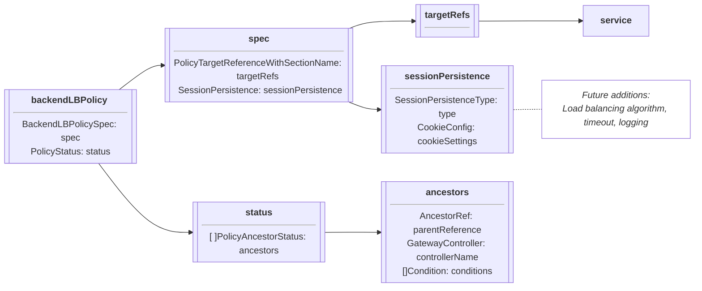
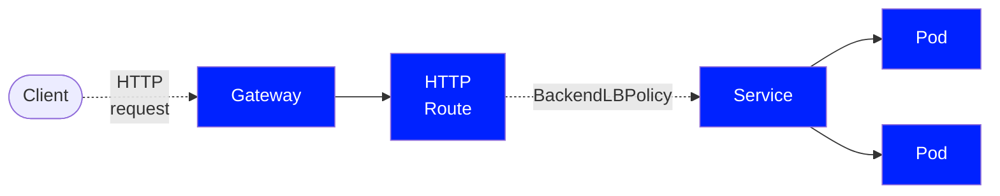

# BackendLBPolicy

??? example "Experimental Channel since v1.0.0"

    The `BackendLBPolicy` resource is Alpha and has been part of
    the Experimental Channel since `v1.0.0`. For more information on release
    channels, refer to our [versioning guide](/concepts/versioning).

`BackendLBPolicy` is a Gateway API type for handling load-balancing configuration
for the traffic between a Gateway and backend Pods through the Service API.

## Background

`BackendLBPolicy` specifically addresses the configuration of load balancing for traffic between the Gateway and backend services. This enables the Gateway to manage how traffic is distributed to backend Pods after routing has been completed.

While other API objects exist for configuring routing and connection behavior, this API object allows users to specifically configure backend load-balancing behavior, such as session persistence and load-balancing algorithms. 
For more information on load balancing configuration in the Gateway API, refer to Load Balancing configuration in Gateway API.

BackendLBPolicy is a Direct [PolicyAttachment](https://gateway-api.sigs.k8s.io/reference/policy-attachment/)
applied to a Service that accesses a backend. It does not include defaults or overrides and resides in the same namespace as the targeted backend.

In future, BackendLBPolicy enhancements will be there which add additional configurations which includes connection draining, logging that makes central manageable backend traffic policies.

## Features

BackendLBPolicy API currently supports Session persistence configuration.

- Cookie-Based Persistence - Core feture
- Header-Based Persistence - It will be extended feature and optional.

## Spec

The specification of a `BackendLBPolicy` consists of:

- `TargetRefs` - Defines the targeted API object of the policy.  Only Service is allowed.
- `SessionPersistence` - Configure the Session Persistence type (Cookie or Header)

The following chart outlines the object definitions and relationship:

The following illustrates a BackendLBPolicy integrates with a Gateway serving a backend:

### Targeting backends

A BackendLBPolicy targets a backend Pod (or set of Pods) via one or more TargetRefs to a Service.  This TargetRef is a
required object reference that specifies a Service by its Name, Kind (Service), and optionally its Namespace and Group.

!!! info "Restrictions"

    - Cross-namespace for `BackendLBPolicy` are not allowed.

### Session Persistence

This field defined the settings for session between the Gateway and the backend. It supports two types:

   - Cookie-Based Session Persistence - It ensures the client are consistently routed to the same backend using a cookie.
   - Header-Based Session Persistence - It uses the custom header for session tracking.

