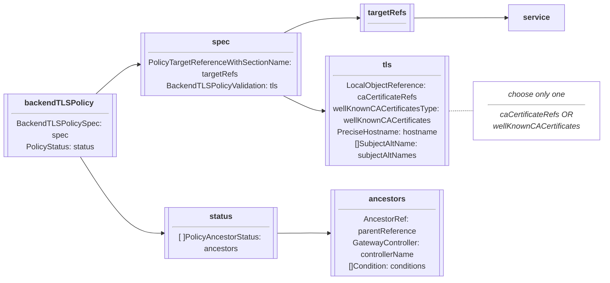
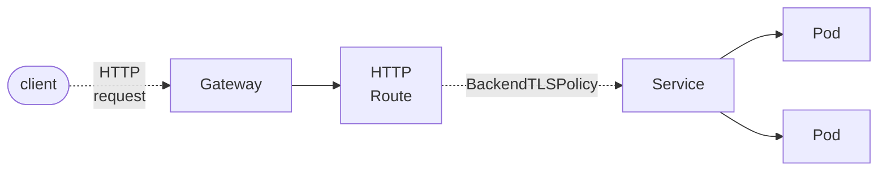

# BackendTLSPolicy

??? success "Standard Channel since v1.4.0"

    The `BackendTLSPolicy` resource is GA and has been part of the Standard
    Channel since `v1.4.0`. For more information on release channels, refer
    to our [versioning guide](../concepts/versioning.md).

[BackendTLSPolicy][backendtlspolicy] is a Gateway API type for specifying the TLS configuration
of the connection from the Gateway to a backend pod(s) via the Service API object.

## Background

`BackendTLSPolicy` specifically addresses the configuration of TLS in order to convey HTTPS from the Gateway
dataplane to the backend.  This is referred to as "backend TLS termination" and enables the Gateway to know
how to connect to a backend pod that has its own certificate.

While there are other API objects provided for TLS to be configured for **passthrough** and **edge** termination,
this API object allows users to specifically configure **backend** TLS termination.  For more information on TLS
configuration in Gateway API, see [TLS Configuration](../guides/tls.md).

BackendTLSPolicy is a Direct [PolicyAttachment](../reference/policy-attachment.md) without defaults or overrides,
applied to a Service that accesses a backend, where the BackendTLSPolicy resides in the same namespace as the
Service to which it is applied. The BackendTLSPolicy and the Service must reside in the same namespace in order
to prevent the complications involved with sharing trust across namespace boundaries.

All Gateway API Routes that point to a referenced Service should respect a configured BackendTLSPolicy.

## Spec

The specification of a [BackendTLSPolicy][backendtlspolicy] consists of:

- [TargetRefs][targetRefs] - Defines the targeted API object of the policy.  Only Service is allowed.
- [Validation][validation] - Defines the configuration for TLS, including hostname, CACertificateRefs, and
WellKnownCACertificates.
- [Hostname][hostname] - Defines the Server Name Indication (SNI) that the Gateway uses to connect to the backend.
- [SubjectAltNames][subjectAltNames] - Specifies one or more Subject Alternative Names that the backend certificate must match. When specified, the certificate must have at least one matching SAN. This field enables separation between SNI (hostname) and certificate identity validation.  A maximum of 5 SANs are allowed.  
- [CACertificateRefs][caCertificateRefs] - Defines one or more references to objects that contain PEM-encoded TLS certificates,
which are used to establish a TLS handshake between the Gateway and backend Pod.  Either CACertificateRefs or
WellKnownCACertificates may be specified, but not both.
- [WellKnownCACertificates][wellKnownCACertificates] - Specifies whether system CA certificates may be used in the TLS
handshake between the Gateway and backend Pod.  Either CACertificateRefs or WellKnownCACertificates may be specified, but not both.
- [Options][options] - A map of key/value pairs enabling extended TLS configuration for implementations that choose to provide support.  Check your implementation's documentation for details.  

The following chart outlines the object definitions and relationship:

The following illustrates a BackendTLSPolicy that configures TLS for a Service serving a backend:

### Targeting backends

A BackendTLSPolicy targets a backend Pod (or set of Pods) via one or more TargetRefs to a Service.  This TargetRef is a
required object reference that specifies a Service by its Name, Kind (Service), and optionally its Namespace and Group.
TargetRefs identify the Service(s) for which your HTTPRoute requires TLS.

!!! info "Restrictions"

    - Cross-namespace certificate references are not allowed.

### BackendTLSPolicyValidation

A BackendTLSPolicyValidation is the specification for the BackendTLSPolicy and defines the configuration for TLS,
including hostname (for server name indication) and certificates.

#### Hostname

Hostname defines the server name indication (SNI) the Gateway should use in order to connect to the backend, and must
match the certificate served by the backend pod. A hostname is the fully qualified domain name of a network host, as
defined by [RFC 3986][rfc-3986]. Note the following deviations from the “host” part of the URI as defined in the RFC:

- IP addresses are not allowed.

Also note:

!!! info "Restrictions"

    - Wildcard hostnames are not allowed.

#### Subject Alternative Names

??? example "Experimental Channel since v1.2.0"

    This field was added to BackendTLSPolicy in `v1.2.0`
The subjectAltNames field enables basic mutual TLS configuration between Gateways and backends, as well as the optional use of SPIFFE. When subjectAltNames is specified, the certificate served by the backend must have at least one Subject Alternative Name matching one of the specified values. This is particularly useful for SPIFFE implementations where URI-based SANs may not be valid SNIs.  
Subject Alternative Names may contain one of either a Hostname or URI field, and must contain a Type specifying whether Hostname or URI is chosen.  

!!! info "Restrictions"  

    - IP addresses and wildcard hostnames are not allowed. (see the description for Hostname above for more details). 
    - Hostname: DNS name format
    - URI: URI format (e.g., SPIFFE ID)

#### TLS Options

??? example "Experimental Channel since v1.2.0"

    This field was added to BackendTLSPolicy in `v1.2.0`
The options field allows specification of implementation-specific TLS configurations. This can include:  

- Vendor-specific mutual TLS automation configuration  
- Minimum supported TLS version restrictions
- Supported cipher suite configurations

Check your implementation documentation for details.  

###
#### Certificates

The BackendTLSPolicyValidation must contain a certificate reference of some kind, and contains two ways to configure the
certificate to use for backend TLS, CACertificateRefs and WellKnownCACertificates.  Only one of these may be used per
BackendTLSPolicyValidation.

##### CACertificateRefs

CACertificateRefs refer to one or more PEM-encoded TLS certificates.

!!! info "Restrictions"

    - Cross-namespace certificate references are not allowed.

##### WellKnownCACertificates

If you are working in an environment where specific TLS certificates are not required, and your Gateway API
implementation allows system or default certificates to be used, e.g. in a development environment, you may
set WellKnownCACertificates to "System" to tell the Gateway to use a set of trusted CA Certificates. There may be
some variation in which system certificates are used by each implementation. Refer to documentation from your
implementation of choice for more information.

### PolicyStatus

Status defines the observed state of the BackendTLSPolicy and is not user-configurable.  Check status in the same
way you do for other Gateway API objects to verify correct operation.  Note that the status in BackendTLSPolicy
uses `PolicyAncestorStatus` to allow you to know which parentReference set that particular status.

[backendtlspolicy]: ../reference/spec.md#backendtlspolicy
[validation]: ../reference/spec.md#backendtlspolicyvalidation
[caCertificateRefs]: ../reference/spec.md#localobjectreference
[wellKnownCACertificates]: ../reference/spec.md#localobjectreference
[hostname]: ../reference/spec.md#precisehostname
[rfc-3986]: https://tools.ietf.org/html/rfc3986
[targetRefs]: ../reference/spec.md#localpolicytargetreferencewithsectionname
[subjectAltNames]: ../reference/spec.md#subjectaltname
[options]: ../reference/spec.md#backendtlspolicyspec
