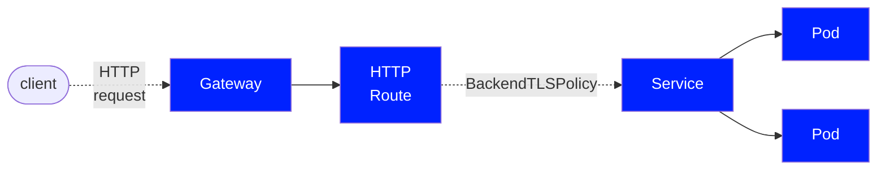

# BackendTLSPolicy

??? example "Experimental Channel in v1.0.0+"

    The `BackendTLSPolicy` resource is Alpha and part of the Experimental Channel in `v1.0.0+`.

!!! info "Experimental Channel"

    The `BackendTLSPolicy` resource described below is currently only included in the "Experimental" channel
    of Gateway API. For more information on release channels, refer to the [related documentation](https://gateway-api.sigs.k8s.io/concepts/versioning).

[BackendTLSPolicy][backendtlspolicy] is a Gateway API type for specifying the TLS configuration
of the connection from the Gateway to a backend pod/s via the Service API object.

## Background

`BackendTLSPolicy` specifically addresses the configuration of TLS in order to convey HTTPS from the Gateway
dataplane to the backend.  This is referred to as "backend TLS termination" and enables the Gateway to know
how to connect to a backend pod that has its own certificate.  

While there are other API objects provided for TLS to be configured for **passthrough** and **edge** termination,
this API object allows users to specifically configure **backend** TLS termination.  For more information on TLS
configuration in Gateway API, see [TLS Configuration](/guides/tls/).

BackendTLSPolicy is a Direct [PolicyAttachment](/reference/policy-attachment/) without defaults or overrides,
applied to a Service that accesses a backend, where the BackendTLSPolicy resides in the same namespace as the
Service to which it is applied. The BackendTLSPolicy and the Service must reside in the same namespace in order
to prevent the complications involved with sharing trust across namespace boundaries.  

All Gateway API Routes that point to a referenced Service should respect a configured BackendTLSPolicy.

## Spec

The specification of a [BackendTLSPolicy][backendtlspolicy] consists of:

- [TargetRef][targetRef] - Defines the targeted API object of the policy.  Only Service is allowed.
- [TLS][tls] - Defines the configuration for TLS, including hostname, CACertRefs, and WellKnownCACerts.
- [Hostname][hostname] - Defines the Server Name Indication (SNI) that the Gateway uses to connect to the backend.
- [CACertRefs][caCertRefs] - Defines one or more references to objects that contain PEM-encoded TLS certificates,
which are used to establish a TLS handshake between the Gateway and backend Pod.  Either CACertRefs or WellKnownCACerts
may be specified, but not both.
- [WellKnownCACerts][wellKnownCACerts] - Specifies whether system CA certificates may be used in the TLS
handshake between the Gateway and backend Pod.  Either CACertRefs or WellKnownCACerts may be specified, but not both.

The following illustrates a BackendTLSPolicy that configures TLS for a Service serving a backend:

### Targeting backends

A BackendTLSPolicy targets a backend Pod (or set of Pods) via a`TargetRef` to a Service.  This TargetRef is a
required object reference that specifies a Service by its Name, Kind (Service), and optionally its Namespace and Group.
TargetRef identifies the Service for which your HTTPRoute requires TLS.

!!! info "Restrictions"
- Cross-namespace certificate references are not allowed.

### BackendTLSPolicyConfig

A BackendTLSPolicyConfig is the specification for the BackendTLSPolicy and defines the configuration for TLS,
including hostname (for server name indication) and certificates.

#### Hostname

Hostname defines the server name indication (SNI) the Gateway should use in order to connect to the backend, and must
match the certificate served by the backend pod. A hostname is the fully qualified domain name of a network host, as
defined by [RFC 3986][rfc-3986]. Note the following deviations from the “host” part of the URI as defined in the RFC:

- IP addresses are not allowed.

Also note:

!!! info "Restrictions"

    - Wildcard hostnames are not allowed.

#### Certificates

The BackendTLSPolicyConfig must contain a certificate reference of some kind, and contains two ways to configure the
certificate to use for backend TLS, CACertRefs and WellKnownCACerts.  Only one of these may be used per
BackendTLSPolicyConfig.

##### CaCertRefs

CACertRefs refer to one or more PEM-encoded TLS certificates.

!!! info "Restrictions"

    - Cross-namespace certificate references are not allowed.

##### WellKnownCACerts

If you are working in an environment where specific TLS certificates are not required, and your Gateway API
implementation allows system or default certificates to be used, e.g. in a development environment, you may
set WellKnownCACerts to "System" to tell the Gateway to use a set of trusted CA Certificates. There may be
some variation in which system certificates are used by each implementation. Refer to documentation from your
implementation of choice for more information.

### PolicyStatus

Status defines the observed state of the BackendTLSPolicy and is not user-configurable.  Check status in the same
way you do for other Gateway API objects to verify correct operation.  Note that the status in BackendTLSPolicy
uses `PolicyAncestorStatus` to allow you to know which parentReference set that particular status.

[backendtlspolicy]: /references/spec/#gateway.networking.k8s.io/v1alpha2.BackendTLSPolicy
[tls]: /references/spec/#gateway.networking.k8s.io/v1alpha2.BackendTLSPolicy.TLS
[caCertRefs]: /references/spec/#gateway.networking.k8s.io/v1alpha2.BackendTLSPolicyConfig.CACertRefs
[wellKnownCACerts]: /references/spec/#gateway.networking.k8s.io/v1alpha2.BackendTLSPolicyConfig.WellKnownCACerts
[hostname]: /references/spec/#gateway.networking.k8s.io/v1beta1.PreciseHostname
[targetRef]: /references/spec/#gateway.networking.k8s.io/v1alpha2.PolicyTargetReference
