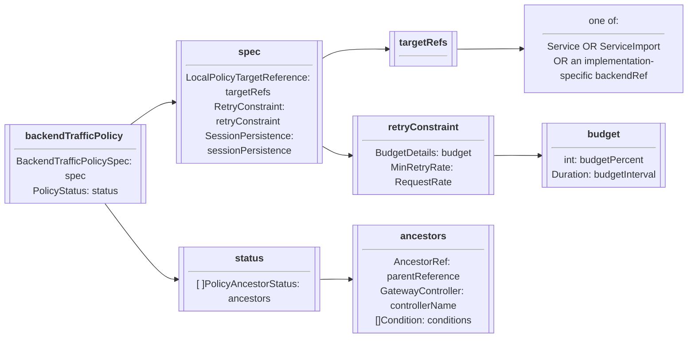

# BackendTrafficPolicy

??? example "Experimental Channel since v1.3.0"

    The `BackendTrafficPolicy` resource is a part of the Experimental Channel
    since `v1.3.0`. For more information on release channels, refer to our
    [versioning guide](../concepts/versioning.md).

[BackendTrafficPolicy][backendtrafficpolicy] is a Gateway API type to configure
the behavior of clients when targeting a valid backend resource.

## Background

`BackendTrafficPolicy` is used to configure the behavior of clients when making
requests targeting a backend, a grouping of like endpoints. Currently, this
policy includes the ability to configure a `RetryConstraint`, which can
dynamically limit the number of active retries targeting the specified backend,
by defining a "retry budget". Additional features may be added in the future.

### Retry Constraint

While client-side retries are important for allowing requests to be
successfully retried in
periods of intermittent failure, excessive retries can quickly overwhelm a
system, leading to cascading failures such as retry storms. Specifying a
`RetryConstraint` within `BackendTrafficPolicy` allows application
developers to dynamically calculate a limit on active client-side retries as a percentage of
the overall active request volume. While the retry stanza within the
[HTTPRouteRule][httproute] resource allows specifying whether a request
*should* be retried, as well as the maximum number of 
retries that may be performed for a failed request, budgeted
retries instead act as a
fail-safe in order to ensure that the targeted backend will not be overwhelmed
by the *overall* volume of retries from the client.

The retry budget is calculated based on the percentage of incoming traffic
composed of retries over a given time interval. Retrying the same original
request multiple times within the retry budget interval will lead to each retry
being counted towards calculating the budget. Once the budget is exceeded,
additional retries to the backend will be rejected and MUST return a 503
response to the client. The parameters of the retry budget calculation can be
configured within `RetryConstraint`.

BackendTrafficPolicy is a Direct
[PolicyAttachment](../reference/policy-attachment.md). All Gateway API Routes
that target the referenced Backend should respect a configured
BackendTrafficPolicy. Additional configurations for defining a constraint on
retries MAY be defined in the future.

## Spec

The specification of a [BackendTrafficPolicy][backendtrafficpolicy] consists of:

- [TargetRefs][localpolicytargetreference] - Defines the targeted API object(s) of the policy.
  Backends (A grouping of like endpoints such as Service,
  ServiceImport, or any implementation-specific backendRef) are the only valid
  API target references.
- [RetryConstraint][retryConstraint] - Defines the configuration for how a retry budget should be calculated, by specifying BudgetDetails and MinRetryRate.
- [SessionPersistence][sessionPersistence] - Defines the session persistence for the backend.

The following chart outlines the object definitions and relationship:

### Targeting backends

`BackendTrafficPolicy` targets a group of backend Pods via one or more
TargetRefs such as Service, ServiceImport, or implementation-specific
backendRef. TargetRefs is a required object reference, specifying a Backend via
its Name, Kind, and Group. Currently, TargetRefs can not be scoped to
specific ports on a service. 

[backendtrafficpolicy]: /references/specx.md#xbackendtrafficpolicy
[localpolicytargetreference]: /references/spec/#gateway.networking.k8s.io/v1alpha2.LocalPolicyTargetReference
[retryConstraint]: /references/specx.md#retryconstraint
[sessionPersistence]: /references/spec/#gateway.networking.k8s.io/v1.SessionPersistence
[httproute]: /references/spec/#https://gateway-api.sigs.k8s.io/reference/spec/#gateway.networking.k8s.io/v1beta1.HTTPRoute
