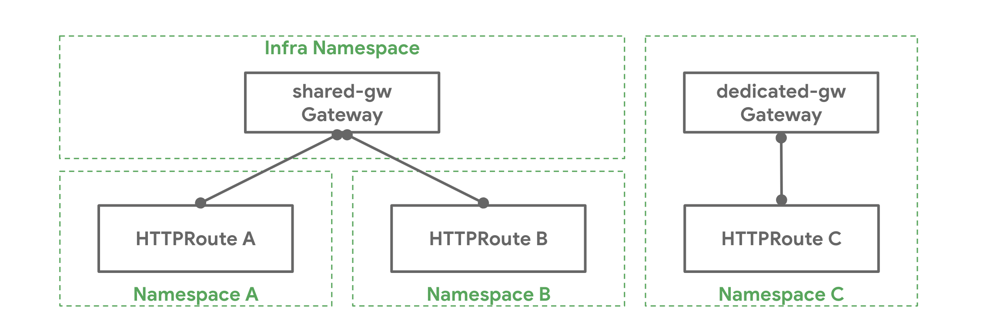
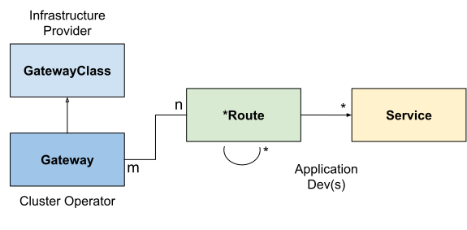

# API Overview

Gateway API is a complex API, solving a complex problem.
The designers of Gateway API have done our best to try to meet the dual demands of configuration flexibility and high usability.

In order to do that, we've needed to create a number of new ideas and concepts, while still echoing ideas from the rest of Kubernetes.
This page goes through the most important things to learn when you are starting out in Gateway API.

On this page, important words and concepts that are used in other places in the Gateway API docs are written in **bold text**, as are other points that are really important to remember.

## Roles and personas

There are 3 primary roles in Gateway API, as described in [roles and personas]:

- **Ian** (he/him): Infrastructure Provider
- **Chihiro** (they/them): Cluster Operator
- **Ana** (she/her): Application Developer

[roles and personas]:roles-and-personas.md

## Resource model

!!! note
    Gateway API resources are in the `gateway.networking.k8s.io` API group as
    Custom Resource Definitions (CRDs). Unqualified resource names below will
    implicitly be in this API group.

There are three main types of objects in our resource model:

**GatewayClass** defines a set of gateways with a common configuration and behavior.

**Gateway** requests a point where traffic can be translated to Services within the cluster.

**Routes** describe how traffic arriving via the Gateway maps to the Services.

### GatewayClass

??? success "Standard Channel since v0.5.0"

    The `GatewayClass` resource is GA and has been part of the Standard Channel since
    `v0.5.0`. For more information on release channels, refer to our [versioning
    guide](versioning.md).

GatewayClass defines a set of Gateways that share a common configuration and
behaviour. Each GatewayClass will be handled by a single controller, although
controllers may handle more than one GatewayClass.

GatewayClass is a cluster-scoped resource. There must be at least one
GatewayClass defined in order to be able to have functional Gateways. A
controller that implements Gateway API does so by providing an associated
GatewayClass resource that the user can reference from their Gateway(s).

This is similar to
[IngressClass](https://kubernetes.io/docs/concepts/services-networking/ingress/#ingress-class)
for Ingress and
[StorageClass](https://kubernetes.io/docs/concepts/storage/storage-classes/) for
PersistentVolumes. In Ingress v1beta1, the closest analog to GatewayClass is the
`ingress-class` annotation, and in IngressV1, the closest analog is the
IngressClass object.

### Gateway

??? success "Standard Channel since v0.5.0"

    The `Gateway` resource is GA and has been part of the Standard Channel since
    `v0.5.0`. For more information on release channels, refer to our [versioning
    guide](versioning.md).

A Gateway describes how traffic can be translated to Services within the
cluster. That is, it defines a request for a way to translate traffic from
somewhere that does not know about Kubernetes to somewhere that does. For
example, traffic sent to a Kubernetes Service by a cloud load balancer, an
in-cluster proxy, or an external hardware load balancer. While many use cases
have client traffic originating “outside” the cluster, this is not a
requirement.

It defines a request for a specific load balancer config that implements the
GatewayClass’ configuration and behaviour contract. The resource may be created
by an operator directly, or may be created by a controller handling a
GatewayClass.

As the Gateway spec captures user intent, it may not contain a complete
specification for all attributes in the spec. For example, the user may omit
fields such as addresses, TLS settings. This allows the controller
managing the GatewayClass to provide these settings for the user, resulting in a
more portable spec. This behaviour will be made clear using the GatewayClass
Status object.

Gateway objects bind one or more **Addresses** to one or more **Listeners**.

**Addresses** are how the Gateway is reached, and are usually IP addresses, although some implementations (particularly ones that route traffic via an AWS load balancer) use domain names instead.

**Listeners** describe how the Gateway should listen for traffic, and have a `port`, a `protocol`, and other protocol-specific details.
Listeners that are not **distinct** are in conflict, and Gateway API includes instructions for what happens in various conflict cases. What makes Listeners distinct is a bit complicated and is discussed in the Distinctiveness section (link).

A critical reason for the requirement that Listeners are distinct is that traffic flowing through a Gateway **must only match a single Listener**.
Any particular traffic must only be able to be asssigned to a single Listener, and once that Listener is chosen, the traffic **must** be routable via an attached, protcol-specific Route, **or it must be dropped by the Gateway**.

The most important outcome here is that traffic can't fail to be routed by one Listener, then fall back to another for further processing.
For more information on this, see the [Traffic Matching](traffic-matching.md) page.

However, for the Route -> Gateway relationship, the most important thing is that Routes **attach** to one or more Listeners on the the Gateway.

#### Distinctiveness

For the property that traffic must only match a _single_ Listener to be true, then Listeners must be **distinct**.

Gateway API defines **distinctiveness** according to the protocol selected on the Listener. For any given protocol, some fields (particularly `port`) MAY be shared, but exactly what that means depends on the protocol.

Listeners that are _not_ distinct are **Conflicted**, and may not be present on the same Gateway.
If they are, then the entire Gateway is invalid and will not reach `Accepted` status.

(Feel free to skip these exact definitions below if you are just starting out, they are very important, but you can learn by doing as well).

??? example "Distinctiveness rules, in increasing order of complexity"

    * `TCP` and `UDP` Listeners are distinct only on the combination of `protocol` and `port`.
    So, two Listeners that listen on port `53`, but where one has `protocol` set to `TCP` and the other `UDP` are distinct, but two Listeners that both have `protocol` `TCP`, and `port` `22` are not distinct, and are thus Conflicted.
    * `TLS` Listeners are distinct based on the combination of the fields `protocol`, `port`, and `hostname`.
    In this case, the `hostname` describes the Server Name Indicator (SNI) used as part of the TLS handshake, which can be used as a routing discriminator.
    Note that, in this case the TLS config in the `tls` stanza is _not_ relevant, as that allows you to specify whether or not the connection is terminated, which is not relevant in this case - because only the SNI, which applies in either terminated or not terminated cases, is defined.
    * `HTTP` Listeners are distinct via the combination of the fields `protocol`, `port`, `hostname`.
    Two Listeners that both expose `HTTP` on port `80`, with different `hostname` fields, are distinct.
    * `HTTPS` Listeners are distinct via the combination of the fields `protocol`, `port`, `hostname`, but there is an additional requirement.
    If the protocol is `HTTPS`, then you must have a Secret reference that points to a Kubernetes Secret of type `kubernetes.io/tls`. Listeners with different `hostnames` may point to different Secrets, but we don't mandate that (since a single certificate can support many hostnames).
    So, two Listeners that expose `HTTPS` on port `443` are distinct if they have different `hostname` fields.


### Route Types

Route resources define protocol-specific rules for mapping requests from a Gateway
to Kubernetes Services.

As of v1, four Route resource types are included with the API. Custom Route types
that are implementation-specific are encouraged for other protocols. New route
types may be added to the API in future.

#### HTTPRoute

??? success "Standard Channel since v0.5.0"

    The `HTTPRoute` resource is GA and has been part of the Standard Channel since
    `v0.5.0`. For more information on release channels, refer to our [versioning
    guide](versioning.md).

HTTPRoute is for multiplexing HTTP or terminated HTTPS connections. It's intended
for use in cases where you want to inspect the HTTP stream and use HTTP request data
for either routing or modification, for example using HTTP Headers for routing, or
modifying them in-flight.

#### TLSRoute

??? example "Experimental Channel since v0.3.0"

    The `TLSRoute` resource is Alpha and has been part of the Experimental
    Channel since `v0.3.0`. For more information on release channels, refer to
    our [versioning guide](versioning.md).

TLSRoute is for multiplexing TLS connections, discriminated via SNI. It's intended
for where you want to route based on TLS metadata, and are not interested in properties
of the higher-level protocols like HTTP. When using a `Passthrough` TLS listener, the
encrypted byte stream of the connection is proxied directly to the destination backend,
which is then responsible for decrypting the stream. When using a `Terminate` TLS
listener, encryption is terminated at the gateway.

#### TCPRoute and UDPRoute

??? example "Experimental Channel since v0.3.0"

    The `TCPRoute` and `UDPRoute` resources are Alpha and have been part of the
    Experimental Channel since `v0.3.0`. For more information on release
    channels, refer to our [versioning guide](versioning.md).

TCPRoute (and UDPRoute) are intended for use for mapping one or more ports
to a single backend. In this case, there is no discriminator you can
use to choose different backends on the same port, so each TCPRoute really needs a
different port on the listener (in general, anyway). You can terminate TLS in
which case the unencrypted byte stream is passed through to the backend.
You can choose to not terminate TLS, in which case the encrypted byte stream
is passed through to the backend.

#### GRPCRoute

??? success "Standard Channel since v1.1.0"

    The `GRPCRoute` resource is GA and has been part of the Standard Channel since
    `v1.1.0`. For more information on release channels, refer to our [versioning
    guide](versioning.md).

GRPCRoute is for idiomatically routing gRPC traffic. Gateways supporting
GRPCRoute are required to support HTTP/2 without an initial upgrade from HTTP/1,
so gRPC traffic is guaranteed to flow properly.

#### Route summary table

One of the most important use cases for Gateway API is to allow Ana the Application Developer and her peers to be able to multiplex Routes onto the same Listener.
Each Route type has different information that can be used to accomplish this, and these sets of information are called **Routing Discriminators**.

More precisely, **Routing discriminators** are the information that can be used to allow multiple Routes to share a single port on a Listener.

This table from the [API Overview](link) page summarizes the various Route types included in Gateway API, with their **Routing Discriminators**.

|Object|Protocol|OSI Layer|Routing Discriminator|Listener TLS Support|Backend TLS Support|Purpose|
|------|--------|---------|---------------------|-----------|-------|-------|
|HTTPRoute|HTTP or HTTPS| Layer 7 | Anything in the HTTP Protocol | Terminated only | Via BackendTLSPolicy |HTTP and HTTPS Routing|
|TLSRoute|TLS| Somewhere between layer 4 and 7| SNI or other TLS properties| Passthrough or Terminated | None currently, although support for BackendTLSPolicy when Terminated has been discussed.|Routing of TLS protocols including HTTPS where inspection of the HTTP stream is not required.|
|GRPCRoute|HTTP or HTTPS| Layer 7 | Anything in the gRPC Protocol | Terminated only | None currently, although support for BackendTLSPolicy when Protocol is `HTTPS` has been discussed.| gRPC Routing over HTTP/2 and HTTP/2 cleartext|
|TCPRoute|TCP| Layer 4| None | Passthrough or Terminated | None currently, although support for BackendTLSPolicy when Terminated has been discussed.| Allows for forwarding of a TCP stream from the Listener to the Backends |
|UDPRoute|UDP| Layer 4| None | None | None | Allows for forwarding of a UDP stream from the Listener to the Backends. |

Notably, because of their lack of other **routing discriminators**, TCPRoute and UDPRoute can only have a _single_ Route attached to any particular Listener.

## Attaching Routes to Gateways

When a Route attaches to a Gateway, it represents configuration that is applied
on the Gateway that configures the underlying load balancer or proxy. How and
which Routes attach to Gateways is controlled by the resources themselves. Route
and Gateway resources have built-in controls to permit or constrain how they are
attached. Together with Kubernetes RBAC, these allow organizations to enforce
policies for how Routes are exposed and on which Gateways.

There is a lot of flexibility in how Routes can attach to Gateways to achieve
different organizational policies and scopes of responsibility. These are
different relationships that Gateways and Routes can have:

- **One-to-one** - A Gateway and Route may be deployed and used by a single
  owner and have a one-to-one relationship.
- **One-to-many** - A Gateway can have many Routes bound to it that are owned by
  different teams from across different Namespaces.
- **Many-to-one** - Routes can also be bound to more than one Gateway, allowing
  a single Route to control application exposure simultaneously across different
  IPs, load balancers, or networks.

For a Route to attach to a Listener, two things have to be true:

* The Route must reference a Gateway (or one of its Listeners via a `sectionName`) in its `parentRefs` stanza. All Routes **must** contain a `parentRefs` stanza to be a Gateway API compliant Route object.
* The Listener must _accept_ the Route's attachment. There are many ways for Listeners to describe the shape of what Routes should attach to a given Listener, and some attachments require agreement between the Listener and the Route about protocol-specific details (for example, matching hostnames between a Listener and a HTTPRoute).

The Route side of this is intended to ensure that, at all times, control over where an application is exposed is in the hands of Ana, the Application Developer.
Chihiro, the Cluster Admin and Gateway owner, can limit what _shapes_ Routes that can attach to their Gateway can take (via their Kind or their namespace),but they can't force Ana to expose her application.
The final decision, and control of the Route object, is always Ana's.

The Listener side is intended to ensure that Ana's Route produces a valid confguration, and also matches Chihiro's requirements (if any) about what traffic is allowed to be exposed on that Gateway.

### Example

[Chihiro] has deployed a Gateway `shared-gw` in the `infra` Namespace to be
used by different application teams for exposing their applications outside
the cluster. Teams A and B (in Namespaces `A` and `B` respectively) attach
their Routes to this Gateway. They are unaware of each other and as long as
their Route rules do not conflict with each other they can continue operating
in isolation. Team C has special networking needs (perhaps performance,
security, or criticality) and they need a dedicated Gateway to proxy their
application to the outside world. Team C deploys their own Gateway
`dedicated-gw`  in the `C` Namespace that can only be used by apps in the `C`
Namespace.

<!-- source: https://docs.google.com/presentation/d/1neBkFDTZ__vRoDXIWvAcxk2Pb7-evdBT6ykw_frf9QQ/edit?usp=sharing -->


[Chihiro]:roles-and-personas.md#chihiro

### How it Works

As said above, the following is required for a Route to be attached to a Gateway:

1. The Route needs an entry in its `parentRefs` field referencing the Gateway.
2. At least one listener on the Gateway needs to allow this attachment.

#### Referencing Gateways

??? example "Extended Feature"

    The `Port` field described below is an Extended feature, and so is _optional_ for implementations to support.
    The feature name for this feature is `HTTPRouteParentRefPort`, and you should be able to find out if your implementation supports it either in the implementation's GatewayClass (under `status.supportedFeatures`), or on one of the implementation comparison pages (like the [v1.4 comparison](../implementations/v1.4.md).)

A Route can reference a Gateway by specifying the namespace (optional if the
Route and the Gateway are in the same namespace) and name of the Gateway in
a `parentRef`. By default, a Route will attach to all listeners of a Gateway,
however it can restrict the selection to a subset of listeners using the
following fields in `parentRef`:

1. **SectionName:** When `sectionName` is set, the Route selects the listener with the specified name.
2. **Port:** When `port` is set, the Route selects all listeners listening on the specified port and with protocol compatible with this kind of Route.

When multiple fields in `parentRef` are set, the Route selects listeners that
satisfy all conditions specified in those fields. For example, when both
`sectionName` and `port` are set, the Route selects listeners with the specified
name AND listening on the specified port.

#### Restricting Route Attachment

Each Gateway listener can restrict which Routes can be attached with the
following mechanisms:

1. **Hostname:** When the `hostname` field on a listener is set, attached Routes
   that specify a `hostnames` field must have at least one overlapping value.
2. **Namespaces:** The `allowedRoutes.namespaces` field on a listener can be
   used to restrict where Routes may be attached from. The `namespaces.from`
   field supports the following values:
    * `Same` is the default option. Only Routes in the same namespace
      as this Gateway may be attached.
    * `All` will allow Routes from all Namespaces to be attached.
    * `Selector` means that Routes from a subset of Namespaces selected by a
      Namespace label selector may be attached to this Gateway. When `Selector`
      is used, the `namespaces.selector` field must be used to specify label
      selectors. This field is not supported with `All` or `Same`.
3. **Kinds:** The `allowedRoutes.kinds` field on a listener can be used to
   restrict the kinds of Routes that may be attached.

If none of the above are specified, a Gateway listener will trust Routes
attached from the same namespace that support the listener protocol.

#### Further Gateway - Route attachment examples

The following `my-route` Route wants to attach to the `foo-gateway` in the
`gateway-api-example-ns1` and will not attach to any other Gateways. Note that
`foo-gateway` is in a different Namespace. The `foo-gateway` must allow
attachment from HTTPRoutes in the namespace `gateway-api-example-ns2`.

```yaml

```

This `foo-gateway` allows the `my-route` HTTPRoute to attach.

```yaml

```

For a more permissive example, the below Gateway will allow all HTTPRoute resources
to attach from Namespaces with the "expose-apps: true" label.

```yaml

```

### Combined types

The combination of `GatewayClass`, `Gateway`, `xRoute` and `Service`(s)
defines an implementable load-balancer. The diagram below illustrates the
relationships between the different resources:

<!-- source: https://docs.google.com/document/d/1BxYbDovMwnEqe8lj8JwHo8YxHAt3oC7ezhlFsG_tyag/edit#heading=h.8du598fded3c -->


### Request flow

A typical [north/south] API request flow for a gateway implemented using a
reverse proxy is:

1. A client makes a request to <http://foo.example.com>.
2. DNS resolves the name to a `Gateway` address.
3. The reverse proxy receives the request on a `Listener` and uses the [Host
   header](https://tools.ietf.org/html/rfc7230#section-5.4) to match an
   `HTTPRoute`.
4. Optionally, the reverse proxy can perform request header and/or path
   matching based on `match` rules of the `HTTPRoute`.
5. Optionally, the reverse proxy can modify the request, i.e. add/remove
   headers, based on `filter` rules of the `HTTPRoute`.
6. Lastly, the reverse proxy forwards the request to one or more objects, i.e.
   `Service`, in the cluster based on `backendRefs` rules of the `HTTPRoute`.

[north/south]:glossary.md#northsouth-traffic

### TLS Configuration

TLS is configured on Gateway listeners, and may be referred to across namespaces.

Please refer to the [TLS details](../guides/tls.md) guide for a deep dive on TLS.

## Attaching Routes to Services

When using Gateway API to configure a [service mesh], the Route will
attach directly to a Service, representing configuration meant to be applied
to any traffic directed to the Service. How and which Routes attach to a given
Service is controlled by the Routes themselves (working with Kubernetes RBAC),
as covered in the [GAMMA routing documentation].

[GAMMA]:../mesh/index.md
[GAMMA routing documentation]:../mesh/index.md#connecting-routes-and-services
[service mesh]:glossary.md#service-mesh

## Extension points

A number of extension points are provided in the API to provide flexibility in
addressing the large number of use-cases that cannot be addressed by a general
purpose API.

Here is a summary of extension points in the API:

- **BackendRefs**: This extension point should be used for forwarding
  traffic to network endpoints other than core Kubernetes Service resource.
  Examples include an S3 bucket, Lambda function, a file-server, etc.
- **HTTPRouteFilter**: This API type in HTTPRoute provides a way to hook into
the request/response lifecycle of an HTTP request.
- **Custom Routes**: If none of the above extensions points suffice for a use
  case, Implementers can choose to create custom Route resources for protocols
  that are not currently supported in the API. Custom Route types need to share
  the same fields that core Route types do. These are contained within
  CommonRouteSpec and RouteStatus.

Whenever you are using an extension point without any prior art, please let
the community know. As we learn more about usage of extension points, we would
like to find the common denominators and promote the features to core/extended
API conformance.
