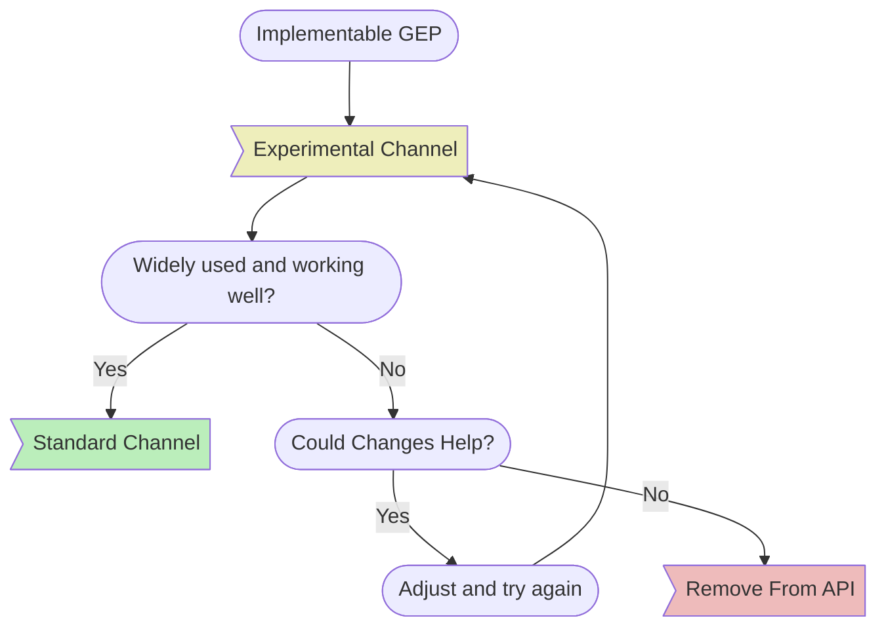

# Versioning

## Overview
Each new release of Gateway API is defined with a "bundle version" that
represents the Git tag of a release, such as v1.0.0. This contains the
following:

* API Types (Go bindings for the resources)
* CRDs (Kubernetes definitions of the resources)

### Release Channels
Release channels are used to indicate feature stability within Gateway API. All
new features and resources start in the Experimental release channel. From that
point, these may graduate to the Standard release channel or be dropped from the
API entirely.

The following diagram provides a high level overview of the lifecycle of a
feature or resource proposed by a new [GEP](../geps/overview.md) (enhancement
proposal) in Gateway API:



The Standard release channel includes:

* Resources that have graduated to Beta or GA API Versions (note that Beta API
  versions are being phased out in Gateway API)
* All fields that have graduated to Standard from the Experimental Channel

The Experimental release channel includes everything in the Standard release
channel, plus:

* Resources with Alpha API Versions
* All new fields before they graduate to Standard Channel


<!-- Source: https://docs.google.com/presentation/d/1sfZTV-vlisDUIie_iK_B2HqKia_querT6m6T2_vbAk0/edit -->

We recommend using the Standard Channel by default as it will provide a stable
experience. Many implementations also provide support for the Experimental
Channel which enables us to iterate on new features quickly. Note that this
channel makes no backwards compatibility guarantees and breaking changes may be
released at any point.

### API Versions
Upstream Kubernetes APIs have 3 levels of stability, denoted by alpha, beta, and
GA API versions. In Gateway API, we've narrowed this down to 2 levels of
stability, expressed by our release channels as described above.

In general, this means that when resources graduate from the Experimental
channel to the Standard Channel, they'll also be graduating from an Alpha API
Version (v1alpha2) to a GA API Version (v1).

#### Rationale
We're phasing out beta for the following reasons:

1. In most cases there are effectively two levels of API stability - installed
   by default (stable), and alpha/experimental (unstable). It's not obvious
   what value an intermediate (Beta) state would have for Gateway API.
2. The further we separate the "stable" and "experimental" APIs, the longer it
   takes to get meaningful feedback on new features.
3. Each unique API version we maintain comes with significant additional cost
   for users, implementers, and maintainers.

#### Beta
Although some Gateway API resources already received a Beta API version when
they graduated to the Standard Channel, that will not be the case for any
additional resources. All future resources that graduate to Standard Channel
will include a v1 API version as part of that process.

The resources that already have a beta API version (v1beta1) are:

* HTTPRoute
* Gateway
* GatewayClass
* ReferenceGrant

In the v1.0 release, HTTPRoute, Gateway, and GatewayClass all graduated to
include a GA API Version (v1).

ReferenceGrant is a special case since it is in the process of [transitioning
into an upstream Kubernetes
API](https://github.com/kubernetes/enhancements/issues/3766) that is owned by
[sig-auth](https://github.com/kubernetes/community/blob/master/sig-auth/README.md).
Until that is resolved, it is likely that ReferenceGrant will be effectively
frozen as beta in Gateway API. When it is widely available as a built-in
Kubernetes API, we will likely remove it from the Standard Channel of Gateway
API.

## Version Indicators
Each CRD will be published with annotations that indicate their bundle version
and channel:

```
gateway.networking.k8s.io/bundle-version: v0.4.0
gateway.networking.k8s.io/channel: standard|experimental
```

## What Can Change
When using or implementing this API, it is important to understand what can
change across bundle versions.

### Patch Version (e.g. v0.4.0 -> v0.4.1)
* API Spec:
    * Clarifications
    * Correcting typos
* Bug fixes:
    * Correcting validation
    * Fixes to release process or artifacts
* Conformance tests:
    * Fixes for existing tests
    * Additional conformance test coverage for existing features

### Minor Version (e.g. v0.4.0 -> v0.5.0)
* Everything that is valid in a patch release
* Experimental Channel:
    * Adding new API fields or resources
    * Breaking changes for existing API fields or resources
    * Removing API fields or resources without prior deprecation
* Standard Channel:
    * Graduation of fields or resources from Experimental to Standard Channel
    * Removal of an API resource following [Kubernetes deprecation
  policy](https://kubernetes.io/docs/reference/using-api/deprecation-policy/)
* All Channels:
    * Changes to recommended conditions or reasons in status
    * Loosened validation (including making required fields optional)
    * Changes to conformance tests to match spec updates
    * Introduction of a new API version which may include renamed fields or
      anything else that is valid in a [new Kubernetes API
      version](https://kubernetes.io/docs/reference/using-api/#api-versioning)

### Major Version (e.g. v0.x to v1.0)
* There are no API compatibility guarantees when the major version changes.

## Graduation Criteria
For a resource, field, or feature to graduate from Experimental to Standard, it
must meet the following criteria:

* Full conformance test coverage.
* Multiple conformant implementations.
* Widespread implementation and usage.
* At least 6 months of soak time as an alpha API.
* No significant changes for at least 1 minor release and 3 months.
* Approval from subproject owners + KEP reviewers.

## Supported Versions
This project aims to provide support for a wide range of Kubernetes versions with
consistent upgrade experiences across versions. To accomplish that, we commit to:

1. Support a minimum of the most recent 5 Kubernetes minor versions.
2. Ensure that all Standard Channel changes between v1beta1 and v1 are fully
   compatible and convertible.
3. Take every possible effort to avoid introduction of a conversion webhook. If
   a conversion webhook needs to be introduced, it will be supported for the
   lifetime of the API, or at least until an alternative is available.

## CRD Management
For information on how to manage Gateway API CRDs in your clusters, refer to our
[CRD Management Guide](../guides/crd-management.md).

## Out of Scope
### Unreleased APIs
This project will have frequent updates to the main branch. There are no
compatibility guarantees associated with code in any branch, including main,
until it has been released. For example, changes may be reverted before a
release is published. For the best results, use the latest published release of
this project.

### Source Code
We do not provide stability guarantees for source code imports. The Interfaces
and behavior may change in an unexpected and backwards-incompatible way in any
future release.
