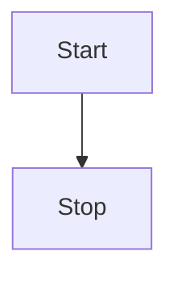

# Documentation Style Guide

Gateway API aims to adhere to the upstream [Kubernetes Documentation Style
Guide](https://kubernetes.io/docs/contribute/style/style-guide/) wherever
possible. This guide should be considered an extension of that guide. Whenever
there is conflicting guidance, the information contained in this guide has
precedence for Gateway API documentation.

## Name of the Project
This project is named "Gateway API", not "the Gateway API". As such, the only
time it is acceptable to use "the Gateway API" is when it is part of a broader
term, such as "the Gateway API maintainers".

## Callouts
To implement callouts in documentation, we make use of [mkdocs-material
admonitions](https://squidfunk.github.io/mkdocs-material/reference/admonitions/).

### Release Channels
Wherever possible, we try to clearly state which release channel a resource or
feature is currently included in, and which version it was introduced to that
channel. To accomplish that, we use admonitions that look like this:

??? success "Standard Channel since v0.5.0"

    The `HTTPRoute` resource is GA and has been part of the Standard Channel
    since `v0.5.0`. For more information on release channels, refer to our
    [versioning guide](/concepts/versioning).

??? example "Experimental Channel since v0.3.0"

    The `TLSRoute` resource is Alpha and has been part of the Experimental
    Channel since `v0.3.0`. For more information on release channels, refer to
    our [versioning guide](/concepts/versioning).

## Diagrams
In many cases, diagrams are the best way to explain a concept. Unfortunately
they can be hard to maintain and update. To ensure diagrams are more
maintainable, we strongly recommend using the built-in support for
[Mermaid](https://mermaid.js.org/) diagrams. Here is a simple example of a
diagram:

Whenever it's not practical to use Mermaid diagrams, we ask that you link to
a source that enables anyone to make a copy and edit as needed.
