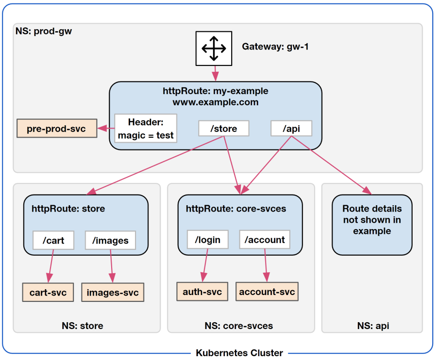
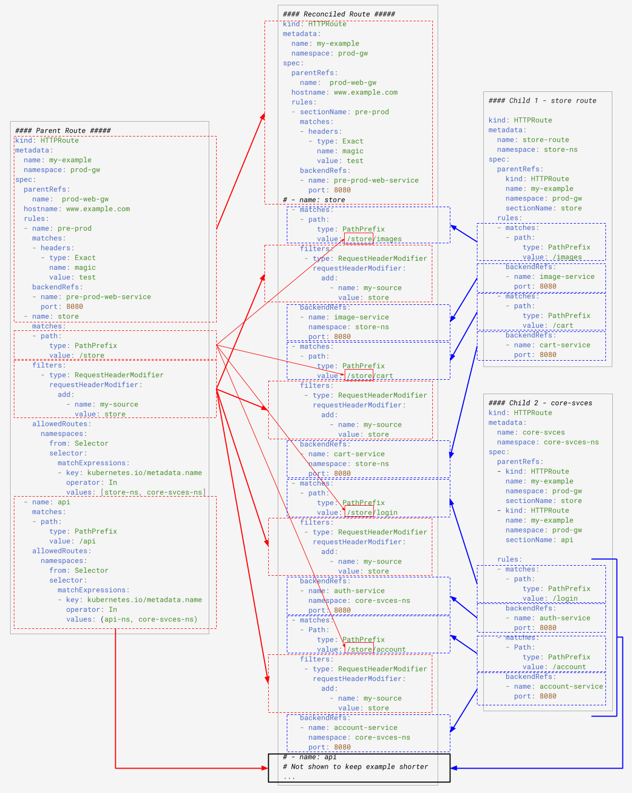

# GEP-1058: Route Inclusion and Delegation

- Issue: [#1058](https://github.com/kubernetes-sigs/gateway-api/issues/1058)
- Status: Proposed

## TLDR

Add support for a 2-tier hierarchy of route configuration to allow partial
delegation of route settings and, provide more flexibility in how route
configurations are organized and managed.

## Goals

- Provide a 2-tier hierarchy of route configuration to allow partial delegation
of route settings.
- Allow a route owner to limit the scope of a specific delegation.
- Provide a method to reuse a subset of route configuration across multiple routes
- Minimize the changes to the existing Gateway API
- Focus on HTTPRoute but create a design pattern that can be applied to other
route types in the future

## Non-Goals

- Explicitly define how route inclusion/delegation works for any specific route
  type other than `HTTPRoute`

## Terminology

- **Route**: A generic substitute for the type of route. Equivalent to saying,
“a route of type [*type*]”
- **Parent Route:** A `Route` that specifies a listener as its parentRef object
and is listed as a parentRef object in a different Route. Technically, a parent
route is any route that has a non-nil AllowedRoutes block
- **Child Route:** A Route that lists a Route as its parentRef object.
- **Ephemeral Route:** The route configuration that results from combining (i.e.
 reconciling) a parent route and the child route(s) that attaches to it. The
 ephemeral route represents the configuration that is actually applied to the
 data plane.
- **Delegation:** when an included route crosses a persona ownership boundary
(e.g. a parent route is managed by an infrastructure team and a child route is
managed by an app dev team)
- **Inclusion:** When a child Route’s configuration is combined with a parent
Route’s config during runtime. The two routes may or may not be owned by the same
persona or organization. All delegations are inclusions, but not all inclusions
are delegations.  

## Introduction

This proposal adds support for creating parent/child relationships between
multiple routes. This solves two use cases. First, a common subset of a route
configuration can be defined once and used by multiple routes. This can
significantly reduce the effort needed to make the same change to multiple routes.
The second use case is allowing the owner of a route to delegate responsibility
for portions of the route configuration.

This proposal is specifically focused on HTTPRoutes but creates a design
pattern that can be applied to other route types in the future. For this reason,
this GEP primarily uses the generic term “Route” instead of using HTTPRoute.

## Use Cases

There are two primary use cases that this proposal is intended to address. There
are also a number of secondary use cases that are a combination of the two
primary ones. The two primary use cases are described below.

The diagram below is an example scenario that is referred to
throughout this document and the example configurations are based on it.

**Example Scenario 1:**  


### 1. Partial Administrative Delegation of Routing

There are scenarios where there is a need to divide responsibility for route
configuration across multiple users and/or groups.

Using Scenario 1 as an example, there are four groups of administrative users,
one for each name space. The `prod-gw` namespace is managed by the NetOps team
and the other three admin groups are the Application Owners, each with their own
namespace.

The NetOps team has a single Listener that handles all HTTP-based traffic for
the host www.example.com but they want to manage route configuration only enough
to ensure traffic is sent to the correct namespace. The NetOps team wants to
delegate the rest of the route configuration to the application owners.

It should be noted that both the NetOps team and the Application teams may need
to configure more features of HTTPRoute than just matching rules. Examples of
this are header manipulation and path rewriting.

### 2. Compose routes from reusable config fragments

Another use case is where there is a group of route config settings that are
common across multiple Routes of the same type (e.g. HTTPRoute). Users want to
be able to have the Routes include that group of config settings by reference
instead of having to embed those settings directly in each Route or RouteRule.

The configurations for Scenario 1 (shown lower on this page), demonstrate two
ways this technique can be used. In the first case, traffic needs to be routed
to "Core Services" (`core-svces-ns`) from two different starting points. Using
route inclusion, the routing configuration for the Core Services are put in a
child route and then that child route is included in two sections of a parent
route where they are needed.

Another way route inclusion is used in Scenario 1 is by configuring a
HTTPRouteFilter, that inserts a header, in the parent route. This results in the
filter being added to each RouteRule in the child route `store-route`. The child
route is both shorter and easier to read than it would have been without this
technique.

This use case and the Delegation use case are solved using the same mechanism
(route inclusion). They differ only in the intention (i.e. purpose) for using
that mechanism.

One advantage of allowing Routes to include groups of settings by reference is
that, when one of those settings needs to be changed, it only has to be changed
in one place instead of editing all of the relevant Routes. Another advantage is
that it prevents those settings from diverging across the Routes over time.

The remainder of this document covers the proposed enhancements to the Gateway API.

## Parent/Child Route Relationships

The proposal is to allow the settings in a child route to be combined with a
section of the parent route’s RouteRule.   A HTTPRouteRule may have either
BackendRefs or AllowedRoutes set. The effect of this is that a Route can
delegate to other Routes. These routes will be referred to as the parent and
child routes. This model would be more consistent with the current Route to
Gateway binding model (as documented in [GEP 724][gep-724]) than alternatives
such as "route inclusion". It allows minimal coordination from the team
implementing the child route while remaining within a scope defined by a gateway
operator, and centralizes configuration on the Route object, avoiding the need
for a ReferencePolicy.

### Summary of Changes, Requirements and Constraints: Parent/Child Route Relationships

This section details the changes to the standard to support Parent/Child routes
and the rules that govern those relationships.

(Note: A separate section covers the rules for how parent and child routes are
logically combined at runtime.)

Before getting to those details, the following two fragments of configuration
show how a parent/child route relationship is created. These are based on the
Scenario 1 diagram shown previously.

```yaml
#### Parent Route #####
kind: HTTPRoute
metadata:
  name: my-example
  namespace: prod-gw
spec:
  parentRefs:
    name:  prod-web-gw
  hostname: www.example.com
  rules:
  ...
    - name: store
...
      allowedRoutes:
      namespaces:
        from: Selector
        selector:
          matchExpressions:
          - key: kubernetes.io/metadata.name
            operator: In
            values: [store-ns, core-svces-ns]
...

#### Child 1 - store route
kind: HTTPRoute
metadata:
  name: store-route
  namespace: store-ns
spec:
  parentRefs:
    kind: HTTPRoute
    name: my-example
    namespace: prod-gw
    sectionName: store
...
```

Here are the changes and related rules:

1. Support for Parent/child Route relationships is an "Extended" feature in the
   Gateway API specification
2. Add `AllowedRoutes` to [HTTPRouteRule][HTTPRouteRule] as optional
    1. Default value is nil
    2. A single `RouteRule` can contain `BackendRefs` OR `AllowedRoutes`, not both.
    3. A parent `Route` may include `RouteRules` that use `BackendRefs` **AND**
       `RouteRules` that use `AllowedRoutes`.
    4. `AllowedRoutes` MUST be non-nil in a `RouteRule` to permit child `Routes`
       to attach to that `RouteRule`.
        1. Explanation: A parent `Route` will allow delegation to one or more
           child `Routes` by specifying `AllowedRoutes` where `BackendRef` would
           be used otherwise.
    5. Multiple child routes may attach to a single `RouteRule`, as long as they
       are distinct.
3. Allow a Route’s `ParentRef` Kind to be the same type as the Route’s type
    1. `Kind` is required when the `ParentRefs` is a route. `Kind` will default to
       `gateway` (current behavior).
4. Add `Name` (type is [SectionName][sectionName]) to
   [HTTPRouteRule][HTTPRouteRule] as optional
    1. The `Name` field is expected to be added in the implementation of
       [GEP-995 - Add Name to HTTPRouteRule and HTTPRouteMatch][gep-995]
    2. Default value is nil
    3. A child route may include a `SectionName` when its `ParentRef` is a route.
        1. A child route “attaches" to the parent route’s `RouteRule` that matches
           that `SectionName`. The child route must also match the criteria
           specified in the `RouteRule’s AllowedRoutes`.
    4. If the `ParentRefs` of a child route doesn’t include a `SectionName`, the
       child route attaches to all of the Parent Route’s `RouteRules` having
       `AllowedRoutes` criteria that the child route meets.
5. A parent `Route` and any related child `Routes` must be the same type of
   `Routes`.
    1. Example: A child HTTPRoute can not point to a parent TCPRoute.
6. A `Route` MUST NOT be a parent to a `Route` AND a child of another `Route`.
    1. Explanation: This limitation avoids the need for specific
       internal/terminal Route types, and the design of using a ParentRef from
       the child to an AllowedRoutes slot on a parent allows a Route to know if
       it is either a parent or child (or misconfigured as both) without
       requiring the graph traversal that a design like ForwardTo may need to
       avoid cycles.
    2. If an implementation chooses to not enforce this limitation, that must be
       documented along with how many tiers of parent/child route relationships
       are allowed
7. A Route’s `ParentRefs` can list more than one type of parent.
    1. Example: A `HTTPRoute`’s ParentRefs can list one (or more) `Gateways` and
       one (or more) `HTTPRoutes` at the same time.

## Binding Parent and Child Routes

Binding a child route to a parent route refers to the process of reconciling
(i.e. combining) the two routes. Binding is treated as a single transaction for
each Parent/Child route pair. Even when a child route attaches to multiple
`RouteRules` in the parent route, the binding between the two routes is still a
single transaction.

The binding transaction has two stages; reconciliation and activation. The
reconciliation process produces an Ephemeral route config. After the
reconciliation process has completed successfully, the new Ephemeral config is
made the active Ephemeral route config and applied to the data plane.

An Ephemeral route is the result of the first child route to successfully bind
to the parent route. After that, for each child route that attempts to bind to
that parent route, the reconciliation process is actually between the existing
Ephemeral route config and the child route's config. This is required because,
evaluated individually, each parent/child reconciliation may produce a valid
config but, all of them combined may produce an invalid config.

This means that, when a parent route has multiple child routes that attach to
it, the reconciliations of the children to the parent, must be done in series
(as opposed to in parallel).

NOTE: An Ephemeral route is not a formal Kubernetes object. It is a logical
concept used, in this document, to help describe behavior. In some cases, the
terms "parent" and "ephemeral" route are interchangeable depending on whether or
not an ephemeral route already exists due to a previous, successful binding of a
child to that parent.

### Failed Binding

The binding transaction MUST fail if there is A non-recoverable error during the
binding process. A failed binding should result in no changes to the
configuration of the active Ephemeral route.

A failed binding DOES NOT invalidate the parent `RouteRules` that the child
route is trying to bind to. This is necessary because other child routes might
bind to those parental `RouteRules` (might already be bound or may try to bind
in the future).

When a parent route's binding to a child route fails, that should not block the
parent route's bindings with other child routes. In the same way, a child route
failing to bind with a parent route should not block that child's bindings to
other parent routes.

## Reconciling Parent and Child Routes

**A key principle guiding the design of how parent and child routes are
combined, is that the data plane can apply the resulting route settings in a
single processing cycle (per direction) of the network traffic.**

NOTE: In the rest of this section, the term configuration "object" can also
represent a config parameter or an array of either.Which of those it represents
depends on the specific config setting it is being applied to and what the
containing object supports.

Conceptually, the basic the way a parent `Route` and child `Routes` are combined
is that, an object in the parent route is added (logical AND) to **each**
equivalent object(s) in the child route. This starts at the top layer of objects
and is repeated, in sequence, down each layer.

For any given level of config objects there may be a 1-to-many relationship. As
an example, the settings in the parent's`RouteRule` are "added" to each of the
child's `RouteRule`s.

### Configuration Conflicts and Invalid Configurations

During the reconciliation process, any conflict of configuration settings
between the parent and child routes is considered fatal to the transaction and
the entire Binding fails.

A configuration conflict exists when the reconciliation process would result in
an Ephemeral route configuration that would not be valid as a single, standalone
`Route`.  This means, in concept, a user could save the generated Ephemeral
route config to `my-foo-route.yaml`, remove the parent and child routes from the
cluster, then load `my-foo-route.yaml` into the cluster, and the system
would accept and deploy it as a valid config.

A config conflict may not be between config elements in the child and the
parent. Instead, the conflict may be between config elements from two (or more)
child routes that attach to the same `RouteRule` in the parent route. For this
reason, when a config conflict is detected, implementations should identify the
config elements that conflict, including the routes that are the original source
of each element, and provide that info to users via appropriate methods of
notification  (e.g., logs, message in GUI, etc.).

NOTE: A notification of the type just described may have security implications
if the source routes of the conflict are in different namespaces. The
notification might include confidential information from one of the namespaces,
that should not be exposed to an administrative user from the namespace of one
of the other source routes.

Some specific types of objects and config parameters have unique rules for how
the parent and child are combined. These are described below.

### Hostname Settings

In the current version of the standard,  `hostname` can be specified at both the
listener and route level. When both are specified, each is treated as a partial
FQDN and the two strings are combined at the point of overlap. In this proposal,
that model is extended to allow `hostname` to be specified at the listener,
parent route **and** child route levels. Specifying `hostname` at any
combination of these levels is allowed but the `hostnames` are always combined
in the sequence: listener, parent route, child route.  

### RouteMatches

The match criteria from the associated sectionName of the parent route’s
`RouteRule`, are added (logical AND) to each `RouteMatch` in the child route’s
`RouteRules`. Arrays of matching criteria are evaluated, based on the existing
rules for that type of array, before being AND'ed with the matching array from
the other route.

There are specific rules for how some types of matches are combined. These are
described below.

#### Path Matching

The model described above is simple to understand and apply with all types of
matching criteria except for path matching. There are two reasons path matching
is different.

First, the user may want to match routes in the child using paths that are
relative to the path in the parent route’s match criteria.

The second reason is that there are multiple methods supported for doing path
matching. These include prefix, postfix and RegEx. Trying to reconcile two path
matching rules could be very complex and prone to error.

To avoid these issues, the only explicitly supported pattern for using path
matching, in both a parent and a child route, is using the matching type
`PathPrefix` in both routes. The two paths are concatenated to form the complete
path to be matched. When being concatenated. the path from the child is added to
the end of the parent’s path.

### RouteFilters

The filters specified in the associated sectionName of the parent route’s
`RouteRules`, are added (logical AND) to each `RouteFilter` in the child route’s
`RouteRules`.

Configuration conflicts are determined as described in the [Configuration
Conflicts and Invalid
Configurations](#configuration-conflicts-and-invalid-configurations) section,
above.

### Example Reconciliation of Parent and Child Routes

The diagram below shows how a parent route and two child route are reconciled
(i.e. combined) and the ephemeral route configuration that is the result. These
route configurations match the Scenario 1 diagram shown previously. To keep this
diagram from being even larger than it is, the routing configuration for the
`api` namespace is not included.


[Click here to see diagram in full size ](images/1058-reconciling-routes.png)

### Summary of Changes, Requirements and Constraints: Binding and Reconciling Routes

1. The process of binding a child route to a parent route is treated as a single
   transaction
   1. Any non-recoverable error encountered in the process of reconciling and
      binding the two routes, is treated as fatal to the transaction and the
      entire transaction fails.
   2. A failed attempt to bind a child route to a parent route shall result in
      no changes to the configuration of the active Ephemeral route.
2. A failed binding between and parent and child routes shall not prevent either
   route from binding with other routes.
3. When multiple child routes are configured to bind to the same `RouteRule` in
   a parent route, the order in which the child routes bind to the parent should
   be assumed to be random. They are not guarantied to be in any specific order.
   1. Implementations may allow other combinations of path matching types. If
      they do, it should be clearly documented which combinations are allowed
      and how the values in each combination are reconciled.
4. When reconciling a parent route and a child route (each being individually
   valid), if a combination of settings in the two routes would result in an
   Ephemeral route configuration that would not be valid as a standalone route,
   that is to be considered a config conflict between the two routes and shall
   be treated as a non-recoverable error. This shall result in the bind
   transaction failing.
5. When reconciling a parent route and a child route, The `RouteMatch`\(s\) and
   `RouteFilter`\(s\) from the Parent's `RouteRule` are AND'ed those in each
   `RouteRule` in the child route. This creates a set of `RouteRule`\(s\) that
   are added to the Ephemeral route.
   1. If the child route attaches to multiple `RouteRule`\(s\) in the parent,
      each `RouteRule` from the parent is independently reconciled with the
      child's `RouteRules`\(s\). For each `RouteRul` in the parent, an
      additional set of `RouteRule`\(s\) is created and added to the Ephemeral
      route.
6. Path Matching: If `HTTPPathMatch` is configured in both the parent and child
   `Routes`, allow **only** substring prefix matching on path, without any
   wildcard or RegEx matching,
    1. As suggested in [this comment in GitHub Issue #634][gh-issue-634-comment]
       to avoid cycles.
    2. The two path strings are concatenated to form the complete path to be
       matched.
7. Hostname: Extend, to child routes, the current model of configuring the
   hostname at both the Listener and Route.
    1. Allow setting hostname matching at any combination of listener, parent
       route and child route.  No change to the current way of combining the
       values of hostname when set at more than one level.
  
## Route status

### Things to remember

If a route references a non-route resource in its `parentRef` field, and has an `allowedRoute` in one of its route rules, it is a *parent* Route.

If a route reference another route in its `parentRef` field, it is a *child* Route and cannot also have `allowedRoute` stanzas.

For the already-existing `parents` stanza, the status is effectively
namespaced by two things: the `parentRef` and the `controllerName`.
An example is included below of error handling when routes are attached to multiple Gateways with different GatewayClasses (and thus `controllerNames`).

In the case that an implementation sees a status that does *not* match its `controllerName` field, it *must* put that status back unaltered.
To put this another way, an implementation *must* only modify `parents` entries that match its `controllerName`. (This is implied by the base spec, but not well documented at the moment).

### Status additions

The basic design:
- we'll add a `grandparents` stanza inside the parents stanza in status, which will contain details about the route being a parent, successfully or not.
- the `grandparents` stanza will only be populated if a rule has a non-nil `allowedRoutes` section.
- once the `grandparents` stanza is populated, Conditions are used to describe if the configuration still generates a valid Ephemeral Route configuration.

Here's what the proposal looks like for an attached child route:

```yaml
status:
  # Existing stanza is the same
  parents:
  - parentref:
      name: somegateway
      namespace: somenamespace
    controllerName: controller.io/somecontroller
    conditions:
    - <conditions here>
    grandparents:
    - conditions:
      - <conditions here>
```
We add a new `grandparents` stanza inside the the top-level `parents` status. This stanza will be `+optional` and `omitempty`, with the following rules:
- `grandparents` will be nil in all non-parent HTTPRoutes.
- Once a HTTPRoute is a parent, then this stanza must also be non-nil.

We need to add this inside the parents stanza because it's possible that a parent HTTPRoute may be attached to more than one parent (probably Gateways) of its own, and there may be different status between different Gateways. For example, if a parent HTTPRoute is attached to two Gateways, one of which has a wildcard hostname, whether or not the child HTTPRoute attempting to attach to the parent HTTPRoute will be accepted is dependent on the hostname setting on the Gateway Listener. An example demonstrating this is included below.

The struct itself has the same `parentRef` and `conditions` fields as the `parents` struct.

The `parentRef` in the `grandparents` struct must be the same as the one on the *parent* Route's status. See the example for more clarity here.

For Conditions:
- when the controller first sees the parent Route, it must add the following Condition Types to the *parent* Route:
  - `Attached`: one or more Routes have successfully attached to this parent. False if zero Routes have attached successfully. Note that a new Reason has also been added, `PartiallyAttached` which indicates that *some* routes have tried to attach and failed.
  - `Conflicted`: one or more settings in the parent conflict with settings in one of the child routes. The message should contain more details. Routes that cause this to be true do not attach.
  - `ResolvedRefs`: one or more Routes have failed to attach because there is a problem with their reference. (for example, they could not be found). Those routes do not attach.
  - `NotSupported`: the controller that is reconciling this Route does not support attaching at least one of the routes that has attempted to attach, or the parent route is already a child route itself. Those routes do not attach.

It must also add the same types to the *child* Route.

## Examples

### Main Example

This is the YAML for the main example, with the status stanzas added.

```yaml
kind: HTTPRoute
metadata:
  name: my-example
  namespace: prod-gw
spec:
  parentRefs:
    name: prod-web-gw
  hostname: www.example.com
  rules:
  - name: pre-prod
    matches:
    - headers:
      - type: Exact
        name: magic
        value: test
    backendRefs:
    - name: pre-prod-web-service
      port: 8080
  - name: store
    matches:
    - path:
        type: PathPrefix
        value: /store
    filters:
      - type: RequestHeaderModifier
        requestHeaderModifier:
          add:
            - name: my-source
              value: store
    allowedRoutes:
      namespaces:
        from: Selector
        selector:
          matchExpressions:
          - key: kubernetes.io/metadata.name
            operator: In
            values: [store-ns, core-svces-ns]
  - name: api
    matches:
    - path:
        type: PathPrefix
        value: /api
    allowedRoutes:
      namespaces:
        from: Selector
        selector:
        matchExpressions:
        - key: kubernetes.io/metadata.name
          operator: In
          values: [api-ns, core-svces-ns]
status:
  parents:
  - parentRef:
      name: prod-web-gw
    controllerName: prod-gw
    conditions:
    - type: Accepted
      status: true
      reason: Accepted
      Message: Route successfully attached to Gateway.
---
kind: HTTPRoute
metadata:
  name: store-route
  namespace: store-ns
spec:
  parentRefs:
    - kind: HTTPRoute
      name: my-example
      namespace: prod-gw
      sectionName: store
  rules:
  - matches:
    - path:
        type: PathPrefix
        value: /images
    backendRefs:
    - name: image-service
      port: 8080
  - matches:
    - path:
        type: PathPrefix
        value: /cart
    backendRefs:
    - name: cart-service
      port: 8080
status:
  parents:
    - parentRef:
        kind: HTTPRoute
        name: my-example
        namespace: prod-gw
        sectionName: store
      controllerName: prod-gw
      conditions:
      - type: Attached
        status: true
        reason: Attached
        message: Successfully attached to `store` section.
      grandparents:
      - parentRef:
          kind: Gateway
          name: prod-web-gw
        conditions:
        - type: Accepted
          status: true
          reason: Accepted
          Message: Route successfully attached to parent and gateway.
---
kind: HTTPRoute
metadata:
  name: core-svces
  namespace: core-svces-ns
spec:
  parentRefs:
  - kind: HTTPRoute
    name: my-example
    namespace: prod-gw
    sectionName: store
  - kind: HTTPRoute
    name: my-example
    namespace: prod-gw
    sectionName: api
  rules:
  - matches:
    - path:
        type: PathPrefix
        value: /login
    backendRefs:
    - name: auth-service
      port: 8080
  - matches:
    - path:
        type: Pathprefix
        value: /account
    backendRefs:
    - name: account-service
      port: 8080
status:
  parents:
  - parentRef:
      kind: HTTPRoute
      name: my-example
      namespace: prod-gw
      sectionName: store
    controllerName: prod-gw
    conditions:
    - type: Attached
      status: true
      reason: Attached
      message: Successfully attached to `store` section.      
    grandparents:
    - parentRef:
          kind: Gateway
          name: prod-web-gw
        conditions:
        - type: Accepted
          status: true
          reason: Accepted
          Message: Route successfully attached to parent and gateway.
  - parentRef:
      kind: HTTPRoute
      name: my-example
      namespace: prod-gw
      sectionName: api
    controllerName: prod-gw
    conditions:
    - type: Attached
      status: true
      reason: Attached
      message: Successfully attached to `api` section.
    grandparents:
    - parentRef:
          kind: Gateway
          name: prod-web-gw
        conditions:
        - type: Accepted
          status: true
          reason: Accepted
          Message: Route successfully attached to parent and gateway.
```

This is pretty verbose, but the extra information will be very important once we
begin having errors with our configuration.

### Multiple Gateways, same GatewayClass, domain match error

In this example, the HTTPRoute `http-parent` is able to attach to either Gateway by itself, but the Gateways share a GatewayClass (and `controllerName`).

However, because both Gateways include different `hostname` fields, once the child is included, `gateway-a` will accept it, and `gateway-b` will not, because the hostnames don't match.

This is a slightly contrived example, but serves to illustrate that we need a way for both `http-parent` and `http-child` to indicate that something has gone wrong.

```yaml
---
apiVersion: gateway.networking.k8s.io/v1alpha2
kind: Gateway
metadata:
  name: gateway-a
spec:
  gatewayClassName: acme-lb
  listeners:
  - name: http
    protocol: HTTP
    port: 80
    hostname: *.example.com
---
apiVersion: gateway.networking.k8s.io/v1alpha2
kind: Gateway
metadata:
  name: gateway-b
spec:
  gatewayClassName: acme-lb
  listeners:
  - name: http
    protocol: HTTP
    port: 80
    hostname: subdomain.example.com
---
apiVersion: gateway.networking.k8s.io/v1alpha2
kind: HTTPRoute
metadata:
  name: http-parent
spec:
  parentRefs:
  - name: gateway-a
    sectionName: http
  - name: gateway-b
    sectionName: http
  rules:
    - allowedRoutes:
        kinds: 
          - kind: HTTPRoute
        namespaces:
          from: Same
    - backendRefs:
      - name: default-svc
        port: 8080
status:
  parents:
  - controllerName: somevalue
    parentRef:
      name: gateway-a
    conditions:
    - type: Accepted
      status: true
      reason: Accepted
      message: Successfully accepted
  - controllerName: somevalue
    parentRef:
      name: gateway-b
    conditions:
    - type: Accepted
      status: true
      reason: Accepted
      message: Successfully accepted
---
apiVersion: gateway.networking.k8s.io/v1alpha2
kind: HTTPRoute
metadata:
  name: http-child
spec:
  parentRefs:
  - name: gateway-a
    sectionName: http
  hostnames:
    - testdomain.example.com
  rules:
    - backendRefs:
      - name: foo-svc
        port: 8080
status:
  parents:
  - controllerName: somevalue
    parentRef:
      name: http-parent
    conditions:
    - type: Accepted
      status: true
      reason: GrandparentConfigError
      message: Some configuration was not accepted in the attachment process. See grandparents for more details.
    grandparents:
      - controllerName: somevalue
        parentRef:
          name: gateway-a
        conditions:
        - type: Accepted
          status: true
          reason: Accepted
          message: Successfully accepted
      - controllerName: somevalue
        parentRef:
          name: gateway-b
        conditions:
        - type: Accepted
          status: false
          reason: HostnameMismatch
          message: The route could not be accepted because of a hostname mismatch - `testdomain.example.com` does not match `subdomain.example.com`.

```
### Multiple Gateways, different GatewayClasses, domain match error

This is the same *error* as above, but ends up represented slightly differently because the two Gateways belong to separate GatewayClasses, and thus may be managed by different controllers.

Thus, `gateway-a` is managed by the `acme` implementation, that has a `controllerName` of `acme`, and `gateway-b` is managed by the `nadir` implementation, that has a `controllerName` of `nadir`.

In this case, each controller is expected only to update its own entry in `parents`.

```yaml
---
apiVersion: gateway.networking.k8s.io/v1alpha2
kind: Gateway
metadata:
  name: gateway-a
spec:
  gatewayClassName: acme-lb
  listeners:
  - name: http
    protocol: HTTP
    port: 80
    hostname: *.example.com
---
apiVersion: gateway.networking.k8s.io/v1alpha2
kind: Gateway
metadata:
  name: gateway-b
spec:
  gatewayClassName: nadir-lb
  listeners:
  - name: http
    protocol: HTTP
    port: 80
    hostname: subdomain.example.com
---
apiVersion: gateway.networking.k8s.io/v1alpha2
kind: HTTPRoute
metadata:
  name: http-parent
spec:
  parentRefs:
  - name: gateway-a
    sectionName: http
  - name: gateway-b
    sectionName: http
  rules:
    - allowedRoutes:
        kinds: 
          - kind: HTTPRoute
        namespaces:
          from: Same
    - backendRefs:
      - name: default-svc
        port: 8080
status:
  parents:
  - controllerName: acme
    parentRef:
      name: gateway-a
    conditions:
    - type: Accepted
      status: true
      reason: Accepted
      message: Successfully accepted
  - controllerName: nadir
    parentRef:
      name: gateway-b
    conditions:
    - type: Accepted
      status: true
      reason: Accepted
      message: Successfully accepted
---
apiVersion: gateway.networking.k8s.io/v1alpha2
kind: HTTPRoute
metadata:
  name: http-child
spec:
  parentRefs:
  - name: gateway-a
    sectionName: http
  hostnames:
    - testdomain.example.com
  rules:
    - backendRefs:
      - name: foo-svc
        port: 8080
status:
  parents:
  - controllerName: acme
    parentRef:
      name: http-parent
    conditions:
    - type: Accepted
      status: true
      reason: Accepted
      message: Accepted successfully
    grandparents:
      - parentRef:
          name: gateway-a
        conditions:
        - type: Accepted
          status: true
          reason: Accepted
          message: Successfully accepted
  - controllerName: nadir
    parentRef:
      name: http-parent
    conditions:
    - type: Accepted
      status: true
      reason: GrandparentConfigError
      message: Some configuration was not accepted in the attachment process. See grandparents for more details.
    grandparents:
      - parentRef:
          name: gateway-b
        conditions:
        - type: Accepted
          status: false
          reason: HostnameMismatch
          message: The route could not be accepted because of a hostname mismatch - `testdomain.example.com` does not match `subdomain.example.com`.
```


## Alternatives

### Extending backendRef to allow targeting a Route

This idea was to allow `backendRef` to, optionally, specify a route instead of a
service. Some of the reasons for not taking this approach include:

- It would require changes to `backendRefs`. No changes to `allowedRoutes` are
  needed to use it for this. 
- To minimize the changes to `backendRef`, it would require the owner of the
  parent route to know the exact name of the child route. If the two routes are
  in different namespaces, that might require cross-organization coordination
  between administrators.
- It would result in there being one way to attach routes to listeners and a
  different way to attach routes to routes.

## References

The first draft of this GEP was presented in the document [K8s Gateway API -
Route inclusion and delegation][first-draft]. It includes many comments from the
Gateway API community.

There are multiple other documents, GitHub Issues and discussions that are
directly related to this topic and influenced the design of this GEP. This
include the following:

- [Request Filtering Between Gateways and Namespaced Routes · Issue #634 · kubernetes-sigs/gateway-api (github.com)](https://github.com/kubernetes-sigs/gateway-api/issues/634)
- [Request Filtering Between Gateways and Namespaced Routes - Google Docs](https://docs.google.com/document/d/1-0mgRRAY784OgGQ1_LCOshpLLbeAtIr4eXd0YVYK4RY/edit#heading=h.8cfxzle5tmqb)
- [Clarify how RouteGateways would work if we supported Route->Route delegation · Issue #411 · kubernetes-sigs/gateway-api (github.com)](https://github.com/kubernetes-sigs/gateway-api/issues/411)
- [Route inclusion/delegation security and policy implications · Issue #1042 · kubernetes-sigs/gateway-api (github.com)](https://github.com/kubernetes-sigs/gateway-api/issues/1042)

<!-- Reference links go below this line -->

[gep-724]: https://gateway-api.sigs.k8s.io/geps/gep-724/ "GEP-724: Refresh Route-Gateway Binding"
[gep-995]: https://github.com/kubernetes-sigs/gateway-api/issues/995
[HTTPRouteRule]: https://gateway-api.sigs.k8s.io/v1alpha2/references/spec/#gateway.networking.k8s.io/v1alpha2.HTTPRouteRule
[sectionName]: https://gateway-api.sigs.k8s.io/v1alpha2/references/spec/#gateway.networking.k8s.io/v1alpha2.SectionName
[gh-issue-634-comment]: https://github.com/kubernetes-sigs/gateway-api/issues/634#issuecomment-841930457
[first-draft]: https://docs.google.com/document/d/1iumYQQMaB9y-PCtMsRwVfzKlZXZDejr_fO0krXn3F90
