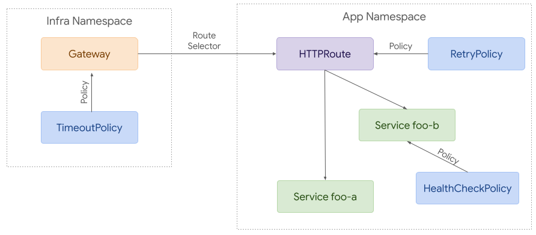

# GEP-713: Policy Attachment

* Issue: [#713](https://github.com/kubernetes-sigs/gateway-api/issues/713)
* Status: Experimental

## TLDR

This GEP aims to standardize policy attachment to resources associated with
Gateway API by establishing a pattern which defines how `Policy` API types can
have their relevant effects applied to network traffic. Individual policy APIs
(e.g. `TimeoutPolicy`, `RetryPolicy`, etc) will include a common `TargetRef`
field in their specification to identify how and where to apply that policy.
This will be important for providing a consistent experience across
implementations of the API, even for configuration details that may not be fully
portable.

## Goals

* Establish a pattern for policy attachment which will be used for any policies
  included in the Gateway API spec
* Establish a pattern for policy attachment which should be used for any
  implementation specific policies used with Gateway API resources
* Provide a way to distinguish between required and default values for all
  policy API implementations
* Enable policy attachment at all relevant scopes, including Gateways, Routes,
  Backends
* Ensure the policy attachment specification is generic and forward thinking
  enough that it could be easily adapted to other grouping mechanisms like
  Namespaces in the future
* Provide a means of attachment that works for both ingress and mesh
  implementations of this API
* Provide a consistent specification that will ensure familiarity between both
  included and implementation-specific policies so they can both be interpreted
  the same way.

## Out of scope

* Define all potential policies that may be attached to resources
* Design the full structure and configuration of policies

## API

This approach is building on concepts from all of the alternatives discussed
below. This is very similar to the existing BackendPolicy resource in the API,
but also borrows some concepts from the [ServicePolicy
proposal](https://github.com/kubernetes-sigs/gateway-api/issues/611).

### Policy Attachment for Ingress
Attaching policy to Gateway resources for ingress use cases is relatively
straightforward. A policy can reference the resource it wants to apply to.
Access is granted with RBAC - anyone that has access to create a RetryPolicy in
a given namespace can attach it to any resource within that namespace.


To build on that example, it’s possible to attach policies to more resources.
Each policy applies to the referenced resource and everything below it in terms
of hierarchy. Although this example is likely more complex than many real world
use cases, it helps demonstrate how policy attachment can work across
namespaces.



### Policy Attachment for Mesh
Although there is a great deal of overlap between ingress and mesh use cases,
mesh enables more complex policy attachment scenarios. For example, you may want
to apply policy to requests from a specific namespace to a backend in another
namespace.


Policy attachment can be quite simple with mesh. Policy can be applied to any
resource in any namespace but it can only apply to requests from the same
namespace if the target is in a different namespace.

At the other extreme, policy can be used to apply to requests from a specific
workload to a backend in another namespace. A route can be used to intercept
these requests and split them between different backends (foo-a and foo-b in
this case).


### Policy TargetRef API

Each Policy resource MUST include a single `targetRef` field. It must not
target more than one resource at a time, but it can be used to target larger
resources such as Gateways or Namespaces that may apply to multiple child
resources.

As with most APIs, there are countless ways we could choose to expand this in
the future. This includes supporting multiple targetRefs and/or label selectors.
Although this would enable compelling functionality, it would increase the
complexity of an already complex API and potentially result in more conflicts
between policies. Although we may choose to expand the targeting capabilities
in the future, at this point it is strongly preferred to start with a simpler
pattern that still leaves room for future expansion.

The `targetRef` field MUST have the following structure:

```go
// PolicyTargetReference identifies an API object to apply policy to.
type PolicyTargetReference struct {
    // Group is the group of the target resource.
    //
    // +kubebuilder:validation:MinLength=1
    // +kubebuilder:validation:MaxLength=253
    Group string `json:"group"`

    // Kind is kind of the target resource.
    //
    // +kubebuilder:validation:MinLength=1
    // +kubebuilder:validation:MaxLength=253
    Kind string `json:"kind"`

    // Name is the name of the target resource.
    //
    // +kubebuilder:validation:MinLength=1
    // +kubebuilder:validation:MaxLength=253
    Name string `json:"name"`

    // Namespace is the namespace of the referent. When unspecified, the local
    // namespace is inferred. Even when policy targets a resource in a different
    // namespace, it may only apply to traffic originating from the same
    // namespace as the policy.
    //
    // +kubebuilder:validation:MinLength=1
    // +kubebuilder:validation:MaxLength=253
    // +optional
    Namespace string `json:"namespace,omitempty"`
}
```

### Sample Policy API
The following structure can be used as a starting point for any Policy resource
using this API pattern. Note that the PolicyTargetReference struct defined above
will be distributed as part of the Gateway API.

```go
// ACMEServicePolicy provides a way to apply Service policy configuration with
// the ACME implementation of the Gateway API.
type ACMEServicePolicy struct {
    metav1.TypeMeta   `json:",inline"`
    metav1.ObjectMeta `json:"metadata,omitempty"`

    // Spec defines the desired state of ACMEServicePolicy.
    Spec ACMEServicePolicySpec `json:"spec"`

    // Status defines the current state of ACMEServicePolicy.
    Status ACMEServicePolicyStatus `json:"status,omitempty"`
}

// ACMEServicePolicySpec defines the desired state of ACMEServicePolicy.
type ACMEServicePolicySpec struct {
    // TargetRef identifies an API object to apply policy to.
    TargetRef gatewayv1a2.PolicyTargetReference `json:"targetRef"`

    // Override defines policy configuration that should override policy
    // configuration attached below the targeted resource in the hierarchy.
    // +optional
    Override *ACMEPolicyConfig `json:"override,omitempty"`

    // Default defines default policy configuration for the targeted resource.
    // +optional
    Default *ACMEPolicyConfig `json:"default,omitempty"`
}

// ACMEPolicyConfig contains ACME policy configuration.
type ACMEPolicyConfig struct {
    // Add configurable policy here
}

// ACMEServicePolicyStatus defines the observed state of ACMEServicePolicy.
type ACMEServicePolicyStatus struct {
    // Conditions describe the current conditions of the ACMEServicePolicy.
    //
    // +optional
    // +listType=map
    // +listMapKey=type
    // +kubebuilder:validation:MaxItems=8
    Conditions []metav1.Condition `json:"conditions,omitempty"`
}
```

### Hierarchy
Each policy MAY include default or override values. Default values are given
precedence from the bottom up, while override values are top down. That means
that a default attached to a Backend will have the highest precedence among
default values while an override value attached to a GatewayClass will have the
highest precedence overall.


To illustrate this, consider 3 resources with the following hierarchy:
A > B > C. When attaching the concept of defaults and overrides to that, the
hierarchy would be expanded to this:

A override > B override > C override > C default > B default > A default.

Note that the hierarchy is reversed for defaults. The rationale here is that
overrides usually need to be enforced top down while defaults should apply to
the lowest resource first. For example, if an admin needs to attach required
policy, they can attach it as an override to a Gateway. That would have
precedence over Routes and Services below it. On the other hand, an app owner
may want to set a default timeout for their Service. That would have precedence
over defaults attached at higher levels such as Route or Gateway.

If using defaults and overrides, each policy resource MUST include 2 structs
within the spec. One with override values and the other with default values.

In the following example, the policy attached to the Gateway requires cdn to
be enabled and provides some default configuration for that. The policy attached
to the Route changes the value for one of those fields (includeQueryString).

```yaml
kind: GKEServicePolicy # Example of implementation specific policy name
spec:
  override:
    cdn:
      enabled: true
  default:
    cdn:
      cachePolicy:
        includeHost: true
        includeProtocol: true
        includeQueryString: true
  targetRef:
    kind: Gateway
    name: example
---
kind: GKEServicePolicy
spec:
  default:
    cdn:
      cachePolicy:
        includeQueryString: false
  targetRef:
    kind: HTTPRoute
    name: example
```

In this final example, we can see how the override attached to the Gateway has
precedence over the default drainTimeout value attached to the Route. At the
same time, we can see that the default connectionTimeout attached to the Route
has precedence over the default attached to the Gateway.


#### Supported Resources
It is important to note that not every implementation will be able to support
policy attachment to each resource described in the hierarchy above. When that
is the case, implementations MUST clearly document which resources a policy may
be attached to.

#### Attaching Policy to GatewayClass
GatewayClass may be the trickiest resource to attach policy to. Policy
attachment relies on the policy being defined within the same scope as the
target. This ensures that only users with write access to a policy resource in a
given scope will be able to modify policy at that level. Since GatewayClass is a
cluster scoped resource, this means that any policy attached to it must also be
cluster scoped.

GatewayClass parameters provide an alternative to policy attachment that may be
easier for some implementations to support. These parameters can similarly be
used to set defaults and requirements for an entire GatewayClass.

### Targeting External Services
In some cases (likely limited to mesh) we may want to apply policies to requests
to external services. To accomplish this, implementations can choose to support
a refernce to a virtual resource type:

```yaml
apiVersion: networking.acme.io/v1alpha1
kind: RetryPolicy
metadata:
  name: foo
spec:
  default:
    maxRetries: 5
  targetRef:
    group: networking.acme.io
    kind: ExternalService
    name: foo.com
```

### Conflict Resolution
It is possible for multiple policies to target the same resource. When this
happens, merging is the preferred outcome. If multiple policy resources target
the same resource _and_ have an identical field specified with different values,
precedence MUST be determined in order of the following criteria, continuing on
ties:

* The oldest Policy based on creation timestamp. For example, a Policy with a
  creation timestamp of "2021-07-15 01:02:03" is given precedence over a Policy
  with a creation timestamp of "2021-07-15 01:02:04".
* The Policy appearing first in alphabetical order by `{namespace}/{name}`. For
  example, foo/bar is given precedence over foo/baz.

For a better user experience, a validating webhook can be implemented to prevent
these kinds of conflicts all together.

### Kubectl Plugin
To help improve UX and standardization, a kubectl plugin will be developed that
will be capable of describing the computed sum of policy that applies to a given
resource, including policies applied to parent resources.

Each Policy CRD that wants to be supported by this plugin will need to follow
the API structure defined above and add a `gateway.networking.k8s.io/policy:
true` label to the CRD.

### Status
In the future, we may consider adding a new `Policies` field to status on
Gateways and Routes. This would be a list of `PolicyTargetReference` structs
with the fields instead used to refer to the Policy resource that has been
applied.

Unfortunately, this may create more confusion than it is worth, here are some of
the key concerns:

* When multiple controllers are implementing the same Route and recognize a
  policy, it would be difficult to determine which controller should be
  responsible for adding that policy reference to status.
* For this to be somewhat scalable, we'd need to limit the status entries to
  policies that had been directly applied to the resource. This could get
  confusing as it would not provide any insight into policies attached above or
  below.
* Since we only control some of the resources a policy might be attached to,
  adding policies to status would only be possible on Gateway API resources, not
  Services or other kinds of backends.

Although these concerns are not unsolvable, they lead to the conclusion that
a Kubectl plugin should be our primary approach to providing visibility here,
with a possibility of adding policies to status at a later point.

### Interaction with Custom Filters and other extension points
There are multiple methods of custom extension in the Gateway API. Policy
attachment and custom Route filters are two of these. Policy attachment is
designed to provide arbitrary configuration fields that decorate Gateway API
resources. Route filters provide custom request/response filters embedded inside
Route resources. Both are extension methods for fields that cannot easily be
standardized as core or extended fields of the Gateway API. The following
guidance should be considered when introducing a custom field into any Gateway
controller implementation:

1. For any given field that a Gateway controller implementation needs, the
   possibility of using core or extended should always be considered before
   using custom policy resources. This is encouraged to promote standardization
   and, over time, to absorb capabilities into the API as first class fields,
   which offer a more streamlined UX than custom policy attachment.

2. Although it's possible that arbitrary fields could be supported by custom
   policy, custom route filters, and core/extended fields concurrently, it is
   strongly recommended that implementations not use multiple mechanisms for
   representing the same fields. A given field should only be supported through
   a single extension method. An example of potential conflict is policy
   precedence and structured hierarchy, which only applies to custom policies.
   Allowing a field to exist in custom policies and also other areas of the API,
   which are not part of the structured hierarchy, breaks the precedence model.
   Note that this guidance may change in the future as we gain a better
   understanding for extension mechanisms of the Gateway API can interoperate.

### Conformance Level
This policy attachment pattern is associated with an "EXTENDED" conformance
level. The implementations that support this policy attachment model will have
the same behavior and semantics, although they may not be able to support
attachment of all types of policy at all potential attachment points.

### Apply Policies to Sections of a Resource (Future Extension)
Although initially out of scope, it would be helpful to be able to target
specific matches within nested objects. For example, it may be useful to attach
policies to a specific Gateway listener or Route rule. This section explores
what that could look like.

Each Route rule or Gateway listener should be expanded with an optional name
field. The target ref would be expanded with an optional sectionName field that
could be used to refer to that specific section of the resource. It would refer
to the following concepts on these resources:

* Gateway.Listeners.Name
* xRoute.Rules.Name
* Service.Ports.Name

```yaml
apiVersion: gateway.networking.k8s.io/v1alpha2
kind: HTTPRoute
metadata:
  name: http-app-1
  labels:
    app: foo
spec:
  hostnames:
  - "foo.com"
  rules:
  - name: bar
    matches:
    - path:
        type: Prefix
        value: /bar
    forwardTo:
    - serviceName: my-service1
      port: 8080
---
apiVersion: networking.acme.io/v1alpha2
kind: RetryPolicy
metadata:
  name: foo
spec:
  maxRetries: 5
  targetRef:
    name: foo
    group: gateway.networking.k8s.io
    kind: HTTPRoute
    sectionName: bar
```

This would require adding a `SectionName` field to the PolicyTargetReference:
```go
type PolicyTargetReference struct {
    // SectionName is the name of a section within the target resource. When
    // unspecified, this targets the entire resource. In the following
    // resources, SectionName is interpreted as the following:
    // * Gateway: Listener Name
    // * Route: Rule Name
    // * Service: Port Name
    //
    // +kubebuilder:validation:MinLength=1
    // +kubebuilder:validation:MaxLength=253
    // +optional
    SectionName string `json:"sectionName,omitempty"`
    // ...
}
```

This would also require adding a `Name` field to Gateway listeners and Route
rules:

```go
type Listener struct {
    // Name is the name of the Listener. If more than one Listener is present
    // each Listener MUST specify a name. The names of Listeners MUST be unique
    // within a Gateway.
    //
    // Support: Core
    //
    // +kubebuilder:validation:MinLength=1
    // +kubebuilder:validation:MaxLength=253
    // +optional
    Name string `json:"name,omitempty"`
    // ...
}
```

```go
type RouteRule struct {
    // Name is the name of the Route rule. If more than one Route Rule is
    // present, each Rule MUST specify a name. The names of Rules MUST be unique
    // within a Route.
    //
    // Support: Core
    //
    // +kubebuilder:validation:MinLength=1
    // +kubebuilder:validation:MaxLength=253
    // +optional
    Name string `json:"name,omitempty"`
    // ...
}
```

### Advantages
* Incredibly flexible approach that should work well for both ingress and mesh
* Conceptually similar to existing ServicePolicy proposal and BackendPolicy
  pattern
* Easy to attach policy to resources we don’t control (Service, ServiceImport,
  etc)
* Minimal API changes required
* Simplifies packaging an application for deployment as policy references do not
  need to be part of the templating

### Disadvantages
* May be difficult to understand which policies apply to a request

## Removing BackendPolicy
BackendPolicy represents the initial attempt to cover policy attachment for
Gateway API. Although this proposal ended up with a similar structure to
BackendPolicy, it is not clear that we ever found sufficient value or use cases
for BackendPolicy. Given that this proposal provides more powerful ways to
attach policy, it makes sense to remove BackendPolicy until we have a better
alternative.

## Alternatives

### 1. ServiceBinding for attaching Policies and Routes for Mesh
A new ServiceBinding resource has been proposed for mesh use cases. This would
provide a way to attach policies, including Routes to a Service.

Most notably, these provide a way to attach different policies to requests
coming from namespaces or specific Gateways. In the example below, a
ServiceBinding in the consumer namespace would be applied to the selected
Gateway and affect all requests from that Gateway to the foo Service. Beyond
policy attachment, this would also support attaching Routes as policies, in this
case the attached HTTPRoute would split requests between the foo-a and foo-b
Service instead of the foo Service.


This approach can be used to attach a default set of policies to all requests
coming from a namespace. The example below shows a ServiceBinding defined in the
producer namespace that would apply to all requests from within the same
namespace or from other namespaces that did not have their own ServiceBindings
defined.


#### Advantages
* Works well for mesh and any use cases where requests don’t always transit
  through Gateways and Routes.
* Allows policies to apply to an entire namespace.
* Provides very clear attachment of polices, routes, and more to a specific
  Service.
* Works well for ‘shrink-wrap application developers’ - the packaged app does
  not need to know about hostnames or policies or have extensive templates.
* Works well for ‘dynamic’ / programmatic creation of workloads ( Pods,etc - see
  CertManager)
* It is easy to understand what policy applies to a workload - by listing the
  bindings in the namespace.

#### Disadvantages
* Unclear how this would work with an ingress model. If Gateways, Routes, and
  Backends are all in different namespaces, and each of those namespaces has
  different ServiceBindings applying different sets of policies, it’s difficult
  to understand which policy would be applied.
* Unclear if/how this would interact with existing the ingress focused policy
  proposal described below. If both coexisted, would it be possible for a user
  to understand which policies were being applied to their requests?
* Route status could get confusing when Routes were referenced as a policy by
  ServiceBinding
* Introduces a new mesh specific resource.

### 2. Attaching Policies for Ingress
An earlier proposal for policy attachment in the Gateway API suggested adding
policy references to each Resource. This works very naturally for Ingress use
cases where all requests follow a path through Gateways, Routes, and Backends.
Adding policy attachment at each level enables different roles to define
defaults and allow overrides at different levels.


#### Advantages
* Consistent policy attachment at each level
* Clear which policies apply to each component
* Naturally translates to hierarchical Ingress model with ability to delegate
  policy decisions to different roles

#### Disadvantages
* Policy overrides could become complicated
* At least initially, policy attachment on Service would have to rely on Service
  annotations or references from policy to Service(s)
* No way to attach policy to other resources such as namespace or ServiceImport
* May be difficult to modify Routes and Services if other components/roles are
  managing them (eg Knative)

### 3. Shared Policy Resource
This is really just a slight variation or extension of the main proposal in this
GEP. We would introduce a shared policy resource. This resource would follow the
guidelines described above, including the `targetRef` as defined as well as
`default` and `override` fields. Instead of carefully crafted CRD schemas for
each of the `default` and `override` fields, we would use more generic
`map[string]string` values. This would allow similar flexibility to annotations
while still enabling the default and override concepts that are key to this
proposal.

Unfortunately this would be difficult to validate and would come with many of
the downsides of annotations. A validating webhook would be required for any
validation which could result in just as much or more work to maintain than
CRDs. At this point we believe that the best experience will be from
implementations providing their own policy CRDs that follow the patterns
described in this GEP. We may want to explore tooling or guidance to simplify
the creation of these policy CRDs to help simplify implementation and extension
of this API.

## References

**Issues**
* [Extensible Service Policy and Configuration](https://github.com/kubernetes-sigs/gateway-api/issues/611)

**Docs**
* [Policy Attachment and Binding](https://docs.google.com/document/d/13fyptUtO9NV_ZAgkoJlfukcBf2PVGhsKWG37yLkppJo/edit?resourcekey=0-Urhtj9gBkGBkSL1gHgbWKw)
