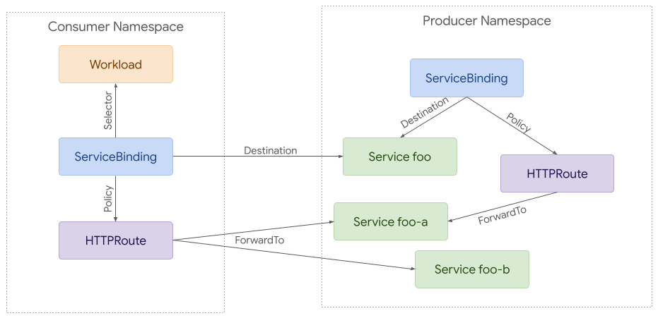

# GEP-713: Policy Attachment

* Issue URL: https://github.com/kubernetes-sigs/gateway-api/issues/713
* Status: Implementable

## TLDR

This GEP aims to standardize policy attachment to resources associated with
Gateway API. This will be important for providing a consistent experience across
implementations of the API, even for configuration details that may not be fully
portable.

## Goals

* Establish a pattern for policy attachment which will be used for any policies
  included in the Gateway API spec
* Establish a pattern for policy attachment which should be used for any
  implementation specific policies used with Gateway API resources
* Provide a way to distinguish between required and default values
* Enable policy attachment at all relevant scopes, including Gateways, Routes,
  Backends, and maybe Namespaces
* Provide a means of attachment that works for both ingress and mesh uses of
  this API
* Provide a consistent way that both included and implementation-specific
  policies can be interpreted

## API

This approach is building on concepts from all of the alternatives discussed
below. This is very similar to the existing BackendPolicy resource in the API,
but also borrows some concepts from the ServicePolicy proposal.

### Policy Attachment for Ingress
Attaching policy to Gateway resources for ingress use cases is relatively
straightforward. A policy can reference the resource it wants to apply to.
Access is granted with RBAC - anyone that has access to create a RetryPolicy in
a given namespace can attach it to any resource within that namespace.


Attaching policy to Gateway resources for ingress use cases is relatively
straightforward. A policy can reference the resource it wants to apply to.
Access is granted with RBAC - anyone that has access to create a RetryPolicy in
a given namespace can attach it to any resource within that namespace.


### Policy Attachment for Mesh
Although there is a great deal of overlap between ingress and mesh use cases,
mesh enables more complex policy attachment scenarios. For example, you may want
to apply policy to requests from a specific namespace to a backend in another
namespace. 


Policy attachment can be quite simple with mesh. Policy can be applied to any
resource in any namespace but it can only apply to requests from the same
namespace if the target is in a different namespace.

At the other extreme, policy can be used to apply to requests from a specific
workload to a backend in another namespace. A route can be used to intercept
these requests and split them between different backends (foo-a and foo-b in
this case).


### Policy TargetRef API

Each Policy resource should include a single `targetRef` field. It must not
target more than one resource at a time, but it can be used target larger
resources such as Gateways or Namespaces that may apply to multiple child
resources. This field should have the following structure:

```go
// PolicyTargetReference identifies an API object to apply policy to.
type PolicyTargetReference struct {
    // Group is the group of the target resource.
    //
    // Support: Core
    //
    // +kubebuilder:validation:MinLength=1
    // +kubebuilder:validation:MaxLength=253
    Group string `json:"group"`

    // Kind is kind of the target resource.
    //
    // Support: Core
    //
    // +kubebuilder:validation:MinLength=1
    // +kubebuilder:validation:MaxLength=253
    Kind string `json:"kind"`

    // Name is the name of the target resource.
    //
    // Support: Core
    //
    // +kubebuilder:validation:MinLength=1
    // +kubebuilder:validation:MaxLength=253
    Name string `json:"name"`

    // SectionName is the name of a section within the target resource. When 
    // unspecified, this targets the entire resource. In the following
    // resources, SectionName is interpreted as the following:
    // * Gateway: Listener Name
    // * Route: Rule Name
    // * Service: Port Name
    //
    // Support: Core
    //
    // +kubebuilder:validation:MinLength=1
    // +kubebuilder:validation:MaxLength=253
    // +optional
    SectionName string `json:"sectionName,omitempty"`

    // Namespace is the namespace of the referent. When unspecified, the local
    // namespace is inferred. Even when policy targets a resource in a different
    // namespace, it may only apply to traffic originating from the same 
    // namespace as the policy.
    //
    // Support: Extended
    //
    // +kubebuilder:validation:MinLength=1
    // +kubebuilder:validation:MaxLength=253
    // +optional
    Namespace string `json:"namespace,omitempty"`
    
    // ClassName is the name of the class this policy should apply to. When
    // unspecified, the policy will apply to all classes that support it.
    //
    // Support: Core
    //
    // +kubebuilder:validation:MinLength=1
    // +kubebuilder:validation:MaxLength=253
    // +optional
    ClassName string `json:"className,omitempty"`
}
```

### Status
A new `Policies` field will be added to status on Gateways and Routes. This will
be a list of `PolicyTargetReference` structs with the fields instead used to
refer to the Policy resource that has been applied.

### Hierarchy
Policy precedence is determined in the same direction a request flows. For
ingress, that means from Gateway to Backend, and for mesh that means from
Consumer to Backend. 

| Ingress | Sidecar Consumer |
|-|-|
| Gateway Namespace | Consumer Namespace |
| Gateway | Consumer |
| Route Namespace | Route Namespace |
| Route | Route |
| Backend Namespace | Backend Namespace |
| Backend | Backend |

Some implementations may wish to provide default or enforced values. For default
values, the hierarchies above would be used. For example, if a default value was
specified for both a Route and Backend, the value attached to the backend would
be given precedence. For enforced values, precedence would be given to the
policy attached higher in the hierarchy.

Each policy resource would include 2 structs within the spec. One with enforced
values and the other with default values. In the following example, the policy
attached to the Gateway requires cdn to be enabled and provides some default
configuration for that. The policy attached to the Route changes the value for
one of those fields (includeQueryString).

```yaml
kind: GKEServicePolicy # Example of implementation specific policy name
spec:
  enforce:
    cdn:
      enabled: true
  default:
    cdn:
      cachePolicy:
        includeHost: true
        includeProtocol: true
        includeQueryString: true
  targetRef:
    kind: Gateway
    name: example
---
kind: GKEServicePolicy
spec:
  default:
    cdn:
      cachePolicy:
        includeQueryString: false
  targetRef:
    kind: HTTPRoute
    name: example
```

### Targeting External Services
In some cases (likely limited to mesh) we may want to apply policies to requests
to external services. To accomplish this, implementations can choose to support
a refernce to a virtual resource type:

```yaml
kind: RetryPolicy
apiVersion: networking.acme.io/v1alpha1
metadata:
  name: foo
spec:
  default:
    maxRetries: 5
  targetRef:
    group: networking.acme.io
    kind: ExternalService
    hostname: foo.com
```

### Apply Policies to Specific Matches
In some cases we may want to target specific matches within nested objects. For
example, it may be useful to attach policies to a specific Gateway listener or
Route rule.

Each Route rule or Gateway listener should be expanded with an optional name
field. The target ref would be expanded with an optional sectionName field that
could be used to refer to that specific section of the resource. It would refer
to the following concepts on these resources:

* Gateway.Listeners.Name
* xRoute.Rules.Name
* Service.Ports.Name

```yaml
kind: HTTPRoute
apiVersion: networking.x-k8s.io/v1alpha1
metadata:
  name: http-app-1
  labels:
    app: foo
spec:
  hostnames:
  - "foo.com"
  rules:
  - name: bar
    matches:
    - path:
        type: Prefix
        value: /bar
    forwardTo:
    - serviceName: my-service1
      port: 8080
---
kind: RetryPolicy
apiVersion: networking.acme.io/v1alpha1
metadata:
  name: foo
spec:
  maxRetries: 5
  targetRef:
    name: foo
    group: networking.x-k8s.io
    kind: HTTPRoute
    sectionName: bar
```

This would require adding a `Name` field to Gateway listeners and Route rules:

```go
type Listener struct {
    // Name is the name of the Listener.
    //
    // Support: Core
    //
    // +kubebuilder:validation:MinLength=1
    // +kubebuilder:validation:MaxLength=253
    // +optional
    Name string `json:"name,omitempty"`
    // ...
}
```

```go
type RouteRule struct {
    // Name is the name of the Route rule.
    //
    // Support: Core
    //
    // +kubebuilder:validation:MinLength=1
    // +kubebuilder:validation:MaxLength=253
    // +optional
    Name string `json:"name,omitempty"`
    // ...
}
```

### Kubectl Plugin
To help improve UX and standardization, a kubectl plugin will be developed that
will be capable of describing the computed sum of policy that applies to a given
resource, including policies applied to parent resources.

Each Policy CRD that wants to be supported by this plugin will need to follow
the API structure defined above and add a `networking.x-k8s.io/policy: true` to
the CRD.

### Interaction with Custom Filters
The concept of policy attachment is rather similar to attaching custom filters
to a Route rule. Although it's possible that both concepts could be supported
concurrently in the future, it is strongly recommended that implementations not
recycle the same resource types for both concepts. To help simplify
configuration, a concept should be configurable as either policy or a route
filter, not both. This guidance may change in the future as we gain a better
understanding for how the two concepts can interoperate.

### Advantages
* Incredibly flexible approach that should work well for both ingress and mesh
* Conceptually similar to existing ServicePolicy proposal and BackendPolicy
  pattern
* Easy to attach policy to resources we don’t control (Service, ServiceImport,
  etc)
* Minimal API changes required (just expansion of status)
* Simplifies packaging an application for deployment as policy references do not
  need to be part of the templating

### Disadvantages
* May be difficult to understand which policies apply to a request


## Alternatives

### 1. ServiceBinding for attaching Policies and Routes for Mesh
A new ServiceBinding resource has been proposed for mesh use cases. This would
provide a way to attach policies, including Routes to a Service.

Most notably, these provide a way to attach different policies to requests
coming from namespaces or specific Gateways. In the example below, a
ServiceBinding in the consumer namespace would be applied to the selected
Gateway and affect all requests from that Gateway to the foo Service. Beyond
policy attachment, this would also support attaching Routes as policies, in this
case the attached HTTPRoute would split requests between the foo-a and foo-b
Service instead of the foo Service.


This approach can be used to attach a default set of policies to all requests
coming from a namespace. The example below shows a ServiceBinding defined in the
producer namespace that would apply to all requests from within the same
namespace or from other namespaces that did not have their own ServiceBindings
defined.



#### Advantages
* Works well for mesh and any use cases where requests don’t always transit
  through Gateways and Routes.
* Allows policies to apply to an entire namespace.
* Provides very clear attachment of polices, routes, and more to a specific
  Service.
* Works well for ‘shrink-wrap application developers’ - the packaged app does
  not need to know about hostnames or policies or have extensive templates.
* Works well for ‘dynamic’ / programmatic creation of workloads ( Pods,etc - see
  CertManager)
* It is easy to understand what policy applies to a workload - by listing the
  bindings in the namespace.

#### Disadvantages
* Unclear how this would work with an ingress model. If Gateways, Routes, and
  Backends are all in different namespaces, and each of those namespaces has
  different ServiceBindings applying different sets of policies, it’s difficult
  to understand which policy would be applied.
* Unclear if/how this would interact with existing the ingress focused policy
  proposal described below. If both coexisted, would it be possible for a user
  to understand which policies were being applied to their requests?
* Route status could get confusing when Routes were referenced as a policy by
  ServiceBinding
* Introduces a new mesh specific resource.

### 2. Attaching Policies for Ingress
An earlier proposal for policy attachment in the Gateway API suggested adding
policy references to each Resource. This works very naturally for Ingress use
cases where all requests follow a path through Gateways, Routes, and Backends.
Adding policy attachment at each level enables different roles to define
defaults and allow overrides at different levels.


#### Advantages
* Consistent policy attachment at each level
* Clear which policies apply to each component
* Naturally translates to hierarchical Ingress model with ability to delegate
  policy decisions to different roles

#### Disadvantages
* Policy overrides could become complicated
* At least initially, policy attachment on Service would have to rely on Service
  annotations or references from policy to Service(s)
* No way to attach policy to other resources such as namespace or ServiceImport
* May be difficult to modify Routes and Services if other components/roles are
  managing them (eg Knative)


## Out of scope

* Define all potential policies that may be attached to resources
* Design the full structure and configuration of policies

## References

**Issues**
* [Extensible Service Policy and Configuration](https://github.com/kubernetes-sigs/gateway-api/issues/611)

**Docs**
* [Policy Attachment and Binding](https://docs.google.com/document/d/13fyptUtO9NV_ZAgkoJlfukcBf2PVGhsKWG37yLkppJo/edit?resourcekey=0-Urhtj9gBkGBkSL1gHgbWKw)