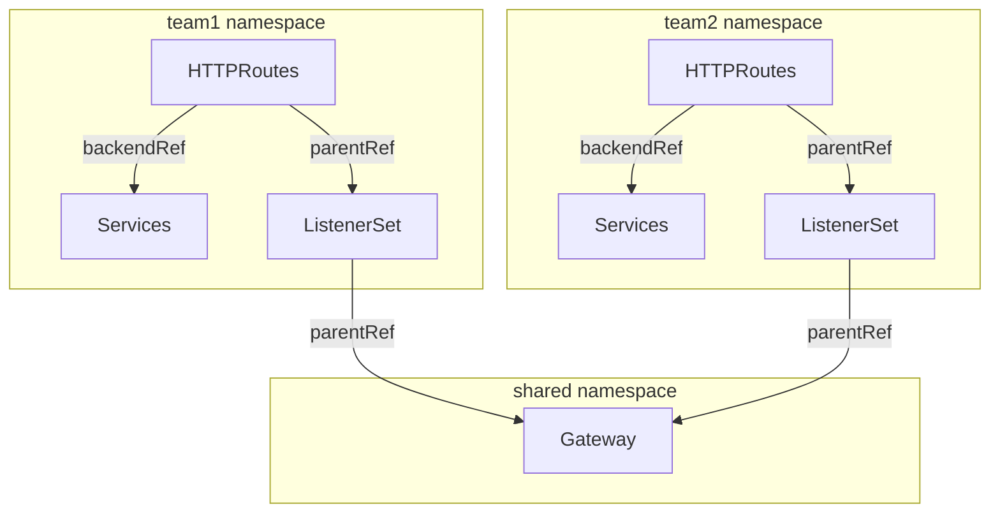

# ListenerSets

ListenerSets allow teams to define ports, hostnames, and TLS certificates in separate resources
rather than cramming everything into one giant Gateway object which has a limit of 64 listeners.
This enables a delegated management  model suitable for high-scale, multi-tenant environments.

As such, you might use ListenerSets for the following advantages:

- *Multitenancy*: You can let different teams create their own ListenerSets while sharing the same
Gateway and backing load-balancing infrastructure.

- *Large scale deployments*: By using ListenerSets, Gateways can have more than 64 listeners attached.
Teams can also share the same ListenerSet configuration to avoid duplication.

- *Certificates for more listeners per gateway*: Because you can now have more than 64 listeners per Gateway,
a single Gateway can forward secured traffic to more backends that might have their own certificates.
This approach aligns with projects that require service-level certificates, such as Istio Ambient Mesh or Knative.

The following diagram illustrates how ListenerSets help decentralize route configuration in a multi-tenant environment at scale:

- Team 1 and Team 2 each manage their own Service and HTTPRoute resources within their respective namespaces.

- Each HTTPRoute refers to a namespace-local ListenerSet. This way, each team controls how their routes are exposed,
such as the protocol, port, and TLS certificate settings.

- The ListenerSets from both teams share a common Gateway in a separate namespace. A separate Gateway team can setup
and manage centralized infrastructure or enforce policies as appropriate.



## Using ListenerSets
### Gateway Configuration

By default, a Gateway does not allow ListenerSets to be attached. Users can enable this behaviour
by configuring their Gateway to allow ListenerSets by adding the `allowedListeners` field to the Gateway spec.
This defines which namespaces are permitted to contribute listeners.

```yaml
apiVersion: gateway.networking.k8s.io/v1
kind: Gateway
metadata:
  name: parent-gateway
spec:
  allowedListeners:
    namespaces:
      from: Same
```

### ListenerSet Configuration
The ListenerSet references the parent Gateway via `parentRef`:

```yaml
apiVersion: gateway.networking.k8s.io/v1
kind: ListenerSet
metadata:
  name: workload-listeners
spec:
  parentRef:
    name: parent-gateway
    kind: Gateway
    group: gateway.networking.k8s.io
```

### Route Attachment

To attach an `HTTPRoute` (or any other route type) to a ListenerSet,
it must reference the `ListenerSet` as the Parent Resource via `parentRefs`.

```yaml
apiVersion: gateway.networking.k8s.io/v1
kind: HTTPRoute
metadata:
  name: httproute-example
spec:
  parentRefs:
  - name: workload-listeners
    kind: ListenerSet
    group: gateway.networking.k8s.io
    sectionName: second
```

## Listener Conflicts

Since multiple ListenerSets can attach to one Gateway, a conflict-aware merge is performed.
A listener is unique based on the combination of Port, Protocol, and Hostname.

In case of a conflict, listener precedence is used to resolve port and hostname collisions.
The parent Gateway always takes absolute priority; if a conflict exists between external ListenerSets,
the one with the earliest creation timestamp wins. In the rare event of identical timestamps, the
alphabetical order of the namespace and name acts as the final tie-breaker. Any "losing" configuration
is automatically marked with a `Conflicted: True` status and remains inactive until the higher-priority
resource is removed, ensuring a secure and predictable traffic flow.

## Examples

The following example shows a `Gateway` with an HTTP listener and two child HTTPS `ListenerSets`
with unique hostnames and certificates. Only `ListenerSets` from the same namespace of the `Gateway` will be accepted:

```yaml
apiVersion: gateway.networking.k8s.io/v1
kind: Gateway
metadata:
  name: parent-gateway
spec:
  gatewayClassName: example
  allowedListeners:
    namespaces:
      from: Same
  listeners:
  - name: foo
    hostname: foo.com
    protocol: HTTP
    port: 80
---
apiVersion: gateway.networking.x-k8s.io/v1alpha1
kind: ListenerSet
metadata:
  name: first-workload-listeners
spec:
  parentRef:
    name: parent-gateway
    kind: Gateway
    group: gateway.networking.k8s.io
  listeners:
  - name: first
    hostname: first.foo.com
    protocol: HTTPS
    port: 443
    tls:
      mode: Terminate
      certificateRefs:
      - kind: Secret
        group: ""
        name: first-workload-cert # Provisioned via HTTP01 challenge
---
apiVersion: gateway.networking.x-k8s.io/v1alpha1
kind: ListenerSet
metadata:
  name: second-workload-listeners
spec:
  parentRef:
    name: parent-gateway
    kind: Gateway
    group: gateway.networking.k8s.io
  listeners:
  - name: second
    hostname: second.foo.com
    protocol: HTTPS
    port: 443
    tls:
      mode: Terminate
      certificateRefs:
      - kind: Secret
        group: ""
        name: second-workload-cert # Provisioned via HTTP01 challenge
```


