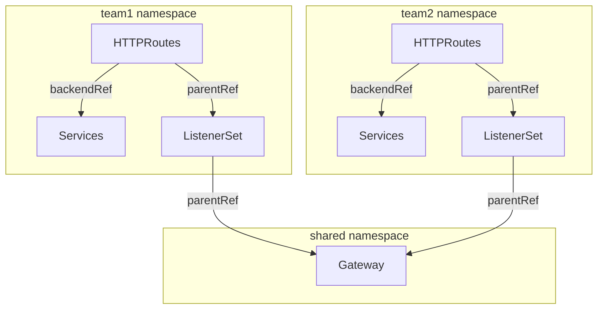

# ListenerSets

ListenerSets allow teams to independently define and attach groups of listeners to a central, shared Gateway. This enables self-service TLS configuration, improves multi-tenancy by allowing decentralized listener management, and allows scaling beyond the 64 listener limits of a single Gateway resource.

## ListenerSet use cases

As such, you might use ListenerSets for the following advantages:

- *Multitenancy*: You can let different teams create their own ListenerSets, but share the same Gateway and backing load balancing infrastructure.

- *Large scale deployments*: By using ListenerSets, Gateways can have more than 64 listeners attached. Teams can also share the same ListenerSet configuration to avoid duplication.

- *Certificates for more listeners per gateway*: Because you can now have more than 64 listeners per Gateway, a single Gateway can forward secured traffic to more backends that might have their own certificates. This approach aligns with projects that might require service-level certificates, such as Istio Ambient Mesh or Knative.

The following diagram presents a simple illustration of how ListenerSets can help you decentralize route configuration in a multitenant environment at scale.

- Team 1 and Team 2 each manage their own Service and HTTPRoute resources within their respective namespaces.

- Each HTTPRoute refers to a namespace-local ListenerSet. This way, each team controls how their routes are exposed, such as the protocol, port, and TLS certificate settings.

- The ListenerSets from both teams share a common Gateway in a separate namespace. A separate Gateway team can setup and manage centralized infrastructure or enforce policies as appropriate.



## Prerequisites

To use ListenerSets, you must be running Gateway API 1.5+

## Attaching ListenerSets
### Gateway Configuration

By default a `Gateway` does not allow `ListenerSets` to be attached. Users can enable this behaviour by configuring their `Gateway` to allow `ListenerSet` attachment via `spec.allowedListeners` :

```yaml
apiVersion: gateway.networking.k8s.io/v1
kind: Gateway
metadata:
  name: parent-gateway
spec:
  allowedListeners:
    namespaces:
      from: Same
```

The `namespaces.from` field within `AllowedListeners` can take the following four values:

- `None` (Default): No external ListenerSets are allowed to attach. Only the listeners defined directly inside the Gateway resource will be used.

- `Same`: Only ListenerSets located in the same namespace as the Gateway can be attached.

- `All`: ListenerSets from any namespace in the cluster are allowed to attach, provided they have a valid parentRef pointing to the Gateway.

- `Selector`: Only ListenerSets in namespaces that match a specific label selector are allowed. When using this value, you must also provide the selector field

### ListenerSet Configuration
A ListenerSet uses a parentRef to point to a specific Gateway

```yaml
apiVersion: gateway.networking.k8s.io/v1
kind: ListenerSet
metadata:
  name: workload-listeners
spec:
  parentRef:
    name: parent-gateway
    kind: Gateway
    group: gateway.networking.k8s.io
```

### Route Attachment

Routes can specify a `ListenerSet` as a `parentRef`. Routes can use `sectionName` fields in `ParentReference` to help target a specific listener. If no listener is targeted (`sectionName` is unset) then the Route attaches to all the listeners in the `ListenerSet`.

```yaml
apiVersion: gateway.networking.k8s.io/v1
kind: HTTPRoute
metadata:
  name: httproute-example
spec:
  parentRefs:
  - name: workload-listeners
    kind: ListenerSet
    group: gateway.networking.k8s.io
    sectionName: second
```

To attach a Route to a `ListenerSet` and its parent `Gateway`, it MUST have multiple `parentRefs` eg:

```yaml
apiVersion: gateway.networking.k8s.io/v1
kind: HTTPRoute
metadata:
  name: httproute-example
spec:
  parentRefs:
  - name: workload-listeners
    kind: ListenerSet
    group: gateway.networking.k8s.io
    sectionName: second
  - name: parent-gateway
    kind: Gateway
    sectionName: foo
```

## Listener Conflicts

Conflicts occur when multiple listeners claim the same Port, Protocol, and/or Hostname. The controller resolves these using the following priority:

1. Parent Gateway Listeners: Listeners defined directly in the Gateway spec always have the highest priority.

2. ListenerSet Creation Time: If two ListenerSets conflict, the one with the older creationTimestamp wins.

3. ListenerSet Alphabetical Order: If creation timestamps are identical, priority is given based on the alphabetical order of the resource's {namespace}/{name}.

The listener with the highest priority is Accepted and Programmed
The lower-priority listener is marked with a `Conflicted: True` condition in its status.

> A ListenerSet may be partially accepted if only some of its listeners are in conflict. Valid listeners will continue to route traffic, while conflicted ones are disabled

## Status Updates

A ListenerSet is considered successfully attached to a Gateway when the following three conditions must all be met:

1. Explicit Gateway Permission : By default, Gateways do not allow any external ListenerSets to attach. The Gateway must have an allowedListeners field in its spec that selects the namespace of the ListenerSet.

2. Valid Parent Reference : The ListenerSet must explicitly point back to the target Gateway.

3. Resource-Level Acceptance : The Gateway Controller must validate and "accept" the resource (all listeners are valid, etc.).

> A ListenerSet can be Accepted overall even if one of its individual listeners is in conflict with another set. In this case, only the non-conflicting listeners are "Programmed" into the data plane.

### Gateway Status
The parent `Gateway` status reports the number of successful attached listeners to `.status.attachedListenerSets`.

```yaml
apiVersion: gateway.networking.k8s.io/v1
kind: Gateway
metadata:
  name: parent-gateway
...
status:
  attachedListenerSets: 2
```

### ListenerSet Status
`ListenerSets` have a top-level `Accepted` and `Programmed` conditions. The details are as follows :
The `Accepted: True` condition is set if the ListenerSet is accepted.
The `Accepted: False` condition can be set for multiple reasons such as the parent Gateway does not allow ListenerSets, all the listeners are invalid, etc.

Because a ListenerSet can contain multiple listeners, each one gets its own status entry and follows the same logic as Gateway listeners.

## Examples

The following example shows a `Gateway` with an HTTP listener and two child HTTPS `ListenerSets` with unique hostnames and certificates.
Only `ListenerSets` from the same namespace of the `Gateway` will be accepted:

```yaml
apiVersion: gateway.networking.k8s.io/v1
kind: Gateway
metadata:
  name: parent-gateway
spec:
  gatewayClassName: example
  allowedListeners:
    namespaces:
      from: Same
  listeners:
  - name: foo
    hostname: foo.com
    protocol: HTTP
    port: 80
---
apiVersion: gateway.networking.x-k8s.io/v1alpha1
kind: ListenerSet
metadata:
  name: first-workload-listeners
spec:
  parentRef:
    name: parent-gateway
    kind: Gateway
    group: gateway.networking.k8s.io
  listeners:
  - name: first
    hostname: first.foo.com
    protocol: HTTPS
    port: 443
    tls:
      mode: Terminate
      certificateRefs:
      - kind: Secret
        group: ""
        name: first-workload-cert # Provisioned via HTTP01 challenge
---
apiVersion: gateway.networking.x-k8s.io/v1alpha1
kind: ListenerSet
metadata:
  name: second-workload-listeners
spec:
  parentRef:
    name: parent-gateway
    kind: Gateway
    group: gateway.networking.k8s.io
  listeners:
  - name: second
    hostname: second.foo.com
    protocol: HTTPS
    port: 443
    tls:
      mode: Terminate
      certificateRefs:
      - kind: Secret
        group: ""
        name: second-workload-cert # Provisioned via HTTP01 challenge
```


