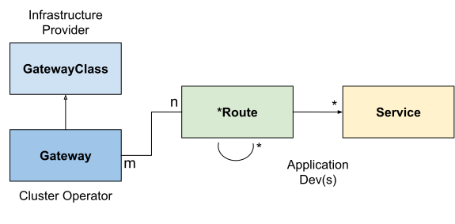

# API 개요

이 문서는 게이트웨이 API에 대한 개요를 제공한다.

## 역할과 페르소나

[역할과 페르소나]에 설명된 대로 게이트웨이 API에는 3가지 주요 역할이 있다.

- **Ian** (그/그의): 인프라 제공자
- **Chihiro** (그들/그들의): 클러스터 운영자
- **Ana** (그녀/그녀의): 애플리케이션 개발자

[역할과 페르소나]:roles-and-personas.md

## 리소스 모델

!!! 참고
    게이트웨이 API 리소스는 커스텀 리소스 정의(CRDs)로서
    `gateway.networking.k8s.io` API 그룹에 속해 있다.
    아래의 리소스 이름은 특별한 언급이 없는 한 이 API 그룹에 속한 것으로 간주된다.

리소스 모델에는 세 가지 주요 객체 타입이 있다.

*Gateway Class*는 공통 구성과 동작을 가진 게이트웨이 집합을
정의한다.

*Gateway*는 트래픽이 클러스터 내의 서비스로 변환될 수 있는 지점을
요청한다.

*Route*는 게이트웨이를 통해 들어오는 트래픽이 서비스에 어떻게 매핑되는지 설명한다.

### 게이트웨이 클래스 (GatewayClass)

??? success "v0.5.0 부터 표준 채널"

    `GatewayClass` 리소스는 GA(정식 출시)되었으며 `v0.5.0` 부터 표준 채널의 일부이다.
    릴리스 채널에 대한 자세한 정보는
    [버전 관리 가이드](versioning.md)를 참조하자.

게이트웨이 클래스는 공통 구성과 동작을 공유하는 게이트웨이 집합을 정의한다.
각 게이트웨이 클래스는 단일 컨트롤러에 의해 처리되지만,
컨트롤러는 여러 게이트웨이 클래스를 처리할 수 있다.

게이트웨이 클래스는 클러스터 범위의 리소스이다.
기능적인 게이트웨이를 사용하기 위해서는 최소한 하나의 게이트웨이 클래스가 정의되어 있어야 한다.
게이트웨이 API를 구현하는 컨트롤러는 사용자가 게이트웨이에서 참조할 수 있는 연관된
게이트웨이 클래스 리소스를 제공함으로써 이를 수행한다.

이는 인그레스의
[인그레스 클래스](https://kubernetes.io/ko/docs/concepts/services-networking/ingress/#%EC%9D%B8%EA%B7%B8%EB%A0%88%EC%8A%A4-%ED%81%B4%EB%9E%98%EC%8A%A4)와
퍼시스턴트 볼륨의
[스토리지 클래스](https://kubernetes.io/ko/docs/concepts/storage/storage-classes/)와 유사하다.
인그레스 v1beta1에서 게이트웨이 클래스와
가장 유사한 것은 `ingress-class` 어노테이션이며,
IngressV1에서는 인그레스 클래스 객체가 가장 유사하다.

### 게이트웨이 (Gateway)

??? success "v0.5.0 부터 표준 채널"

    `게이트웨이` 리소스는 GA(정식 출시)되었으며 `v0.5.0` 부터 표준 채널의 일부이다.
    릴리스 채널에 대한 자세한 정보는 [버전 관리 가이드](versioning.md)를
    참조하자.

게이트웨이는 트래픽이 클러스터 내의 서비스로 어떻게 변환될 수 있는지 설명한다.
즉, 쿠버네티스를 알지 못하는 곳에서
쿠버네티스를 아는 곳으로 트래픽을 변환하는 방법에 대한 요청을 정의한다.
예를 들어, 클라우드 로드 밸런서, 클러스터 내 프록시 또는 외부 하드웨어 로드 밸런서에 의해
쿠버네티스 서비스로 전송되는 트래픽이 이에 해당한다.
많은 사용 사례에서 클라이언트 트래픽이 클러스터 "외부"에서 시작되지만,
이는 필수 요구사항은 아니다.

게이트웨이는 게이트웨이 클래스의 구성 및 동작 계약을 구현하는
특정 로드 밸런서 구성에 대한 요청을 정의한다.
이 리소스는 운영자가 직접 생성하거나,
게이트웨이 클래스를 처리하는 컨트롤러에 의해 생성될 수 있다.

게이트웨이 스펙은 사용자의 의도를 담고 있으므로, 스펙의 모든 속성에 대한
완전한 명세를 포함하지 않을 수 있다.
예를 들어, 사용자는 주소, TLS 설정과 같은 필드를 생략할 수 있다.
이를 통해 게이트웨이 클래스를 관리하는 컨트롤러가
사용자를 위해 이러한 설정을 제공할 수 있으며, 이는 더 이식성 있는 스펙을 제공한다.
이러한 동작은 게이트웨이 클래스 상태 객체를 사용하여 명확하게 표시된다.

게이트웨이는 하나 이상의 *라우트 참조*에 연결될 수 있으며, 
이는 트래픽의 일부를 *특정 서비스*로 전달하는 역할을 한다.

### 라우트 리소스 (Route Resource)

라우트 리소스는 게이트웨이에서 쿠버네티스 서비스로의 요청 매핑을 위한
프로토콜별 규칙을 정의한다.

v1alpha2를 기준으로, API에는 네 가지 라우트 리소스 타입이 포함되어 있다.
구현별로 특정한 사용자 정의 라우트 타입은 다른 프로토콜에 대해 권장된다.
향후 API에 새로운 라우트 타입이 추가될 수 있다.

#### HTTPRoute

??? success "v0.5.0 부터 표준 채널"

    `HTTPRoute` 리소스는 GA(정식 출시)되었으며 `v0.5.0` 부터 표준 채널의 일부이다.
    릴리스 채널에 대한 자세한 정보는 [버전 관리 가이드](versioning.md)를
    참조하자.

HTTPRoute는 HTTP 또는 종료된 HTTPS 연결을 다중화하기 위한 것이다.
HTTP 스트림을 검사하고 HTTP 요청 데이터를 라우팅하거나 수정에 사용하려는 경우에 사용된다.
예를 들어, HTTP 헤더를 사용하여 라우팅하거나
이를 전송 중에 수정하는 경우에 사용된다.

#### TLSRoute

??? example "v0.3.0 부터 실험적 채널"

    `TLSRoute` 리소스는 알파 상태이며 `v0.3.0` 부터 실험적 채널의 일부이다.
    릴리스 채널에 대한 자세한 정보는 [버전 관리 가이드](versioning.md)를
    참조하자.

TLSRoute는 SNI를 통해 구분되는 TLS 연결을 멀티플렉싱하기 위한 것이다.
SNI를 주요 라우팅 방법으로 사용하고 싶고, HTTP와 같은 상위 레벨 프로토콜의
속성에는 관심이 없는 경우에 사용된다. 연결의 바이트 스트림은
백엔드로 검사 없이 프록시된다.

#### TCPRoute와 UDPRoute

??? example "v0.3.0 부터 실험적 채널"

    `TCPRoute` 및 `UDPRoute` 리소스는 알파 상태이며 `v0.3.0` 부터 실험적 채널의 일부이다.
    릴리스 채널에 대한 자세한 정보는 [버전 관리 가이드](versioning.md)를
    참조하자.

TCPRoute(및 UDPRoute)는 하나 이상의 포트를 단일 백엔드에 매핑하는 데 사용된다.
이 경우, 동일한 포트에서 서로 다른 백엔드를 선택할 수 있는 구분자가 없으므로,
일반적으로 각 TCPRoute는 리스너에서 서로 다른 포트를 필요로 한다.
TLS를 종료할 수 있는데,
이 경우 암호화되지 않은 바이트 스트림이 백엔드에 전달된다.
TLS를 종료하지 않도록 선택할 수도 있으며,
이 경우에는 암호화된 바이트 스트림이 백엔드에 전달된다.

#### GRPCRoute

??? success "v1.1.0 부터 표준 채널"

    `GRPCRoute` 리소스는 GA(정식 출시)되었으며 `v1.1.0` 부터 표준 채널의 일부이다.
    릴리스 채널에 대한 자세한 정보는 [버전 관리 가이드](versioning.md)를
    참조하자.

GRPCRoute는 gRPC 트래픽을 관용적으로 라우팅하기 위한 것이다.
GRPCRoute를 지원하는 게이트웨이는 HTTP/1에서 초기 업그레이드 없이
HTTP/2를 지원해야 하므로, gRPC 트래픽이 올바르게 흐를 수 있도록 보장된다.

#### 라우트 요약 표

아래의 "라우팅 식별자" 열은 여러 라우트가 리스너의 포트를 공유할 수 있도록
하는 데 사용할 수 있는 정보를 나타낸다.

|객체|OSI 계층|라우팅 식별자|TLS 지원|목적|
|------|---------|---------------------|-----------|-------|
|HTTPRoute| 레이어 7 | HTTP 프로토콜의 모든 것 | 종료만 가능 | HTTP 및 HTTPS 라우팅|
|TLSRoute| 레이어 4와 7 사이 | SNI 또는 다른 TLS 속성 | 패스스루 또는 종료 | HTTP 스트림 검사가 필요하지 않은 HTTPS를 포함한 TLS 프로토콜 라우팅|
|TCPRoute| 레이어 4 | 목적지 포트 | 패스스루 또는 종료 | 리스너에서 백엔드로 TCP 스트림 전달 허용 |
|UDPRoute| 레이어 4 | 목적지 포트 | 없음 | 리스너에서 백엔드로 UDP 스트림 전달 허용 |
|GRPCRoute| 레이어 7 | gRPC 프로토콜의 모든 것 | 종료만 가능 | HTTP/2 및 HTTP/2 클리어텍스트를 통한 gRPC 라우팅|

참고로 HTTPRoute 및 TCPRoute를 통해 라우팅되는 트래픽은 게이트웨이와
백엔드 사이에서 암호화될 수 있다(일반적으로 재암호화라고 함).
기존 게이트웨이 API 리소스로는 이를 구성할 수 없지만,
게이트웨이 API에서 표준화된 방식이 정의될 때까지
구현체에서 이에 대한 사용자 정의 구성을 제공할 수 있다.

## 라우트를 게이트웨이에 연결하기

라우트가 게이트웨이에 연결되면, 이는 기본 로드 밸런서나 프록시를 구성하는
게이트웨이에 적용되는 구성을 나타낸다. 라우트가 게이트웨이에 연결되는 방법과
어떤 라우트가 연결되는지는 리소스 자체에 의해 제어된다. 라우트와
게이트웨이 리소스에는 연결 방법을 허용하거나 제한하는 내장 제어 기능이 있다.
쿠버네티스 RBAC와 함께 이러한 기능은 조직이 라우트가 노출되는 방식과
어떤 게이트웨이에 노출되는지에 대한 정책을 시행할 수 있게 한다.

라우트가 게이트웨이에 연결되는 방법에는 다양한 조직 정책과 책임 범위를
달성하기 위한 많은 유연성이 있다. 게이트웨이와 라우트가 가질 수 있는
다양한 관계는 다음과 같다.

- **일대일(One-to-one)** - 게이트웨이와 라우트는 단일 소유자에 의해
  배포되고 사용되며 일대일 관계를 가질 수 있다.
- **일대다(One-to-many)** - 게이트웨이는 서로 다른 네임스페이스의
  다양한 팀이 소유한 여러 라우트가 바인딩될 수 있다.
- **다대일(Many-to-one)** - 라우트도 여러 게이트웨이에 바인딩될 수 있어,
  단일 라우트가 서로 다른 IP, 로드 밸런서 또는 네트워크에서 동시에
  애플리케이션 노출을 제어할 수 있다.

### 예시

[Chihiro]는 `infra` 네임스페이스에 `shared-gw` 게이트웨이를 배포하여
여러 애플리케이션 팀이 클러스터 외부에 애플리케이션을 노출할 수 있도록 했다.
A팀과 B팀(각각 네임스페이스 `A`와 `B`에 있음)은 자신의 라우트를
이 게이트웨이에 연결한다.
이들은 서로에 대해 알지 못하며,
라우트 규칙이 서로 충돌하지 않는 한 계속 독립적으로 운영할 수 있다.
C팀은 특별한 네트워킹 요구 사항(성능, 보안 또는 중요도 등)이 있어
애플리케이션을 외부 세계로 프록시하기 위한 전용 게이트웨이가 필요하다.
C팀은 `C` 네임스페이스에 자체 게이트웨이인 `dedicated-gw`를 배포하며,
이는 `C` 네임스페이스의 앱에서만 사용할 수 있다.

<!-- source: https://docs.google.com/presentation/d/1neBkFDTZ__vRoDXIWvAcxk2Pb7-evdBT6ykw_frf9QQ/edit?usp=sharing -->


[Chihiro]:roles-and-personas.md#Chihiro

### 작동 방식

라우트가 게이트웨이에 연결되기 위해서는 다음 사항이 필요하다.

1. 라우트는 게이트웨이를 참조하는 `parentRefs` 필드에 항목이 있어야 한다.
2. 게이트웨이의 최소 하나의 리스너가 이 연결을 허용해야 한다.

#### 게이트웨이 참조

??? example "실험적 채널"

    아래에서 설명하는 `Port` 필드는 현재 게이트웨이 API의 "실험적"
    채널에만 포함되어 있다. 릴리스 채널에 대한 자세한 정보는
    [관련 문서](versioning.md#release-channels)를 참조하자.

라우트는 네임스페이스(라우트와 게이트웨이가 동일한 네임스페이스에 있는 경우 선택 사항)와
`parentRef`에서 게이트웨이의 이름을 지정하여 게이트웨이를 참조할 수 있다.
기본적으로 라우트는
게이트웨이의 모든 리스너에 연결되지만,
`parentRef`에서 아래의 필드를 사용하여 선택을 리스너의 하위 집합으로 제한할 수 있다.

1. **SectionName** `sectionName`이 설정되면, 라우트는 지정된 이름을 가진
   리스너를 선택한다.
2. **Port** `port`가 설정되면, 라우트는 지정된 포트에서 리스닝하고
   이 종류의 라우트와 호환되는 프로토콜을 가진 모든 리스너를 선택한다.

`parentRef`에서 여러 필드가 설정되면, 라우트는 이러한 필드에 지정된
모든 조건을 충족하는 리스너를 선택한다. 예를 들어, `sectionName`과 `port`가
모두 설정된 경우, 라우트는 지정된 이름을 가지고 지정된 포트에서
리스닝하는 리스너를 선택한다.

#### 라우트 연결 제한

각 게이트웨이 리스너는 다음 메커니즘을 사용하여 어떤 라우트를
연결할 수 있는지 제한할 수 있다.

1. **Hostname:** 리스너에 `hostname` 필드가 설정되면, `hostnames` 필드를
   지정하는 연결된 라우트는 최소한 하나의 겹치는 값을 가져야 한다.
2. **Namespaces:** 리스너의 `allowedRoutes.namespaces` 필드는 라우트가
   연결될 수 있는 위치를 제한하는 데 사용할 수 있다. `namespaces.from`
   필드는 다음 값을 지원한다.
    * `Same`은 기본 옵션이다. 이 게이트웨이와 동일한 네임스페이스에 있는
      라우트만 연결될 수 있다.
    * `All`은 모든 네임스페이스의 라우트가 연결될 수 있도록 허용한다.
    * `Selector`는 네임스페이스 레이블 셀렉터에 의해 선택된 네임스페이스의
      하위 집합에서 라우트가 이 게이트웨이에 연결될 수 있음을 의미한다.
      `Selector`가 사용될 때, `namespaces.selector` 필드는 레이블
      셀렉터를 지정하는 데 사용되어야 한다. 이 필드는 `All` 또는 `Same`과 함께 지원되지 않는다.
3. **Kinds:** 리스너의 `allowedRoutes.kinds` 필드를 사용하여 연결될 수
   있는 라우트의 종류를 제한할 수 있다.

위의 내용이 지정되지 않은 경우, 게이트웨이 리스너는 리스너 프로토콜을
지원하는 동일한 네임스페이스에서 연결된 라우트를 신뢰한다.

#### 추가 게이트웨이 - 라우트 연결 예시

아래 `my-route` 라우트는 `gateway-api-example-ns1`의 `foo-gateway`에
연결하려고 하며 다른 게이트웨이에는 연결되지 않는다. `foo-gateway`가
다른 네임스페이스에 있다는 점에 유의하자. `foo-gateway`는
`gateway-api-example-ns2` 네임스페이스의 HTTPRoute에서 연결을 허용해야 한다.

```yaml

```

이 `foo-gateway`는 `my-route` HTTPRoute의 연결을 허용한다.

```yaml

```

더 관대한 예시로, 아래 게이트웨이는 "expose-apps: true" 레이블이 있는
네임스페이스에서 모든 HTTPRoute 리소스가 연결될 수 있도록 허용한다.

```yaml

```

### 결합된 타입

`게이트웨이 클래스`, `게이트웨이`, `xRoute` 및 `서비스`의 조합은
구현 가능한 로드 밸런서를 정의한다. 아래 다이어그램은
서로 다른 리소스 간의 관계를 보여준다:

<!-- source: https://docs.google.com/document/d/1BxYbDovMwnEqe8lj8JwHo8YxHAt3oC7ezhlFsG_tyag/edit#heading=h.8du598fded3c -->


### 요청 흐름

리버스 프록시를 사용하여 구현된 게이트웨이의 일반적인 [북/남]
API 요청 흐름은 다음과 같다.

1. 클라이언트가 <http://foo.example.com>에 요청을 보낸다.
2. DNS가 이름을 `Gateway` 주소로 해석한다.
3. 리버스 프록시가 `Listener`에서 요청을 수신하고
   [Host 헤더](https://tools.ietf.org/html/rfc7230#section-5.4)를
   사용하여 `HTTPRoute`와 일치시킨다.
4. 선택적으로, 리버스 프록시는 `HTTPRoute`의 `match` 규칙을 기반으로
   요청 헤더 및/또는 경로 매칭을 수행할 수 있다.
5. 선택적으로, 리버스 프록시는 `HTTPRoute`의 `filter` 규칙을 기반으로
   요청을 수정(즉, 헤더 추가/제거)할 수 있다.
6. 마지막으로, 리버스 프록시는 `HTTPRoute`의 `backendRefs` 규칙을 기반으로
   요청을 클러스터 내의 하나 이상의 객체(즉, `Service`)로 전달한다.

[북/남]:glossary.md#northsouth-traffic

### TLS 구성

TLS는 게이트웨이 리스너에서 구성되며, 네임스페이스 간에 참조될 수 있다.

TLS에 대한 자세한 내용은 [TLS 세부 정보](../guides/tls.md) 가이드를 참조하자.

## 라우트를 서비스에 연결하기

게이트웨이 API를 사용하여 [서비스 메시](glossary.md#service-mesh)를 구성할 때,
라우트는 서비스에 직접 연결되어 서비스로 향하는 모든 트래픽에 적용되는
구성을 나타낸다. 어떤 라우트가 주어진 서비스에 연결되는지와 그 방법은
라우트 자체(쿠버네티스 RBAC와 함께 작동)에 의해 제어되며,
[GAMMA 라우팅 문서]에서 설명되어 있다.

[GAMMA]:../mesh/index.md
[GAMMA 라우팅 문서]:../mesh/index.md#connecting-routes-and-services
[서비스 메시]:glossary.md#service-mesh

## 확장 포인트

일반적인 목적의 API로는 처리할 수 없는
많은 사용 사례에 유연성을 제공하기 위해
API에 여러 확장 포인트가 제공된다.

다음은 API의 확장 포인트 요약이다.

- **BackendRefs**: 이 확장 포인트는 코어 쿠버네티스 서비스 리소스 이외의
  네트워크 엔드포인트로 트래픽을 전달하는 데 사용되어야 한다.
  예를 들어 S3 버킷, Lambda 함수, 파일 서버 등이 있다.
- **HTTPRouteFilter**: HTTPRoute의 이 API 타입은 HTTP 요청의
  요청/응답 라이프사이클에 연결하는 방법을 제공한다.
- **Custom Routes**: 위의 확장 포인트가 사용 사례에 충분하지 않은 경우,
  구현자는 현재 API에서 지원되지 않는 프로토콜에 대한 커스텀 라우트 리소스를
  생성할 수 있다.
  커스텀 라우트 타입은 코어 라우트 타입과 동일한 필드를 공유해야 한다.
  이러한 필드는 CommonRouteSpec과 RouteStatus 내에 포함되어 있다.

이전 사례 없이 확장 포인트를 사용하는 경우, 커뮤니티에 알려주자.
확장 포인트의 사용에 대해 더 많이 배우면서,
공통 분모를 찾고
기능을 코어/확장 API 호환성으로 승격시키고자 한다.
