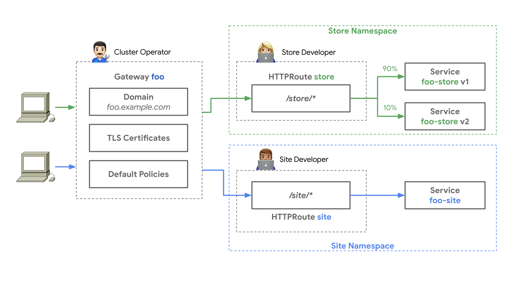

# 사용 사례

게이트웨이 API는 _매우_ 다양한 사용 사례를 다룬다(이는 강점이자 약점이다!).
이 페이지는 이러한 사용 사례의 전체 목록을 제공하려는 것이 _아니다_.
대신, API가 어떻게 사용될 수 있는지를 보여주는 데
도움이 될 수 있는 몇 가지 예시를 제공하는 것이 목적이다.

모든 경우에, 게이트웨이 API에서 사용되는 [역할과 페르소나]를 염두에 두는 것이 매우 중요하다.
여기서 제시하는 사용 사례는 의도적으로
[Ana], [Chihiro], [Ian]이라는 인물들을 중심으로 설명된다.
이들이 바로 API가 사용 가능해야 하는 대상이다.
(특히 소규모 조직에서는 이 역할들이 같은 사람에 의해 수행될 수도 있지만,
각 역할은 분명히 구분되는 서로 다른 관심사를 가지고 있다는 점을
별도로 고려하는 것이 중요하다.)

[역할과 페르소나]:roles-and-personas.md
[Ana]:roles-and-personas.md#key-roles-and-personas
[Chihiro]:roles-and-personas.md#key-roles-and-personas
[Ian]:roles-and-personas.md#key-roles-and-personas

## 사용 사례 목록

- [사용 사례](#_1)
  - [사용 사례 목록](#_2)
  - [기본 북/남(North/South) 사용 사례](#_3)
  - [단일 게이트웨이 뒤에 여러 애플리케이션](#_4)
  - [기본 동/서(East/West) 사용 사례](#_5)
  - [게이트웨이와 메시 결합 사용 사례](#_6)

[역할과 페르소나]:roles-and-personas.md

## 기본 [북/남] 사용 사례

??? success "v0.8.0 부터 표준 채널"

    [북/남] 사용 사례는 `v0.8.0`부터 표준 채널에서 완전히 지원된다.
    릴리스 채널에 대한 자세한 내용은
    [버전 관리 가이드](versioning.md)를 참고하자.

Ana는 쿠버네티스에서 실행하고 싶은 마이크로서비스 애플리케이션을 만들었다.
이 애플리케이션은 클러스터 외부의 클라이언트가 사용할 것이며,
Ana는 애플리케이션을 만들었지만 클러스터를 직접 세팅하는 것은 그녀의 전문이
아니다.

1. Ana는 Chihiro에게 클러스터를 세팅해달라고 요청한다.
   Ana는 Chihiro에게 자신의 클라이언트들이 `https://ana.application.com/`을
   기반으로 하는 URL을 통해 API를 사용할 것으로 기대한다고 말한다.

2. Chihiro는 Ian에게 클러스터를 요청한다.

3. Ian은 `basic-gateway-class`라는 [게이트웨이 클래스] 리소스를 가진
   게이트웨이 컨트롤러가 실행되는 클러스터를 프로비저닝한다.
   게이트웨이 컨트롤러는 클러스터 외부에서 내부로 트래픽을 라우팅하는 인프라와
   관련된 작업을 관리한다.

4. Ian은 Chihiro에게 새 클러스터의 자격 증명을 제공하고,
   `basic-gateway-class` 게이트웨이 클래스를 사용해 설정할 수 있다고 알려준다.

5. Chihiro는 클러스터에 `ana-gateway`라는 [게이트웨이]를 적용하고, 443 포트에서 TLS 트래픽을 수신하도록 설정하며,
   Subject CN이 `ana.application.com`인 TLS 인증서를 제공한다.
   이 게이트웨이는 `basic-gateway-class` 게이트웨이 클래스와 연결된다.

6. 3단계에서 Ian이 프로비저닝한 게이트웨이 컨트롤러는
   `ana-gateway`에 대한 로드 밸런서와 IP 주소를 할당하고,
   443 포트로 들어오는 요청을 라우팅할 수 있는
   데이터 플레인 컴포넌트를 프로비저닝하며,
   `ana-gateway`와 연관된 라우팅 리소스를 감시하기 시작한다.

7. Chihiro는 `ana-gateway`의 IP 주소를 받아 클러스터 외부에서
   `ana.application.com`에 대한 DNS 레코드를 생성하여 일치시킨다.

8. Chihiro는 Ana에게 `ana-gateway`라는 게이트웨이를 사용할 수 있다고
   알린다.

9. Ana는 어떤 URL 경로가 허용되고 어떤 마이크로서비스가 이를 처리할지 설정하는
   [HTTPRoute] 리소스를 작성하고 적용한다.
   그녀는 [라우트 연결 프로세스]를 사용하여 이러한 HTTPRoutes를
   `ana-gateway`와 연관시킨다.

10. 이 시점에서, 로드 밸런서에 도착하는 요청은 Ana의 라우팅 명세에 따라
    Ana의 애플리케이션으로 트래픽이 라우팅된다.

이것은 Chihiro가 게이트웨이에서 [TLS](../guides/tls.md#downstream-tls)와
같은 중앙 정책을 강제할 수 있게 하며,
동시에 Ana와 동료들은 애플리케이션의 [라우팅 로직](../guides/http-routing.md)과
롤아웃 계획(예: [트래픽 분할 롤아웃](../guides/traffic-splitting.md))을
직접 제어할 수 있도록 허용한다.

[북/남]:glossary.md#northsouth-traffic

## 단일 게이트웨이 뒤에 여러 애플리케이션

??? success "v0.8.0 부터 표준 채널"

    [북/남] 사용 사례는 `v0.8.0`부터 표준 채널에서 완전히 지원된다.
    릴리스 채널에 대한 자세한 내용은
    [버전 관리 가이드](versioning.md)를 참고하자.

이 사례는
[기본 북/남 사용 사례](#_3)와 놀라울 정도로 유사하지만,
여러 애플리케이션 팀이 존재한다.
Ana와 그녀의 팀은 `store` 네임스페이스에서 스토어프론트 애플리케이션을 관리하고,
Allison과 그녀의 팀은 `site` 네임스페이스에서 웹사이트를 관리한다.

- Ian과 Chihiro는 위와 같이 클러스터,
  `GatewayClass`, `Gateway`를 함께 제공한다.

- Ana와 Allison은 각각 워크로드와 HTTPRoute를
  동일한 `Gateway` 리소스에 독립적으로 배포한다.

이렇게 역할을 분리하면
Chihiro가 게이트웨이에서 [TLS](../guides/tls.md#downstream-tls)와 같은 중앙 정책을 강제할 수 있다.
한편, Ana와 Allison은 [각자의 네임스페이스](../guides/multiple-ns.md)에서 애플리케이션을 운영하면서
동일한 공유 게이트웨이에 라우트를 연결해,
[라우팅 로직](../guides/http-routing.md),
[트래픽 분할 롤아웃](../guides/traffic-splitting.md) 등을
독립적으로 제어할 수 있고,
Chihiro와 Ian이 처리하는 부분은 신경 쓰지 않아도 된다.

[HTTPRoute]:../api-types/httproute.md
[게이트웨이 클래스]:../api-types/gatewayclass.md
[게이트웨이]:../api-types/gateway.md
[라우트 연결 프로세스]:api-overview.md#attaching-routes-to-gateways

## 기본 [동/서] 사용 사례

이 시나리오에서
Ana는 이미 [GAMMA] 호환 [서비스 메시]가 실행 중인 클러스터에 워크로드를 배포했다.
Ana는 메시를 활용해 잘못된 URL 경로로 들어오는 요청을 거부하고,
모든 요청에 타임아웃을 적용함으로써 워크로드를 보호하고자
한다.

- Chihiro와 Ian은 이미 서비스 메시가 실행 중인 클러스터를 제공했다.
  Ana는 이들에게 별도의 요청을 할 필요가 없다.

- Ana는 허용 가능한 라우트와 타임아웃을 정의하고,
  자신의 워크로드 서비스에 `parentRef`를 지정한 HTTPRoute를 작성한다.

- Ana는 자신의 워크로드와 동일한 네임스페이스에 HTTPRoute를 적용한다.

- 메시는 Ana가 정의한 HTTPRoute에 따라 라우팅 정책을 자동으로 적용하기
  시작한다.

이 경우 역할 간의 관심사 분리는
Ana가 커스텀 라우팅 로직과 함께 서비스 메시를 활용할 수 있게 해주며,
Chihiro나 Ian에게의 요청에서 병목 없이 이를 수행할 수 있게 한다.

[동/서]:glossary.md#eastwest-traffic
[GAMMA]:../mesh/index.md
[서비스 메시]:glossary.md#service-mesh

## 게이트웨이와 메시 결합 사용 사례

이는 사실상
[단일 게이트웨이 뒤에 여러 애플리케이션이 있는 경우](#_4)와 [기본 동/서 사용 사례](#_5)를
결합한 형태다.

- Chihiro와 Ian은 클러스터, [게이트웨이 클래스], [게이트웨이]를 프로비저닝할 것이다.

- Ana와 Allison은 각자의 네임스페이스에 그들의 애플리케이션을
  배포할 것이다.

- Ana와 Allison은 이후 적절하게 HTTPRoute 리소스를 적용할 것이다.

이 시나리오에서는 메시가 포함되어 있기 때문에 두 가지 매우 중요한
변화가 있다.

1. Chihiro가 [서비스 라우팅]을 사용하는 [게이트웨이 컨트롤러]를 배포했다면,
   [엔드포인트 라우팅]으로 재구성해야 할 가능성이 크다.
   (이는 [GAMMA]에서 진행 중인 작업 영역이며,
   엔드포인트 라우팅이 권장될 전망이다.)

2. Ana와/또는 Allison은 메시 라우팅 로직을 구성하기 위해
   HTTPRoute를 각자의 워크로드 서비스에 바인딩해야 한다.
   이 HTTPRoute들은 메시 전용의 별도일 수도 있고,
   게이트웨이와 서비스 모두에 바인딩되는 단일 HTTPRoute일 수도 있다.

언제나 그렇듯, 이런 방식으로 관심사를 분리하는 궁극적인 목적은
Chihiro가 게이트웨이에서 [TLS](../guides/tls.md#downstream-tls)와 같은
중앙 정책을 강제할 수 있게 하면서,
Ana와 Allison이
[라우팅 로직](../guides/http-routing.md), [트래픽 분할 롤아웃](../guides/traffic-splitting.md) 등을
독립적으로 제어할 수 있도록 허용하는 것이다.
이는 [북/남]과 [동/서] 라우팅 모두에 해당한다.

[게이트웨이 컨트롤러]:glossary.md#gateway-controller
[서비스 라우팅]:glossary.md#service-routing
[엔드포인트 라우팅]:glossary.md#endpoint-routing
