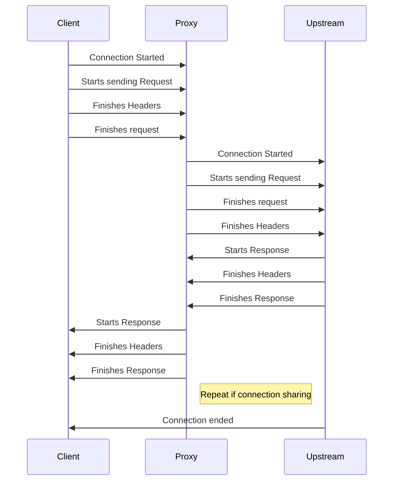
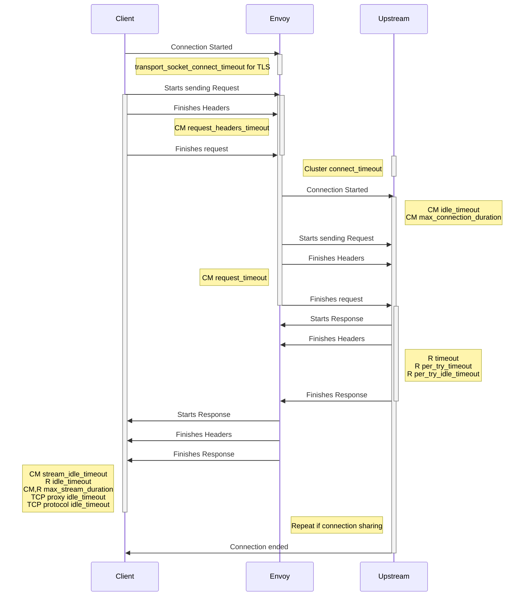
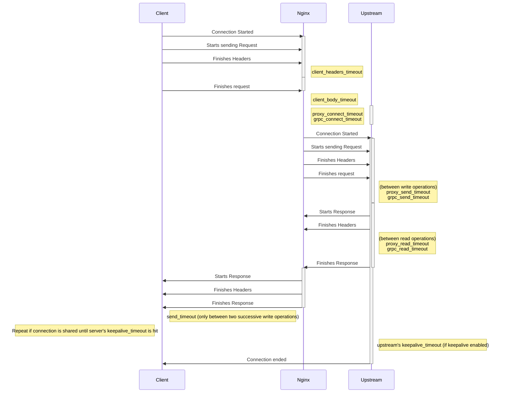
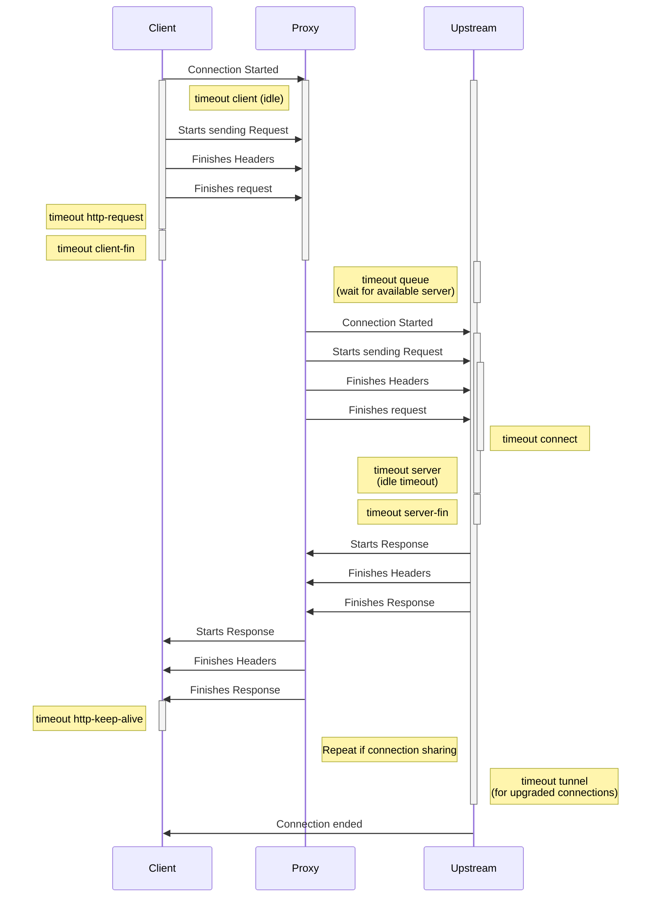
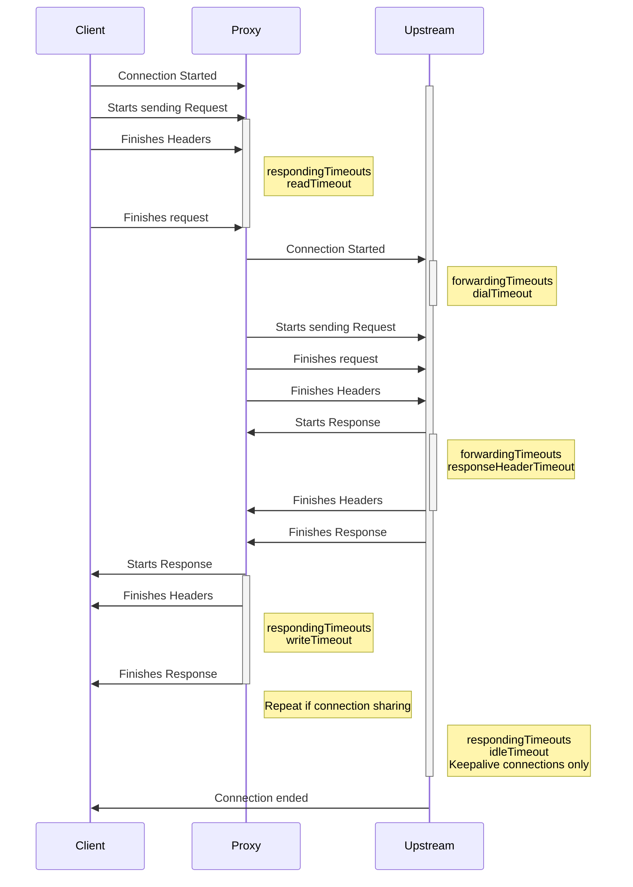
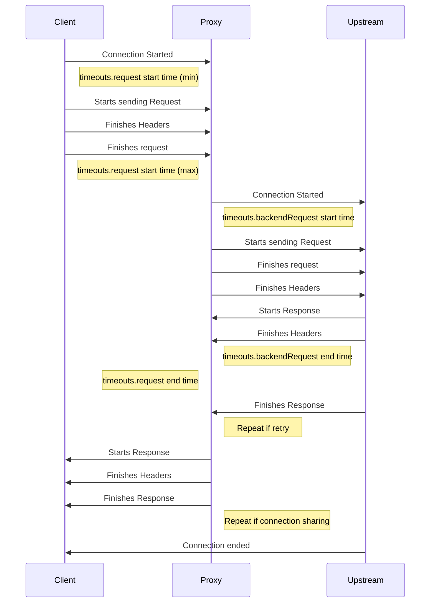

# GEP-1742: HTTPRoute Timeouts

* Issue: [#1742](https://github.com/kubernetes-sigs/gateway-api/issues/1742)
* Status: Standard

(See [status definitions](../overview.md#gep-states).)

## TLDR

Create some sort of design so that Gateway API objects can be used to configure
timeouts for different types of connection.

## Goals

- Create some method to configure some timeouts.
- Timeout config must be applicable to most if not all Gateway API implementations.

## Non-Goals

- A standard API for every possible timeout that implementations may support.

## Introduction

In talking about Gateway API objects, particularly HTTPRoute, we've mentioned
timeout configuration many times in the past as "too hard" to find the common
ground necessary to make more generic configuration. This GEP intends firstly
to make this process less difficult, then to find common timeouts that we can
build into Gateway API.

For this initial round, we'll focus on Layer 7 HTTP traffic, while acknowledging
that Layer 4 connections have their own interesting timeouts as well.

The following sections will review all the implementations, then document what
timeouts are _available_ for the various data planes.

### Background on implementations

Most implementations that handle HTTPRoute objects use a proxy as the data plane
implementation, that actually forwards flows as directed by Gateway API configuration.

The following table is a review of all the listed implementations of Gateway API
at the time of writing, with the data plane they use for Layer 7, based on what information
could be found online. If there are errors here, or if the implementation doesn't
support layer 7, please feel free to correct them.

| Implementation | Data Plane       |
|----------------|------------|
| Acnodal EPIC   | Envoy      |
| Apache APISIX  | Nginx      |
| BIG-IP Kubernetes Gateway| F5 BIG-IP  |
| Cilium         | Envoy      |
| Contour        | Envoy      |
| Emissary Ingress| Envoy     |
| Envoy Gateway  | Envoy      |
| Flomesh Service Mesh | Pipy |
| Gloo Edge      | Envoy      |
| Google Kubernetes Engine (GKE) | Similar to Envoy Timeouts |
| HAProxy Ingress | HAProxy   |
| Hashicorp Consul | Envoy    |
| Istio          | Envoy      |
| Kong           | Nginx      |
| Kuma           | Envoy      |
| Litespeed      | Litespeed WebADC |
| NGINX Gateway Fabric | Nginx |
| Traefik        | Traefik    |


### Flow diagrams with available timeouts

The following flow diagrams are based off the basic diagram below, with all the
timeouts I could find included.

In general, timeouts are recorded with the setting name or similar that the data
plane uses for them, and are correct as far as I've parsed the documentation
correctly.

Idle timeouts are marked as such.



#### Envoy Timeouts

For Envoy, some timeouts are configurable at either the HTTP Connection Manager
(very, very roughly equivalent to a Listener), the Route (equivalent to a HTTPRoute)
level, or the Cluster (usually close to the Service) or some combination. These
are noted in the below diagram with a `CM`, `R`, or `Cluster` prefix respectively.



#### Nginx timeouts

Nginx allows setting of GRPC and general HTTP timeouts separately, although the
purposes seem to be roughly equivalent.



#### HAProxy timeouts



#### Traefik timeouts


#### F5 BIG-IP Timeouts

Could not find any HTTP specific timeouts. PRs welcomed. 😊

#### Pipy Timeouts

Could not find any HTTP specific timeouts. PRs welcomed. 😊

#### Litespeed WebADC Timeouts

Could not find any HTTP specific timeouts. PRs welcomed. 😊

## API

The above diagrams show that there are many different kinds of configurable timeouts
supported by Gateway implementations: connect, idle, request, upstream, downstream.
Although there may be opportunity for the specification of a common API for more of
them in the future, this GEP will focus on the L7 timeouts in HTTPRoutes that are
most valuable to clients.

From the above analysis, it appears that most implementations are capable of
supporting the configuration of simple client downstream request timeouts on HTTPRoute
rules. This is a relatively small addition that would benefit many users.

Some implementations support configuring a timeout for individual backend requests,
separate from the overall client request timeout. This is particularly useful if a
client HTTP request to a gateway can result in more than one call from the gateway
to the destination backend service, for example, if automatic retries are supported.
Adding support for this would also benefit many users.

### Timeout values

There are 2 kinds of timeouts that can be configured in an `HTTPRouteRule`:

1. `timeouts.request` is the timeout for the Gateway API implementation to send a
    response to a client HTTP request. Whether the gateway starts the timeout before
    or after the entire client request stream has been received, is implementation dependent.
    This field is optional `Extended` support.

1. `timeouts.backendRequest` is a timeout for a single request from the gateway to a backend.
    This field is optional `Extended` support. Typically used in conjunction with retry configuration,
    if supported by an implementation.
    Note that retry configuration will be the subject of a separate GEP (GEP-1731).



Both timeout fields are [GEP-2257 Duration] values. A zero-valued timeout
("0s") MUST be interpreted as disabling the timeout; a non-zero-valued timeout
MUST be >= 1ms.

[GEP-2257 Duration]:../gep-2257/index.md

### GO

```go
type HTTPRouteRule struct {
	// Timeouts defines the timeouts that can be configured for an HTTP request.
	//
	// Support: Extended
	//
	// +optional
	// <gateway:standard>
	Timeouts *HTTPRouteTimeouts `json:"timeouts,omitempty"`

	// ...
}

// HTTPRouteTimeouts defines timeouts that can be configured for an HTTPRoute.
// Timeout values are represented with Gateway API Duration formatting.
// Specifying a zero value such as "0s" is interpreted as no timeout.
//
// +kubebuilder:validation:XValidation:message="backendRequest timeout cannot be longer than request timeout",rule="!(has(self.request) && has(self.backendRequest) && duration(self.request) != duration('0s') && duration(self.backendRequest) > duration(self.request))"
type HTTPRouteTimeouts struct {
	// Request specifies the maximum duration for a gateway to respond to an HTTP request.
	// If the gateway has not been able to respond before this deadline is met, the gateway
	// MUST return a timeout error.
	//
	// For example, setting the `rules.timeouts.request` field to the value `10s` in an
	// `HTTPRoute` will cause a timeout if a client request is taking longer than 10 seconds
	// to complete.
	//
	// This timeout is intended to cover as close to the whole request-response transaction
	// as possible although an implementation MAY choose to start the timeout after the entire
	// request stream has been received instead of immediately after the transaction is
	// initiated by the client.
	//
	// The value of Request is a Gateway API Duration string as defined by GEP-2257. When this
	// field is unspecified, request timeout behavior is implementation-specific.
	//
	// Support: Extended
	//
	// +optional
	Request *Duration `json:"request,omitempty"`

	// BackendRequest specifies a timeout for an individual request from the gateway
	// to a backend. This covers the time from when the request first starts being
	// sent from the gateway to when the full response has been received from the backend.
	//
	// An entire client HTTP transaction with a gateway, covered by the Request timeout,
	// may result in more than one call from the gateway to the destination backend,
	// for example, if automatic retries are supported.
	//
	// The value of BackendRequest must be a Gateway API Duration string as defined by
	// GEP-2257.  When this field is unspecified, its behavior is implementation-specific;
	// when specified, the value of BackendRequest must be no more than the value of the
	// Request timeout (since the Request timeout encompasses the BackendRequest timeout).
	//
	// Support: Extended
	//
	// +optional
	BackendRequest *Duration `json:"backendRequest,omitempty"`
}

// Duration is a string value representing a duration in time. The format is as specified
// in GEP-2257, a strict subset of the syntax parsed by Golang time.ParseDuration.
//
// +kubebuilder:validation:Pattern=`^([0-9]{1,5}(h|m|s|ms)){1,4}$`
type Duration string
```

### YAML

```yaml
apiVersion: gateway.networking.k8s.io/v1beta1
kind: HTTPRoute
metadata:
  name: timeout-example
spec:
  ...
  rules:
  - backendRefs:
    - name: some-service
      port: 8080
    timeouts:
      request: 10s
      backendRequest: 2s
```

### Conformance Details

Gateway implementations can indicate support for the optional behavior in this GEP using
the following feature names:

- `HTTPRouteRequestTimeout`: supports `rules.timeouts.request` in an `HTTPRoute`.
- `HTTPRouteBackendTimeout`: supports `rules.timeouts.backendRequest` in an `HTTPRoute`.

## Alternatives

Timeouts could be configured using policy attachments or in objects other than `HTTPRouteRule`.

### Policy Attachment

Instead of configuring timeouts directly on an API object, they could be configured using policy
attachments. The advantage to this approach would be that timeout policies can be not only
configured for an `HTTPRouteRule`, but can also be added/overridden at a more fine
(e.g., `HTTPBackendRef`) or coarse (e.g. `HTTPRoute`) level of granularity.

The downside, however, is complexity introduced for the most common use case, adding a simple
timeout for an HTTP request. Setting a single field in the route rule, instead of needing to
create a policy resource, for this simple case seems much better.

In the future, we could consider using policy attachments to configure less common kinds of
timeouts that may be needed, but it would probably be better to instead extend the proposed API
to support those timeouts as well.

The default values of the proposed timeout fields could also be overridden
using policy attachments in the future. For example, a policy attachment could be used to set the
default value of `rules.timeouts.request` for all routes under an `HTTPRoute` or `Gateway`.

### Other API Objects

The new timeouts field could be added to a different API struct, instead of `HTTPRouteRule`.

Putting it on an `HTTPBackendRef`, for example, would allow users to set different timeouts for different
backends. This is a feature that we believe has not been requested by existing proxy or service mesh
clients and is also not implementable using available timeouts of most proxies.

Another alternative is to move the timeouts configuration up a level in the API to `HTTPRoute`. This
would be convenient when a user wants the same timeout on all rules, but would be overly restrictive.
Using policy attachments to override the default timeout value for all rules, as described in the
previous section, is likely a better way to handle timeout configuration above the route rule level.

## References

[GEP-2257]:../gep-2257/index.md
