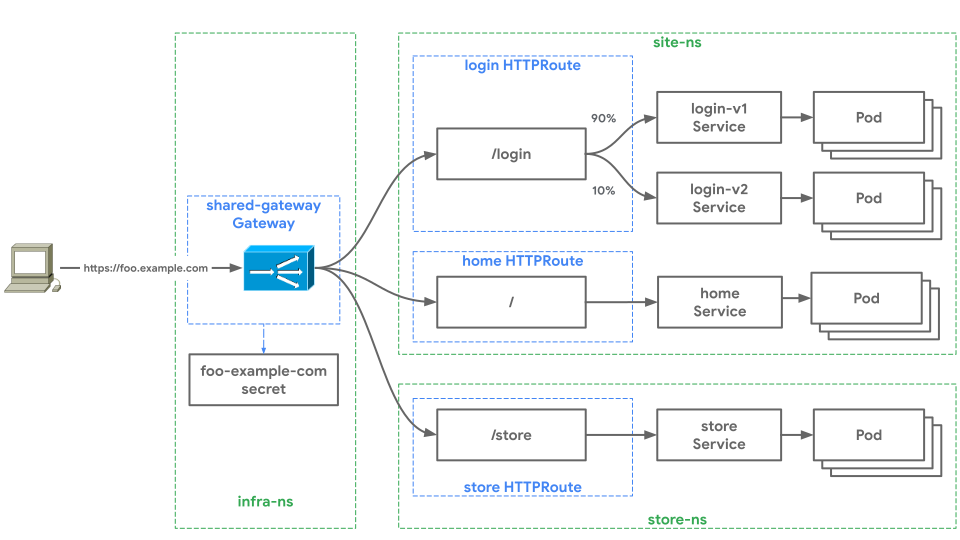

# Cross-Namespace routing

The Gateway API has core support for cross Namespace routing. This is useful
when more than one user or team is sharing the underlying networking infrastructure,
yet control and configuration must be segmented to minimize access and fault
domains. Gateways and Routes can be deployed into different Namespaces and bind
with each other across Namespace boundaries. This allows differing user access
and roles (RBAC) to be applied to separate Namespaces, effectively controlling
who has access to different parts of the cluster-wide routing configuration. The
ability for Routes to bind with Gateways across Namespace boundaries is goverend
by [_Route binding_](#cross-namespace-route-binding), which
is explored in this guide. The guide shows how two independent teams can safely
share the same Gateway from different Namespaces.

In this guide there are two independent teams, _store_ and _site_, operating
in the same Kubernetes cluster in the `store-ns` and `site-ns` Namespaces. These are
their requirements:

- The site team has two applications, _home_ and _login_, that are running 
behind `foo.example.com`. They want to isolate access and configuration across
their apps as much as possible to minimize access and failure domains. 
They use separate HTTPRoutes for each app, to isolate app routing configurations 
such as canary rollouts. but share the same load balancer 
IP, port, domain, and TLS certificate.
- The store team has a single Service called _store_ that they have deployed 
in the `store-ns` Namespace. 
- The Foobar Corporation operates behind the `foo.example.com` domain so they 
would like to host all applications on the same Gateway resource. This is 
controlled by a central infrastructure team, operating in the `infra-ns` Namespace.
- Lastly, the security team controls the certificate for `foo.example.com`. 
By managing this certificate through the single shared Gateway they are able 
to centrally control security without directly involving application teams.

The logical relationship between the Gateway API resources looks like this:



## Cross-namespace Route binding

[Route binding](/concepts/api-overview/#route-binding) is an important concept 
that dictates how Routes and Gateways select each other to apply routing
configuration to a Gateway. It is especially relevant when there are multiple
Gateways and multiple Namespaces in a cluster. Gateway and Route binding is
bidirectional - a binding can only exist if the Gateway owner and Route owner
owner both agree to the relationship. This bi-directional relationship exists
for two reasons:

- Route owners don't want to overexpose their applications and don't want 
their apps to be accessible through paths they are not aware of.
- Gateway owners don't want apps using certain Gateways they should not be 
using. An internal application shouldn't be exposed through a public Gateway 
for example.


As a result, Gateways and Routes have independent control to determine which
resources they permit binding with. It is a handshake between the infra owners
and the application owners that allows them to be independent actors.
Route-owners can specify that they will bind with all Gateways in the cluster,
or only Gateways from a specific Namespace, with a specific label selector, or
an individual Gateway. Similarly, Gateways provide the same level of control.
This allows a cluster to be more self-governed, which requires less central
administration to ensure that Routes are not over-exposed.

## Resource Deployment

The infrastructure team deploys the `shared-gateway` Gateway into the `infra-ns` 
Namespace. 

```yaml

```

A few notes about this Gateway:

- It is matching for the `foo.example.com` domain. This is configured on the 
Gateway so that each HTTPRoute does not also have to configure hostname matching, 
since they are all using the same domain. This also allows these HTTPRoute 
manifests to be reused across production and dev environments where the dev 
environment might be hosted at `foo.dev.corp.example.com`.
- The Gateway is configured for HTTPS and references the `foo-example-com` Secret. 
This allows the certificate to be managed centrally for all applications which 
are using this Gateway.
- It allows any Route in the cluster to use this Gateway because `namespaces.from = All`. 
This is a permissive method of Route selection since the Routes are given 
full control to select this Gateway. There are more restrictive forms of Route 
selection that allow selection on a per-Namespace basis, detailed 
in [Route binding](/concepts/api-overview/#route-binding). The following block
specifies how this Gateway allows HTTPRoutes from all Namespaces in the 
cluster to bind to it:

```yaml
    routes:
      kind: HTTPRoute
      namespaces:
        from: "All"
```

Meanwhile, the store team deploys their route for the `store` Service in the 
`store-ns` Namespace:

```yaml

```

This Route has straightforward routing logic as it just matches for 
`/store` traffic which it sends to the `store` Service. The following snippet 
of the [`gateways` field](/v1alpha1/references/spec/#networking.x-k8s.io/v1alpha1.RouteGateways) 
controls which Gateways this Route can bind to:

```yaml
  gateways:
    allow: FromList
    gatewayRefs:
    - name: shared-gateway
      namespace: infra
```

`gateways.allow` can be configured for Gateways in the same Namespace as the
Route (the default), all Gateways, or a list of specific Gateways. In this
example the store and site teams decide to reference a specific Gateway. This is
the least permissive choice which ensures that other Gateways in the cluster
(perhaps created in the future at some point) will not bind with these Routes.
If cluster administrators have full control over how Gateways are deployed in a
cluster then a more permissive binding option could be configured on Routes. The
less permissive the Gateway selection is, the less that application owners need
to know about which Gateways are deployed. 

The site team now deploys Routes for their applications. They deploy two
HTTPRoutes into the `site-ns` Namespace:

- The `home` HTTPRoute acts as a default routing rule, matching for all traffic 
to `foo.example.com/*` not matched by an existing routing rule and sending it to 
the `home` Service.
- The `login` HTTPRoute  routes traffic for `foo.example.com/login` to 
`service/login-v1` and `service/login-v2`. It uses weights to granularly 
control traffic distribution between them. 

Both of these Routes use the same Gateway binding configuration which specifies
`gateway/shared-gateway` in the `infra-ns` Namespace as the only Gateway that these
Routes can bind with.

```yaml

```

After these three Routes are deployed, they will all be bound to the 
`shared-gateway` Gateway. The Gateway merges its bound Routes into a single flat
list of routing rules. [Routing
precedence](/references/spec/#networking.x-k8s.io/v1alpha1.HTTPRouteRule)
between the flat list of routing rules is determined by most specific match and
conflicts are handled according to [conflict
resolution](/concepts/guidelines#conflicts). This provides predictable and
deterministic merging of routing rules between independent users.

Thanks to cross-Namespace routing, the Foobar Corporation can distribute
ownership of their infrastructure more evenly, while still retaining centralized
control. This gives them the best of both worlds, all delivered through
declarative and open source APIs.