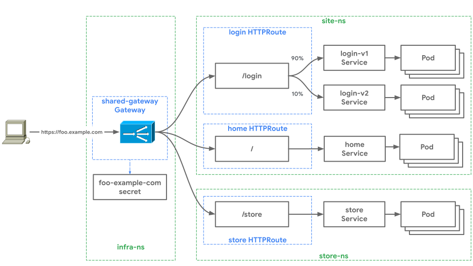

# Cross-Namespace routing

The Gateway API has core support for cross Namespace routing. This is useful
when more than one user or team is sharing the underlying networking
infrastructure, yet control and configuration must be segmented to minimize
access and fault domains.

Gateways and Routes can be deployed into different Namespaces and Routes 
attached to Gateways across Namespace boundaries. This allows differing user access and
roles (RBAC) to be applied to separate Namespaces, effectively controlling who
has access to different parts of the cluster-wide routing configuration. The
ability for Routes to attach to Gateways across Namespace boundaries is governed
by [_Route Attaching_](#cross-namespace-route-attachment), which
is explored in this guide which will demonstrate how two independent teams can
safely share the same Gateway from different Namespaces.

In this guide there are two independent teams, _store_ and _site_, operating
in the same Kubernetes cluster in the `store-ns` and `site-ns` Namespaces. These
are their requirements:

- The site team has two applications, _home_ and _login_, that are running
behind `foo.example.com`. They want to isolate access and configuration across
their apps as much as possible to minimize access and failure domains.
They use separate HTTPRoutes for each app, to isolate app routing configurations
such as canary rollouts, but share the same load balancer
IP, port, domain, and TLS certificate.
- The store team has a single Service called _store_ that they have deployed
in the `store-ns` Namespace.
- The Foobar Corporation operates behind the `foo.example.com` domain so they
would like to host all applications on the same Gateway resource. This is
controlled by a central infrastructure team, operating in the `infra-ns`
Namespace.
- Lastly, the security team controls the certificate for `foo.example.com`.
By managing this certificate through the single shared Gateway they are able
to centrally control security without directly involving application teams.

The logical relationship between the Gateway API resources looks like this:



## Cross-namespace Route Attachment

[Route attachment][attaching] is an important concept that dictates how Routes
and Gateways select each other to apply routing configuration to a Gateway. It
is especially relevant when there are multiple Gateways and multiple Namespaces
in a cluster. Gateway and Route attachment is bidirectional - attachment can
only succeed if the Gateway owner and Route owner owner both agree to the
relationship. This bi-directional relationship exists for two reasons:

- Route owners don't want to overexpose their applications and don't want
their apps to be accessible through paths they are not aware of.
- Gateway owners don't want apps using certain Gateways they should not be
using. An internal application shouldn't be exposed through a public Gateway
for example.

As a result, Gateways and Routes have independent control to determine which
resources will succeed in attaching. It is a handshake between the infra owners
and the application owners that allows them to be independent actors. Routes
can only attach to specified gateways and Gateways provide a similar level of
selection control over which Routes they allow to attach to by trusting
specific namespaces in which those Routes live and operate. This allows a
cluster to be more self-governed, which requires less central administration
to ensure that Routes are not over-exposed.

## Multi-Namespace Gateways Example

The infrastructure team deploys the `shared-gateway` Gateway into the `infra-ns`
Namespace:

```yaml

```

The `http` listener in the above `Gateway` matches traffic for the
`foo.example.com` domain specifically, this frees `HTTPRoute` resources which
attach to it from needing to do any matching on the `hostname` which can reduce
the amount of templating needed for deployment of the underlying application,
since the `HTTPRoutes` developed for it can be domain agnostic (helpful for
situations where the domain hosting the application is not static).


The `routes` section of this `Gateway` is particularly important because it is
the crux of how multiple namespace support is configured in this example:

```yaml
   routes:
      namespaces:
        selector:
          matchLabels:
            environment: development
```

In the above _only_ namespaces labeled as `development` will be able to attach
their routes to the `Gateway`. The namespaces themselves must be decorated with
the corresponding labels:

```yaml

```

## Route Attachment Examples

The store team deploys their route for the `store` Service in the `store-ns`
Namespace:

```yaml

```

This Route has straightforward routing logic as it just matches for
`/store` traffic which it sends to the `store` Service.

The site team now deploys Routes for their applications. They deploy two
HTTPRoutes into the `site-ns` Namespace:

- The `home` HTTPRoute acts as a default routing rule, matching for all traffic
to `foo.example.com/*` not matched by an existing routing rule and sending it to
the `home` Service.
- The `login` HTTPRoute  routes traffic for `foo.example.com/login` to
`service/login-v1` and `service/login-v2`. It uses weights to granularly
control traffic distribution between them.

Both of these Routes use the same Gateway attachment configuration which
specifies `gateway/shared-gateway` in the `infra-ns` Namespace as the only
Gateway that these Routes want to attach to.

```yaml

```

After these three Routes are deployed, they will all be bound to the
`shared-gateway` Gateway. The Gateway merges its bound Routes into a single flat
list of routing rules. [Routing
precedence](/references/spec/#gateway.networking.k8s.io/v1alpha2.HTTPRouteRule)
between the flat list of routing rules is determined by most specific match and
conflicts are handled according to [conflict
resolution](/concepts/guidelines#conflicts). This provides predictable and
deterministic merging of routing rules between independent users.

Thanks to cross-Namespace routing, the Foobar Corporation can distribute
ownership of their infrastructure more evenly, while still retaining centralized
control. This gives them the best of both worlds, all delivered through
declarative and open source APIs.

[attaching]:/concepts/api-overview/#attaching-routes-to-gateways
